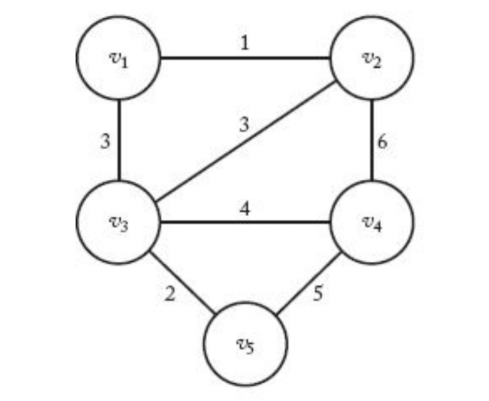
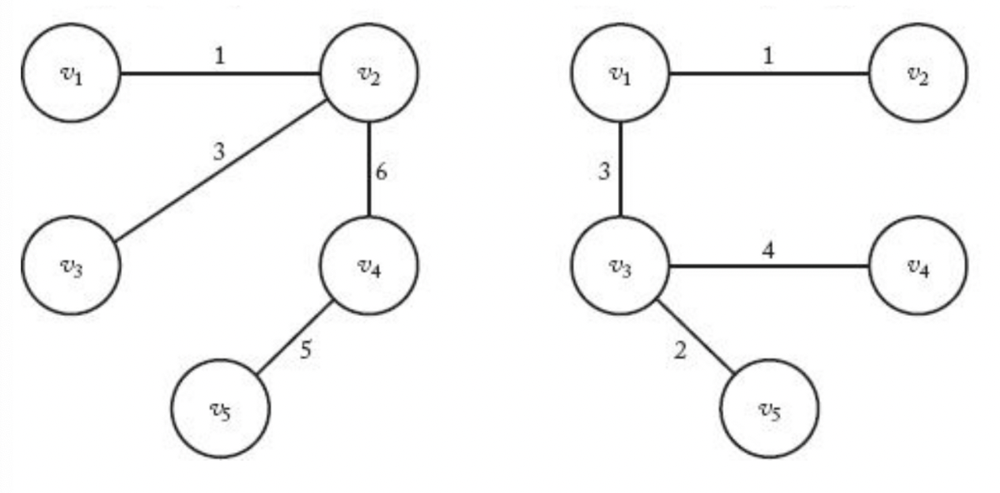

### 가중치 그래프



### 신장 트리

- 연결된 비방향성 그래프 G에서, 순환경로(cycle)가 없어지도록 이음선을 제거하여 구성한 연결된 부분그래프를 신장 트리(spanning tree)라 한다.
- 따라서 신장 트리는 G안에 있는 모든 정점을 다 포함하되 트리가 되는(i.e., 순환경로가 존재하지 않는) 연결된 부분 그래프이다.



(좌) 신장트리 (우) 최소 비용 신장 트리

### 최소 비용 신장 트리

- 신장트리가 되는 G의 부분그래프 중에서 가중치의 합이 최소가 되는 부분 그래프를 최소 비용 신장 트리라고 한다
- 여기서 최소의 가중치를 가진 부분 그래프는 반드시 트리가 되어야 한다. 그 이유는 다음과 같다.
  - 만약 트리가 아니라면, 분명히 순환경로가 있을 것이다.
  - 그렇게 되면 순환 경로 상의 한 이음선을 제거하면 더 작은 비용의 신장 트리가 만들어진다.
- 모든 신장 트리가 최소 비용 신장 트리는 아니다.

### 최소 비용 신장 트리의 응용

- 도로건설 : 도시들을 모두 연결하면서 도로의 길이가 최소가 되도록 하는 문제
- 통신 : 전화선의 길이가 최소가 되도록 전화 케이블 망을 구성하는 문제
- 배관 : 파이프의 총 길이가 최소가 되도록 연결하는 문제

### MST(Minimal Spanning Tree) - 무작정 알고리즘

- 알고리즘
  - 모든 신장 트리를 다 고려해 본다.
  - 그 중에서 최소비용이 드는 것을 신장 트리로 고른다.
- 분석
  - 최악의 경우, 지수보다도 나쁘다.
  - 완전 연결이면 대충 생각해도 n!에 해당한다.

### MST - 탐욕적 알고리즘 (V노드 E엣지)

문제 : 비 방향성 그래프 G=(V,E)가 주어졌을 때, F ⊆ E 를 만족하면서, T=(V,F)가 G의 MST가 되는 F를 찾는 문제.

알고리즘:
  1. F:=0;
  2. 최종 해답을 얻지 못하는 동안 다음 절차를 계속 반복하라
   - 1. 선정 절차 : 적절한 최적해 선정절차에 따라서 하나의 이음선을 선정
   - 2. 적정성 점검 : 선정한 이음선을 F에 추가시켜도 순환경로가 생기지 않으면, F에 추가시킨다.
   - 3. 해답 점검 : T=(V,F)가 신장 트리이면, T가 최소 비용 신장 트리이다.

### MST - 프림(Prim) 알고리즘

1. F:=0;
2. Y:={v1};
3. 최종 해답을 얻지 못하는 동안 다음 절차를 계속 반복하라.
- 1. 선정 절차/적정성 점검 : V-Y에 속한 정점 중에서, Y에 가장 가까운 정점 하나를 선정한다.
- 2. 선정한 정점을 Y에 추가한다.
- 3. Y로 이어지는 이음선을 F에 추가한다.
- 4. 해답 점검 : Y=V가 되면, T = (V,F)가 최소 비용 신장 트리이다.

### MST - Prim 알고리즘의 최적 여부 검증

- 비방향성 그래프 G = (V,E)가 주어졌을 떄, 만약 E의 부분집합 F에 MST가 되도록 이음선을 추가해 나갈 수 있으면 (F에 이음선들을 추가하여  MST가 되면), F는 유망하다(promising)라고 한다.
  - 유망의 의미는 “지금까지 구성한 집합을 사용하여 최적의 솔루션을 구성할 수 있음”을 말한다.
  - Prim 알고리즘에서 구성되는 각 단계의 F들이 유망함을 보이면, 최적임을 보일 수 있게 된다.

### MST - Kruskal 알고리즘

1. F:=0;
2. 서로소(disjoint)가 되는 V의 부분집합 들을 만드는데, 각 부분집합마다 하나의 정점만 가지도록 한다.
3. E 안에 있는 이음선을 가중치의 비 내림차순으로 정렬한다.
4. 최종해답을 얻지 못하는 동안 다음 절차를 계속 반복하라
- 1. 선정 절차 : 다음 이음선을 선정한다.(최소의 가중치를 가진 이음선을 선정한다.)
- 2. 적정성 점검 : 만약 선정된 이음선이 두 개의 서로소인 정점을 잇는다면, 먼저 그 부분집합을 하나의 집합으로 합하고, 그 다음에 그 이음선을 F에 추가한다.
- 3. 해답 점검 : 만약 모든 부분집합이 하나의 집합으로 합하여지면, 그 때 T=(V,F)가 최소비용 신장 트리이다.
```toc
```
