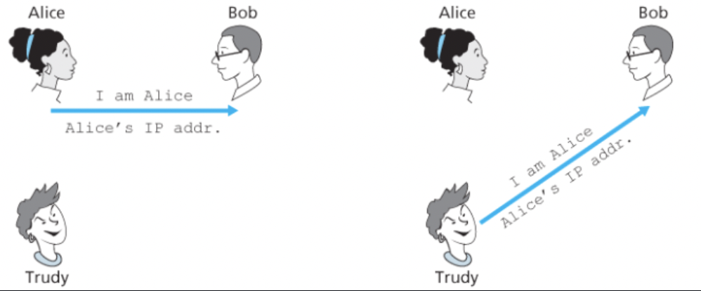
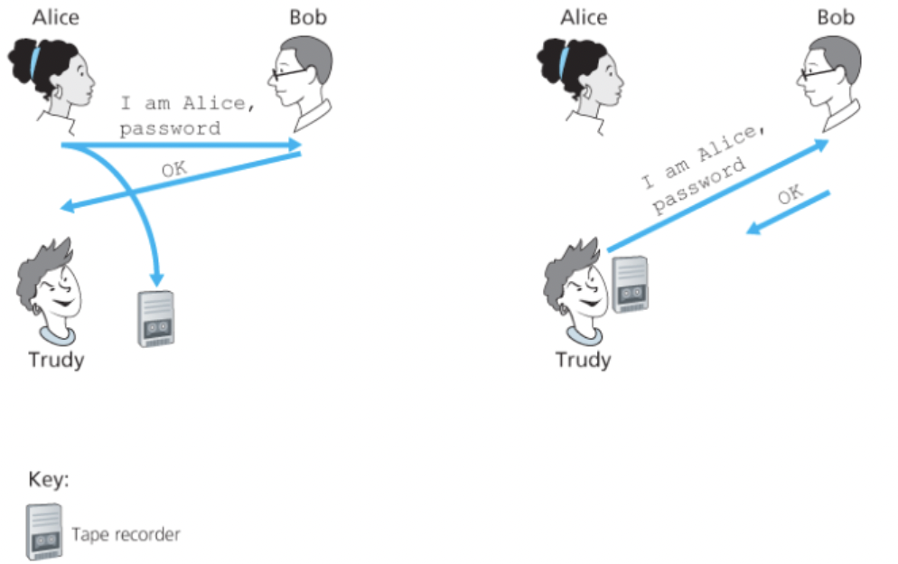
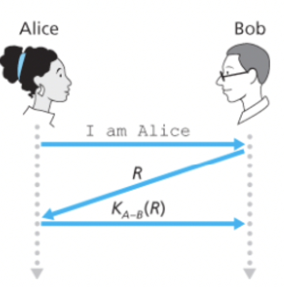

# 종단점 인증

**종단점 인증**이란 하나의 통신 개체가 다른 개체에게 자신의 신원을 컴퓨터 네트워크상으로 증명하는 작업이다.

예를 들어, 전자 메일 사용자가 서버에 신원을 입증할 수 있다.

서로 간의 인증은 인증 프로토콜의 한 부분으로서 교환된 메시지와 데이터만을 기반으로 수행되어야 한다.

<br/>

대부분의 인증 프로토콜은 다른 프로토콜을 수행하기 전에 수행된다.

즉, 인증 후에 작업을 수행한다.

<br/>

### 인증 프로토콜 ap(authentication protocol) 2.0



송신자가 이미 알려진 네트워크 주소(IP 주소)를 가지고 통신을 한다면 수신자는 인증 메시지를 가지고온 IP 데이터 그램 출발지 주소가 송신자의 IP 주소와 일치하는지 확인함으로써 앨리스를 인증할 수 있다.

그러나 IP 데이터그램을 생성해서 원하는 출발지 IP 주소를 넣고 그 데이터그램을 라우터로 보낼 수 있으므로 이는 안전하지 못하다.

<br/>

예를 들어, 침입자가 가짜 출발지 주소를 쓰고 데이터를 보낼 수 있는데 이 방법은 `IP 스푸핑`의 한 형태이다.

침입자가 출발지 주소를 바꾸지 못하게 하면 되겠지만, 이는 강제할 수 없다.

<br/>

### 인증 프로토콜 ap(authentication protocol) 3.0



인증자와 인증 받는 사람 간에 공유된 비밀번호를 사용할 수 있다.

지메일, 페이스북 등 많은 서비스가 비밀번호 인증을 사용한다.

그러나 이 프로토콜은 안전하지 못하다.

침입자가 송신자의 통신을 도청한다면 송신자의 비밀번호를 알아낼 수 있고, 이후 송신자인 척 할 수 있다.

<br/>

### 인증 프로토콜 ap(authentication protocol) 3.1

비밀번호를 암호화하여 비밀번호를 엿듣는 것을 막을 수 있다.

송신자와 수신자는 대칭 비밀키를 공유하여 비밀번호를 암호화 복호화할 수 있다.

<br/>

그러나 수신자는 `재생 공격(playback attack)`의 위험에 노출되어 있다.

침입자는 도청하여 송신자의 암호화된 비밀번호를 저장했다가 나중에 그대로 수신자에게 보낸다.

즉, 송신자인 척 할 수 있다.

<br/>

### 인증 프로토콜 ap(authentication protocol) 4.0



`넌스(nonce)`는 프로토콜이 평생에 단 한 번만 사용하는 숫자를 뜻한다.

**시나리오**

1. 송신자는 메시지를 보낸다.
2. 수신자는 넌스 R을 선택하고 그것을 송신자에게 보낸다.
3. 송신자는 대칭 비밀키를 이용하여 그 넌스를 암호화하고, 암호화된 넌스 K(R)을 수신자에게 보낸다.
   - 해당 송신자가 다음에 또 통신을 하면 R이 바뀌어도 비밀키를 알고 있으므로 또 인증을 받을 수 있다.
   - 그러나 침입자라면 비밀키를 모르고 있으므로 암호화할 수 없다.
4. 수신자는 상대방이 대칭 비밀키를 알고 있으므로 상대방인 것을 확인한다.


```toc
```
