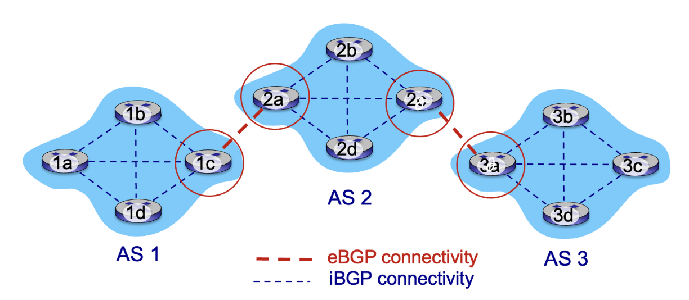

## BGP



- eBGP (External BGP): 이웃 AS로부터 서브넷의 도달 가능성 정보를 얻습니다. 즉, 게이트웨이 간에 서브넷의 도달 가능성 정보를 교환하는 역할을 합니다. 인접한 AS 간의 경로 정보 교환을 통해 AS는 다른 네트워크로의 경로를 확인할 수 있습니다.
- iBGP (Internal BGP): 도달 가능성 정보를 AS 내부의 모든 라우터로 전파합니다. iBGP는 게이트웨이에서 내부 라우터로 도달 가능성 정보를 전달하는 역할을 수행합니다. 이를 통해 AS 내부의 모든 라우터는 최신의 도달 가능성 정보를 유지할 수 있습니다.

BGP는 도달 가능성 정보와 정책에 기반하여 다른 네트워크로의 "좋은" 경로를 결정하는 데 사용됩니다. AS는 자체 정책과 관련하여 다른 네트워크로의 경로 선택을 조정할 수 있습니다. 또한, BGP는 서브넷이 자신의 존재를 인터넷 전체에 알릴 수 있도록 해줍니다. 즉, "나는 여기에 있어요"라는 메시지를 인터넷에게 알릴 수 있습니다.

BGP는 인터넷의 규모가 커지고 복잡해지는 것을 관리하기 위해 사용되는 프로토콜입니다. 다른 AS와의 경로 교환과 정책 기반의 경로 선택을 통해 전체 인터넷의 라우팅 시스템을 조율하는 역할을 수행합니다.

## BGP route selection 기준

관리자의 판단 : policy 우선
Shortest AS-PATH
Closest NEXT_HOP route : 뜨거운 감자
기타 기준에 의해 경로 선택

```toc
```
