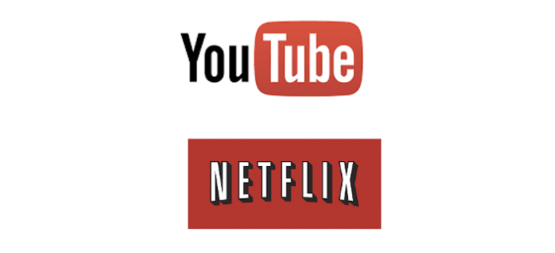
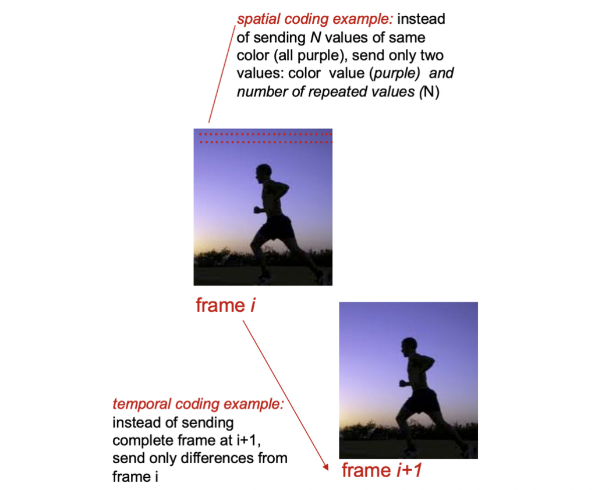
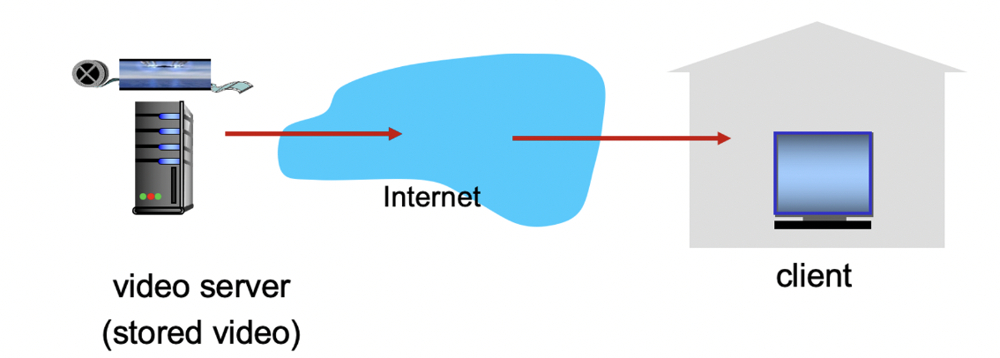
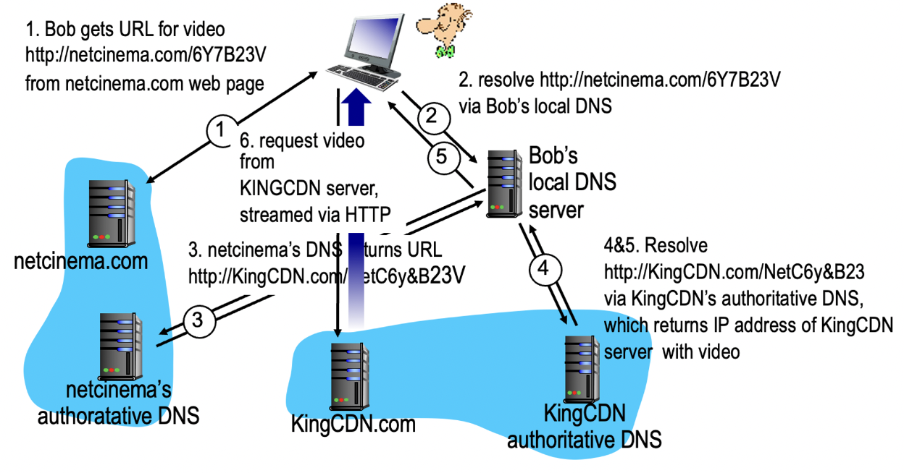

### Video Streaming and CDNs: context


- **동영상 트래픽은 인터넷 대역폭의 주요 소비자**
    - Netflix와 YouTube는 가정용 ISP 트래픽의 37%와 16%를 차지합니다.
    - 약 10억 명의 YouTube 사용자와 약 7500만 명의 Netflix 사용자가 있습니다.
- Challenge : 규모 - 약 10억 명의 사용자에게 어떻게 도달할 것인가?
    - 메가 비디오 서버는 작동 불가능
- Challenge : 이질성
    - 다양한 사용자들은 다양한 가용성을 지님 (예: 유선 vs 무선; 대역폭 풍부 vs 대역폭 부족)
- 해결책: 분산된 응용 수준(Application Level)의 인프라

## Multimedia : Video


- 동영상: 일정한 속도로 표시되는 이미지의 연속(예: 초당 24개의 이미지)
- 디지털 이미지: 픽셀 배열
    - 각 픽셀은 비트(RGB)로 표현됨
- 코딩: 이미지 내부 및 이미지 간의 중복을 사용하여 이미지를 인코딩하는 데 사용되는 비트 수를 줄임
    - 공간적 압축 (이미지 내부)
    - 시간적 압축 (이전 이미지로부터의 차이)
- CBR: 고정된 비트율(constant bit rate)으로 동영상 인코딩
- VBR: 가변적인 비트율(variable bit rate)으로 동영상 인코딩, 공간적, 시간적 코딩의 양에 따라 비트율이 변경됨
    - 예시:

      MPEG 1 (CD-ROM) 1.5 Mbps  
      MPEG2 (DVD) 3-6 Mbps  
      MPEG4 (인터넷에서 자주 사용, < 1 Mbps)


### Streaming


- 스트리밍 방식 : 받으면서 보여주는 것
- 다운로드 방식 : 전부 다 받고 볼 수 있는것

### Streaming multimedia : DASH


>💡 동영상은 원래 UDP였으나 인터넷 발달로 TCP위에서 HTTP로 돌림 그것을 위한 변형이 DASH


- DASH: HTTP를 통한 동적, 적응형 스트리밍
- 서버:
    - 비디오 파일을 여러 청크로 나눔
    - 각 청크는 다른 비트율로 인코딩되어 저장됨
    - manifest file: 다양한 청크의 URL 제공
    - 비디오 화질: 1280x720(HD, 720p), 4096x2160(4K)
- 클라이언트: DASH 클라이언트는 연속적으로 가용 네트워크 대역폭을 측정하고, 이를 기반으로 향후 다운로드할 비디오 세그먼트의 비트율을 결정
    - 주기적으로 서버-클라이언트 대역폭을 측정하며, menifest file를 참조하여 한 번에 하나의 청크를 요청한다.
    - 현재 대역폭에 기반하여 지속 가능한 최대 코딩 비율을 선택한다.

      다양한 시간에 다양한 코딩 비율을 선택할 수 있다(가용 대역폭에 따라 시간에 따라 다름).


- 클라이언트의 **“지능”**: 클라이언트는 버퍼 고갈이나 오버플로우가 발생하지 않도록 청크를 요청하는 시기를 결정한다.
    - 가용 대역폭이 더 많을 때 더 높은 화질의 비트레이트를 요청할 때
    - 클라이언트에 **“가까운”** 서버나 가용 대역폭이 **“높은”** 서버에서 청크를 요청할 때
    - MPEG-DASH 클라이언트에서 콘텐츠가 재생되면, 클라이언트는 비트레이트 적응(ABR) 알고리즘을 사용하여 재생이 멈추거나 버퍼링이 발생하지 않도록 가능한 최고 비트레이트의 세그먼트를 자동으로 선택해 준다.

## Content Distribution Networks

- Challenge : 수백만 개의 비디오 중에서 수십만의 동시 사용자에게 콘텐츠를 스트리밍하는 방법은?

### 옵션 1: 단일 대형 “Mega Server”

- 단일 장애 지점 : 한 곳에 장애가 생기면 전체 서비스 마비
- 네트워크 혼잡 지점 : 단일 서버에 트래픽 몰림
- 원격 클라이언트에 대한 긴 경로
- 동일한 비디오의 여러 복사본이 발신 링크로 전송됨
- **결국 이 솔루션은 확장성이 없다.** ☠️

### 옵션 2: 분산된 사이트 (CDN)에 비디오 복사본 저장/서비스

- 깊은 진입(enter deep): CDN 서버를 *다양한* 접근 네트워크로 확장하여 사용자에게 가까운 위치에 배치, 가까운 CDN서버에 데이터를 캐싱 (넓은 곳에 CDN서버 분산)
    - Akamai와 같은 회사가 1700개의 위치에서 사용
- 가까이 가져오기(bring home): 접근 네트워크(IXP) 근처의 더 큰 규모의 POPs(접속점)에서 작은 수(10개 정도)의 클러스터 사용 (좁은 곳에 많은 CDN서버)
    - Limelight와 같은 회사가 사용

### CDN 콘텐츠 접근


1. 밥은 netcinema.com 에서 video 링크를 클릭
2. 밥의 로컬 DNS 서버에 요청
3. netcinema의 권한있는 DNS서버에서 KingCDN.com의 주소를 가져옴


>💡 KingCDN.com은 실질적으로 동영상을 가지고 있는 곳


1. KingCDN.com에 접근하기 위해 KingCDN의 권한있는 DNS서버에 요청
2. KingCDN.com에 접근하여 HTTP를 통해 동영상을 스트리밍

```toc
```
