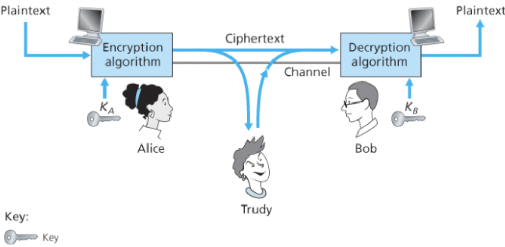
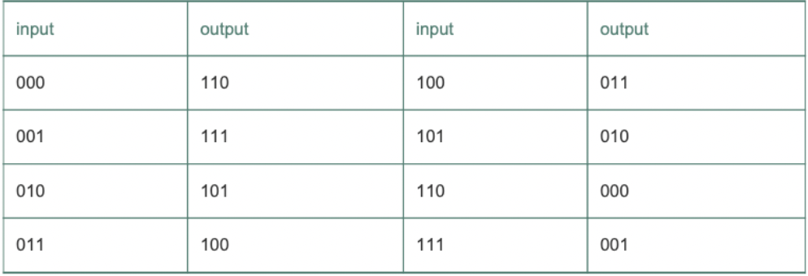
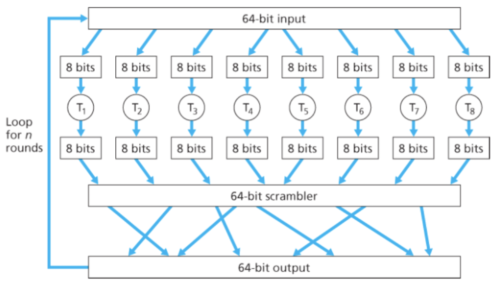

# 암호의 원리

송신자가 보내는 원래 형태의 메시지를 **평문** 또는 **원문**이라고 한다.

송신자는 평문을 **암호화 알고리즘**을 사용해서 암호화하며, 암호화된 메시지인 암호문은 다른 침입자가 해석할 수 없다.

이 **암호화 알고리즘**은 모든이에게 알려져있고, 누구나 쉽게 사용할 수 있다.

즉, 전송한 데이터를 침입자가 복원할 수 없게 해주는 비밀 정보가 필요한데 이것이 바로 **키**이다.

<br/>

### 시나리오



1. 앨리스는 숫자나 문자의 열인 키 A를 암호화 알고리즘의 입력값으로 사용하여 암호화된 메시지 `A(m)`을 완성한다.
2. 밥은 키 B와 암호문 `A(m)`을 복호화 알고리즘에 입력값으로 넣어 `B(A(m)) = m` 의 출력을 받는다.

<br/>

### 대칭키 시스템

앨리스와 밥의 키가 동일하며 이 키는 둘만의 비밀이다.

<br/>

### 공개키 시스템

키 중 하나는 세상 모두에게 알려져있고 다른 키는 앨리스 밥 중 한명만 알고 있다.

<br/>

## 대칭키 암호화

### 카이사르 암호

영어로된 원문에 대해 평문의 각 철자를 알파벳 순서로 k번째 뒤에 오는 철자로 대치한다. (철자들의 순환을 가정. z의 1번째 뒤에 오는 철자는 a다.)

여기서는 k의 값이 암호화 키가 된다.

하지만 카이사르 암호인 것을 알고 있다면 금방 암호문을 복호화할 수 있을 것이다.

<br/>

### 단일 문자 대응 암호

카이사르 암호처럼 일정한 규칙에 따라 대치하는 대신 아무 규칙 없이 각 철자들을 고유한 대응 글자로 변환한다.

26! 정도의 문자 대응쌍이 가능하여 더 안전하다.

그러나 e나 t가 흔하게 나타나거나 3개 혹은 3개의 특정 문자가 함께 나오거나  하는 특성 탓에 암호를 해독하기 쉬워진다.

예를들어 암호문을 사용하는 사람의 이름이 평문에 들어가있다는 것을 안다면 즉시 알파벳 중 몇쌍을 확정 지을 수 있다.

<br/>

**침입자가 갖고 있는 정보에 따른 시나리오**

- 암호문만을 이용한 공격
  - 평문 메시지에 대한 어떠한 정보도 없는 경우
- 알려진 평문 공격
  - 침입자가 평문과 암호문에 나올 단어(이름 등)를 미리 알고 있는 경우 해당 단어에 대한 단어 쌍을 알 수 있다.
- 선택 평문 공격
  - 침입자가 특정 평문 메시지를 선택하여 송신자에게 보내게 하고 이에 대응하는 암호문의 형태를 얻을 수 있다.

<br/>

### 다중 문자 대응 암호화

여러 개의 단일 문자 대응법을 가지고 평문 메시지에서의 위치에 따라 서로 다른 단일 문자 대응 암호법을 사용한다.

즉, 같은 문자라도 평문 메시지에서의 위치에 따라 다르게 암호화 된다.

<br/>

예를 들어, 단일 문자 대응법 첫번째를 C1, 단일 문자 대응법 두번째를 C2라고 해보자.

평문의 첫번째 메시지는 C1, 두번째는 C2, 세번째는 C1 … 식으로 평문 메시지의 위치에 따라 단일 문자 대응법을 달리 한다.

<br/>

### 블록 암호화

현재 TLS, PGP, IPsec 등에 사용되는 암호화 기법이다.

오늘날 널리 활용되는 블록 암호화 방법에는 AES, DES, 3DES 등이 있다.



블록 암호화에서는 메시지가 k 비트의 블록 단위로 쪼개어져 암호화 된다.

k 비트의 평문은 k 비트 블록의 평문을 k비트 블록의 암호문으로 일대일 사상 시킨다.

위 표와 같이 사상한다면 `010110001111`은 `101000111001` 로 암호화 된다.

<br/>

k 비트에 대해서 총 `(2^k)!` 로 사상의 수가 천문학적으로 커진다.

그러나 `k=64`라고하면 송신자와 수신자 모두 `2^64`개의 입력 테이블에 대한 테이블을 유지해야하는데 이는 실행이 거의 불가능 하고, 키가 바뀌면 큰 테이블을 재생성해야 하기 때문에 실제 사용은 불가능 하다.



대신 블록 암호화 기법은 입출력 블록의 순열 테이블을 임의로 모방 생성하는 함수를 사용한다.

위 그림은 `k=64`일 때의 예시를 나타낸다.

**시나리오**
1. 64 비트의 블록을 8 비트씩 8개의 청크로 나눈다.
2. 각 8 비트 청크는 관리 가능한 크기인 8비트 입력 블록에 대응하는 8비트 출력 블록을 가진 테이블에 의해 처리된다.
3. 각 청크는 관리 가능한 크기인 8 비트 입력 블록에 대응하는 8 비트 출력 블록을 가진 테이블에 의해 처리된다.
4. 암호화된 청크는 하나의 64 비트 블록으로 다시 합쳐진다.
  - 각각의 위치는 뒤섞여서 합쳐진다.
5. 64 비트 블록을 다시 입력부로 넣는다.
6. 이 사이클을 n번 반복한다.
  - 각 입력 비트가 대부분의 최종 출력 바트들에 영향을 미치게 하기 위해서이다.
  - 라운드를 한번만 수행하면 하나의 입력 비트는 8개의 출력 비트에만 영향을 끼친다.

이 블록 암호화 알고리즘의 키는 블록을 뒤섞는 규칙이 알려져있다면 8개의 순열 테이블이다.

<br/>

### 암호 블록 체이닝

네트워크 애플리케이션에서는 일반적으로 긴 메시지를 암호화할 필요가 있는데, 블록 암호화를 이용하면 미묘하지만 중요한 문제가 발생한다.

2개 이상의 평문 블록이 동일하다면 같은 암호문을 생성해내고, 공격자는 동일한 암호문으로 원문을 추측해낼 수 있는 가능성이 생긴다.

여기에 하위 프로토콜에 대한 지식까지 활용하면 전체 메시지를 복호화할 수 있다.

이를 해결하기 위해 같은 평문 블록에 대해 다른 암호문 블록이 생성될 수 있도록 임의성을 추가할 수 있다.

<br/>

**시나리오**

1. 송신자는 i번째 평문 블록 m(i)를 위해 k비트 길이의 임의의 수 r(i)를 생성한다.
2. `K(r(i) xor m(i)) = c(i)` 암호문을 만든다.
  - r(i)로 인해 m(i)와 m(j)가 같아도 암호문은 달라지게 된다.
3. 수신자는 r(i)와 c(i)를 받아서 `m(i) = K(c(i)) xor r(i)` 를 수행한다.
  - 침입자는 암호화되지 않은 r(i)를 볼수는 있지만 키를 알지 못하므로 평문 m(i)를 복호화할 수 없다.

<br/>

그러나 송신자는 2배의 비트를 더 보내야 하고 2배의 대역폭을 필요로 한다.

이 문제를 해결하기 위해 `암호 블록 체이닝(Cipher Block Chaining, CBC)` 기법을 사용한다.

<br/>

**시나리오**

1. 메시지를 암호화하기 전에 송신자는 초기화 벡터라 불리는 임의의 k 비트열 c(0)을 생성한다.
2. 송신자는 c(0)를 수신자에게 보낸다.
3. 첫번째 블록에 대해 송신자는 `c(1)= K(m(1) xor c(0))` 을 계산한다.
4. 암호화된 c(1)을 수신자에게 보낸다.
5. 송신자는 이를 계속 `c(i)= K(m(i) xor c(i-1))` 암호문 블록을 생성하고 보낸다.
  - 수신자는 c(i-1)을 알고 있으므로 계속 복호화할 수 있다.
  - 마찬가지로 같은 평문을 가지고 있어도 다른 암호문을 갖게 된다.
  - 침입자는 암호화되지 않은 c(0)을 볼수는 있지만 키를 알지 못하므로 평문 m(i)를 복호화할 수 없다.
  - 송신자는 하나의 초기화 벡터만 더 전송하면 되므로 대역폭 증가량이 미미하다.

<br/>

## 공개키 암호화


공개키 암호화에서는 송수신자가 각각 키를 갖는다기보다 수신자가 2개의 키를 갖는다.

하나는 세상 모두에게 알려진 **공개키**이고, 다른 하나는 수신자만 아는 **개인키**이다.

<br/>

**시나리오**

1. 송신자는 수신자에게 메시지를 보내기 위해 수신자의 공개키를 확인한다.
2. 수신자의 공개키로 메세지를 암호화하고 송신한다.
3. 수신자는 자신의 개인키로 암호문을 복호화 알고리즘을 사용하여 복호화한다.

<br/>

### RSA

RSA는 모듈로 n 연산(나머지)을 많이 사용한다.

**모듈로 연산의 유용한 성질**

```
[(a mod n)+(b mod n)]mod n=(a+b)mod n
[(a mod n)−(b mod n)]mod n=(a−b)mod n
[(a mod n)⋅(b mod n)]mod n=(a⋅b)mod n

// 3번째 성질로부터 나오는 식
(a mod n)^d mod n = a^d mod n
```

<br/>

**공개키와 개인키의 선택**

1. 2개의 큰 소수 p와 q를 선택한다.
  - 값이 클수록 RSA를 깨기가 어려워지지만 암호화 복호화를 수행하는데 시간이 더 걸린다.
2. `n = pq`, `z =(p-1)(q-1)` 식을 계산한다.
3. 1을 제외하고 z의 서로소 n보다 작은 e를 선택한다.
  - 암호화 encryption의 e를 따왔다.
4. ed-1이 z로 정확히 나누어 떨어지는 숫자 d를 찾는다.
  - 복호화 decryption의 d를 따왔다.
  - 이 말은 즉슨, ed mod z = 1이 성립하도록 d를 선택한다와 같다.
5. 공개키는 숫자쌍 (n,e) 이다. 그의 개인키는 (n,d)이다.

큰 p와 q를 고르는 방법, 지수 연산 방법, e와 d를 고르는 방법 등은 이 책의 범위에서 벗어나므로 생략한다.

<br/>

**알고리즘 시나리오**

1. 암호화를 위해 공개키 (n,e)를 활용한다. 메세지에 e승을 하고 이를 n으로 나눈 나머지를 계산한 값이 암호문 c가 된다.
  - 메세지는 k 비트열로 하나의 정수와 같아서 e의 제곱을 할 수 있다.
  - `c = m^e mod n`
2. 수신된 암호 메시지 c를 복호화 하기 위해 개인키 (n,d)를 활용한다.
  - `m = c^d mod n = m^ed mod n` 을 수행하여 복호화한다.

<br/>

e.g.

수신자가 `p=5` , `q=7`로 선택한다.

이때 `n = 35`, `z = 24`가 된다.

5와 z가 공통인수가 없으므로 `e = 5` 를 선택한다.

`5x29-1 (즉, ed-1)` 이 24로 나누어떨어지므로 `d= 29`를 선택한다.

이제 공개키 (35,5)와 비밀키 (35,29)가 완성되었다.

<br/>

이제 평문 m을 암호화 복호화 해보자.

m은 비트열 1100으로 숫자 12에 대응된다고 가정하자.

암호화 : `m^e = 248832`, `17(c) = 248832(m^e) mod 35(n)`

복호화 : `12(m) = 4819685721067509150915091411825223071697(c^d) mod 68(n)`

<br/>

### 세션키

RSA에 필요한 지수 연산은 시간이 많이 필요하여 실제로 종종 대칭키 암호화와 함께 사용된다.

<br/>

**시나리오**

1. 송신자는 데이터 암호화에 사용할 **세션키**를 고른다.
  - 세션키는 대칭키 암호화에 사용된다. 즉, 밥에게 세션키를 알려야 한다.
2. 송신자는 수신자의 공개키로 세션키를 RSA 암호화한다.
3. 수신자는 암호문을 받고 자신의 개인키로 복호화한다.
4. 수신자는 세션키를 얻고, 송신자가 보낸 데이터를 복호화할 수 있다.

<br/>

### RSA가 동작하는 이유

`m = m mod n= m^ed mod n` 임을 증명하면 된다.

정수론에 의하면 p와 q가 소수이고 `n = pq`, `z = (p-1)(q-1)`이면, `x^y mod n` 이 `x^(y mod z) mod n`과 같다.

즉, 다음과 같은 식을 얻을 수 있다.

`m^ed mod n = m^(ed mod z) mod n`

ed mod z = 1이 되도록 e와 d를 선택하였으므로, `m = m mod n= m^ed mod n` 이다.

여기서 e와 d는 단순 제곱이므로 둘을 바꿔도 정상 동작한다.


```toc
```
