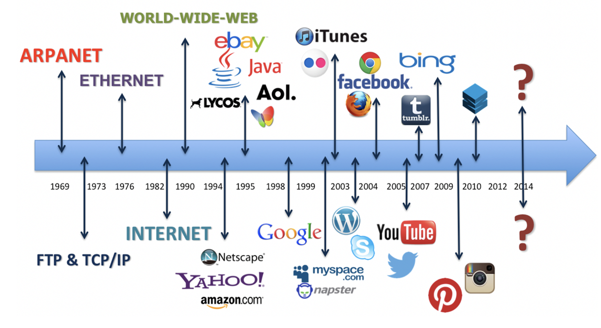
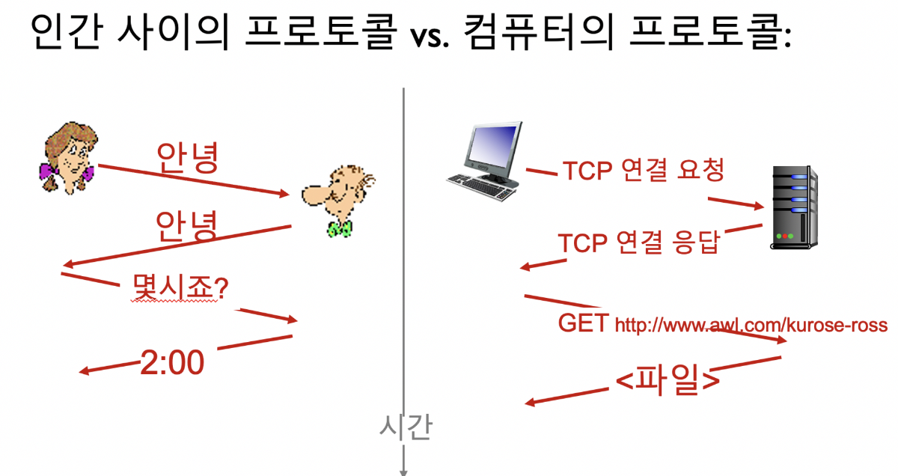
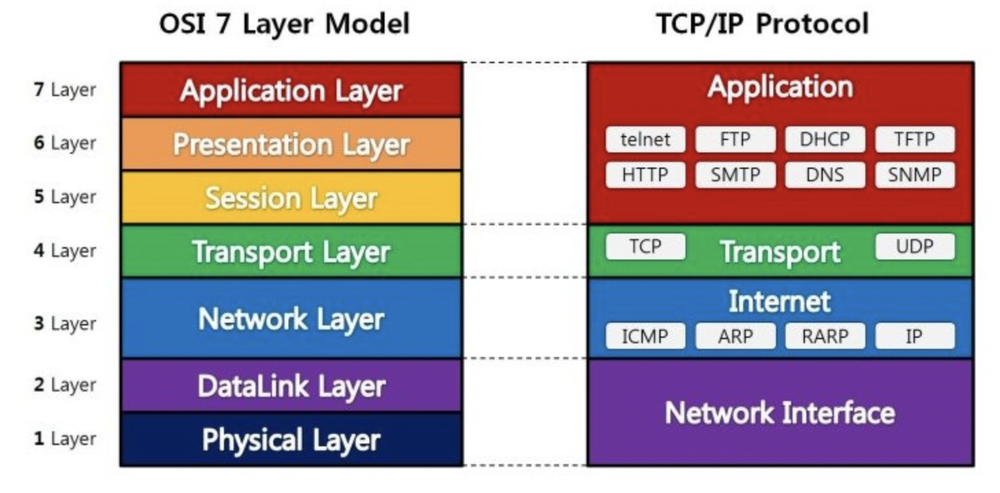
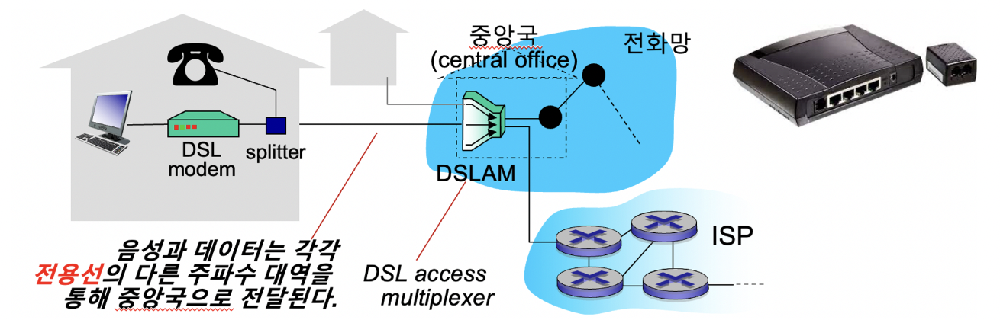
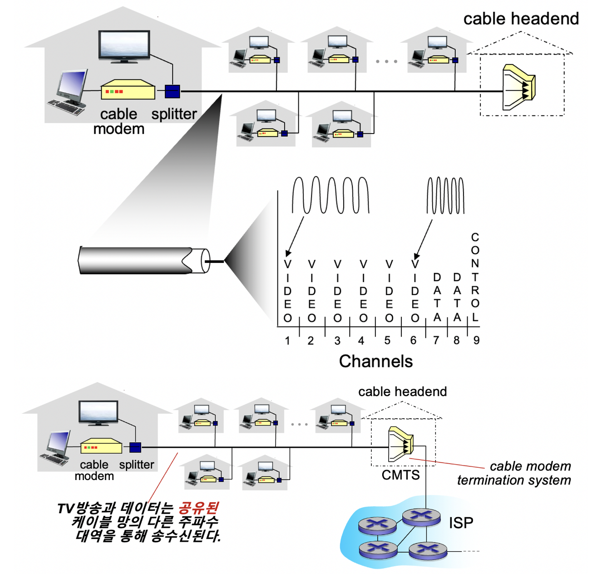
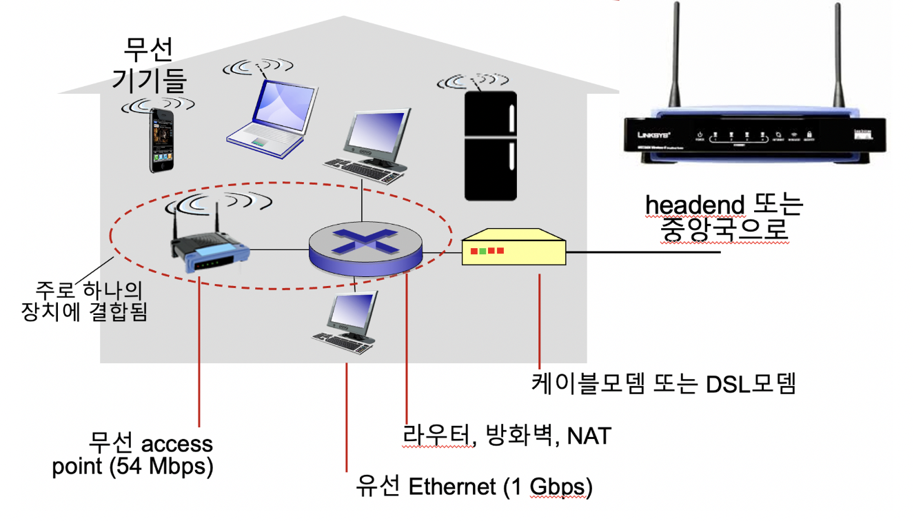
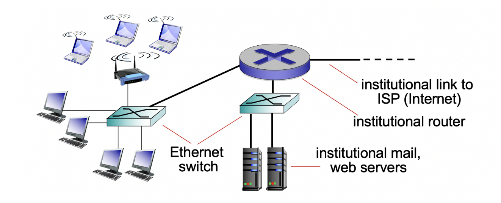
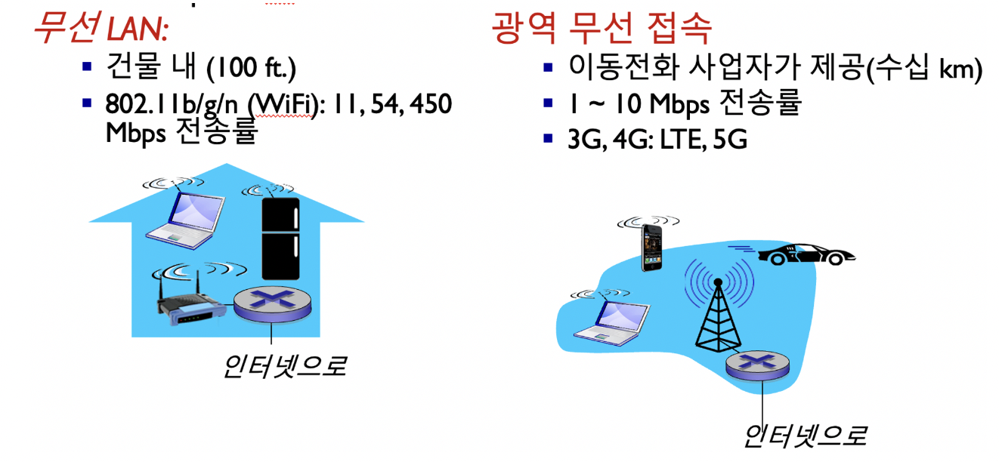

# 인터넷이란?

## Internet vs. intranet

inter + network

intra + network

## nuts & bolts 관점

- 호스트 = 종단시스템
- 모든 서버는 호스트이지만 모든 호스트가 서버인 것은 아니다. 네트워크에 연결이 확립된 모든 장치는 호스트의 자격이 있는 반면, 다른 장치(클라이언트)로부터의 연결을 수락하는 호스트만 서버가 될 수 있다.
- 전송률 : 대역폭(bandwidth)
- 네트워크를 도로로 비유하면, 대역폭은 도로의 넓이, 넓으면 넓을수록 많은 데이터를 보낼 수 있다.
- 호스트끼리의 데이터 교환시 데이터의 단위(패킷), 패킷의 크기는 동일하다.

### 라우터 & 스위치

- 스위치 : 동일한 네트워크의 호스트간 데이터 교환을 도와주는 장치 (주로LAN)
- 라우터 : 서로 다른 네트워크 간 데이터 교환을 도와주는 장치 (주로WAN)

### 인터넷

- 네트워크들의 네트워크
- 상호 연결된 ISPs(Internet Service Providers : KT, LG U+, …)

### 프로토콜

**통신 프로토콜** 또는 **통신 규약**은 컴퓨터나 원거리 통신 장비 사이에서 메시지를 주고 받는 양식과 규칙의 체계를 말함.

### 인터넷 표준

ISO : 전세계 표준화 활동

- OSI : Open System Interconnection

IEEE : 미국 전기전자공학자협회

ITU-T : 국제 전기통신 표준화 기구

IETF : Internet Engineering Task Force(인터넷 국제 표준화 기구)


> 💡 **RFC : Request for comments(기술 제안서)**


## 서비스 관점

### API

- Application Programming Interface
- 소프트웨어 응용 프로그램에서 서로 다른 구성 요소들이 상호 작용할 수 있도록 정의된 규약. 즉, 다른 소프트웨어나 서비스에서 제공하는 기능을 외부 프로그램에서 호출하여 사용할 수 있는 인터페이스를 제공하는 것을 의미함.
- API에서 데이터를 전송하기 위한 형식 : JSON, YAML, XML, CSV …

### Internet Applications


### 프로토콜

프로토콜은 통신 개체 간에 주고받는 메시지의 형식, 순서뿐 아니라 메시지의 송수신과 다른 이벤트에 따른 행동들을 정의한다.



### 레이어 계층 모델



OSI 7 계층은 네트워크에서 통신이 일어나는 과정을 7단계로 나눈 것을 말하며, 국제표준화기구(ISO, International Organization for Standardization)에서 네트워크 간의 호환을 위해 OSI 7 계층이라는 표준 네트워크 모델을 만들었다.

OSI 7단계로 정의한 이유는 통신이 일어나는 과정을 단계별로 파악하기 위함과 통신 과정 중에 특정한 곳에 이상이 생길 경우에 다른 단계의 장비 및 소프트웨어 등을 건드리지 않고 통신 장애를 일으킨 단계에서 해결할 수 있기 때문이다.

# 접속 네트워크

## 접속 네트워크와 물리매체

### Digital Subscriber Line (DSL)


음성과 데이터를 같은 하나의 전용선으로 송수신, 주파수에 따라 분리됨.

음성 : 높은 주파수

데이터 : 낮은 주파수

### 케이블 망



- HFC: hybrid fiber coax (광동축 혼합망, 유사 광랜)
  비대칭적: 최대 30Mbps의 다운스트림 전송률과 2 Mbps의  업스트림 전송률
  광케이블과 동축케이블을 혼합 사용
- 케이블 망이 가정을 ISP 라우터에 접속시켜줌
  각 가정은 cable headend 까지 공유선을 사용
  중앙국까지 전용선을 사용하는 DSL과 다름

### FTTx (광랜)

- FTTN : 전신주나 길가까지는 광케이블, 그 이후 집안까지는 랜선
- FTTC : 어느 지점까지는 광케이블, 그 이후 가정은 구리선 (영국 BT)
- FTTB : 건물까지만 광케이블 그 이후 각 가정은 랜선으로 (구형 아파트인 경우)
- FTTH : 각 아파트 가정까지 바로 광케이블이 들어감 (2006이후 대부분 아파트인 경우)

> 💡 FTTH : Fiber to the Home


### 가정(홈) 네트워크


### 기업 접속 네트워크(Ethernet)


### 무선 네트워크


## 용어 정리

- 디지털과 아날로그 시그널 : 디지털 시그널은 0과 1의 이진수로 표현되는 신호이며, 이산적인(discrete) 값으로 표현된다. 반면 아날로그 시그널은 연속적인(analog) 값으로 표현되며, 무한한 값의 범위를 갖는다.

|  | 디지털 시그널 | 아날로그 시그널 |
| --- | --- | --- |
| 장점 | 잡음에 강함 | 부드럽고 자연스러움 |
|  | 오류 검출 및 수정 용이 | 정보 손실이 적음 |
|  | 품질 변화 없이 복사 및 전송 가능 |  |
|  |  |  |
| 단점 | 대역폭과 전송 속도 요구사항 높음 | 오류 검출 및 수정 어려움 |
|  | 저장 용량이 크고 처리 시간이 많이 소요됨 | 잡음에 민감함 |
|  |  | 장거리 전송 시 감쇠와 왜곡 발생 가능 |
- Bit, Byte, KB, MB, GB, TB, PB, EB, ZB(현재 우리 시대),  다음? : 다음으로는 YB(Yottabyte)가 있다. 10^24 Byte의 크기를 나타낸다.
- Hz : 1초 동안의 상태 변화 : 220V, 60Hz (전압단위 -V : 전류가 흐를 수 있는 양, 대역폭과 유사점)
- 최대 비트 전송률 : 1초 동안 최대로 보내는 데이터 비트 수
  bps : bits per second / b/s : byte per second
- Bandwidth (대역폭)


> 💡 bps : 도로의 폭 / Hz : 도로의 속도  
> bps = Hz × log2(L)  
> 여기서 L은 각 신호에서 나올 수 있는 가능한 상태의 수를 나타냅니다. 예를 들어, L=2 인 경우에는 디지털 신호가 0 또는 1의 두 가지 상태 중 하나를 나타낼 수 있다는 것을 의미합니다. 따라서, 1 Hz의 주파수에서 L=2로 설정하면, bps는 1 x log2(2) = 1 bps가 됩니다.

- 유선 전송 매체 :  동축 케이블, 광 케이블

| 항목 | 동축케이블 | 광케이블 |
| --- | --- | --- |
| 전송 방식 | 전기 신호 | 광 신호 |
| 대역폭 | 낮음 | 높음 |
| 감쇠 | 케이블 길이에 따라 증가 | 거의 없음 |
| 방사선 방지 | 좋음 | 없음 |
| 가격 | 저렴함 | 비싸다 |

### 데이터 패킷의 전송

L비트 크기의 패킷을 전송률 R을 갖는 링크를 통해 전송할 때 걸리는 시간 =

패킷 전송 지연  = L (bits) / R(bits/sec)

전송률 R은 링크의 용량(Capacity), 혹은 대역폭(Bandwidth)라고도 함.

### 물리 매체

- 꼬임선
  - 10-100Mbps, 100m - 1km, 도청 가능
- 동축케이블
  - 10Mbps - 1Gbps, 1km - 10km, 도청 가능
- 광케이블
  - 2 - 200Gbps, 10 - 100km, 도청 불가능
- 전력선(PLC)
  - 전기선으로 데이터를 전송하는 기술
  - 무선 통신 기술의 발전으로 요즘은 잘 사용하지 않음.
  - 속도 및 대역폭의 한계
  - 안정성 문제 : 전기선 상태에 따라 전송 품질이 달라짐
  - 보안 문제 : 외부로부터의 공격에 취약함

### 라디오

- 신호가 전자기 스펙트럼으로 전달됨
- 물리적 “선” 없음
- 양방향성
- 전파환경의 영향 받음
  - 반사(reflection)
  - 장애물의 방해
  - 간섭(interference)
- 라디오 링크의 종류 :
  - 지상 초단파(AM, Amplitude Modulation)
  - LAN(WiFi)
  - 광역
  - 위성(satellite)

```toc
```
