## 라우터 구조

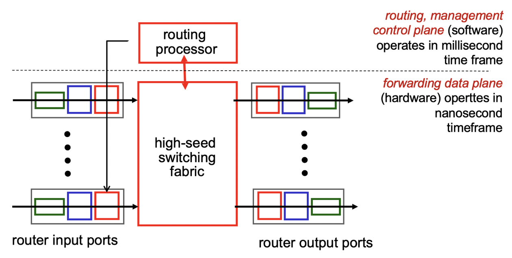

라우터는 Data plane, Control plane 두 부분으로 나뉘어 있다.

### **Control Plane(라우팅 담당)**

- 소프트웨어적으로 처리
- 일정한 시간마다 라우팅
- Control Plane은 네트워크 장비 사이의 통신, 경로 선택, 라우팅 테이블 관리 등의 기능을 수행
- Control Plane은 네트워크 장비의 동작을 제어하고, 네트워크 상태를 모니터링하여 최적의 경로를 결정
- Control Plane은 네트워크의 안정성과 효율성을 유지하고, 서비스 제공을 위한 정책을 관리

### **Data Plane(포워딩 담당)**

- 하드웨어적으로 처리
- Data Plane은 패킷 전달과 관련된 작업을 처리하며, 주로 라우터나 스위치와 같은 네트워크 장비에서 동작
- Data Plane은 패킷의 전달 경로를 결정하고, 포워딩 기능을 수행하여 패킷을 목적지로 전달
- Data Plane은 네트워크의 성능과 속도에 직접적인 영향을 미치는 핵심적인 역할을 담당

## 라우터 구조

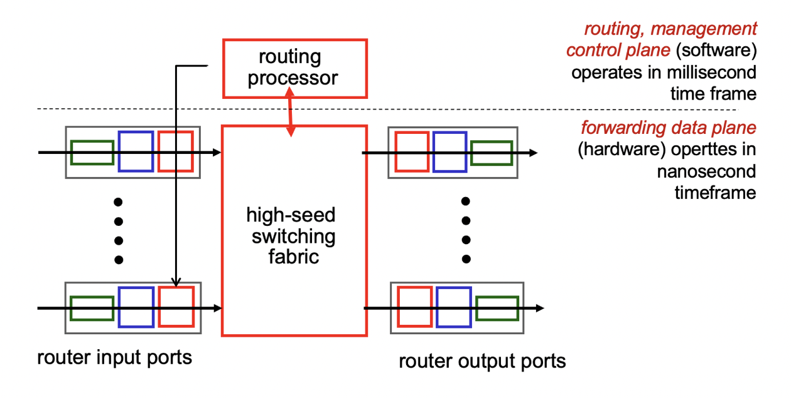

### 방식

1)

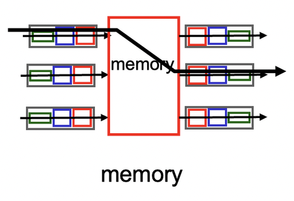

간단하지만 메모리를 거쳐서 하기 때문에 속도가 느려서 안씀

2)

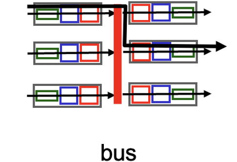

중간에 어느 output으로도 가기 위해 공유버스를 두어 직접 복사 가능, 충돌 가능성 때문에 한정된 시간 input-output쌍이 독점

3)

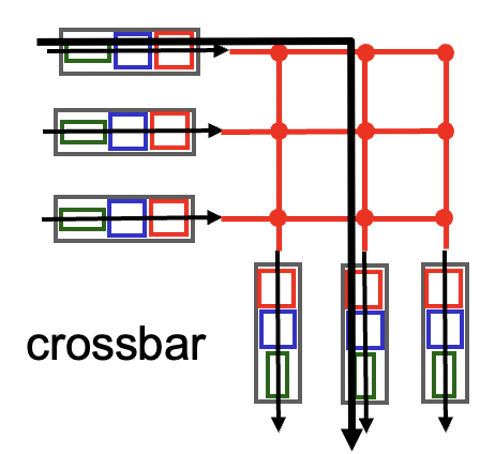

여러 쌍이 동시에 통신 가능, input port의 개수가 n이고, output port의 개수가 m이면 n 곱하기 m 만큼의 switch가 필요

### banyan network

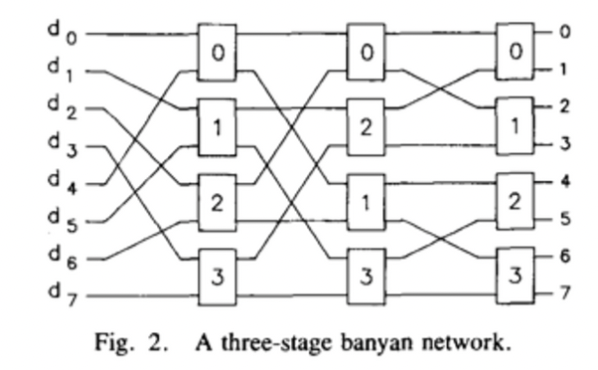

## Input Port Queuing

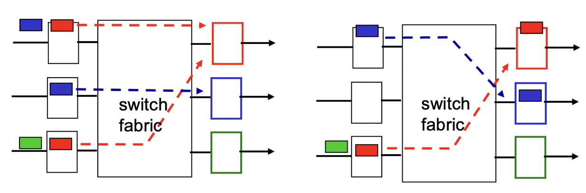

위 사진에서 상단 붉은 패킷이 output으로 이동하는 동안 하단 붉은 패킷이 상단 붉은 패킷이 이동을 끝마치는 것을 기다리는데, 이때 초록 패킷은 빨간 패킷 때문에 이동하지 못함. 이를 `HOL(Head-of-the-Line) blocking`이라고 함.

## Output Ports

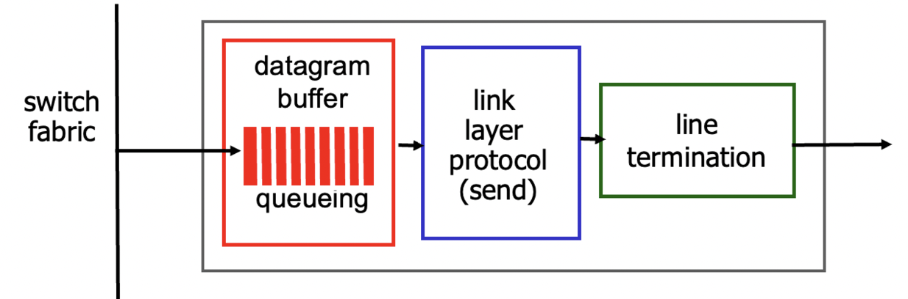

output ports에도 마찬가지로 버퍼가 존재하는데, 버퍼가 꽉 찬 상태에서 새로운 패킷이 들어오면 패킷이 손실될 수 있음. 이를 예방하기 위하여 버퍼 크기를 적절히 정해야 함.

RFC(Request of comments) 3439에서는 적절한 버퍼 크기를 다음과 같이 제안하였음.


> C = Link capacity  
> N = Flows


### 스케줄링 메커니즘

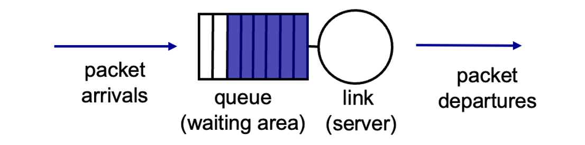

queue(버퍼)공간이 모자라 패킷을 discard 해야할 때, 무엇을 버릴지 정하는 규칙

- Tail Drop : 도착한 패킷을 버림
- Priority : 우선순위를 정하여 버림
- Random : 무작위로 버림

무엇을 버릴지가 아니라 link에서 무엇을 먼저 내보낼지도 정해야 한다.

- Priority : 큐마다 우선순위를 부여하여 우선순위가 높은 큐에서 먼저 내보냄

  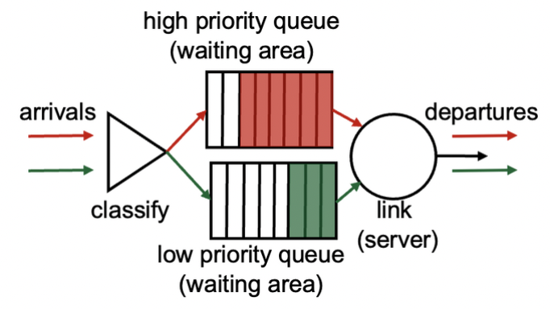

  예시)

  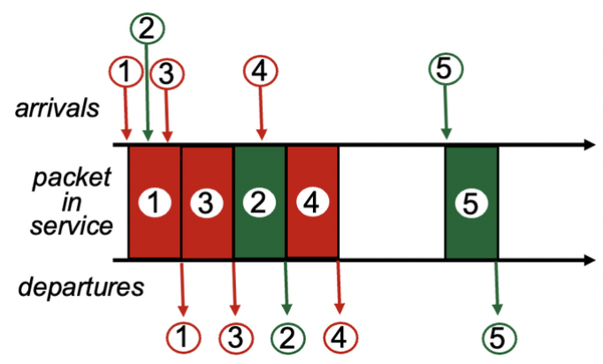

- Round-Robin : 큐마다 한 번씩 돌아가면서 내보냄

  예시)

  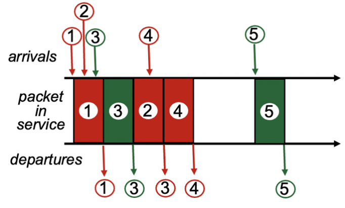

- Weighted Fair Queuing(WFQ) : Round-Robin과 비슷하나 큐마다 가중치를 추가로 부여함.

  예시)

  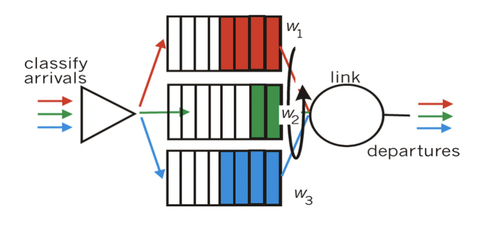

```toc
```
