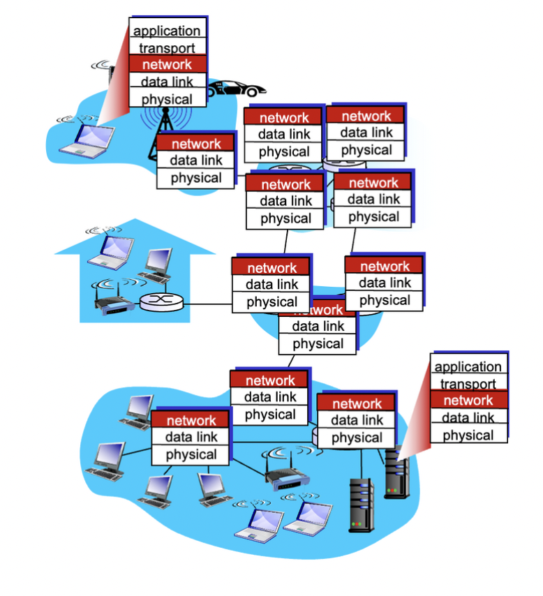
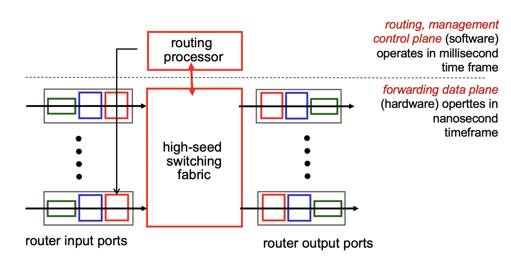
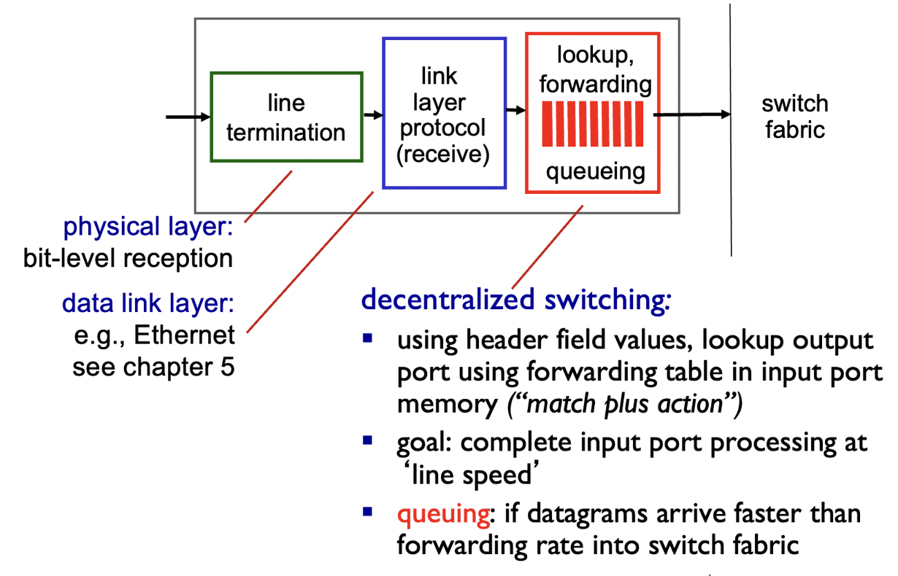
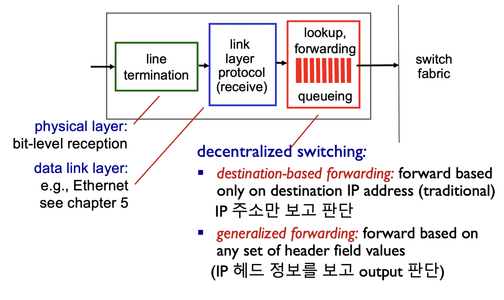
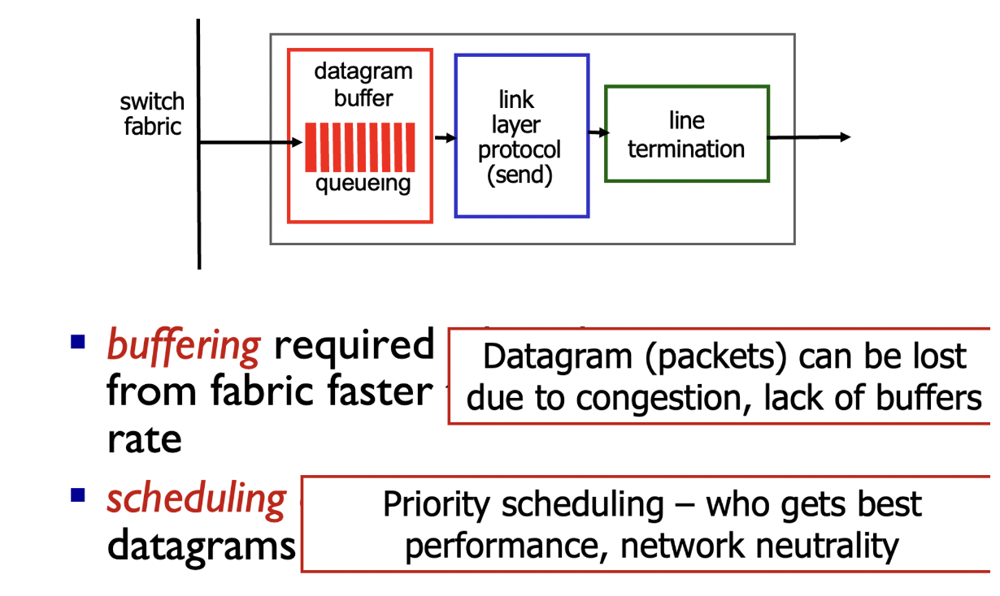
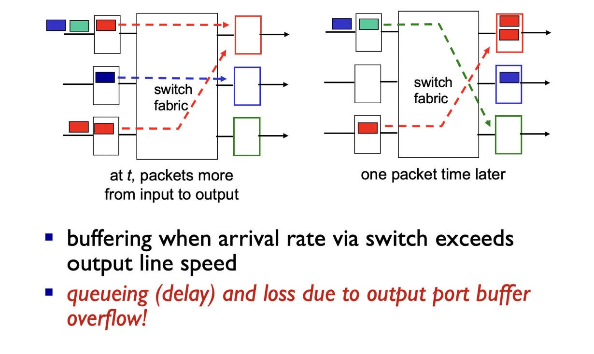

## **Network Layer (네트워크 계층)**


- 송신 측에서 수신 측으로 전송 세그먼트를 전달하는 역할을 하는 계층입니다.
- 송신 측에서는 세그먼트를 데이터그램으로 캡슐화하여 전송합니다.
- 수신 측에서는 데이터그램을 전송 계층으로 전달합니다.
- 모든 호스트와 라우터에는 네트워크 계층 프로토콜이 존재합니다.
- 라우터는 자신을 통과하는 모든 IP 데이터그램의 헤더 필드를 검사합니다.

## 네트워크 계층의 두 가지 주요기능

1. Forwarding (포워딩)
- 라우터의 입력에서 적절한 라우터 출력으로 패킷을 이동시키는 기능입니다.
- 개별 라우터 내에서 수행됩니다.
1. Routing (라우팅)
- 송신지에서 목적지까지 패킷이 거치는 경로를 결정하는 기능입니다.
- 전체 경로에서 패킷이 이동하는 경로를 계획하는 과정을 말합니다.

라우팅 알고리즘은 이러한 라우팅 기능을 수행하기 위해 사용됩니다. 여행을 가는 것과 유사한 비유로 설명하면, 포워딩은 단일 교환소를 통과하는 과정이고, 라우팅은 출발지에서 목적지까지 여행을 계획하는 과정입니다.

## **Data Plane and Control Plane**

### **Data Plane**

- Data Plane은 네트워크 장비에서 동작하는 핵심 기능을 수행하는 영역입니다.
- Data Plane은 패킷 전달과 관련된 작업을 처리하며, 주로 라우터나 스위치와 같은 네트워크 장비에서 동작합니다.
- Data Plane은 패킷의 전달 경로를 결정하고, 포워딩 기능을 수행하여 패킷을 목적지로 전달합니다.
- Data Plane은 네트워크의 성능과 속도에 직접적인 영향을 미치는 핵심적인 역할을 담당합니다.

### **Control Plane**

- Control Plane은 네트워크 장비의 구성과 동작을 관리하는 영역입니다.
- Control Plane은 네트워크 장비 사이의 통신, 경로 선택, 라우팅 테이블 관리 등의 기능을 수행합니다.
- Control Plane은 네트워크 장비의 동작을 제어하고, 네트워크 상태를 모니터링하여 최적의 경로를 결정하는 역할을 합니다.
- Control Plane은 네트워크의 안정성과 효율성을 유지하고, 서비스 제공을 위한 정책을 관리합니다.

데이터 평면(Data plane)과 제어 평면(Control Plane)은 네트워크에서 각각 다른 역할을 수행하며, 데이터 평면은 패킷의 전달과 관련된 작업을 처리하고, 제어 평면은 네트워크 장비의 구성과 동작을 관리합니다. 이 두 평면은 함께 작동하여 네트워크를 운영하고 관리하는 데 필요한 기능을 수행합니다.

## 라우터 구조



### 입력 포트 기능






### 출력 포트





```toc
```
