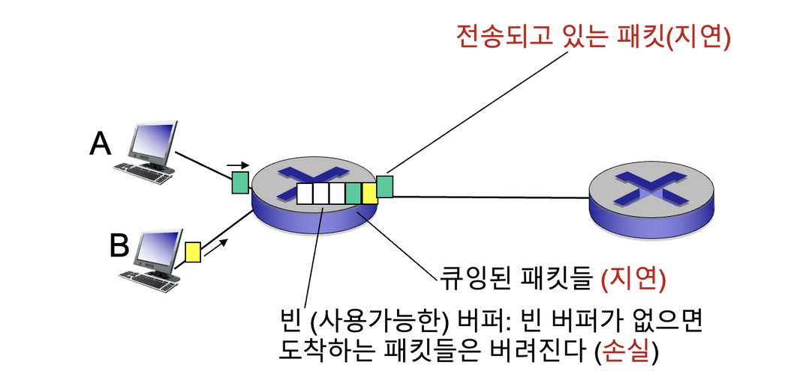
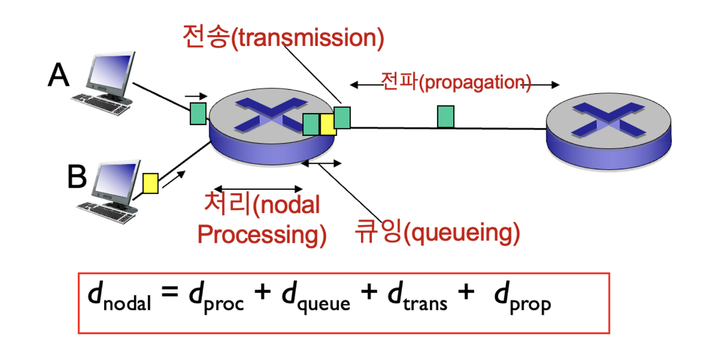
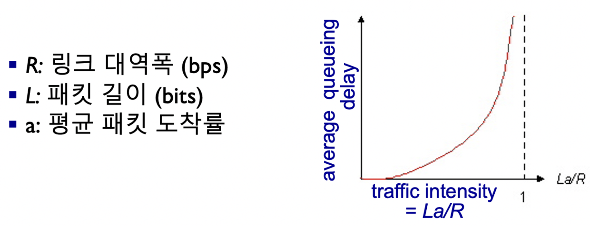
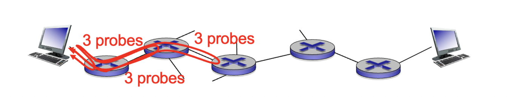

# 네트워크에서의 지연, 손실, 처리율

## 손실과 지연은 어떻게 발생하는가?


- 라우터의 버터에 패킷들이 큐잉된다.
  - 패킷 도착률 > 출력 링크 용량(대역폭)을 넘으면 큐잉
  - 패킷들은 자기 차례를 기다림.

### 패킷 지연의 4가지 원인


- d_{nodal}=d_{proc} + d_{queue} + d_{trans} + d_{prop}
- d_{proc} : nodal processing
  - 에러 검사
  - 출력 링크 결정
  - 대개 msec이하
- d_{queue} : queueing delay
  - 출력 링크에서 전송을 기다리는 시간
  - 라우터의 혼잡 정도에 따라 의존적
- d_{trans} : transmission delay
  - L : 패킷 길이(bits)
  - R : 링크 대역폭(bps)
  - d_{trans} = L/R
- d_{prop} : propagation delay
  - d : 물리 링크의 길이
  - s : 전파 속도 (~2x10^8 m/s)
  - d_{prop} = d/s


### 큐잉 지연


- R : 링크 대역폭 (bps)
- L : 패킷 길이 (bits)
- a: 패킷이 큐에 도착하는 평균율(단위는 패킷/초) : 도착율
- L/R : 서비스율
- La/R = 도착율과 서비스율과의 관계를 의미함.
- La/R ≥ 1 이면 평균 지연이 무한대가 되어 데이터가 큐에 계속해서 누적됨 : 피해야함

L/R은 평균 대기열 길이(L)와 평균 서비스율(R)의 비율을 나타내는 값이다. L/R 값이 작을수록 대기열이 작아지고 작업 처리 속도가 빨라진다. 그에 반해 L/R 값이 클수록 대기열이 커지고 작업 처리 속도가 느려진다.

또한, a는 패킷의 도착률을 의미한다. 도착률이 높을수록 시스템에 높은 작업 부하가 걸리고 대기열의 길이가 늘어날 수 있다.

이렇게 L/R과 a는 큐잉 지연과 관련된 지표로 사용된다. L/R 값이 작을수록 큐잉 지연이 작아지고 작업 처리 속도가 빨라지며, a 값이 낮을수록 도착률이 낮아져서 대기열의 길이가 줄어들 수 있다. 그 반대로 L/R 값이 클수록 큐잉 지연이 커지고 작업 처리 속도가 느려지며, a 값이 높을수록 도착률이 높아져서 대기열의 길이가 증가할 수 있다. 이를 통해 L/R과 a는 패킷의 큐잉 지연과 서비스 품질을 평가하고 개선하는 데 도움이 된다.

### “실제의” 인터넷 지연과 경로


traceroute 프로그램: 송신측에서 수신측에 가는 경로상의 각 라우터들까지의 지연을 측정하여 제공한다.

모든 i에 대해:
경로상의 라우터 i까지 가는 패킷을 3개 보낸다.
라우터 i 는 패킷을 송신측에 되돌려 보낸다.
송신측은 전송에서 응답까지의 시간을 측정한다.
```toc
```
