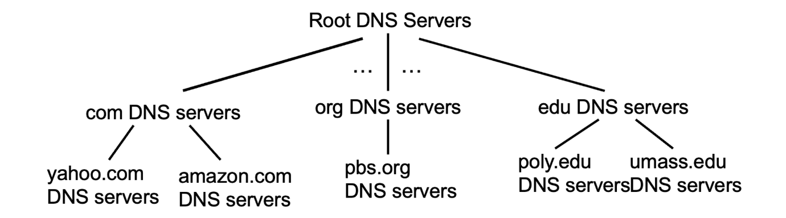
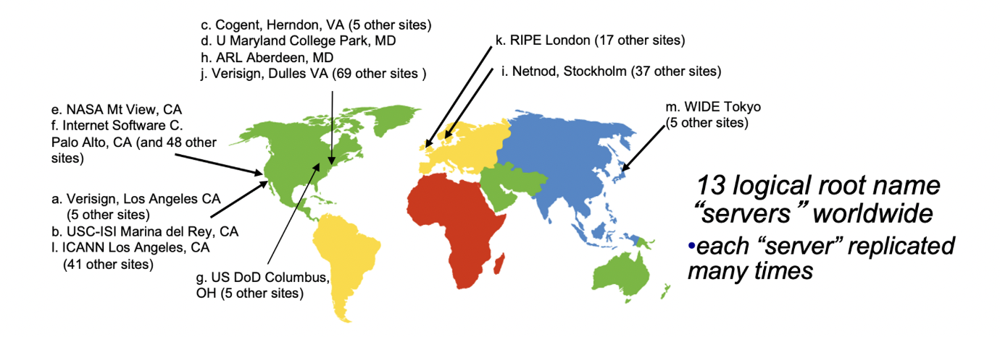
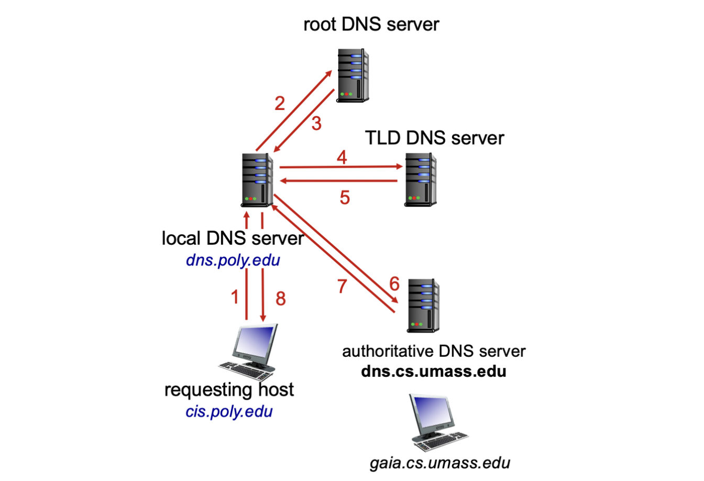
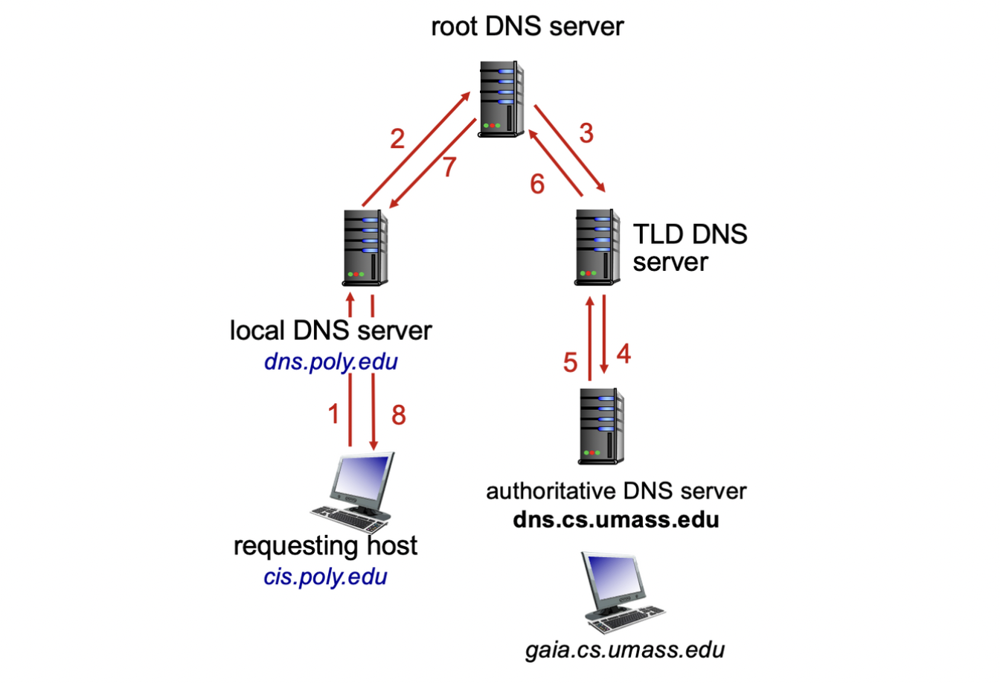
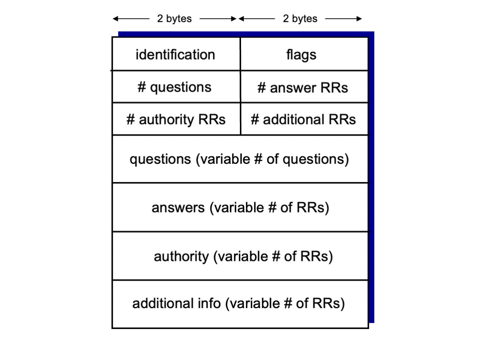

# DNS: Domain Name System

사람들은 여러 식별자를 가지고 있다:
SSN(사회보장번호), 이름, 여권 번호 등이 있다.
인터넷 호스트와 라우터는 다음과 같은 식별자들이 있다:
32비트의 IP 주소 - 데이터그램을 주소 지정하는데 사용된다.
"이름", 예를 들면 **www.yahoo.com** - 사람들에게 읽기 쉬운 형태로 사용된다.
질문: IP 주소와 이름 간의 매핑, 그리고 그 반대의 경우에는 어떻게 할 수 있을까?

- 도메인 이름 시스템:
  계층적인 많은 **네임 서버** 에 구현된 분산 데이터베이스
- 응용 계층 프로토콜: 호스트와 네임 서버가 이름을 확인하여 주소/이름 변환을 한다.
    - 참고: 핵심 인터넷 기능이며, 응용 계층 프로토콜로 구현되어 있다.
    - 네트워크의 "가장자리"에서 복잡성이 발생한다.
    - 전송계층 : UDP사용 (불필요한 데이터 최소화, 트래픽 감소)

## DNS 서비스, 구조

- DNS 서비스
    - 호스트 이름을 IP 주소로 변환
    - 호스트 별칭
    - 정식 이름과 별칭 이름(alias)
    - 메일 서버 IP찾기 (메일 서버도 IP기 때문에 DNS에서 검색)
    - 부하 분산
    - 복제된 웹 서버: 여러 IP 주소가 하나의 이름에 해당하는 이유
- DNS를 중앙집중화하지 않는 이유
    - 하나가 마비되면 시스템 전체가 마비
    - 트래픽 부하
    - 유지 보수의 어려움(확장 불가)

### DNS : 분산, 구조적 데이터베이스



라이언트가 **www.amazon.com의** IP 주소를 찾는 과정:

1. 클라이언트는 루트 서버에 쿼리를 보내 com 도메인의 DNS 서버를 찾는다.
2. 클라이언트는 .com 도메인의 DNS 서버에 쿼리를 보내 amazon.com 도메인의 DNS 서버를 찾는다.
3. 클라이언트는 amazon.com 도메인의 DNS 서버에 쿼리를 보내 **www.amazon.com의** IP 주소를 찾는다

### DNS : root name servers



- **로컬 네임 서버**가 이름(도메인 네임)을 해석할 수 없는 경우 ICANN이 관리하는 **root name server**에게 요청
- **root name server**는 권한 있는 네임 서버로 부터 매핑정보를 받아와 **로컬 네임 서버**에 전달

### TLD, Authoritative Server

- 최상위 도메인 (Top-Level Domain, TLD) 서버: com, org, net, edu, aero, jobs, museums 등의 최상위 도메인 및 국가 코드 최상위 도메인 (ccTLD)인 uk, fr, ca, jp 등의 도메인에 대한 책임을 지는 서버
    - 예시: Network Solutions은 .com TLD 서버를 관리하고, Educause는 .edu TLD 서버를 관리
- 권한 있는 DNS 서버 (Authoritative DNS Server): 조직이나 서비스 제공자에 의해 유지되는 도메인의 고유한 호스트명과 IP 주소의 매핑 정보를 제공하는 서버
    - 조직이나 서비스 제공자가 직접 유지하거나 위탁하여 운영
    - 예시: ns1.example.com, ns2.example.com

### Local DNS Name Server

- 계층 구조에 엄격하게 속하지 않음
- 각 ISP (가정용 ISP, 회사, 대학 등)마다 하나씩 존재
    - "기본 네임 서버"로도 불림
- 호스트가 DNS 쿼리를 생성하면, 해당 호스트의 로컬 DNS 서버로 쿼리가 전송됨
    - 최근 이름-주소 변환 쌍의 로컬 캐시를 가지고 있음 (하지만 오래된 정보일 수 있음)
    - 프록시**처럼** 동작하여 계층 구조로 쿼리를 전달함(프록시와 유사하지만 다른개념)

## DNS 이름 해석 예시

### Iterated Query



- “저희 부서 아니에요, 여기로 가세요”
- 상위 DNS서버가 하위 DNS서버의 주소를 알려주는 것을 반복, 권한있는 DNS서버가 최종적으로 로컬 DNS 서버에 주소 전송
- 로컬 DNS 서버에 부하가 많이 걸림.

### Recursive Query



- root DNS 서버에 요청후, TLD 서버, 권한있는 DNS 서버 순으로 요청이 보내져 최종적으로 로컬 DNS가 주소를 받는 방식
- root DNS 서버에 부하가 많이 걸림.

## DNS : 캐싱, updating records

- 한 번 특정 네임 서버가 매핑 정보를 학습하면, 해당 정보를 캐시에 저장
- 캐시된 항목들은 일정 시간**(TTL:Time To Live)**이 지난 후에 자동으로 삭제
- 최상위 도메인(TLD) 서버는 일반적으로 로컬 네임 서버에 캐시되어 있어서 루트 네임 서버를 자주 방문하지 않습니다.
- 캐시된 항목들은 최신 정보와 다를 수 있음(TTL이 유효한 동안 최신 정보가 갱신되면)
- 호스트의 IP 주소가 변경되면, 모든 TTL이 만료될 때까지 인터넷 전체에 변경 사항이 알려지지 않을 수 있음
- 업데이트/알림 메커니즘은 IETF 표준, RFC 2136

### DNS records

| 도메인 이름 | TTL | 레코드 유형 | 데이터 값 |
| --- | --- | --- | --- |
| example.com | 3600 | A | 192.168.1.1 |
| example.com | 3600 | MX | mail.example.com |
| example.com | 86400 | NS | ns1.example.com |
| example.com | 86400 | NS | ns2.example.com |
| mail.example.com | 3600 | A | 192.168.1.2 |
| http://www.example.com/ | 3600 | CNAME | example.com |

위의 표에서 각 컬럼은 다음과 같은 정보를 나타냄:

- 도메인 이름: 레코드가 적용될 도메인 이름
- TTL (Time To Live): 레코드가 캐시될 수 있는 시간 (초 단위)
- 레코드 유형: DNS 레코드의 종류 (A, MX, NS, CNAME, TXT 등)
    - **각 도메인이름-데이터 값**
    - A : 호스트 네임-실제 IP
    - NS : 호스트 네임-권한있는 네임 서버
    - CNAME : 별명-우회할 도메인
    - MX : 메일 도메인-메일 서버
- 데이터 값: 해당 레코드의 데이터 값 (도메인 이름, IP 주소, 텍스트 등)

## DNS Protocol



## **DNS 레코드 등록**

### **예시: 새로운 스타트업 "Network Utopia"**

1. DNS 등록 업체 (예: Network Solutions)에서 도메인 이름 networkutopia.com을 등록합니다.
2. authoritative name server (primary와 secondary)의 이름과 IP 주소를 제공합니다.
3. 등록 업체는 .com 최상위 도메인 (TLD) 서버에 두 개의 RRs(Resource Records)를 삽입합니다.
    - (networkutopia.com, dns1.networkutopia.com, NS)
    - (dns1.networkutopia.com, 212.212.212.1, A)
4. **[www.networkutopia.com에](http://www.networkutopia.xn--com-568n/)** 대한 authoritative 서버에서 A 타입 레코드를 생성합니다.
5. networkutopia.com에 대한 authoritative 서버에서 MX 타입 레코드를 생성합니다.
```toc
```
