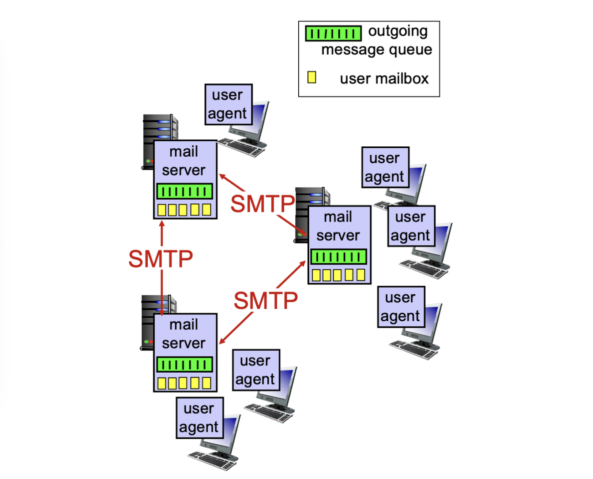
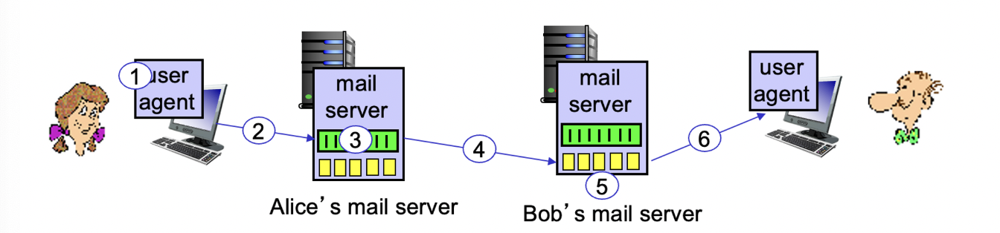
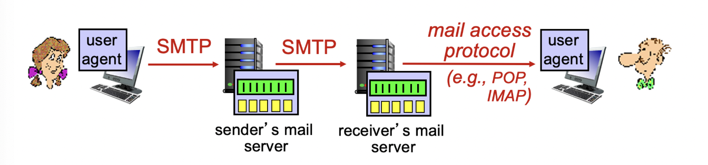

# Electronic mail


**3개의 주 요소** :

- User agent
- Mail server
- Simple Mail Transfer Protocol : SMTP

## User agent

1. 클라이언트: 클라이언트는 서버에게 서비스를 요청하는 컴퓨터나 디바이스를 의미한다. 클라이언트는 웹 브라우저, 웹 애플리케이션, 모바일 앱 등 다양한 형태로 존재할 수 있다. 사용자는 클라이언트를 통해 웹 서버에 요청을 보내고, 서버로부터 응답을 받아 화면에 웹 페이지를 렌더링하거나 서비스를 이용할 수 있다. 예를 들어, 사용자가 웹 브라우저를 통해 웹 페이지를 요청하면 웹 브라우저가 클라이언트 역할을 수행하여 요청을 서버에 전달하고, 서버로부터 받은 응답을 렌더링하여 사용자에게 보여준다.
2. User Agent: User Agent는 HTTP 요청을 보내는 클라이언트의 소프트웨어나 애플리케이션을 식별하는 문자열 정보를 의미한다. 이 정보는 HTTP 헤더에 포함되어 서버에게 전달된다. User Agent는 클라이언트가 어떤 소프트웨어나 애플리케이션을 사용하고 있는지를 서버에게 알려주는 역할을 한다. 예를 들어, 웹 브라우저의 User Agent 정보는 웹 서버에게 어떤 브라우저와 버전을 사용하고 있는지를 알려주어 웹 서버는 그에 맞는 웹 페이지를 제공할 수 있다.
3. **Mail User Agent(MUA)**: 위 그림에 나온 User Agent는 이를 말한다. 메일 사용자 에이전트(Mail User Agent, MUA)는 이메일 클라이언트 소프트웨어로, 이메일을 보내고 받는 데 사용된다. MUA는 이메일 사용자의 요청에 따라 이메일을 작성, 보내기, 수신, 읽기, 삭제 등의 작업을 수행한다.
   MUA는 사용자가 이메일을 작성할 때 이메일의 수신자, 제목, 본문, 첨부 파일 등을 입력하고, 작성한 이메일을 메일 서버에 보내는 역할을 수행한다. 또한, 메일 서버로부터 이메일을 수신하여 사용자의 메일함에 이메일을 보관하고, 사용자가 이메일을 읽고, 삭제하고, 이메일에 답장하고, 전달하고, 다양한 메일 관리 작업을 수행하는 등의 기능을 제공한다.

클라이언트는 사용자가 웹 서버에 접속하여 서비스를 요청하는 디바이스나 소프트웨어를 의미하며, User Agent는 클라이언트의 HTTP 요청을 보내는 소프트웨어나 애플리케이션을 식별하는 정보를 말한다. 클라이언트는 웹 브라우저, 웹 애플리케이션 등 다양한 형태로 존재할 수 있고, User Agent는 해당 클라이언트의 식별 정보를 포함한 문자열로 서버에 전달된다.

또한, 이와 별개로 **메일 사용자 에이전트(Mail User Agent, MUA)** 는 이메일 클라이언트 소프트웨어로, 이메일을 보내고 받는 데 사용되며, 이메일 사용자의 요청에 따라 이메일을 작성, 보내기, 수신, 읽기, 삭제 등의 작업을 수행한다. MUA는 사용자가 이메일을 작성할 때 이메일의 수신자, 제목, 본문, 첨부 파일 등을 입력하고, 작성한 이메일을 메일 서버에 보내는 역할을 수행한다. 또한, 메일 서버로부터 이메일을 수신하여 사용자의 메일함에 이메일을 보관하고, 사용자가 이메일을 읽고, 삭제하고, 이메일에 답장하고, 전달하고, 다양한 메일 관리 작업을 수행한다. MUA는 이메일 표준 프로토콜인 SMTP(Simple Mail Transfer Protocol), POP(Post Office Protocol), IMAP(Internet Message Access Protocol) 등을 사용하여 이메일을 송수신하고 관리한다.

## Mail server

- 메일박스: 사용자의 수신 메시지를 포함
- 메시지 큐: 발신 메일 메시지의 대기열을 갖음
- SMTP 프로토콜: 메일 서버 간에 이메일 메시지를 전송하기 위해 사용됨

## SMTP : Simple Mail Transfer Protocol ([RFC 2821](https://www.rfc-editor.org/rfc/rfc2821))

- 포트 25를 사용하여 TCP를 통해 클라이언트에서 서버로 이메일 메시지를 신뢰성 있게 전송
- 직접 전송: 송신 서버에서 수신 서버로
- 세 가지 전송 단계:
    1. 핸드셰이킹 (Greeting)
    2. 메시지 전송
    3. 종료
- 명령/응답 상호작용 (HTTP와 유사): 명령은 ASCII 텍스트로 구성되고, 응답은 상태 코드와 문구로 구성됨
- 메시지는 7비트 ASCII로 작성되어야 함

## 상황 : Alice가 Bob에게 메세지를 보낼 때


1. 앨리스는 UA(사용자 에이전트)를 사용하여 밥의 메일 주소인 **bob@someschool.edu에** 메시지를 작성한다.
2. 앨리스의 UA는 메시지를 엘리스의 메일 서버로 보내고, 메시지가 메시지 큐에 저장된다.
3. SMTP 클라이언트는 TCP 연결을 통해 밥의 메일 서버와 연결을 열어준다(Greeting).
4. SMTP 클라이언트는 앨리스의 메시지를 TCP 연결을 통해 밥의 메일 서버로 전송한다.
5. 밥의 메일 서버는 메시지를 밥의 메일박스(서버 내부)에 저장한다.
6. 밥은 자신의 사용자 에이전트를 실행하여 메시지를 읽는다.

### SMTP 상호작용 예시

>S: 220 hamburger.edu  
>C: HELO crepes.fr  
>S: 250  Hello crepes.fr, pleased to meet you  
>C: MAIL FROM: alice@crepes.fr  
>S: 250 alice@crepes.fr... Sender ok  
>C: RCPT TO: bob@hamburger.edu  
>S: 250 bob@hamburger.edu ... Recipient ok  
>C: DATA  
>S: 354 Enter mail, end with "." on a line by itself  
>C: Do you like ketchup?  
>C: How about pickles?  
>C: . *//.은 송신자의 메시지가 아니라 UA가 추가한 메시지임(종결자)*  
>S: 250 Message accepted for delivery  
>C: QUIT  
>S: 221 hamburger.edu closing connection  

### SMTP : final words

- SMTP는 지속연결(HTTP1.1과 유사)
- SMTP는 7-bit ASCII코드만 지원
- SMTP 서버는 CRLF.CRLF (캐리지 리턴과 라인 피드로 이루어진 문자열)를 이용하여 메시지의 끝을 판단합니다.
- **HTTP와의 비교 :**
  둘 다 ASCII 명령/응답 상호작용과 상태 코드를 가지고 있음
  HTTP: 각 객체는 자체 응답 메시지에 캡슐화
  SMTP: 여러 개의 객체가 멀티파트 메시지로 전송

### MIME

MIME(Multipurpose Internet Mail Extensions)은 이메일에서 다양한 형태의 데이터를 전송하기 위한 표준 인터넷 프로토콜입니다. MIME을 사용하여 이메일에 텍스트, 이미지, 동영상, 첨부 파일 등 다양한 형태의 데이터를 포함할 수 있습니다. MIME은 SMTP(Simple Mail Transfer Protocol)를 통해 인코딩된 이메일을 전송할 수 있습니다.

MIME의 주요 기능과 제약 사항은 다음과 같습니다:

- 이메일에는 텍스트, 이미지, 동영상 등 다양한 형태의 데이터를 포함할 수 있습니다.
- MIME은 인코딩 방식을 통해 이메일 본문의 데이터를 표현하고 전송합니다.
- MIME은 이메일 클라이언트에서 다양한 형태의 데이터를 표시할 수 있도록 합니다.
- MIME은 이메일에서 파일 형식과 크기에 제한이 있을 수 있습니다.
- 이메일 클라이언트나 서버에서는 MIME 형식으로 전송되는 파일 형식과 크기에 제한을 둘 수 있습니다.
## 메일 포맷 예시

[이하 헤더]

To: [receiver@example.com](mailto:receiver@example.com)  
From: [sender@example.com](mailto:sender@example.com)  
CC: [cc@example.com](mailto:cc@example.com)  
BCC: [bcc@example.com](mailto:bcc@example.com)  
Subject: Example Email Message  
Date: April 9, 2023  

---

[Blank line]

[이하 본문]

안녕하세요,

이메일 메시지 예시입니다. 이곳에 본문 내용이 들어갑니다. 일반 텍스트, HTML, 이미지 등 다양한 형식의 내용을 포함할 수 있습니다.

첨부 파일로 예시 파일을 함께 전송합니다. 파일 이름은 "example_file.pdf"이며, 파일 크기는 2MB입니다.

감사합니다.
보내는이

---

## 메일 접근 프로토콜


메일을 읽을때는 SMTP 사용 불가하다.

- POP: Post Office Protocol [RFC 1939]: 인증, 다운로드
- IMAP: Internet Mail Access Protocol [RFC 1730]: 더 많은 기능, 서버에 저장된 메시지 조작 포함
- HTTP: gmail, Hotmail, Yahoo! Mail, etc.
    - 위 그림에서 웹메일을 사용할 때는 HTTP → SMTP → HTTP순으로 프로토콜 사용됨(서버간에는 SMTP사용)

### POP3 & IMAP

- POP3 : 메일을 클라이언트 측에서 읽는순간 클라이언트로 넘어옴. 해당 메일을 삭제하지 않아도 더 이상 서버에서 해당 메일을 읽을 수 없음. 클라이언트에서만 읽기 가능
- IMAP : 메일을 클라이언트 측에서 읽어도 메일이 서버에 남아있음. 다른 컴퓨터에서 서버에 접근하면 메일을 다시 읽기 가능.

```toc
```
