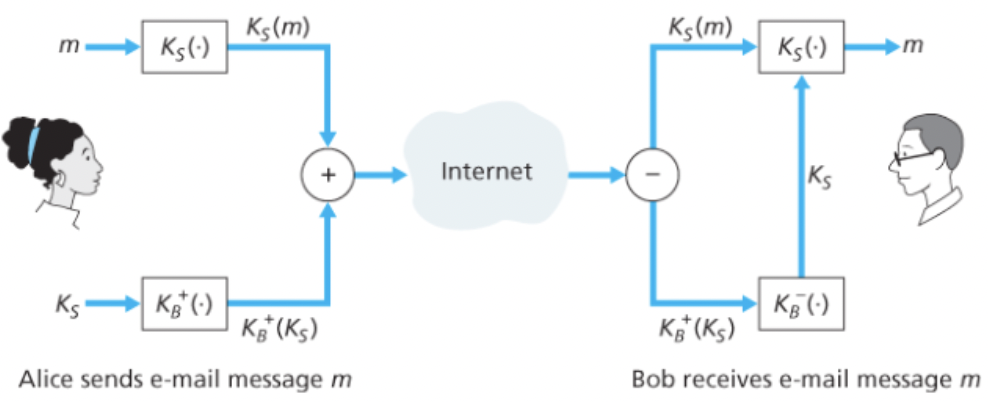
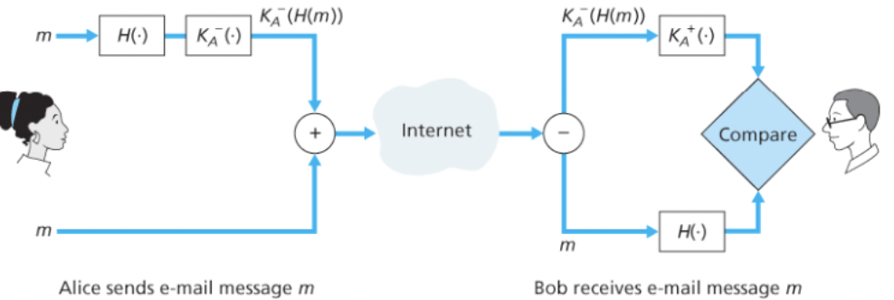
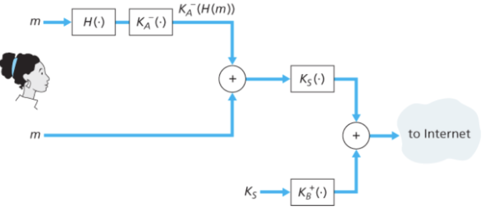

# 전자메일의 보안

보안은 인터넷 프로토콜 스택 위쪽 4개 계층의 어느 곳에서나 보안 서비스를 제공할 수 있다.

보안이 특정 애플리케이션 계층 프로토콜을 위해 제공되면 그 프로토콜을 사용하는 애플리케이션은 보안 서비스를 사용할 수 있게 된다.

<br/>

### 보안 기능이 하나 이상의 계층에서 제공되는 이유

보안은 네트워크 계층에서 제공하는 것으로 충분하지 않을까?

1. 네트워크 계층에서 데이터그램의 모든 데이터를 암호화하고 IP 주소를 인증함으로써 ‘전면적 범위’의 보안을 제공하더라도 사용자 레벨의 보안은 제공할 수 없다.
   - 예를 들어, 인터넷 상거래 사이트는 물건을 구입하려는 고객을 인증하는 데 IP 계층 보안에만 의존할 수는 없다.
2. 프로토콜 상위 계층에서 보안 서비스를 포함한 새로운 인터넷 서비스를 구현하는 일이 점차 쉬워지고 있다.

<br/>

## 보안 전자메일

보안 전자메일 시스템을 만들기 위해 암호화 원리들을 이용해보자.

<br/>

### 기밀성



메시지를 대칭키 기술(AES,DES 등)으로 암호화 복호화하여 기밀성을 얻을 수 있다.

그러나 송수신자만 대칭키를 알기에 어렵기 때문에 공개키 암호화(RSA)를 고려하게 된다.

<br/>

그러나 RSA를 통해 메시지를 암호화 복호화 한다면 계산 부하가 너무 심해서 실질적으로 쓸 수 없다.

이를 위해 세션키를 사용한다.

1. 송신자는 임의의 **대칭 세션키 Ks**를 선택한다.
   - 이 대칭 세션키는 AES나 DES에 사용된다.
2. Ks로 메시지 m을 암호화하여 암호문 1을 얻는다.
3. Ks는 송신자의 공개키로 암호화하여 암호문 2를 얻는다.
4. 이 두개의 암호문을 수신자에게 보낸다.
5. 수신자는 자신의 개인키로 암호문 1을 복호화하여 Ks를 얻을 수 있다.
6. 얻은 Ks로 암호문 2를 복호화하여 m을 얻을 수 있다.

<br/>

이렇게 기밀성을 얻을 수 있다.

<br/>

### 송신자 인증과 메시지 무결성



이 둘을 얻기 위해 전자서명과 해시 알고리즘을 이용한다.

1. 송신자는 메시지 요약문을 얻기 위해 m에 해시함수를 적용하여 H(m)을 얻는다.
2. 전자 서명을 만들기 위해 해시의 결과를 자신의 개인키로 암호화한다.
3. 메시지 m과 전자서명을 수신자에게 보낸다.
4. 수신자는 송신자의 공개키로 전자서명을 복호화한다.
5. 메세지 m에 해시 알고리즘을 적용한 결과와 4의 결과를 비교하여 같으면 보낸 사람을 확인할 수 있고, 메시지의 무결성을 확인할 수 있다.

<br/>

### 통합



1. 먼저 송신자 인증과 무결성 과정을 통해 얻은 메시지와 전자서명 꾸러미를 만든다.
2. 이 꾸러미를 메시지 취급하여 기밀성 과정을 통해 수신자에게 전달한다.
3. 수신자는 순서대로 복호화하여 확인한다.

그러나 수신자는 송신자의 공개키를 알아야하고, 송신자는 수신자의 공개키를 알아야 하므로 CA를 통해 공개키를 인증 받아야한다.

<br/>

## PGP(Pretty Good Privacy)

PGP는 암호화 기법의 좋은 예로 본질적으로 위 통합과 동일하다.

1. PGP가 설치되면 소프트웨어는 사용자를 위한 공개키 쌍을 만든다.
   - 공개키는 사용자 웹사이트에 게시되거나 공개키 서버에 놓인다.
   - PGP 공개키는 사용자간 `신뢰의 그물(web of trust)` 속에서 인증된다.
   - 어떤 PGP 사용자들은 키 서명을 위한 모임을 열어 같은 물리적 공간에 모여서 공개키를 교환하고 그들의 개인키로 서명하는 것으로 서로의 키를 보증한다.
2. 개인키는 비밀번호로 보호된다.
   - 개인키를 사용하려면 사용자는 비밀번호로 인증해야한다.
3. PGP는 전자메일과 같은 방식으로 사용자에게 메시지를 전자서명하거나 암호화하거나 둘다 하거나 하는 선택지를 제공한다.
   - 개인키, 공개키, 해시 알고리즘, RSA가 있으니 모두 가능하다.

```toc
```
