# 홈페이지 개발일지

## 뭘로 만들건데? WIX? SITE123?

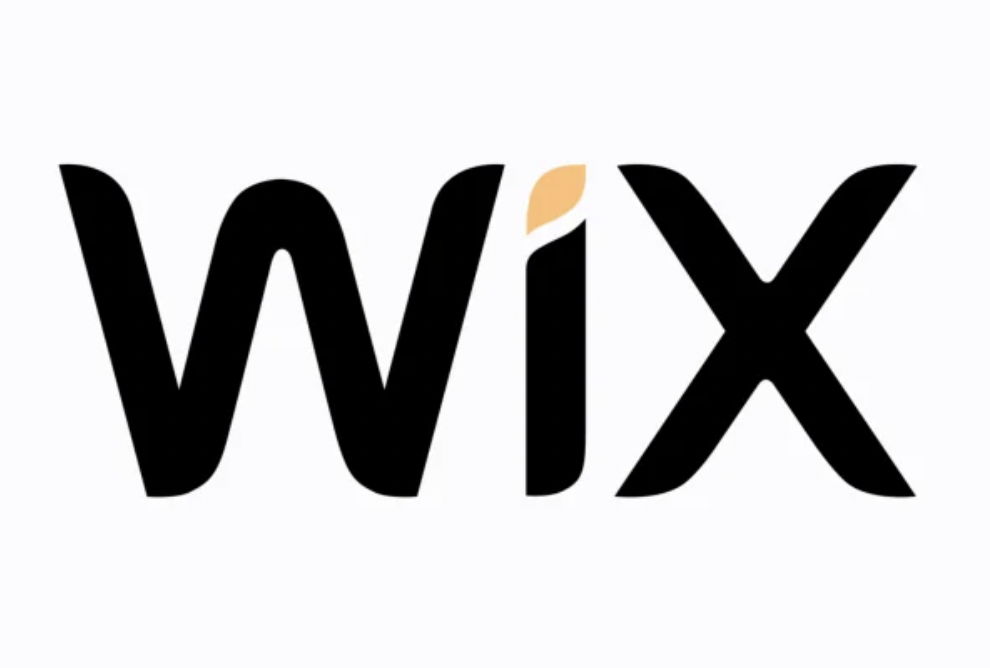

컴퓨터 네트워크 강좌 과제의 일환으로 공부 내용을 정리하여 직접 만든 홈페이지에
게시해야했습니다. <br/><br/>교수님께선 WIX 및 기타 플랫폼을 이용하시라 하셨지만 
그래도 개발자인데 직접 바닥부터 웹사이트를 빌드해서 배포까지 해보자는 생각으로
기존에 알고있던 JS, React지식을 활용하여 프론트 부분을 구성하고 백엔드 쪽은 Firebase를 사용하든지
Spring으로 직접하든지 하도록 하자! 하고 바로 웹사이트 개발을 시작했습니다.


## 마크다운 형식(.md)를 재활용할 수 없을까?

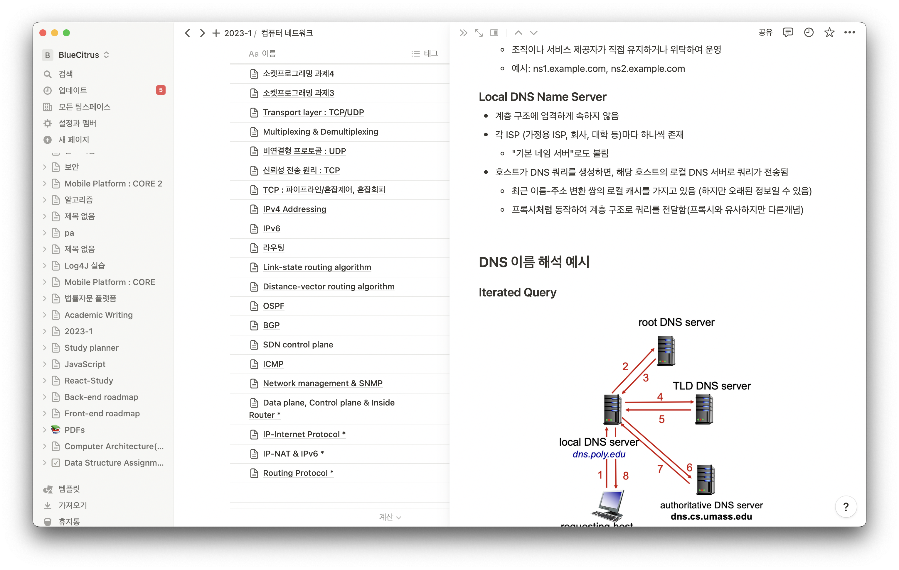

저는 평소에 강의자료 등을 `노션`이라는 워크스페이스를 통해 요약 및 관리하고 있는데,
여기에 정리해 둔 자료들을 놔두고 다시 웹사이트에 처음부터 적는것이 번거로울 것 같았습니다. <br/><br/>
그래서 일일히 html문서로 게시글을 새로 올리는 방식 대신 .md 파일을 이식하여 통합관리하는
정적인 사이트를 만들기로 결정했습니다. 이와 딱 맞는 서비스를 제공해주는 플랫폼이 있는데, 

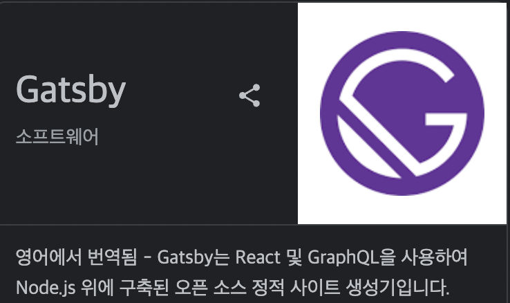

바로 `gatsby`입니다. <br/>

기존에 Node.js 및 React 기반 지식이 어느정도 잡혀있어 다루는 것이 어렵지 않을 것이라 판단하고
홈페이지 개발을 시작하였습니다.

## Gatsby 파헤치기
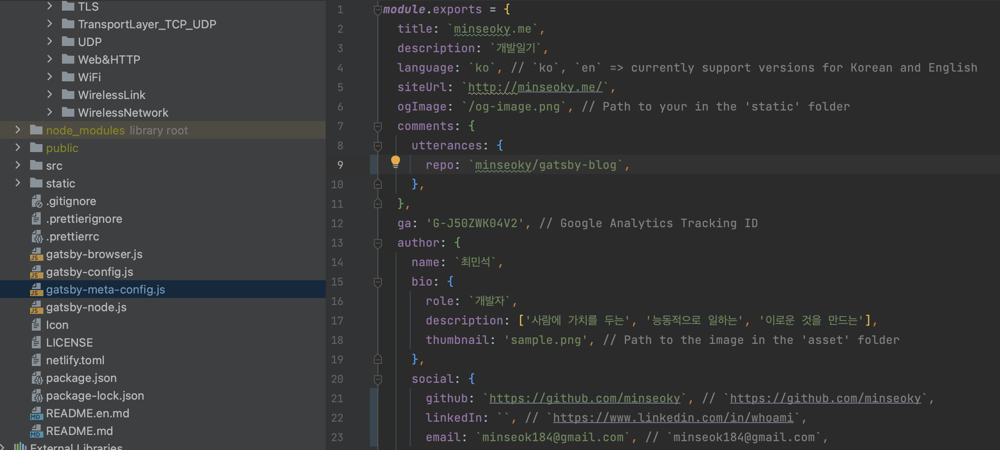
Gatsby로 생성된 정적 웹사이트의 큰 틀은 모두 GraphQL기반으로 작성되어 있습니다. 
각 elements들에 원하는 정보를 입력하면, 여러 페이지에 걸쳐 해당 정보를 레퍼런스로 하는
모든 컴포넌트에 정보다 전달됩니다. 예를 들어, 위 사진의 두번째 줄 `title`의 경우
웹페이지 좌측 상단에 표시되는 Home버튼의 폰트이미지 및 미리보기 페이지에 영향을 주는 식입니다.

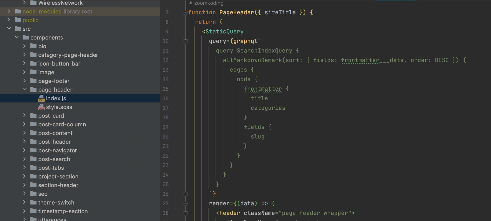
위 사진의 컴포넌트를 보면 알 수 있듯 graphql을 통해 쿼리를 검색하고 title, categories, slug 등의 elements
들을 불러옵니다. 모든 컴포넌트들이 이와 같이 연계되어 있어, graphql을 수정하는 것 만으로 모든 페이지를
한 번에 수정하는 효과를 얻을 수 있어 편리합니다.


## 마크다운 파일 불러오기
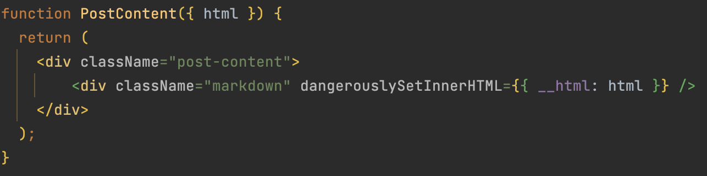
마크다운 파일 또한 graphQL을 통해 불러오는데, 파라미터로 받은 html객체 안에 쿼리와
관련된 정보들이 수록되어 있습니다. markdown에 맞는 css를 적용하고, dangerouslySetInnerHTML 옵션을 통해
마크다운 파일을 불러오고 스타일을 적용시킵니다.<br/><br/>
이 과정에서 실제 마크다운에서 적용되는 일부 문법들이 적용이 되지 않는 현상이 있었는데, scss파일에서 직접 지정해주니 해결되었습니다.

### 경로 지정은 어떻게?
경로 지정의 경우, 오리지널 코드 파일에 content파일을 하나 추가하고 디렉토리의 경로 자체를 웹사이트 경로로 삼았습니다.
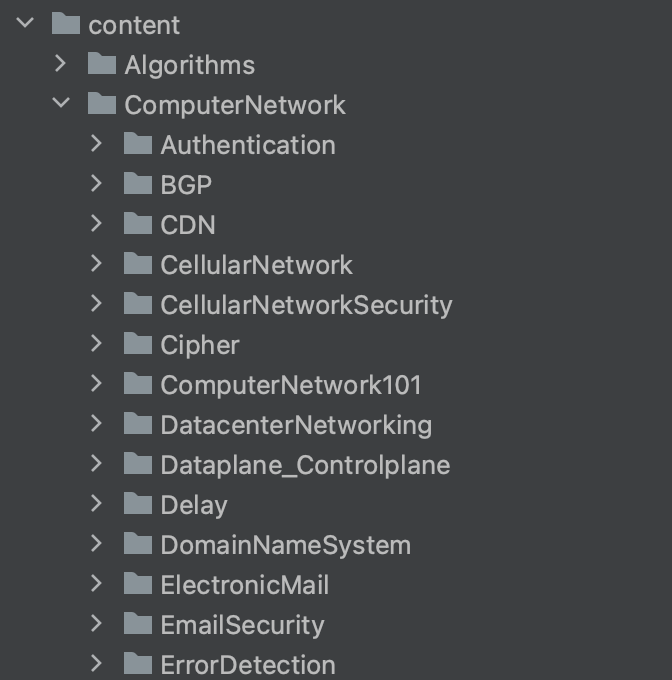
크게 Algorithms 카테고리, ComputerNetwork 카테고리로 분류되었으며, 만약 Authentication에 있는
마크다운 문서를 사이트에서 열람한다면 다음과 같이 표시됩니다.<br/>
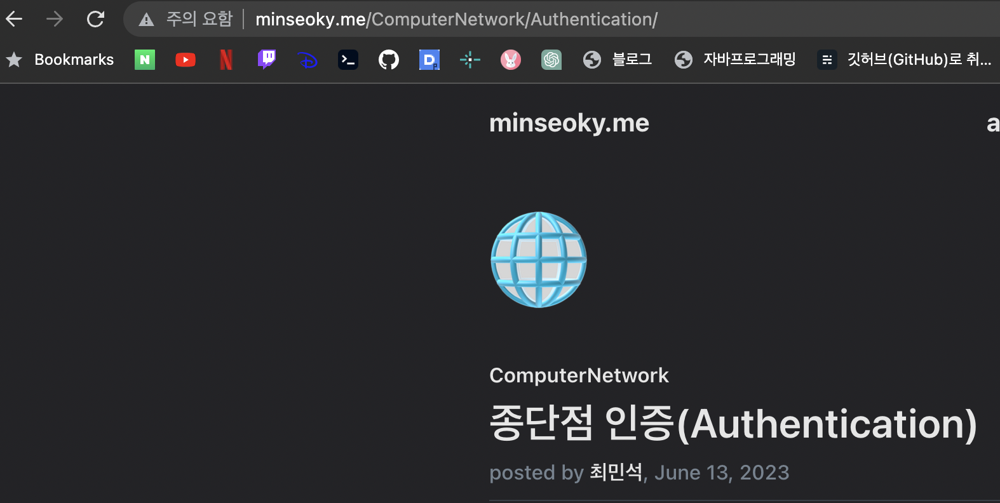

### 카테고리 정립하기
홈페이지를 만들고, 이번 과제에만 국한되지 않고 앞으로도 지식을 쌓는데에 홈페이지를 이용하고 싶어
카테고리를 분류하고 보기 편하게 하기를 원했습니다. 따라서 게시글을 카테고리별로 볼 수 있도록 하고 중복된 카테고리를 가지면
모두 볼 수 있도록 하였습니다.<br/><br/>
예를 들어, 아래의 컴퓨터 네트워크 과제들은 `Computernetwork` 카테고리와 `Assignments` 카테고리
모두에 분류됩니다. (둘 중 어떤 카테고리에서도 볼 수 있습니다.)

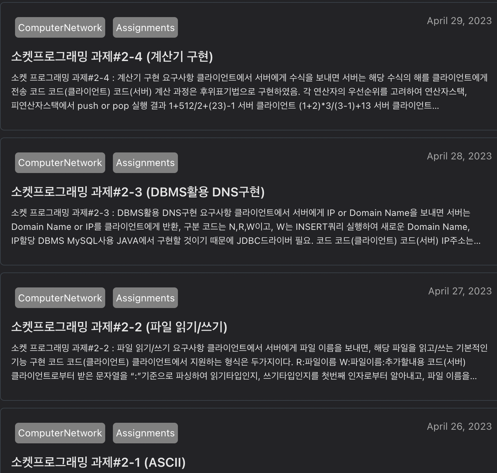

### 댓글기능 추가
제가 정리한 내용을 보고 다른 사람들의 학습에 도움을 줄 수도 있고, 반대로 제가 정리한
오개념을 독자가 바로잡아 줄 수 있다면 좋을것이라 생각했습니다.<br/>
따라서 여러가지 댓글 기능을 제공하는 라이브러리/프레임워크를 탐색하였습니다.<br/>

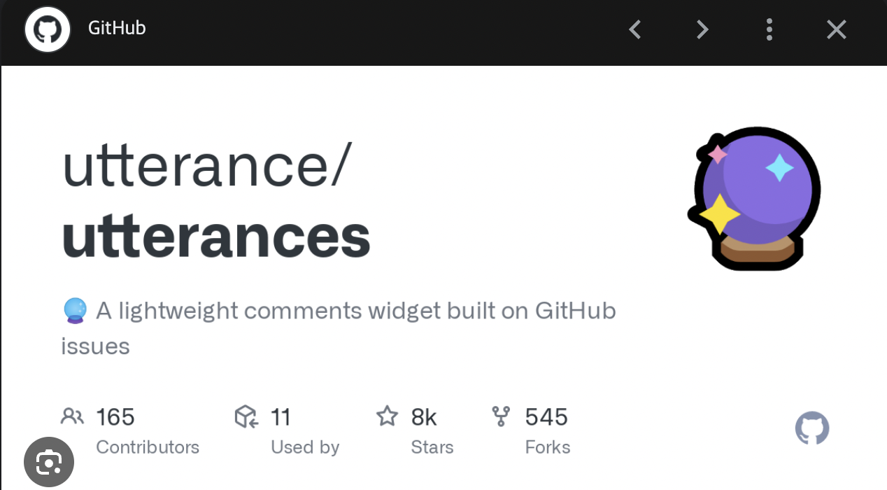
정적사이트에 알맞고 관리하기 편한 기능을 제공하는 `Utterance`를 사용하기로 결정하였습니다.
`Utterance`는 깃허브 계정이 있는 방문자들이 제 게시글에 댓글을 남기면 깃허브의 이슈 등록으로 처리하여
댓글을 이슈로써 관리할 수 있게 해주는 툴입니다.<br/>

아래는 실제 적용된 화면입니다.
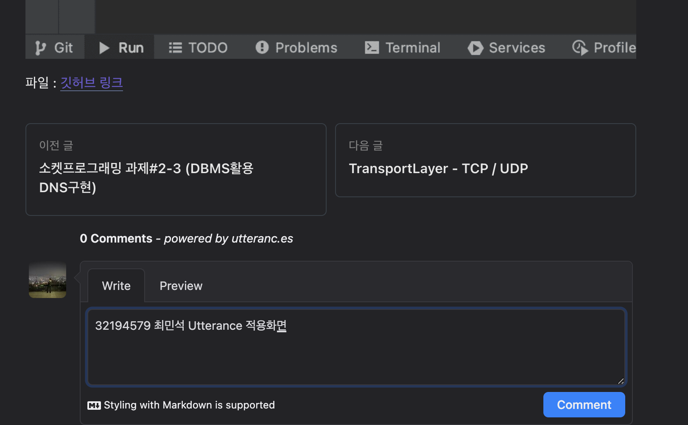

### 기타사항
이 외에도 toc(`Table of Contents`)구현, css디자인, 다크모드 적용 등 많은 옵션을 추가하였지만
일일히 설명하기에 너무 많아 이만 생략하겠습니다.

## 배포하기
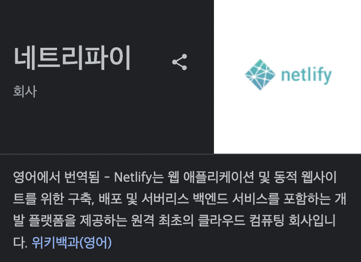
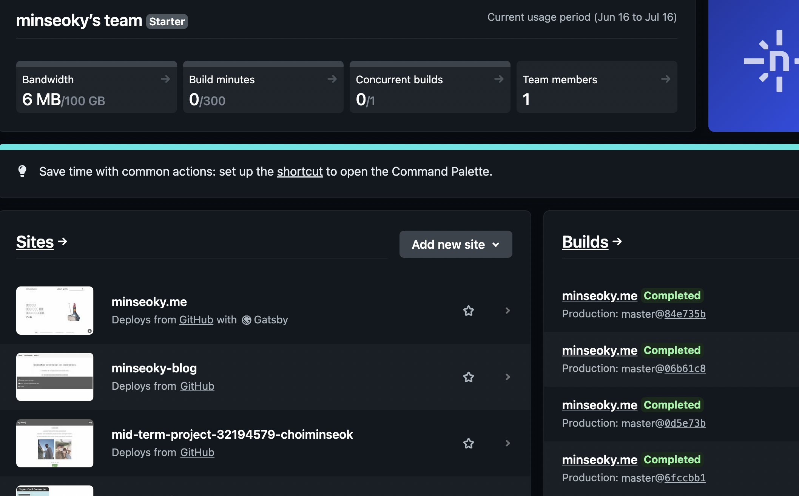
Gatsby와 호환성이 좋은 Netlify를 통해 배포하였습니다. 처음에는 직접 집에 있는 컴퓨터를 통해 Tomcat서버를 구축해보려 했으나 구식 노트북이라
발열이 너무 심해 localhost로만 돌려보고 끝냈습니다.

### 도메인 구입
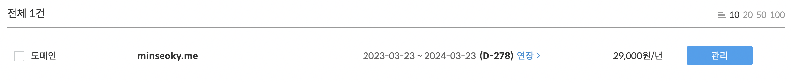
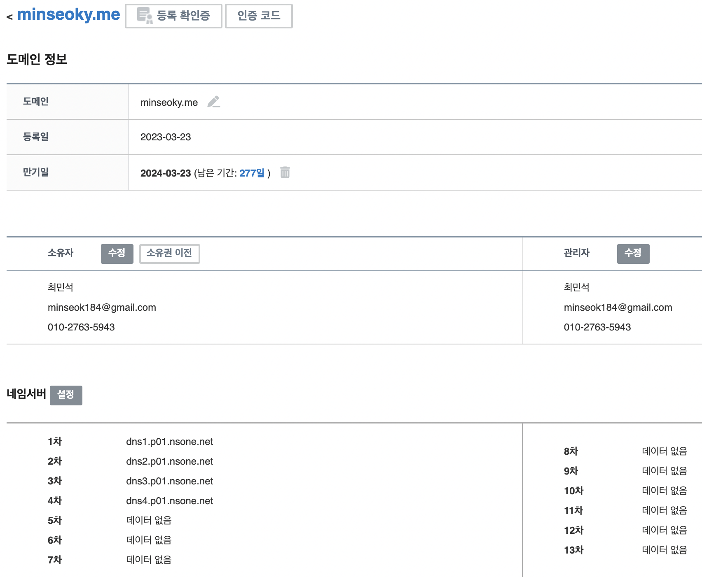
가비아에서 도메인 네임을 구입하였습니다.(1년) 직접 배운 후 도메인 네임을 구입하고 이것저것 설정해보니
꽤 재미있었고 아 이게 이거구나 하는 생각이 많이 들었습니다. 기본적으로 네임서버를 4개 지원해줍니다. (dns1.p01.nsone.net, ...)


# 컴퓨터 네트워크 과목을 마치며

## 얻어가는 것
컴퓨터 네트워크 과목을 마치며 저는 많은 것을 배우고 얻게 되었습니다. 이 과목을 통해 컴퓨터 네트워크의 기본 원리와 동작 메커니즘을 이해하고, 현대의 인터넷과 네트워크 인프라가 어떻게 구성되는지에 대해 깊이 있게 학습할 수 있었습니다.

처음에는 네트워크에 대한 개념이 추상적이고 복잡해 보였지만, 강의와 실습을 통해 그 구조와 동작 방식에 대해 명확하게 이해할 수 있었습니다. 패킷 전송, 라우팅, 스위칭, 프로토콜 등의 개념을 익히고, 실제로 네트워크를 구성하고 테스트해보면서 실무적인 경험을 쌓을 수 있었습니다.

또한, 컴퓨터 네트워크의 중요성과 역할에 대해 깨닫게 되었습니다. 현대 사회에서 인터넷과 네트워크는 기업, 개인, 사회 전반에 걸쳐 빠르고 안정적인 연결을 제공하여 정보의 교류와 협업을 원활하게 만들어줍니다. 이러한 인프라의 원리와 동작에 대한 이해는 실제 현업에서 네트워크 설계와 운영에 큰 도움이 될 것입니다.

컴퓨터 네트워크 과목을 통해 개인 프로젝트(홈페이지 제작 및 소켓프로그래밍)를 진행하고 네트워크 장비를 구성하는 경험도 쌓을 수 있었습니다. 이를 통해 문제 해결, 시간 관리 등의 능력을 향상시킬 수 있었습니다.

마지막으로, 컴퓨터 네트워크 과목을 통해 저의 전공 분야인 컴퓨터 과학과 관련된 중요한 기반 지식을 습득하였습니다. 이러한 지식은 저의 진로와 전문성을 발전시키는데 큰 역할을 할 것이며, 앞으로의 학습과 실무에서도 유용하게 활용될 것입니다.

컴퓨터 네트워크 과목은 어려운 개념과 이론이 많았지만, 알찬 내용과 다양한 경험을 통해 많은 것을 얻을 수 있었습니다. 이 과목을 통해 네트워크에 대한 이해를 넓히고, 현실 세계에서의 네트워크 환경을 이해하게 되어 기쁘게 생각합니다.

## 바라고 싶은 것
온라인 수강을 하여 반복적으로 강의를 들을 수 있던 점은 좋았으나 동영상 음질이 너무 작아 이어폰을 껴야 했고, 가끔씩 발생하는 날카로운 노이즈 때문에 강의를 듣기가 많이 힘들었던 것 같습니다.

좋은 품질의 마이크를 통해 강의를 녹화하는 편이 후배들이 강의를 더 잘 이해할 수 있을 것 같습니다.

```toc
```
