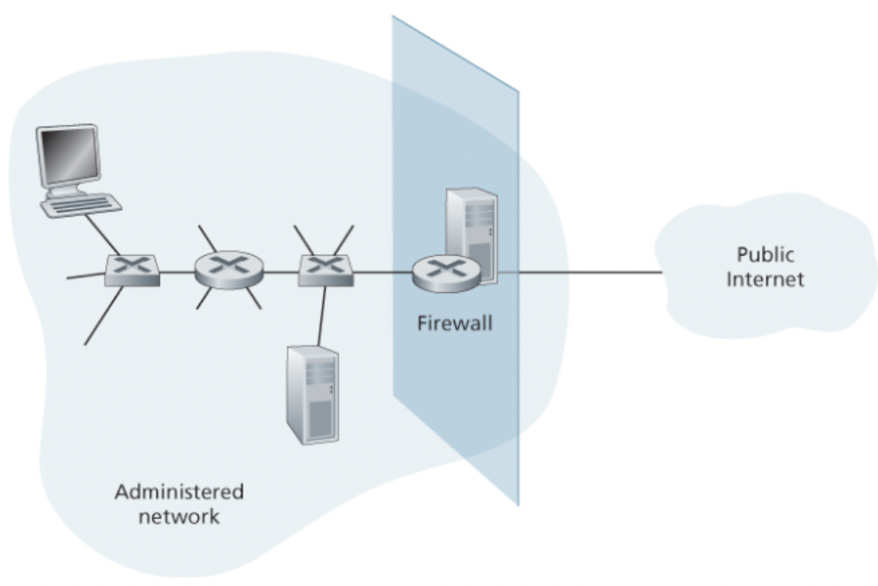
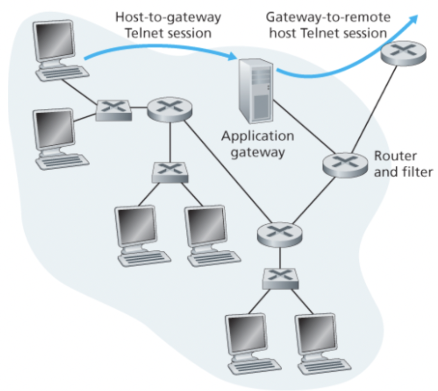
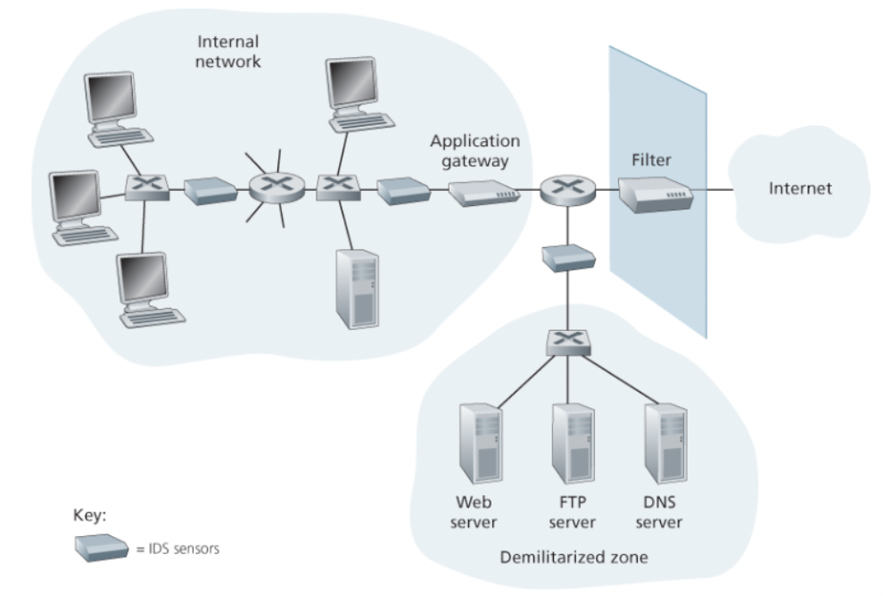

# 운영 보안: 방화벽과 침입 탐지 시스템

### 방화벽

`방화벽(firewall)`은 전체 인터넷으로부터 기관의 내부 네트워크를 분리시킨 하드웨어와 소프트웨어의 조합으로, 어떤 패킷은 통과가 허용되나 어떤 패킷은 차단된다.

네트워크 관리자가 해당 네트워크에 대한 트래픽 출입을 관리하여 접속을 제어한다.



<br/>

### 방화벽의 목표

- 외부와 내부를 오가는 모든 트래픽은 방화벽을 거친다.
- 로컬 보안 정책에 정의된 대로 승인된 트래픽만이 통과가 허용된다.
- 방화벽 자체가 침입 시도에 안전해야 한다.

<br/>

### 전통적인 패킷 필터

기관은 일반적으로 내부의 네트워크를 ISP에 연결하는 게이트웨이 라우터를 갖는다.

외부와 내부를 오가는 모든 트래픽은이 라우터를 지나야만 하고, 이 라우터에서 **패킷 필터링**이 일어난다.

<br/>

**필터링 결정의 근거**

- IP 출발지 또는 목적지 주소
    - 불행히 출발지 주소를 위장한 데이터그램을 막을 수 없다.
- IP 데이터그램 내의 프로토콜 타입 : TCP,UDP OSPF 등
- TCP 또는 UDP 출발지와 목적지 포트
- TCP 플래그 비트 : SYN, ACK
    - ACK 비트가 0인 입력 세그먼트를 거른다면 외부에서 오는 모든 TCP 연결은 거부하고, 내부에서 나가는 건 허락한다.
- ICMP 메시지 타입
- 네트워크에서 나가는 데이터그램과 들어오는 데이터그램에 대한 서로 다른 규칙들
- 서로 다른 라우터 인터페이스에 대한 서로 다른 규칙들

네트워크 관리자는 기관의 정책에 기초해서 방화벽을 설정한다.

예를 들어, 공개 웹 서버 접속 목적을 제외한 어떠한 TCP 연결도 받고 싶지 않다면, 목적지 포트 80번과 웹 서버에 해당하는 목적지 주소를 가진 TCP SYN 세그먼트를 제외한 모든 TCP SYN 세그먼트를 막을 수 있다.

방화벽의 규칙은 접속 제어 목록과 함께 라우터에 구현된다.

<br/>

### 상황 고려 패킷 필터

상황 고려 필터는 TCP 연결을 추적하여 이 정보를 패킷 차단 결정을 하는 데 이용한다.

상황 고려 필터는 연결 고려 테이블에 있는 진행 중인 모든 TCP 연결을 추적함으로써 전통적인 패킷 필터에서 통과되던 패킷도 관리한다. (관리하지 않는다면 Dos 공격 등을 막을 수 없다.)

예를들어, SYN,SYNACK,ACK,FIN을 관찰하여 연결이 60초 동안 사용되지 않는다면 그 연결은 이미 종료되었다고 가정할 수 있다.

<br/>

상황 고려 필터는 접속 제어 목록에 **연결 검사**라는 새로운 열을 포함한다.

예를 들어, 외부에서 조작된 패킷을 TCP 출발지 포트 80번, ACK 플래그를 1로 설정하여 내부로 보내려고 한다고 해보자.

전통적인 패킷 필터는 이를 막을 수 없지만 상황 고려 필터는 연결 검사를 열을 통해 외부에서 들어오는 패킷을 연결 검사 테이블에서 연결된 상태인지 확인하고 조작된 패킷은 연결 검사 테이블에 없으므로 필터링된다.

<br/>

### 애플리케이션 게이트웨이

좀 더 세밀한 수준의 보안을 위해 방화벽은 패킷 필터를 애플리케이션 게이트웨이와 결합해야 한다.

애플리케이션 게이트웨이는 모든 애플리케이션 데이터가 반드시 통과해야 하는 애플리케이션 맞춤 서버다.

다수의 애플리케이션 게이트웨이가 같은 호스트에서 실행될 수 있으나 각 게이트웨이는 자신만의 프로세스들을 가진 분리된 서버다.

<br/>



제한된 내부 사용자만 외부로의 텔넷이 가능하게 하고 모든 외부 클라이언트는 내부로 텔넷을 수행하지 못하게 하는 방화벽을 설계해보자.

1. 애플리케이션 게이트웨이의 IP주소로부터 시작된 텔넷 연결을 제외하고 모든 텔넷 열결 시도를 막도록 라우터의 필터를 설정한다.
    - 이는 외부로의 모든 텔넷 연결이 애플리케이션 게이트웨이를 통과하게 한다.
2. 사용자는 먼저 애플리케이션 게이트웨이와 텔넷 세션을 설정한다.
3. 게이트웨이에는 입력되는 텔넷 세션 요청을 듣고 있는 애플리케이션이 있어서 사용자에게 ID와 비밀번호를 요구한다.
4. 사용자가 입력하면, 애플리케이션 게이트웨이는 그 사용자가 외부로의 텔넷 연결이 효용되어있는지 검사한다.
    - 허가되지 않았다면, 게이트웨이에 의해 종료된다.
    - 허가되었다면, 사용자가 원하는 외부 호스트의 이름을 묻고, 게이트웨이와 외부 호스트 간의 텔넷 연결을 설정한 후 내부 사용자에게서 오는 데이터를 외부 호스트에게 전달한다.
    - 즉, 애플리케이션 게이트웨이는 인증 뿐만 아니라 데이터 전달도 수행한다.

**단점**

1. 각 애플리케이션마다 서로 다른 애플리케이션 게이트웨이를 필요로 한다.
2. 모든 데이터가 게이트웨이를 경유하여 중계되므로 성능상의 손실이 있다.
3. 클라이언트 소프트웨어는 사용자가 요구할 때 어떻게 게이트웨이와 통신할 수 있는지 알아야 하며, 어떤 외부 서버에 연결할지 애플리케이션 게이트웨이에게 알려줄 수 있어야 한다.

<br/>

### 익명성과 사생활 보호

자신의 IP 주소를 웹사이트에 남기고 싶지 않고 지역 ISP에 그 웹사이트에 방문한 사실을 남기고 싶지 않은 익명성을 원한다면 어떻게 해야할까?

신뢰할 수 있는 프록시 서버와 SSL의 조합을 사용할 수 있다.

1. 프록시와 SSL 연결을 설립한 후 이 연결을 통해 희망하는 사이트에 대한 HTTP 요청을 전송한다.
2. 프록시가 SSL로 암호화된 HTTP 요청을 복호화 해서 평문 형식의 HTTP 요청을 웹사이트로 전송한다.
3. 웹사이트는 프록시로 응답을 보내고, 프록시는 SSL을 통해 응답을 호스트에게 보낸다.

그러나 프록시는 결국 모든 것을 알고 있으므로 신뢰할 수 있는 프록시 서버를 사용하는 것이 중요하다.

<br/>

## 침입 탐지 시스템

통과하려는 패킷 헤더를 살펴볼 뿐만 아니라 자세한 패킷 관찰을 수행하는 새로운 틈새 장치에 대한 요구가 있다.

악의적일 수 있는 트래픽을 발견했을 때 경고를 발생시키는 장치를 침입 탐지 시스템(**intrusion detection system,IDS**)이라고 한다.

의심스러운 트래픽을 걸러내는 장치는 침입 방지 시스템(**intrusion prevention system ,IPS**)이라고 한다.

이 둘의 중요한 점은 어떻게 의심스러운 트래픽을 발견하느냐 이므로 두 시스템을 통틀어 IDS 시스템으로 호칭한다.



한 기관에서 IDS는 여러개일 수 있는데, 서로 협조하며 의심스러운 트래픽이 있을 땐 중앙 IDS 프로세서에 전달되어 네트워크 관리자에게 전달된다.

위 그림은 패킷 필터와 애플리케이션 게이트웨이에 의해 보호되고 IDS에 의해 감시되는 높은 보호 구역과 패킷 필터와 IDS만을 사용하는 낮은 구역으로 나눌 수 있다.

IDS는 지나가는 각각의 패킷을 수만 개의 시그니처와 비교해야하기 때문에 많은 연산이 필요하고 IDS를 안쪽에 위치시켜 전체 트래픽 중 일부만 관찰하면 되도록 한다.

<br/>

### 시그니처 기반 시스템

시그니처 기반 IDS는 공격 시그니처에 대한 방대한 데이터베이스를 유지한다.

각 시그니처는 침입 행위에 관련된 규칙들의 집합이다.

시그니처는 단순히 단일 패킷에 대한 특징의 목록일 수도 있고, 연속된 일련의 패킷들에 관련한 것일 수도 있다.

네트워크 관리자는 시그니처를 자신에 맞게 수정하고 그것을 데이터베이스에 추가할 수 있다.

시그니처 기반 IDS는 지나가는 모든 패킷을 읽어 데이터베이스 내의 시그니처들과 비교한다.

만일 어떤 패킷이 데이터베이스 내의 시그니처와 일치하면 경고를 발생시킨다.

그러나 이 방법은 새로운 공격에 대해 대비할 수 없고, 모든 패킷이 데이터베이스와 비교되어야하므로 성능이 좋지 않다.

<br/>

### 이상 기반 IDS

트래픽을 관찰할 때 트래픽 분석표를 만든다.

그 후 ICMP 패킷의 빈도가 지나치게 높다든지 포트 정보 수집과 ping 메시지가 갑자기 증가하는 등 통계학적으로 비정상적인 패킷의 스트림을 찾는다.


```toc
```
