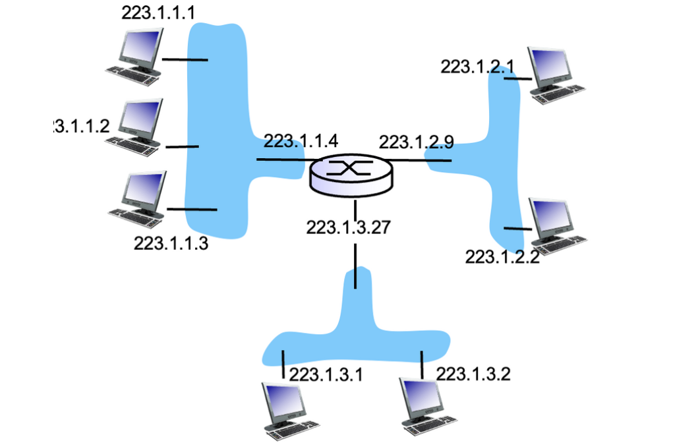
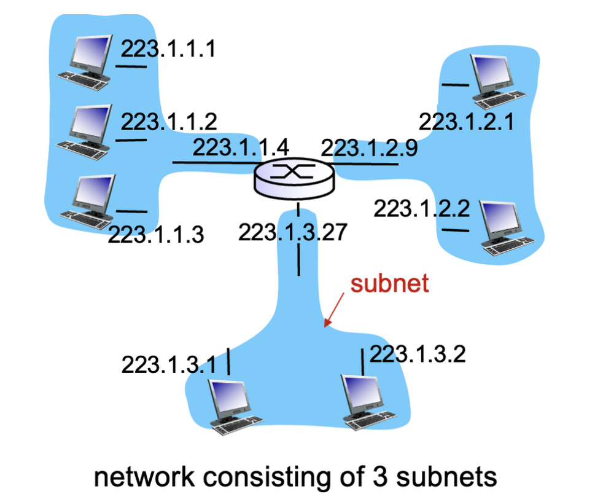
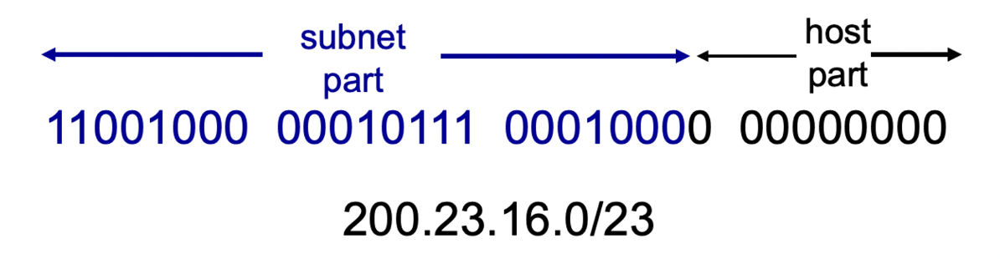
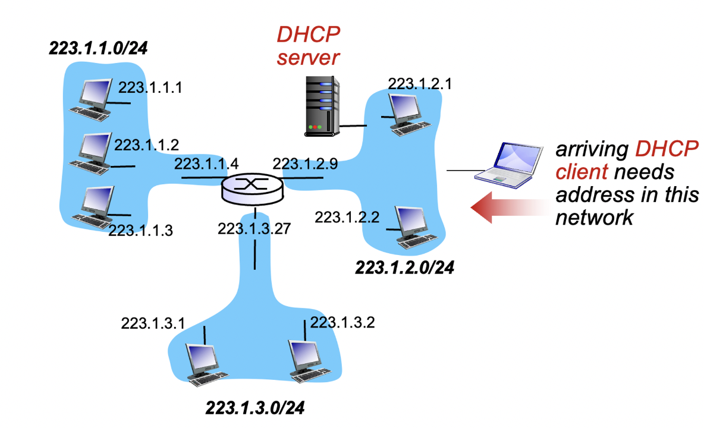

## IP Addressing



IP 주소는 호스트와 라우터 인터페이스를 식별하는 32비트 식별자입니다. 각 인터페이스는 호스트 또는 라우터와 물리적 링크 사이의 연결을 나타냅니다. 일반적으로 라우터는 여러 개의 인터페이스를 가지고 있으며, 호스트는 일반적으로 하나 또는 두 개의 인터페이스를 가지고 있습니다(예: 유선 이더넷, 무선 802.11).

각 인터페이스마다 IP 주소가 할당됩니다. IP 주소는 네트워크 상에서 호스트를 고유하게 식별하기 위해 사용됩니다. 이 주소는 네트워크 계층에서 패킷의 출발지와 목적지를 식별하는 데 사용됩니다. IP 주소는 32비트로 구성되며, 보통 "도트 표기법"으로 표현됩니다. 예를 들어, IPv4 주소인 192.168.0.1은 네트워크 상에서 특정 호스트를 식별하는 데 사용됩니다.

IP 주소는 인터넷 상에서 데이터 전달을 위한 중요한 역할을 합니다. 패킷이 라우터를 통과할 때, 라우터는 IP 주소를 확인하여 패킷을 적절한 출력 링크로 전달합니다. 이를 통해 패킷은 목적지 호스트에 도달할 수 있게 됩니다.

IP 주소는 인터넷 프로토콜 스택에서 사용되며, 다른 프로토콜(예: TCP, UDP)과 함께 동작하여 신뢰성 있는 데이터 전송을 제공합니다. IP 주소를 통해 호스트와 라우터는 네트워크 상에서 통신할 수 있으며, 인터넷에서 다양한 기기 간에 데이터를 전송하는 데 사용됩니다.

- **패킷 전달**: IP는 송신 호스트에서 수신 호스트로 패킷을 전달하는 역할을 수행합니다. 각 패킷은 출발지 IP 주소와 목적지 IP 주소를 포함하고 있어, 네트워크 상에서 패킷이 어디로 전송되어야 하는지를 식별할 수 있습니다.
- **비연결형 프로토콜**: IP는 연결 설정 과정 없이 패킷을 전송하는 비연결형 프로토콜입니다. 이는 패킷들이 독립적으로 전송되며, 각각의 패킷이 독립적으로 경로를 선택하고 전달되는 것을 의미합니다.
- **라우팅**: IP는 라우터를 통해 패킷을 전달합니다. 라우터는 패킷의 목적지 IP 주소를 확인하고, 해당 패킷을 적절한 출력 링크로 전송합니다. 이러한 라우팅 과정은 네트워크의 구성과 라우팅 테이블에 따라 결정됩니다.
- **프로토콜 스택의 핵심**: IP는 인터넷 프로토콜 스택에서 핵심적인 역할을 수행합니다. 다른 상위 계층 프로토콜(예: TCP, UDP)은 IP를 기반으로 동작하며, IP는 하위 계층에서 전송되는 패킷을 관리하고 전송합니다.

## Subnets



서브넷은 IP 네트워크를 논리적으로 분할하는 방법입니다. IP 주소는 네트워크 ID와 호스트 ID로 구성되는데, 서브넷은 네트워크 ID의 일부를 사용하여 작은 네트워크 세그먼트를 생성합니다. 이를 통해 네트워크 관리자는 IP 주소 공간을 효율적으로 사용하고 네트워크를 조직화할 수 있습니다.

서브넷팅을 통해 네트워크는 서브넷 마스크라는 값으로 세분화됩니다. 서브넷 마스크는 IP 주소의 네트워크 ID와 서브넷 ID를 분리하는 데 사용됩니다. 서브넷 마스크는 IP 주소와 비트 단위로 AND 연산을 수행하여 네트워크 ID와 서브넷 ID를 추출합니다.

서브넷을 사용하면 더 작은 네트워크 세그먼트로 나누어 관리할 수 있습니다. 이를 통해 네트워크 트래픽을 분산시키고 네트워크 관리를 더욱 효율적으로 수행할 수 있습니다. 서브넷은 주로 조직 내의 서로 다른 부서, 건물 또는 지리적인 위치에 따라 네트워크를 분할하는 데 사용됩니다.

서브넷팅은 네트워크 주소 공간을 세분화함으로써 IP 주소 부족 문제를 완화하는 데 도움이 됩니다. 서브넷 마스크를 조정하여 더 많은 서브넷을 생성하거나 각 서브넷에 할당되는 호스트 수를 조정할 수 있습니다.

서브넷은 네트워크 계층에서 구현되며, IP 프로토콜과 함께 사용됩니다. 서브넷을 구성하려면 네트워크 관리자가 네트워크 장비(예: 라우터, 스위치)에 서브넷 설정을 구성해야 합니다. 이를 통해 서브넷 간의 통신이 가능하고 호스트는 서브넷 내에서 IP 주소를 사용하여 통신할 수 있습니다.

## CIDR



CIDR (Classless Inter-Domain Routing)는 IP 주소 할당과 라우팅을 더욱 효율적으로 관리하기 위해 개발된 방법입니다. CIDR은 이전의 클래스 기반 IP 주소 체계를 대체하고 보다 유연한 주소 할당을 가능하게 합니다.

이전의 IP 주소 체계에서는 주소 클래스에 따라 네트워크의 크기와 호스트 수가 미리 정해져 있었습니다. 그러나 실제로는 네트워크의 크기가 정해진 클래스에 맞지 않는 경우가 많았습니다. 이로 인해 IP 주소 낭비가 발생하고 주소 공간이 효율적으로 사용되지 않는 문제가 있었습니다.

CIDR은 IP 주소 체계를 클래스에 의존하지 않고 유연하게 할당할 수 있도록 합니다. CIDR에서는 서브넷 마스크를 사용하여 IP 주소를 분할하고 라우팅을 수행합니다. 서브넷 마스크는 IP 주소의 네트워크 ID와 서브넷 ID를 구분하는 데 사용되며, 이를 이용하여 더 작은 서브넷을 생성하고 IP 주소를 할당할 수 있습니다.

CIDR은 IP 주소 체계를 표기하는 방법으로 IP 주소 뒤에 슬래시(/)와 함께 비트 수를 표기합니다. 예를 들어, "192.168.0.0/24"는 24비트의 서브넷 마스크를 가진 네트워크를 나타냅니다. 이는 24비트가 네트워크 ID를 나타내고 나머지 8비트가 호스트 ID를 나타냄을 의미합니다.

CIDR을 사용하면 IP 주소를 더욱 효율적으로 할당할 수 있고, 라우팅 테이블의 크기를 줄이고 인터넷 트래픽을 효율적으로 전달할 수 있습니다. CIDR은 현재 인터넷에서 널리 사용되는 IP 주소 체계이며, 주소 할당 관리와 라우팅에서 중요한 역할을 합니다.

## DHCP



DHCP (Dynamic Host Configuration Protocol)는 네트워크에서 호스트(컴퓨터, 스마트폰 등)에 IP 주소 및 기타 네트워크 구성 정보를 동적으로 할당하기 위해 사용되는 프로토콜입니다. DHCP는 호스트가 네트워크에 연결될 때 자동으로 IP 주소를 할당받고 네트워크 구성 정보를 설정할 수 있도록 도와줍니다.

DHCP는 네트워크 관리자가 수동으로 IP 주소를 할당하는 것보다 효율적이고 편리한 방법을 제공합니다. DHCP 서버는 네트워크에 IP 주소 풀을 관리하고 호스트가 네트워크에 연결될 때 유휴 IP 주소 중 하나를 동적으로 할당합니다. 이를 통해 IP 주소의 효율적인 사용을 도모할 수 있습니다.

또한, DHCP는 IP 주소 외에도 서브넷 마스크, 기본 게이트웨이, DNS 서버 주소 등과 같은 네트워크 구성 정보도 함께 제공합니다. 호스트는 DHCP 클라이언트로 작동하여 네트워크에 연결되면 DHCP 서버에 요청을 보내고 필요한 네트워크 구성 정보를 동적으로 받아옵니다.

DHCP는 다음과 같은 주요 기능을 제공합니다:

1. IP 주소 자동 할당: 호스트가 네트워크에 연결될 때 DHCP 서버가 자동으로 IP 주소를 할당해줍니다.
2. IP 주소 재할당: IP 주소의 대여 기간을 설정하여 일정 기간 동안 IP 주소를 유지하고, 그 이후에는 재할당을 통해 새로운 IP 주소를 받을 수 있습니다.
3. 네트워크 구성 정보 제공: DHCP 서버는 IP 주소 외에도 서브넷 마스크, 기본 게이트웨이, DNS 서버 주소 등과 같은 네트워크 구성 정보를 제공합니다.
4. 중앙 관리: DHCP 서버를 통해 네트워크의 IP 주소 할당과 구성 정보를 중앙에서 관리할 수 있습니다.

DHCP는 현대적인 네트워크에서 많이 사용되며, 큰 규모의 네트워크 환경에서 IP 주소 및 구성 관리를 효율적으로 처리하기 위해 필수적인 프로토콜입니다.

## NAT(Network addressing translation)

NAT (Network Address Translation)은 사설 네트워크와 공용 네트워크 간의 통신을 가능하게 하는 네트워크 프로토콜입니다. NAT는 사설 네트워크 내의 여러 호스트가 공용 IP 주소를 공유하면서 인터넷에 접속할 수 있도록 도와줍니다.

일반적으로 사설 네트워크는 사설 IP 주소를 사용하고, 인터넷에 연결되기 위해서는 공용 IP 주소를 할당받아야 합니다. 하지만 사설 네트워크 내의 여러 호스트가 모두 공용 IP 주소를 할당받는 것은 비효율적입니다. 이때 NAT가 사용되어 사설 IP 주소를 공용 IP 주소로 변환하고, 인터넷과의 통신에서는 변환된 주소를 사용하여 데이터를 주고받을 수 있습니다.

NAT는 주로 다음과 같은 기능을 수행합니다:

1. IP 주소 변환: 사설 네트워크의 호스트들이 공용 IP 주소로 통신하기 위해 사설 IP 주소를 변환합니다. 이를 통해 사설 IP 주소를 가진 호스트들이 인터넷에 접속할 수 있습니다.
2. 포트 주소 변환: NAT는 포트 주소 변환(PAT, Port Address Translation)을 통해 여러 호스트가 하나의 공용 IP 주소를 공유할 수 있습니다. 이를 통해 다수의 호스트가 동시에 인터넷에 접속할 수 있습니다.
3. 연결 추적: NAT는 네트워크 내부와 외부 간의 통신을 추적하고, 내부 호스트가 외부로 요청한 데이터에 대한 응답을 올바른 호스트로 전달합니다.

NAT의 장점은 다음과 같습니다:

- IP 주소 절약: 사설 IP 주소를 사용하여 네트워크 내에서 IP 주소를 효율적으로 관리할 수 있습니다.
- 보안 강화: NAT는 외부에서 내부로 직접적인 접속을 차단하므로 네트워크 보안을 강화할 수 있습니다.
- 호스트 보호: NAT는 내부 호스트들을 외부로부터 감추고, 외부로부터의 공격을 일부 막아줍니다.

```toc
```
