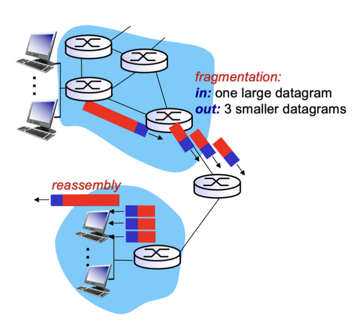
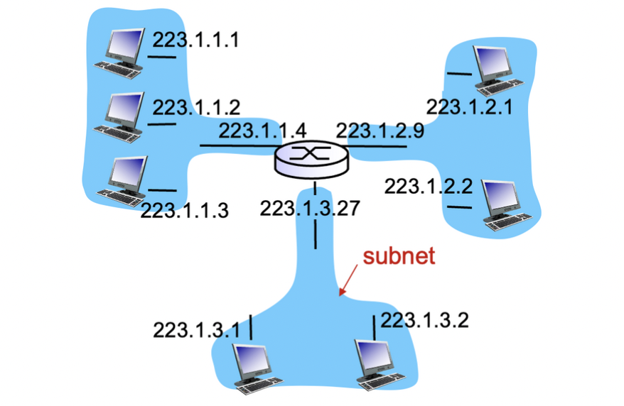

## The Internet Network Layer


- IP
- RIP, OSPF, BGP : Control Plane(제어 평면) - 라우터들끼리 정보를 교환하는데 사용(나중에 설명)
- ICMP : Error reporting에 사용

### IP Format


- ver : IP v4/v6 구분
- head. len(length) : 기본 20바이트(32bit = 4byte 가 5줄)
- type of service : 맨 아래 data(=payload)의 타입 결정
- time to live : 남아있는 홉의 개수(라우터 경유마다 1개씩 줄어듬, 좀비화를 막기 위함)
- upper layer : 어떤 레이어에서 온건지(TCP or UDP)
- length : 전체 길이(header + payload)
- options (if any) : 타임스탬프, 경로 지정, 경로 정보 등 저장
- 16-bit identifier & flgs & fragment offset



### IP fragmentation, Reassembly

경로를 통과하지 못하면 데이터 그램을 작게 쪼개어 보냄 (fragmentation), 마지막 라우터에서 복원(reassembly)


>💡 링크마다 MTU(Maximum Transmission Unit-최대 전송 단위)가 다르기 때문


4000길이의 데이터그램을 1500으로 쪼개면 1480까지만 하나의 데이터그램으로 나눔, 20Byte는 헤더로 사용해야 하기 때문

1500(1480+20) + 1500(1480+20) + 1040(1020+20) = 3040으로 40Byte 증가.


>❓ 왜 마지막 데이터그램이 1060이 아니라 1040인가?  
>기존 4000길이의 데이터그램에도 20바이트의 헤더가 포함되어 있었기 때문. 실제 Payload는 3980이었으며 여기에 20x3(3개로 쪼개므로)=60만큼 증가하여 4040이 됨.


offset의 경우 인덱스인 1480Byte를 8로 나눔(8Byte 단위로 블록화 하기 때문) 따라서 첫번째 오프셋은 0, 두번째 오프셋은 1480/8 = 185, 세번째 오프셋은 2960/8 = 370이 되는 것임.

fragflag는 뒤에 분할된 다른 패킷이 있는지 여부를 나타냄.

## IP 주소 체계


라우터는 여러개의 아이피주소를 가질 수 있음

호스트는 보통 1~2개 (랜선, 와이파이)

### IP 주소 등급


>💡 맨 앞 번호에 따라 클래스가 나뉨


ICANN(Internet Corp. for Assigned Names and Numbers) 에서 IP 주소를 관리

- Uni-cast : 1 대 1 통신
- Multi-cast : 1 대 m 통신 (특정 그룹 m)
- Broad-cast : 1 대 m 통신 (모든 연결된 m)

### Subnet



클래스 기반 주소 체계의 부족한 유연성과 효율성을 개선하기 위해 탄생

라우터의 도움 없이 통신 가능함

호스트 id의 일부를 네트워크 id로 활용하여 네트워크 관리를 쉽게 함


하나의 IP 주소체계를 임의로 여러개의 논리적 네트워크로 나눔.

ex) 서브넷 마스크가 255.255.255.0이면 24bit를 네트워크 id로 사용,

서브넷 마스크가 255.255.192.0이면 18bit를 네트워크 id로 사용(192 = 1100 0000)

✅ IP 주소와 서브넷 마스크를 논리 AND 연산하여 서브넷 네트워크를 구할 수 있음

>💡 Gateway : 바깥으로 나가는 첫번째 라우터의 IP


### CIDR


서브넷 마스크의 연속된 1의 개수를 /n으로 표현

### DHCP(Dynamic Host Configuration Protocol)


DHCP서버를 통해 동적으로 아이피를 할당

중앙 라우터가 게이트웨이 역할

### DHCP 시나리오


1. 255.255.255.255, 67 : 브로드캐스팅, 연결된 모든 호스트에 뿌림, DHCP를 제외한 다른 호스트는 이 메세지 무시
2. 223.1.2.4 아이피를 줄 수 있다고 알림, transaction ID 유지, IP주소 사용 가능시간 3600sec, 이때도 모든 호스트에게 메세지 보내짐(255.255.255.255), transaction ID를 참조하여 정보 받음
3. 해당 IP 받겠다고 알림. transaction ID 변경하여 보냄
4. IP 할당 완료 메세지

4-Way handshaking, 위 정보 외에도 게이트웨이 IP도 제공, local DNS server IP도 제공

```toc
```
