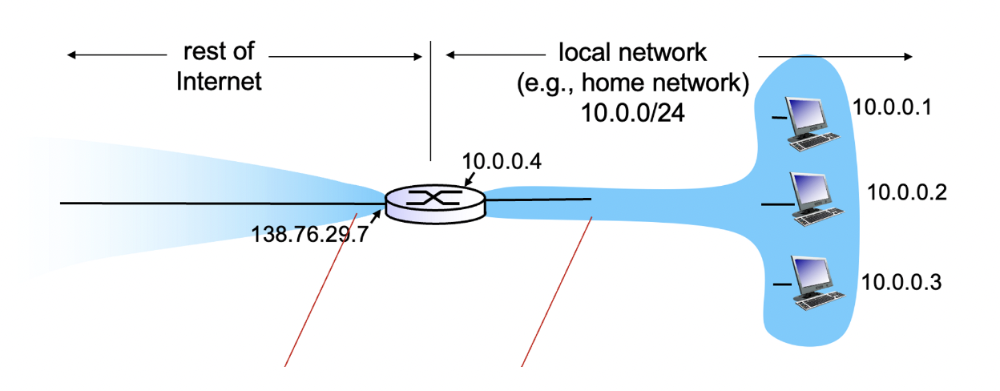
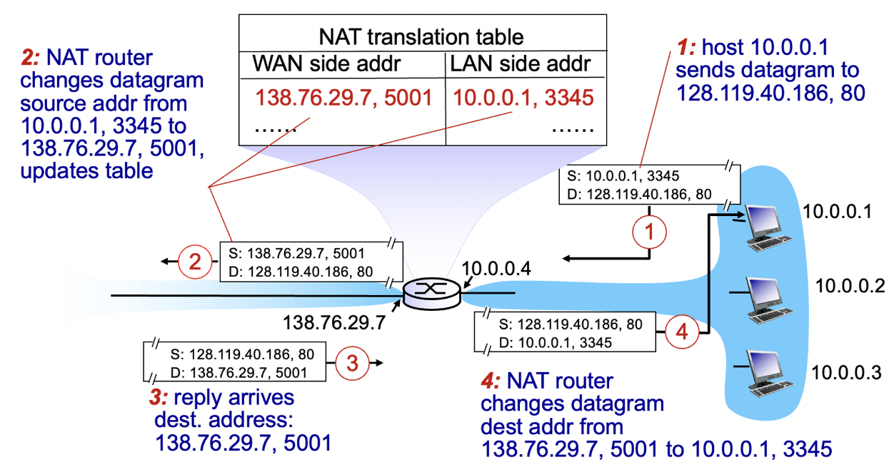
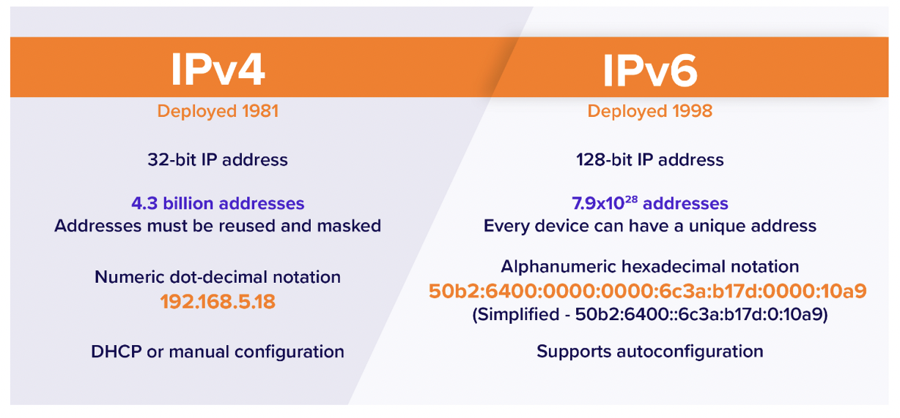
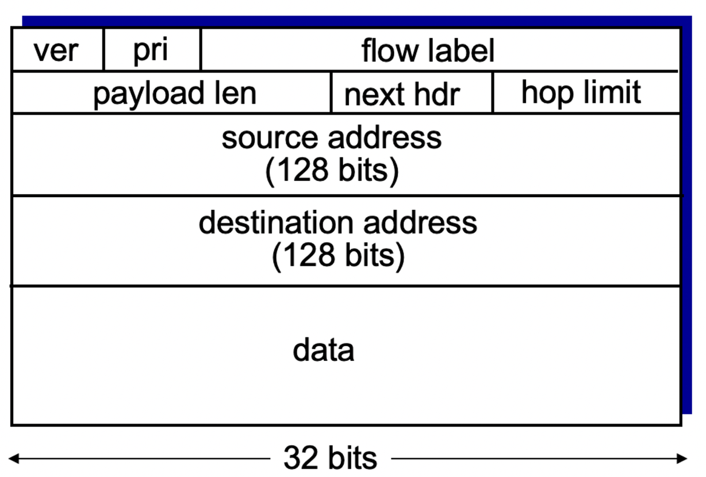
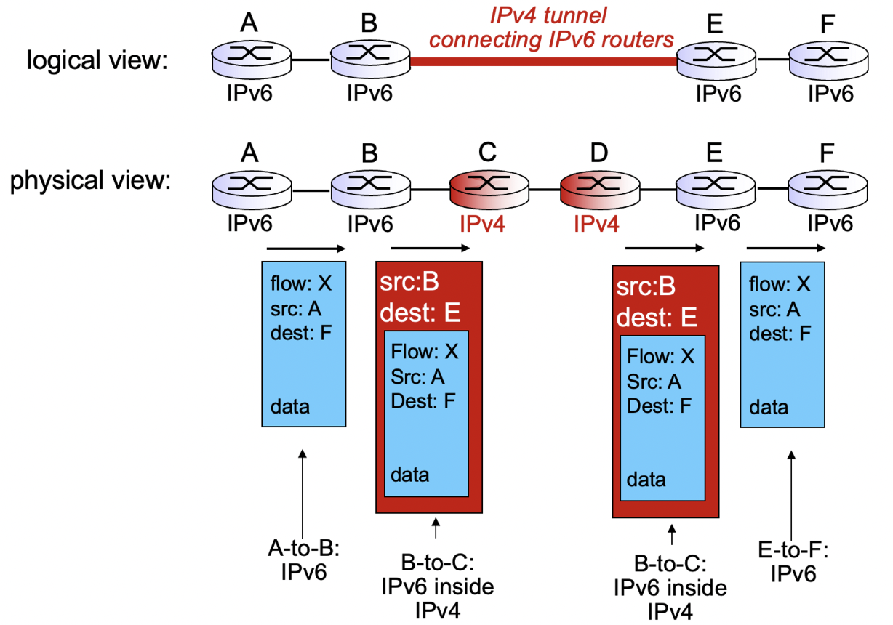

## NAT

가정 내 여러대의 컴퓨터, 스마트폰에 각각 IP를 할당하는 것이 아니라, 인터넷 공유기 1대에만 IP할당

같은 공유기에 연결된 기기들은 사설(가상)IP를 사용하고, 외부에서는 하나의 IP(공식 IP)를 공유함



- A Class : 10.x.x.x
- B Class : 172.16.x.x ~ 172.31.x.x
- C Class : 192.168.0.x ~ 192.168.255.x



1. 10.0.0.1 호스트가 128.199.40.186 외부 IP에 접근하고 싶다.
2. 해당 데이터그램이 라우터를 거칠때, 라우터에서 NAT translation table에 WAN, LAN의 IP주소 및 포트번호를 각각 매핑한다.
3. 라우터로 응답이 오면 table을 참조하여 해당 IP에 전달한다.


> 💡 NAT는 IPv4가 IPv6으로 전환되는 과도기에 사용되도록 개발되었다.  
> → 결국 IPv6로 전환되어야 함.


## IPv6





IPv4의 주소 고갈로 등장,

Header의 길이가 20Byte → 40Byte로 증가

- pri : 패킷의 중요도
- flow label : 데이터그램의 종류를 묶기 위함(같은 경로로 가게끔)
- payload len : data 길이
- next hdr : 확장 헤더(헤더가 더 필요한 경우 늘릴 수 있음)
- hop limit : 앞으로 남은 가능한 hop의 수

사라지거나 변경된 부분들)

- checksum이 사라짐 : TCP는 header+payload에 대해 수행하였고 IPv4는 header에 대해서만 수행하였음, 엄청난 양의 패킷에 대해 checksum을 수행하여 다시 보내달라 하는 과정이 큰 부담이 되어 삭제됨
- options 사라짐 : next hdr로 대체됨
- ICMP → ICMPv6 : ICMP도 업그레이드됨

## IPv4 → IPv6 전환기

### Tunneling



IPv6를 IPv4전용 라우터를 통해 통과시키는 과정

IPv6 데이터그램이 IPv4데이터 그램 안에 캡슐화되어 이동

```toc
```
