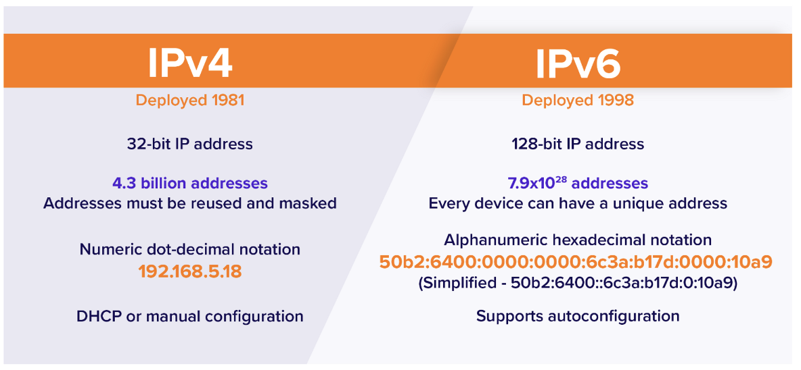
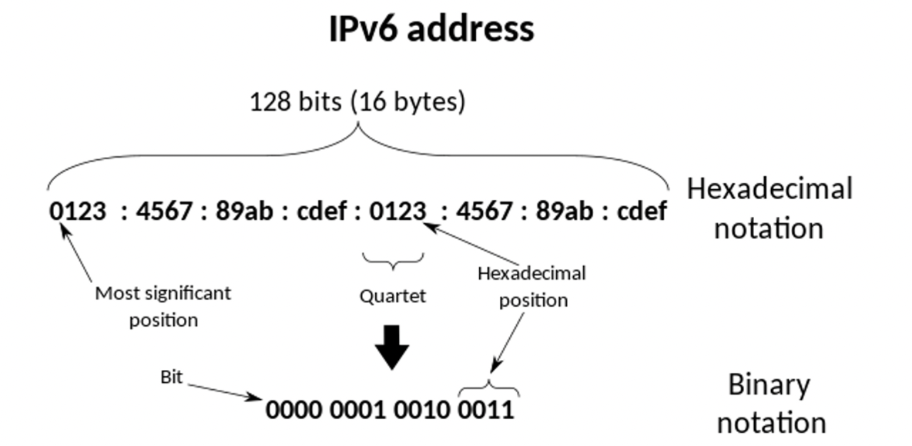
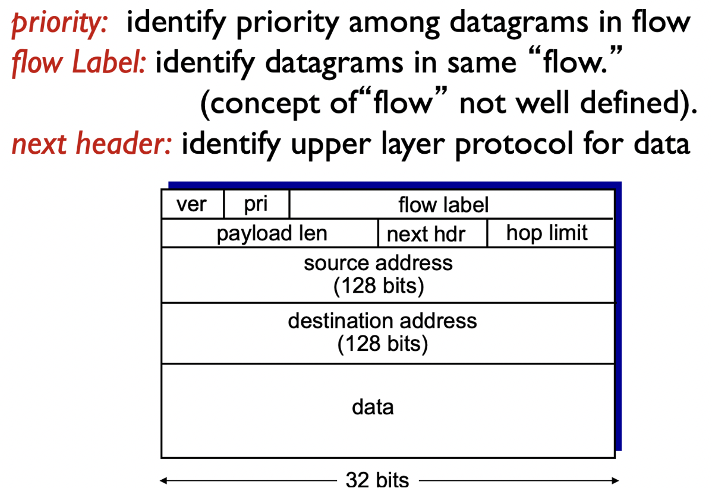
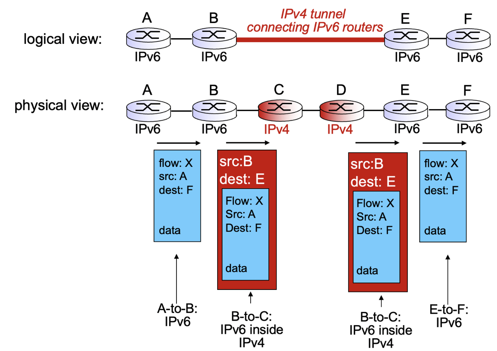

## IPv6





IPv4 주소의 고갈로 등장,

IPv6는 다음 세대 인터넷 프로토콜로서, IPv4의 주소 고갈 문제와 기술적 한계를 극복하기 위해 개발된 프로토콜입니다. IPv6는 128비트 길이의 IP 주소를 사용하여 더 많은 주소 공간을 제공하고, 보다 효율적인 네트워크 통신을 지원합니다.

IPv6의 주요 특징은 다음과 같습니다:

1. 주소 공간 확장: IPv6는 128비트 주소 공간을 제공하여 대략 3.4 x 10^38 개의 주소를 할당할 수 있습니다. 이는 현재 사용 중인 IPv4의 주소 고갈 문제를 해결하고, 더 많은 기기 및 네트워크를 지원합니다.
2. 단순화된 헤더 포맷: IPv6의 헤더는 IPv4의 헤더보다 간단하며, 고정 크기로 구성됩니다. 이로써 라우팅과 패킷 처리가 빨라지고, 헤더 처리 오버헤드가 감소합니다.
3. 자동 주소 구성: IPv6는 호스트가 자동으로 IPv6 주소를 생성하고 구성할 수 있는 기능인 자동 주소 구성을 지원합니다. 이를 통해 호스트의 주소 설정이 간편해지고, 네트워크 관리가 편리해집니다.
4. 향상된 보안 기능: IPv6는 IPsec(인터넷 프로토콜 보안)을 기본적으로 지원하여 데이터의 기밀성, 무결성, 인증 등의 보안 기능을 강화할 수 있습니다.
5. 향상된 품질 및 서비스 지원: IPv6는 트래픽 우선순위 설정, 흐름 라벨링, 패킷 흐름 식별 등의 기능을 지원하여 품질 관리와 다양한 서비스 유형을 지원합니다.

## IPv6 데이터그램 포맷



## 터널링



IPv6 터널링은 IPv6 패킷을 IPv4 네트워크를 통해 전송하기 위한 메커니즘입니다. IPv6은 IPv4와 호환되지 않는 주소 형식을 사용하기 때문에, 기존의 IPv4 인프라에서 IPv6 트래픽을 전송하기 위해서는 터널링이 필요합니다.

터널링은 IPv6 패킷을 IPv4 패킷에 캡슐화하여 전송하는 과정을 말합니다. 이를 통해 IPv6 패킷은 IPv4 네트워크를 통해 전송될 수 있게 됩니다. 터널링은 IPv4 네트워크를 IPv6 네트워크로 연결하는 역할을 수행하며, 다양한 터널링 기술이 존재합니다.

가장 일반적인 터널링 기술은 6to4 터널링과 6in4 터널링입니다.

- 6to4 터널링: 6to4 터널링은 IPv6 패킷을 IPv4 패킷에 캡슐화하여 전송하는 방식입니다. 이를 위해 2002::/16 프리픽스를 사용하여 IPv6 주소를 생성하고, IPv4 주소를 통해 터널을 설정합니다. 6to4 터널링은 자동적으로 동작하며, IPv6 패킷을 IPv4 네트워크로 전송하고 다시 IPv6 네트워크로 복원합니다.
- 6in4 터널링: 6in4 터널링은 IPv6 패킷을 IPv4 패킷에 캡슐화하여 전송하는 방식 중 하나입니다. 이 방식은 IPv6 패킷을 IPv4 헤더에 포함된 IPv4 주소를 이용하여 캡슐화하고, 네트워크 상에서 IPv6 패킷을 전송합니다. 6in4 터널링은 수동적으로 설정해야 하며, 네트워크 장비나 소프트웨어를 사용하여 터널을 설정해야 합니다.
```toc
```
