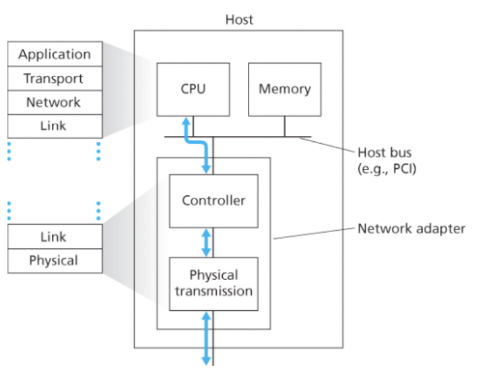

# 링크 계층 소개


### 노드

링크 계층 프로토콜을 실행하는 장치

e.g. 호스트, 라우터, 스위치, AP(access point, 7장에서 설명) 등

<br/>

### 링크

통신 경로상의 인접한 노드들을 연결하는 통신 채널

데이터그램을 출발지 호스트에서 목적지 호스트로 이동시키기 위해서는 데이터그램을 종단 간 경로의 개별 링크들로 이동시켜야만 한다.

한 링크에서 전송 노드는 데이터그램을 `링크 계층 프레임(link-layer frame)`으로 캡슐화해서 링크로 전송한다.

<br/>

위 그림에서는 6개의 링크를 거쳐간다.

<br/>

## 링크 계층이 제공하는 서비스

- `프레임화(framing)`
  - 데이터그램을 링크상으로 전송하기 전에 링크 계층 프레임에 캡슐화한다.
  - 프레임은 데이터그램이 들어있는 데이터필드와 여러 개의 헤더 필드로 구성된다.
- `링크 접속(link access)`
  - `매체 접속 제어(medium access control, MAC)` 프로토콜은 링크상으로 프레임을 전송하는 규칙을 명시한다.
  - 단일 송신자와 단일 수신자의 점대점 링크에서의 `MAC`은 단순하며, 링크가 사용되지 않을 때마다 프레임을 전송할 수 있다.
  - 하나의 브로드캐스트 링크를 여러 노드가 공요하는 경우, MAC 프로토콜은 여러 노드로부터의 프레임 전송을 조정한다.
- `신뢰적 전달`
  - `TCP`와 마찬가지로 확인 응답과 재전송을 통해 서비스를 제공한다.
  - `TCP`에서는 종단 간에 데이터를 재선송 하는 것과는 달리 링크 계층 프로토콜은 오류가 발생한 링크에서 오류를 정정한다.
  - 무선 링크와 같은 오류율을 가진 링크에서 주로 사용되며, 낮은 비트 오류율을 가진 링크에서는 불필요한 오버헤드가 될 수 있어 대다수 유선 링크 계층 프로토콜은 제공하지 않는다.
- `오류 검출과 정정`
  - 신호의 약화나 전자기 잡음 때문에 전송된 프레임 비트를 반대로 오인할 수 있다.
  - 오류가 있는 데이터그램은 전달할 필요가 없으므로 대부분의 링크 계층 프로토콜은 오류를 검출하는 방법을 제공한다.
  - 송신 노드에서 오류 검출 비트를 설정하게 하고 수신 노드에서 오류 검사를 수행하게 함으로써 가능해진다.
  - 트랜스포트 계층과 네트워크 계층의 오류 검출보다 일반적으로 더 복잡하며, 하드웨어로 구현된다.
  - 오류 정정은 오류 검출과 비슷하지만 프레임의 어느 곳에서 오류가 발생했는지 정확하게 찾아낼 수 있다.

<br/>

## 링크 계층이 구현되는 위치

호스트에서 대부분의 경우 링크 계층은 `네트워크 인터페이스 컨트롤러(network interface controller, NIC)`로 알려진 `네트워크 어댑터(network adapter)` 에 구현된다.

(라우터에서는 4장에서 봤듯이 라인 카드에 구현된다.)



<br/>

### 컨트롤러(controller)

`네트워크 어댑터`의 중심에 있다.

링크 계층 서비스의 대다수가 구현되어있는 단일의 특수 용도 칩으로 하드웨어로 구현된다.

송신 측의 컨트롤러는 호스트 메모리에 저장된 데이터그램을 링크 계층 프레임으로 캡슐화한 후 링크 접속 프로토콜에 따라 이 프레임을 통신 링크상으로 전송한다.

수신 측의 컨트롤러는 프레임을 수신한 후 네트워크 계층 데이터그램을 추출한다.

<br/>

### CPU

일부 링크 계층 기능이 호스트 `CPU`에서 실행되는 소프트웨어에 구현되어 있다.

상위 레벨의 링크 계층 기능은 링크 계층 소프트웨어 구성요소에 구현되어 있다.

e.g. 링크 계층 주소 정보 조립, 컨트롤러 하드웨어 활성화, 컨트롤러로부터의 인터럽트, 오류 처리, 데이터그램 전달 등

<br/>

즉, **링크 계층은 하드웨어와 소프트웨어의 조합**이다.
```toc
```
