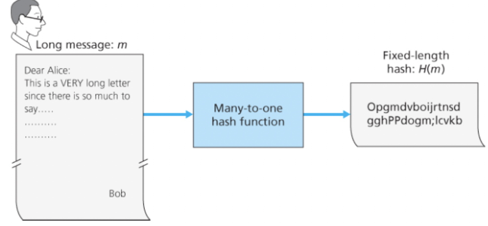
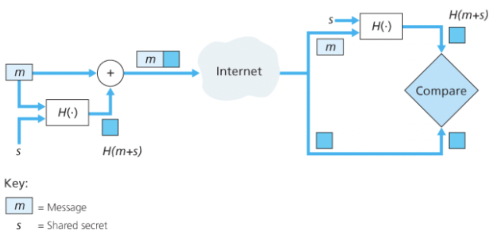
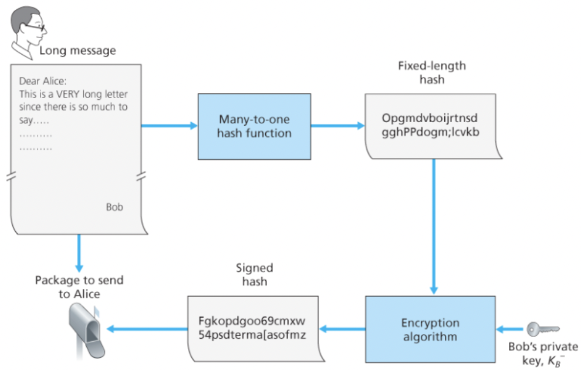
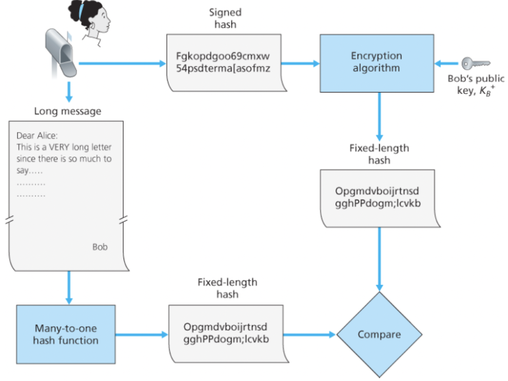
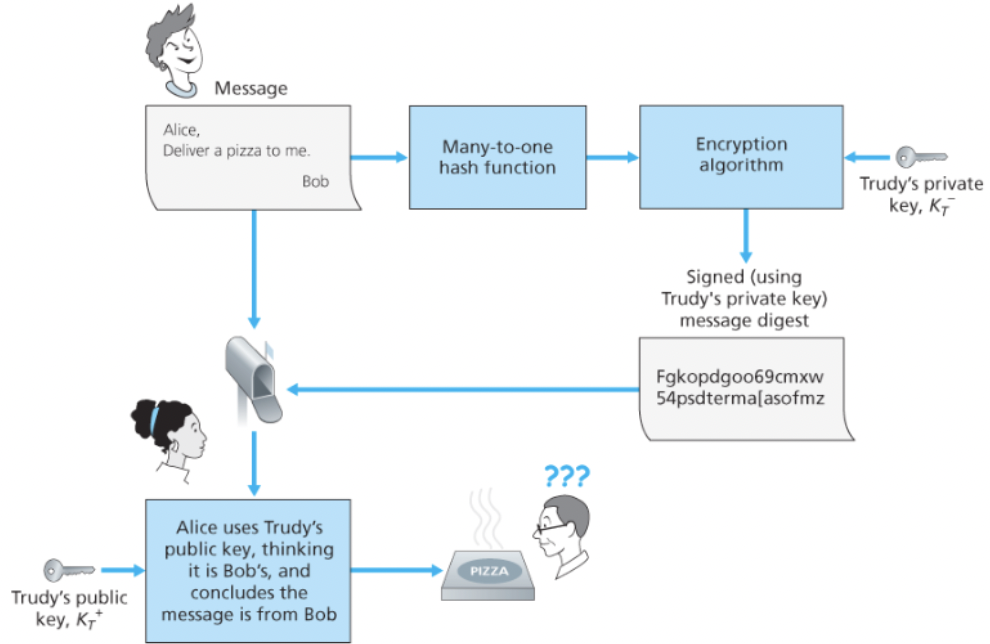
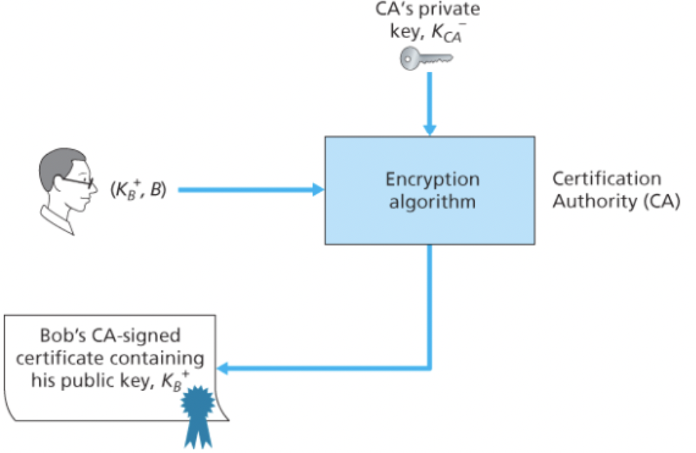

# 메시지 무결성과 전자서명

### 메시지 무결성

1. 메시지가 정말 해당 출발지로부터 왔는가?
2. 메시지가 전달되는 도중 변경되지는 않았는가?

<br/>

## 암호화 해시 함수





해시 함수는 입력 m을 받아서 해시라 불리는 고정된 크기의 문자열 H(m)을 계산해낸다.

암호화 해시 함수는 H(x) = H(y)가 되는 서로 다른 두 메시지 x와 y를 찾는 일이 산술적으로 실행 불가능하다.

즉, (m, H(m))이 원래 메시지와 그 메시지에 대해 송신자가 만들어낸 해시값이라고 할 때, 침입자가 원래 메시지와 동일한 해시값을 갖는 다른 메시지 y를 위조해낼 수 없다.

<br/>

인터넷 체크섬과 같은 간단한 체크섬은 같은 값을 만들기 쉬워 암호화 해시 함수로 사용하기에는 너무 허술하다.

<br/>

### MD5, SHA

MD5 해시 알고리즘이 오늘날 널리 쓰이고 있다.

1. 덧붙이는 단계
  - 하나의 1을 메시지 뒤에 붙이고 충분히 많은 0을 뒤에 덧붙여서 메시지 길이가 단위 길이 조건을 만족시킨다.
2. 추가 단계
  - 덧붙이기 전 메시지 길이를 64비트로 표현하여 추가
3. 어큐뮬레이터 초기화
4. 루프 단계
  - 메시지를 16워드 길이의 단위 블록들로 나누어 4개 라운드로 처리한다.

SHA 알고리즘은 MD4에 사용된 원리와 유사한 원리를 사용하여 널리 사용된다.

<br/>

## 메시지 인증 코드(MAC)

### 메시지 무결성을 얻는 과정

1. 송신자는 메시지 m을 생성하고 해시값 H(m)을 만든다.
  - 이때 SHA 등이 사용된다.
2. 송신자는 메시지 m에 H(m)을 첨부하여 확장 메시지 (m, H(m))을 생성한 후 수신자에게 보낸다.  
   (수신자의 입장에서는 (m, h)로 보임)
3. (m, h)를 받은 수신자는 H(m)을 계산하고 이것이 h와 같다면 문제 없이 처리되었음을 확인한다.

이때, 침입자가 (m’, H(m’))을 자신이 수신자라고 주장하며 보내면 위 단계를 통과하고 부적절한지 알 수 없다.

<br/>

### 인증키를 사용한 메시지 무결성



송신자를 확인하기 위해 송신자 수신자는 비트열 형태의 **인증키**인 비밀키를 공유하여야 한다.

1. 송신자는 메시지 m을 생성하고 인증키 s와 합하여 m+s를 만들고, H(m+s)를 생성한다.
  - H(m+s)를 **메시지 인증 코드**(message authentication code, MAC 이는 링크 계층의 메시지와는 다르다.)라고 부른다.
2. 송신자는 (m, H(m+s))를 보낸다. (수신자의 입장에서는 (m, h)로 보임)
3. 수신자는 (m, h)를 받으면 H(m+s)를 계산하고 값이 h와 같다면 문제가 없다고 결론 짓는다.

메시지 인증 코드는 복잡한 암호화 알고리즘을 필요로하지 않는다.

MD5와 SHA와 함께 사용되는 메시지 인증코드는 HMAC으로 가장 많이 사용되는 표준이다.

통신 개체들에게 인증키를 전달하는 방법은 네트워크 관리자가 각각의 라우터에 직접 접근하거나 인증키를 각 라우터의 공개키로 암호화하여 네트워크를 통해 전달할 수 있다.

<br/>

## 전자 서명

디지털 세계에서 문서의 소유자를 명시하거나 어떤 사람이 문서의 내용에 동의했다는 것을 표시하길 원하고, **전자 서명**은 디지털 세계에서 이러한 목적으로 사용된다.

서명 시 실제로 그 사람이 서명했다는 사실, 그리고 오직 그 사람만이 문서에 서명할 수 있었다는 사실을 증명할 수 있어야 한다.

공개키 암호화 방법은 개인키와 공개키를 따로 가지고 있어 전자 서명에 효과적이다. (다른 사람은 개인키로 서명할 수 없다.)

<br/>

### **시나리오**

1. 서명자는 문서 m을 서명하려한다.
2. 서명자는 자신의 개인키로 K(m)을 만든다. 이것이 바로 전자 서명이다.
  - 전자서명 K(m)은 **서명자의 개인키로 만들어져 서명자만 만들 수 있다.**
3. 전자서명 K(m)을 받은 사람들은 서명자의 공개키를 사용해 원래의 m을 다시 확인할 수 있다.
  - 즉, **공개키의 주인인 서명자가 쓴 서명이라는 것이 확인**된다.
  - 어느 한 사람이 중간에 문서를 조작해 m’을 만들었어도 m과 같지 않으므로 유효하지 않음을 알 수 있다. 즉, 메시지 무결성을 확인할 수 있다.

자신의 개인키로 먼저 암호화하고 공개키로 복호화해도 되는 이유는, `m^ed mod n = m^de mod n = m mod n` 이기 때문이다.

m 자체에 암호화 복호화를 하면 계산의 부하가 심하다.

이때, 해시 알고리즘을 사용하여 해결할 수 있다.

즉, m을 H(m)으로 표현되는 고정 길이의 지문을 계산해내고, K(H(m))을 계산하여 계산의 부하를 줄인다.

<br/>

### 서명자 시나리오



1. 메시지 m을 해시 알고리즘을 이용하여 고정 길이로 바꿔 H(m)을 만든다.
2. H(m)을 자신의 개인키로 암호화 한다.
3. (m,K(H(m)))을 보낸다.

<br/>

### 수신 시나리오



1. 서명자로 부터 (m,K(h))를 받는다.
2. 서명자의 공개키로 K(h)를 복호화하여 h를 알아낸다.
3. m을 해시 알고리즘을 이용하여, H(m)으로 만들고 h와 일치하는지 알아낸다.

<br/>

### MAC vs 전자서명

전자 서명은 인증기관과 함께 공개키 하부 구조를 요구하기 때문에 MAC에 비해 더 무거운 기술이다.

많은 프로토콜에서는 MAC이 사용된다.

<br/>

### 공개키 인증

전자 서명에서는 공개키가 특정 통신 개체에 속한다는 것을 보증하여야 한다. (IPsec과 TSL를 포함한 많은 보안 네트워킹 프로토콜에서 사용된다.)



중간에 침입자가 자신이 서명자라고 주장하며 메시지를 보내는데, 이때 공개키를 자신의 공개키를 담아 보낸다.

수신자는 침입자의 공개키를 사용해 메세지를 복호화 할 것이고, 수신자는 서명자가 쓴 서명임을 확신할 것이다.

<br/>

즉, 공개키 암호를 사용하려면 서명자의 공개키라고 생각되는 것이 정말 서명자의 것인지 확인하여야 한다.

<br/>



공개키가 어떤 통신 개체(서명자)의 것인지 보증하는 일은 일반적으로 CA(인증 기관)에서 담당한다.

CA는 신원을 확인하고 인증서를 발행한다.

1. CA는 어떤 개체(사람, 라우터)가 스스로 주장하는 자신의 신분이 바로 그 개체가 맞는지 확인한다.
  - 인증에 정해진 방법은 없고 CA가 적절한 방법으로 엄격하게 식별자 검증을 수행하리라는 점을 신뢰해야한다.
2. 일단 CA가 신원을 확인하면, CA는 개체의 공개키와 신분 확인서를 결합한 인증서를 만든다.
  - 인증서에는 CA가 서명한다.

```toc
```
