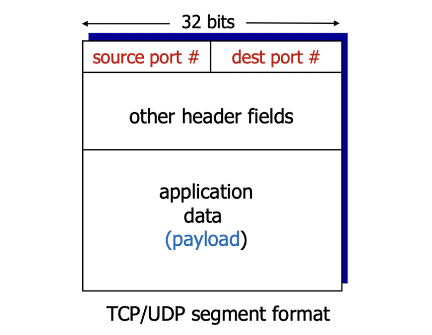

## 다중화 | 역다중화


> 💡  
> **다중화(Sender)** 
>
> - 다중화는 여러 소켓으로부터 데이터를 처리하고, 전송 헤더를 추가하여 나중에 역다중화를 위해 사용합니다.
>
> **역다중화(Receiver)**
>
> - 역다중화는 헤더 정보를 사용하여 받은 세그먼트를 올바른 소켓으로 전달합니다.


네트워크의 다중화는 여러 개의 데이터 흐름을 하나의 통신 매체를 통해 동시에 전송하고, 역다중화는 다중화된 데이터 흐름을 각각의 목적지로 분리하여 독립적으로 수신하는 것을 의미합니다.

## **다중화 해제(Demultiplexing)의 작동 방식**



- 호스트는 IP 데이터그램을 수신합니다.
- 각 데이터그램은 소스 IP 주소와 목적지 IP 주소를 가지고 있습니다.
- 각 데이터그램은 한 개의 전송 계층 세그먼트를 운반합니다.
- 각 세그먼트는 소스 포트 번호와 목적지 포트 번호를 가지고 있습니다.
- 호스트는 IP 주소와 포트 번호를 사용하여 세그먼트를 적절한 소켓으로 전달합니다.
- 페이로드: 상위 계층에서 전송된 데이터로 이루어진 부분입니다. (상위 헤더 + 데이터)

## **비연결형 다중화(Demux) 예시**


좌측Cli : **`DatagramSocket mySocket2 = new DatagramSocket(9157);`**

- 포트 번호 9157로 **`mySocket2`**라는 DatagramSocket을 생성합니다.

중앙서버 : **`DatagramSocket serverSocket = new DatagramSocket(6428);`**

- 포트 번호 6428로 **`serverSocket`**이라는 DatagramSocket을 생성합니다.

우측Cli : **`DatagramSocket mySocket1 = new DatagramSocket(5775);`**

- 포트 번호 5775로 **`mySocket1`**이라는 DatagramSocket을 생성합니다.

## **연결지향형 다중화(Demux)**


> 💡 위 그림은 예시임.


- TCP 소켓은 4-튜플로 식별됩니다:
  - 소스 IP 주소
  - 소스 포트 번호
  - 목적지 IP 주소
  - 목적지 포트 번호
- 다중화: 수신자는 이 네 가지 값을 사용하여 세그먼트를 적절한 소켓으로 전달합니다.
- 서버 호스트는 많은 동시에 연결된 TCP 소켓을 지원할 수 있습니다:
  - 각 소켓은 고유한 4-튜플로 식별됩니다.
- 웹 서버는 각 연결된 클라이언트마다 다른 소켓을 가지게 됩니다.
- 비지속적인 HTTP는 각 요청마다 다른 소켓을 사용합니다.

## 프로세스 vs 쓰레드


프로세스와 스레드는 컴퓨터에서 실행되는 작업의 단위.

**프로세스**

- 프로세스는 운영체제에 의해 실행되는 프로그램의 인스턴스입니다.
- 각 프로세스는 독립된 메모리 공간, 자원, 실행 흐름을 가지고 있습니다.
- 프로세스 간에는 데이터를 주고받기 위해 IPC(Inter-Process Communication) 메커니즘을 사용해야 합니다.
- 각 프로세스는 운영체제로부터 독립적인 자원을 할당받으며, 동시에 여러 프로세스가 실행될 수 있습니다.

**PCB**

- PCB는 프로세스 제어 블록(Process Control Block)의 약자입니다.
- PCB는 운영체제가 각 프로세스를 관리하기 위해 유지하는 데이터 구조입니다.
- 각 프로세스마다 하나의 PCB가 할당되며, 프로세스의 상태와 제어 정보를 저장합니다.
- PCB에는 다음과 같은 정보가 포함될 수 있습니다:
  - 프로세스 식별자(Process ID): 프로세스를 고유하게 식별하는 번호입니다.
  - 프로세스 상태(Process State): 프로세스의 현재 상태(실행, 대기, 준비 등)를 나타냅니다.
  - 프로그램 카운터(Program Counter): 다음에 실행할 명령어의 주소를 가리킵니다.
  - 레지스터 값: 프로세스의 레지스터 상태를 저장합니다.
  - 할당된 자원 정보: 프로세스가 사용하는 자원의 정보(메모리, 입출력 장치 등)를 유지합니다.
  - 스케줄링 정보: 프로세스의 우선순위, 실행 시간 등 스케줄링과 관련된 정보를 포함할 수 있습니다.

PCB는 프로세스의 상태 변화, 프로세스 간의 전환, 자원 할당 및 해제 등을 관리하기 위해 사용되며, 운영체제는 PCB를 통해 프로세스의 상태와 제어를 추적하고 관리합니다.

**스레드**

- 스레드는 프로세스 내에서 실행되는 작업의 단위입니다.
- 하나의 프로세스는 여러 개의 스레드를 가질 수 있으며, 각 스레드는 같은 메모리 공간과 자원을 공유합니다.
- 스레드는 프로세스 내에서 동시에 실행되며, 각 스레드는 독립적인 실행 경로를 가집니다.
- 스레드 간의 통신은 공유된 메모리 공간을 통해 간단하게 이루어집니다.
- 스레드는 경량화되어 생성, 전환, 종료하는 데 비용이 적습니다.

따라서, 프로세스와 스레드는 실행 단위의 차이를 가지며, 프로세스는 독립적인 실행 환경을 가지고 있고, 스레드는 프로세스 내에서 공유된 자원과 메모리 공간을 사용하여 실행됩니다.


```toc
```
