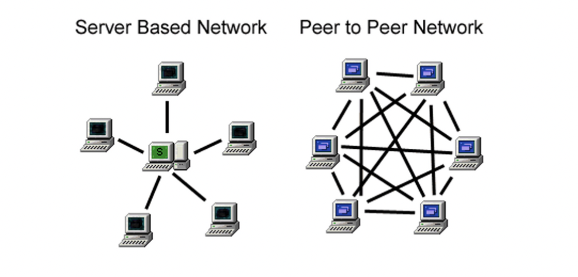

# 네트워크 어플리케이션 원리

## 네트워크 어플리케이션

- e-mail
- ftp : file 공유
- web
- text messaging (카톡)
- remote login
- P2P file sharing
- multi-user network games
- streaming stored video (YouTube, Hulu, Netflix : OTT(over-the-top))
- Skype : voice over IP
- Zoom : real-time video conferencing
- social networking
- Searching engine

## TCP/IP Protocol Layers


## 네트워크 앱 만들기

- 다음과 같은 프로그램 작성:
  - (다른) 엔드 시스템에서 실행
  - 네트워크를 통해 통신
  - 예: 웹 서버 소프트웨어가 브라우저 소프트웨어(클라이언트)와 통신함
- 네트워크 코어 장치용 소프트웨어를 작성할 필요가 없음
- 네트워크 코어 디바이스에서 사용자 애플리케이션을 실행하지 않음
- 엔드 시스템의 애플리케이션을 통해 신속한 애플리케이션 개발 가능

## 어플리케이션 개발 기술

### 프론트엔드

- HTML (SGML의 간소화)
- CSS
- Javascript

### 백엔드

- ASP → [ASP.NET](http://ASP.NET) :
  - ASP은 "Active Server Pages"의 약어로, 마이크로소프트에서 개발한 서버 측 스크립트 기술입니다. ASP는 동적 웹 페이지를 생성하기 위해 사용되며, 서버에서 클라이언트에게 동적 콘텐츠를 제공하기 위해 웹 서버에서 실행되는 서버 측 스크립트 언어를 사용합니다.
- Jsp :
  - JSP는 "Java Server Pages"의 약어로, 자바 기반의 서버 측 스크립트 기술로, 동적 웹 페이지를 생성하기 위해 사용되는 웹 개발 기술입니다. JSP는 자바 코드를 HTML 코드에 포함하여 웹 페이지를 생성할 수 있는 템플릿 기반의 웹 개발 방법을 제공합니다.
- Php :
  - PHP는 "Hypertext Preprocessor"의 약어로, 동적 웹 페이지를 생성하기 위해 사용되는 서버 측 스크립트 언어입니다. PHP는 웹 개발에 널리 사용되며, 웹 서버에서 실행되는 서버 측 스크립트 언어로, HTML 코드 안에 삽입하여 웹 페이지를 동적으로 생성할 수 있습니다.

### 어플리케이션 구조


- client-server :
  - 서버:
    - 항상 켜져 있는 호스트(호스트 컴퓨터)
    - 고정된 IP 주소를 가지고 있음
    - 확장성을 위해 데이터 센터를 사용함
    - 클라우드 컴퓨터 또는 데이터 센터에 위치함
  - 클라이언트:
    - 서버와 통신함
    - 때로는 일시적으로 연결되며, 동적인 IP 주소를 가질 수 있음
    - 서로 직접적으로 통신하지 않음
- p2p (peer-2-peer) : 각각의 컴퓨터가 독립적으로 데이터를 공유하고, 요청과 응답을 직접 처리하는 방식으로 동작
  - 서버 없음:
    - 항상 켜져 있는 서버가 없음
    - 임의의 엔드 시스템이 직접 통신함
  - 피어 (Peer):
    - 피어들은 다른 피어에게 서비스를 요청하고, 다른 피어에게 서비스를 제공함
    - 스스로 확장 가능함 - 새로운 피어가 새로운 서비스 용량과 서비스 수요를 가져옴
    - 피어들은 일시적으로 연결되며 IP 주소가 변경될 수 있음
    - 복잡한 관리가 필요함
  - 예 : 음악, 영화 다운로드 사이트

### Cloud computing

- IaaS(Infrastructure as a Service)
  컴퓨터 및 데이터 스토리지 제공
- PaaS(Platform as a Service)
  애플리케이션 개발과 관리 환경을 제공
- SaaS (Software as a Service)
  특정 소프트웨어 제공 (예. 웹 메일)

## 프로세스 통신

같은 컴퓨터에서 프로세스간 IPC(Inter process communications)를 통해 통신하지만, 다른 컴퓨터(호스트)는 메세지를 통해 통신함.

### Socket


- 프로세스가 소켓에서 메시지를 전송
- 소켓을 문에 비유 :
  - 전송 프로세스가 메시지를 외부(문 밖)로 내보냄
  - 송신 프로세스는 수신 프로세스의 소켓으로 메시지를 전달하는데 문 뒤(OS제어)의 전송 인프라에 의존

### Socket 프로그램 구조


### 주소 지정 프로세스

- 메시지를 받기 위해서는 프로세스는 식별자가 있어야 합니다.
- 호스트 장치는 고유한 32비트 IP 주소를 가지고 있습니다.

Q : 프로세스가 실행되는 호스트의 IP 주소만으로 프로세스를 식별하는 것이 충분한가요?
A : 아니요, 같은 호스트에서 여러 개의 프로세스가 실행될 수 있습니다. (=포트번호 필요)

- 식별자는 호스트상의 프로세스와 관련된 IP 주소와 포트 번호를 모두 포함합니다.
  예를 들어 [gaia.cs.umass.edu](http://gaia.cs.umass.edu/) 웹 서버에 HTTP 메시지를 보내려면:
  IP 주소: 128.119.245.12
  포트 번호: 80

## 응용 계층 프로토콜 정의

1. 교환되는 메시지의 유형:
   예를 들어, 요청(request) 및 응답(response)과 같은 메시지의 유형을 정의합니다.
2. 메시지의 문법:
   메시지 내의 필드와 필드가 어떻게 구분되는지에 대해 정의합니다.
3. 메시지의 의미론:
   필드에 포함된 정보의 의미를 정의합니다.
4. 프로세스가 메시지를 언제 및 어떻게 보내고 응답하는 규칙:
   메시지를 보내고 응답하는 시점과 방식에 대한 규칙을 정의합니다.
5. 오픈 프로토콜:
   RFC(RFC, Request for Comments)에 정의된 프로토콜로, 상호 운용성을 가능하게 합니다. 예를 들어, HTTP, SMTP 등이 있습니다.
6. 프로프리어터리(소유권) 프로토콜:
   소유권이 있는 프로토콜로, 예를 들어 Skype와 같이 특정 회사나 개인이 소유하고 사용하는 프로토콜을 말합니다.

## HTTP / TCP 프로토콜 구조


## 응용 프로그램이 필요로 하는 전송 서비스

1. 데이터 무결성 (신뢰성):
   일부 앱(예: 파일 전송, 웹 트랜잭션)은 100% 신뢰성 있는 데이터 전송을 필요로 한다.
   다른 앱(예: 오디오)은 일부 데이터 손실을 허용할 수 있다.
2. 타이밍 (시간):
   일부 앱(예: 인터넷 전화, 인터랙티브 게임)은 낮은 지연 시간을 필요로 하며 "효과적"으로 작동하기 위해 필요하다.
3. 처리량 (전송률):
   일부 앱(예: 멀티미디어)은 최소한의 처리량을 필요로 한다.
   다른 앱(탄력적인 앱)은 가능한 처리량을 활용할 수 있다.
4. 보안 (암호화):
   암호화, 데이터 무결성 등과 같은 보안 요구사항이 있다.
   예를 들어, 신용카드 전송과 같은 경우에는 보안이 필요하다.

### 일반적인 응용 프로그램의 요구사항


### 인터넷 전송 프로토콜 서비스

**TCP 서비스**:

- 신뢰성 있는 전송: 송신 및 수신 프로세스 간에 신뢰성 있는 데이터 전송을 한다.
- 플로우 컨트롤: 송신자가 수신자를 압도하지 않도록 수신자를 제어한다.
- 혼잡 제어: 네트워크가 혼잡할 때 송신자의 전송 속도를 조절하여 혼잡을 완화한다.
- 타이밍, 최소 처리량 보장, 보안을 제공하지 않는다.
- 연결 지향적: 클라이언트와 서버 프로세스 간에 설정(handshake)이 필요하다.

**UDP 서비스**:

- 신뢰성 없는 데이터 전송: 송신 및 수신 프로세스 간에 신뢰성 없는 데이터 전송을 한다.
- 신뢰성, 플로우 컨트롤, 혼잡 제어, 타이밍, 최소 처리량 보장, 보안, 연결 설정을 제공하지 않는다.


>💡 Q: 왜 UDP가 있는가? UDP가 왜 필요한가?


### TCP 및 UDP 보안:

- TCP 및 UDP는 암호화를 제공하지 않는다.
  - 암호화되지 않은 패스워드가 소켓을 통해 인터넷을 통해 평문으로 전송될 수 있다.
- SSL (Secure Socket Layer):
  - 암호화된 TCP 연결을 제공한다.
  - 데이터 무결성을 보장한다.
  - 엔드포인트 인증을 제공한다.
  - https://
- SSL은 응용 프로그램 계층에 위치한다.
  - 응용 프로그램은 SSL 라이브러리를 사용하여 TCP와 "통신"한다.
- SSL 소켓 API:
  - 암호화되지 않은 패스워드가 소켓을 통해 인터넷을 통해 암호화되어 전송된다.
```toc
```
