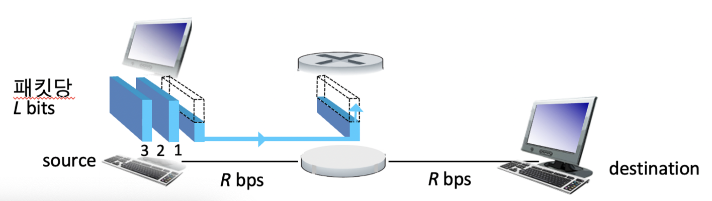
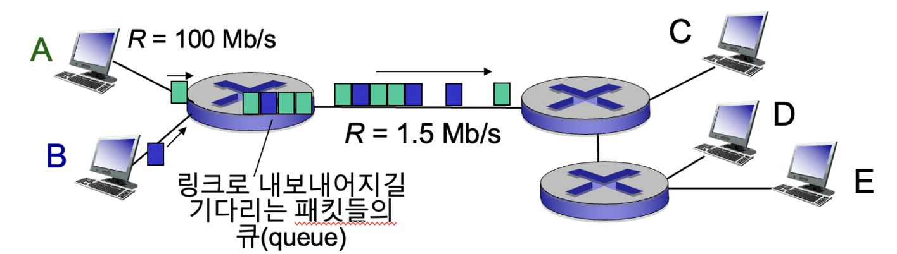
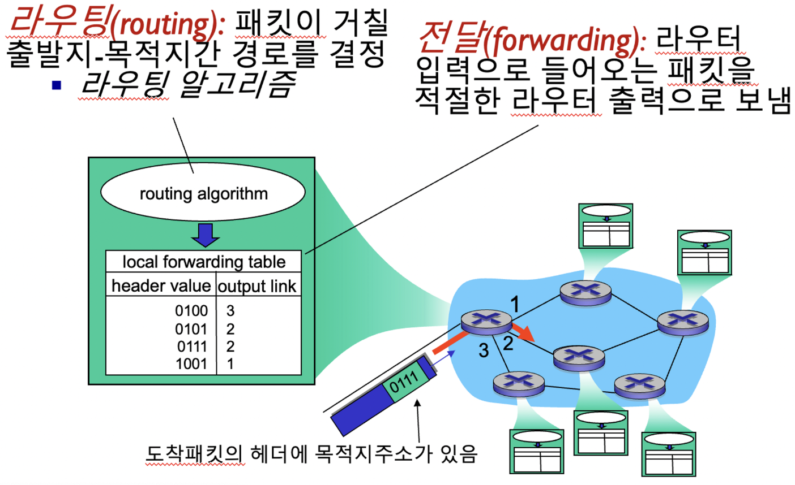
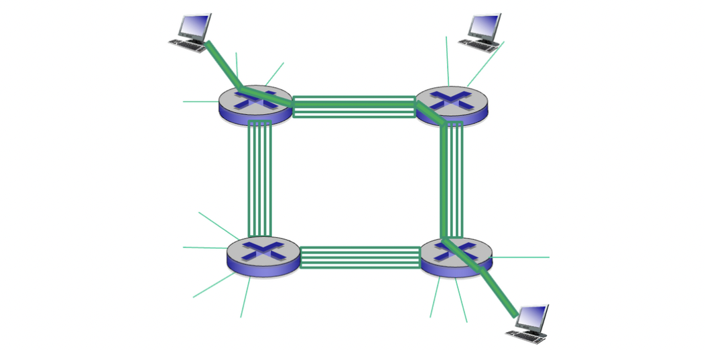
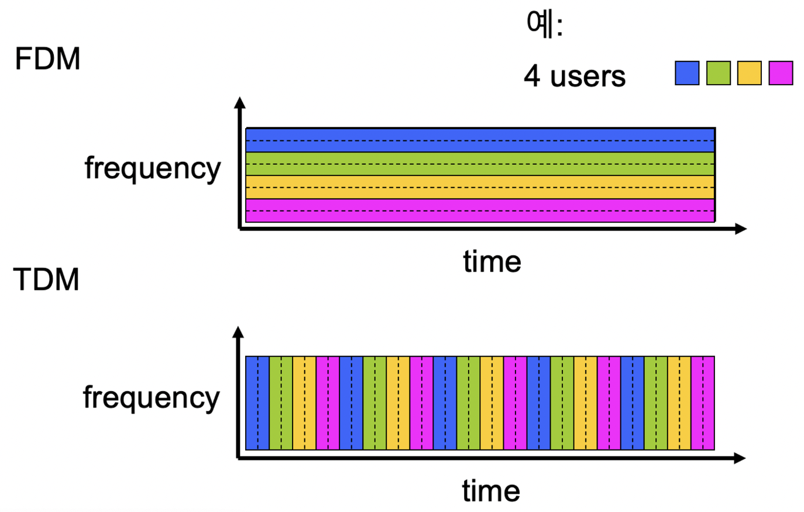
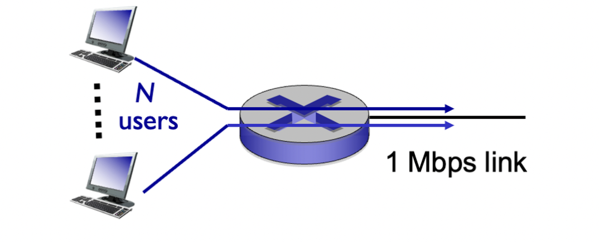
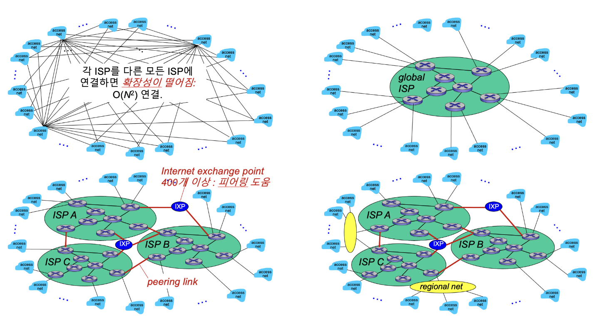
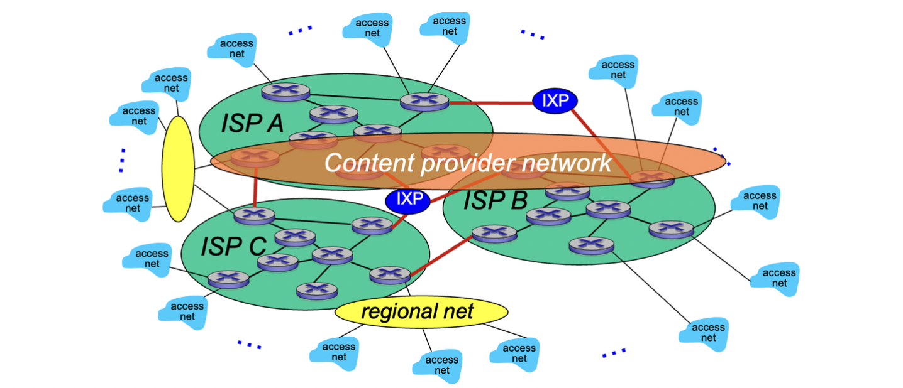
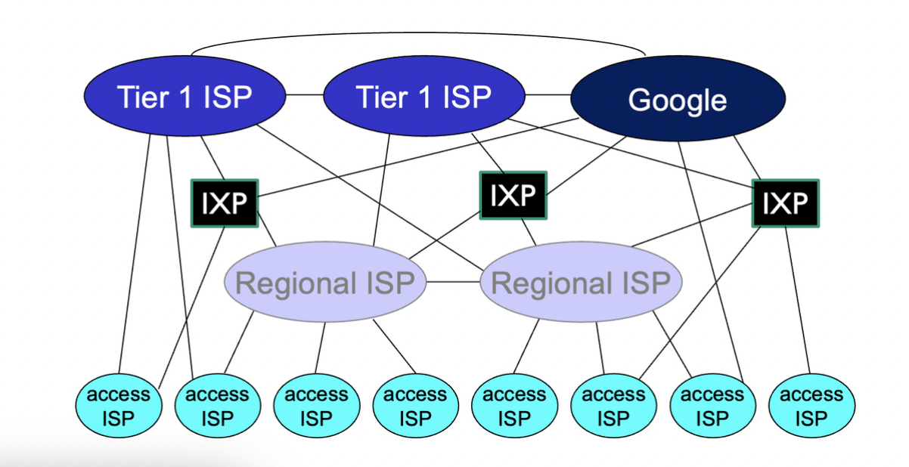

# 네트워크 코어

- 상호 연결된 라우터들의 망
- 패킷교환(packet-switching):호스트는 데이터를 패킷으로 분할
  - 출발지에서 목적지까지의 경로를 따라, 패킷들을 한 라우터에서 다음 라우터로 전송
  - 각 패킷은 링크의 전체 용량을 사용해서 전송됨 : 대역폭을 최대한 사용해서 전송

## 패킷 교환

### 저장 후 전달(store-and-forward)



>💡 라우터에서 패킷 전송 전에 저장하는 장소 : 큐, 메모리


- L 비트 패킷을 R bps 링크에 전송하는데 걸리는 시간 : L/R 초
- 저장 후 전달 : 각 패킷은 라우터에 완전히 도달해야 다음 라우터로 전송 가능.
- 종단지연시간 : 2L/R

### 큐잉 지연, 손실


- 링크로의 도착률 > 링크의 전송률 이면, 라우터의 큐에 데이터가 쌓임
- 메모리가 넘치면 데이터(패킷)는 손실될 수 있다.

### 네트워크 코어의 두가지 핵심 기술


- 라우터는 패킷의 헤더에 있는 IP정보(네트워크 id / 스위치는 호스트 id)가 필요함.
- IP주소 : 176.165.1.1 , 176.165 = 네트워크 id, 1.1 = 호스트 id

### 또 다른 방식 : 회선 교환(circuit switching)


- 패킷 교환 방식에서는 각 패킷이 서로 다른 링크를 통해 전송되어 도착 순서가 보장되지 않는다.
- 회선 교환 방식에서는 미리 종단간 자원을 예약하여 순서를 보장함.
- 전통적인 전화망에 사용됨.

### FDM vs. TDM

- frequency division multiplexing vs. time division multiplexing


## 패킷 교환 vs. 회선 교환


각 사용자가 100kb/s의 속도로 데이터를 전송하고, 링크의 가용한계가 1Mbps, 각 사용자가 총 사용시간의 10%만 데이터를 전송한다면,

회선 교환 방식 : 사용 시간과 관계 없이 무조건 10명만 수용 가능하다.

패킷 교환 방식 : 35명의 사용자가 있다고 가정할 때, 동시에 10명 이상 활동할 확률을 0.0004 미만이다.

모든 사용자가 사용시간의 100%를 데이터 전송에 쓰지 않으므로 패킷 교환 방식이 유리하다!

### 패킷 교환이 항상 더 유리한가?

>💡 Bursty data :  데이터가 확 몰려왔다가 안몰려왔다가 하는 패턴의 데이터


- 패킷 교환은 Bursty data에 적합
  - 단순함
  - call setup 불필요
- 지나친 혼잡 가능성 : 패킷의 지연과 손실 발생
  - 신뢰성 있는 전송과 혼잡제어(congestion control)를 위해 프로토콜 필요(TCP)
- 회선 교환같은 특성을 어떻게 제공할 것인가에 대한 고민

## 인터넷 구조 : 네트워크의 네트워크

- 종단 시스템은 접속 ISPs (Internet Service Providers)를 통해 인터넷에 접속한다.
  - 가정, 회사, 대학 ISPs
- 접속 ISP들도 서로 연결되어야 한다.
  - 임의의 두 호스트가 서로 패킷을 보낼 수 있도록
- 결과적으로 네트워크의 네트워크는 매우 복잡해진다.
  - 경제와 국가정책에 따라 진화한다.

### 수많은 ISP를 서로 연결하는 방법?


각 ISP를 다른 모든 ISP에 연결하면 확장성이 떨어지므로, 글로벌 ISP를 구축하여 글로벌 ISP를 여러 ISP와 연결, 시장 독점을 막기 위해 글로벌 ISP를 여러개 둠.

글로벌 ISP간 통신 : peering link

ISP간 트래픽 교환점 : IXP, 피어링에 도움 줌.


컨텐츠 제공자(예 : Google, Microsoft, Akamai)는 자체 네트워크를 구축해 사용자에게 서비스를 제공할 수도 있음.


```toc
```
