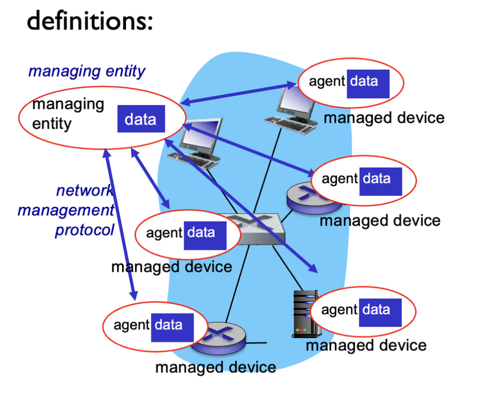
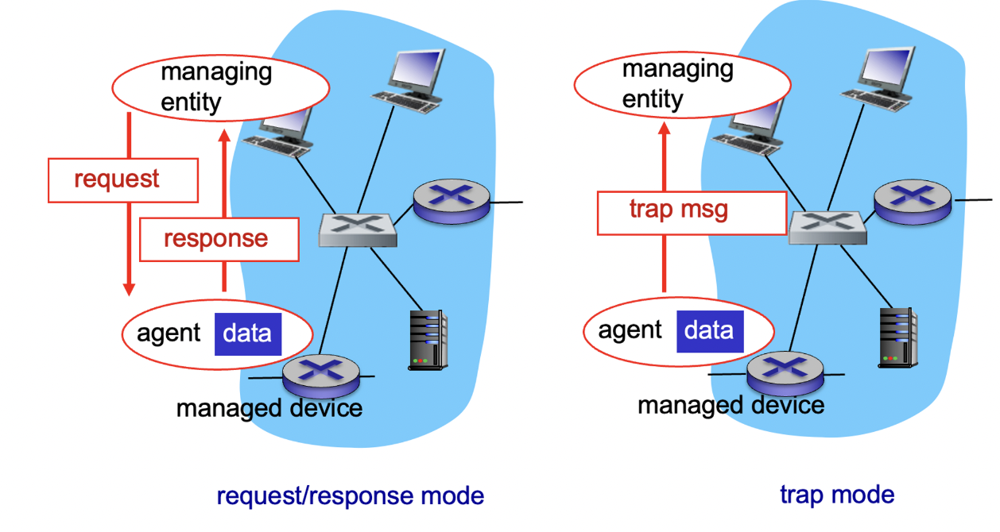
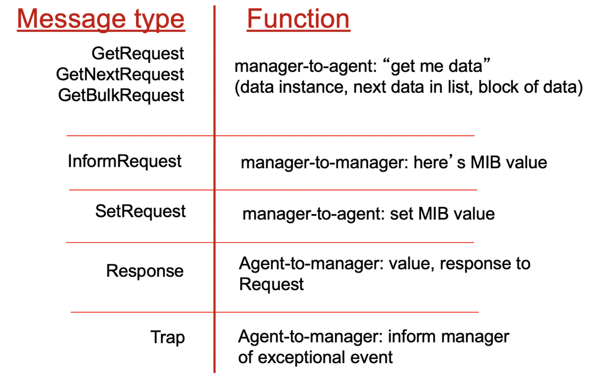
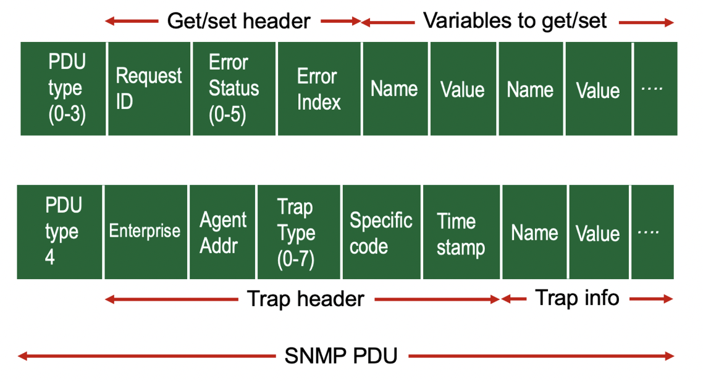

## 네트워크 관리

자율 시스템(또는 "네트워크")은 수천 개의 상호 작용하는 하드웨어/소프트웨어 구성 요소로 구성되어 있습니다.
감시, 제어를 필요로 하는 다른 복잡한 시스템에는 다음이 포함됩니다:

- 제트 비행기
- 원자력 발전소
- 기타 시스템들

네트워크 관리는 하드웨어, 소프트웨어 및 인적 요소를 배치, 통합 및 조정하여 실시간 운영 성능 및 서비스 품질 요구 사항을 합리적인 비용으로 충족시키기 위한 감시, 테스트, 설문 조사, 구성, 분석, 평가 및 제어 등의 작업을 포함합니다.

## 네트워크 관리를 위한 인프라



관리되는 장치들은 관리 대상 개체를 포함하고 있으며, 이들 데이터는 관리 정보베이스 (MIB)에 수집됩니다.

## SNMP 프로토콜



## SNMP 프로토콜 : 메세지 타입



## SNMP 프로토콜 : 메세지 포맷


```toc
```
