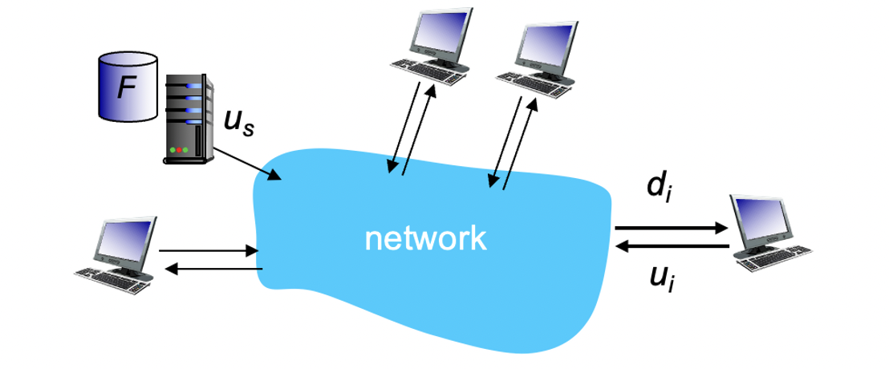
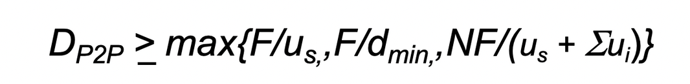
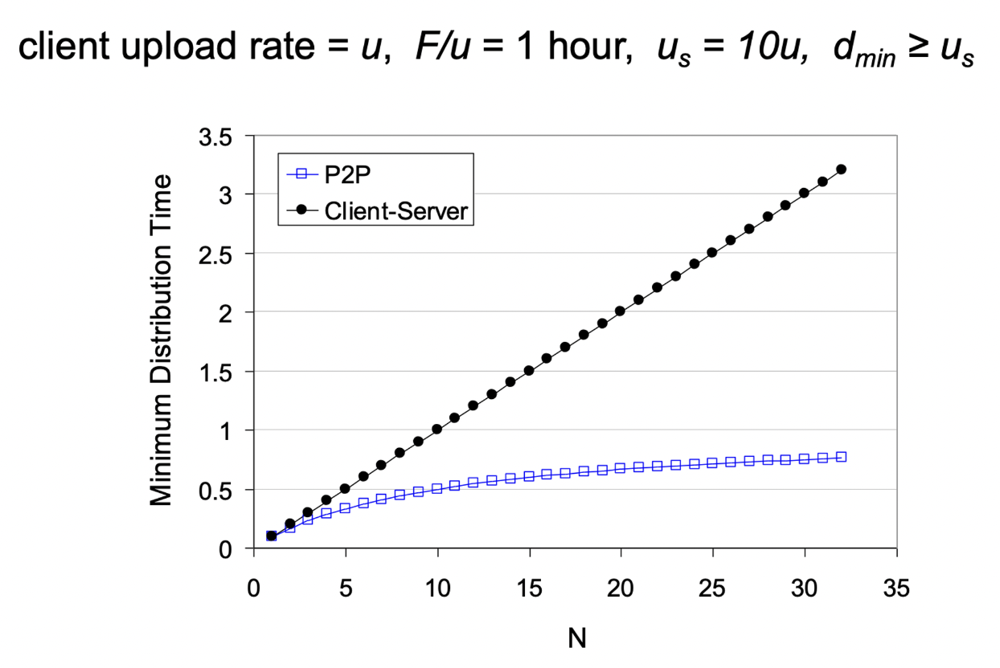
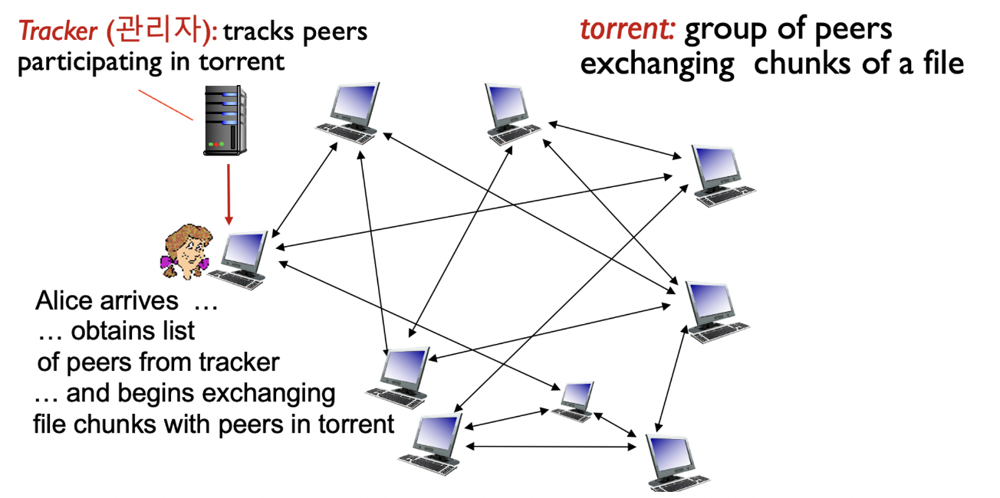
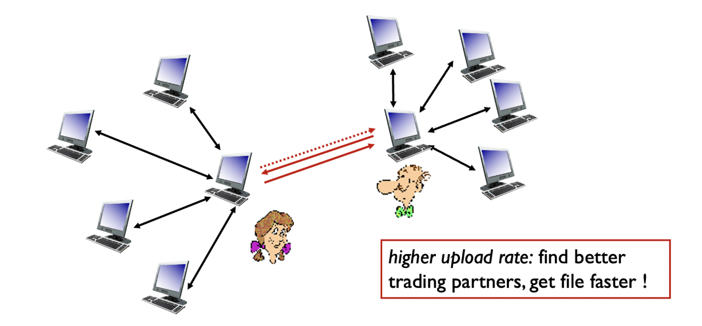

# P2P Applications

## 분산시스템

1. 클라이언트-서버
2. P2P
- 외부인이 볼때 하나의 시스템이 동작하는 것처럼 느껴져야함

## Client-Server vs. P2P


### Client-Server

파일  F를 N클라이언트에 배포하는데 걸리는 시간


- N = 클라이언트 수
- F = 파일 크기
- u_{s} = 서버 전송 속도
- d_{min} = 클라이언트 속도 중 최저값
- server transmission: N개의 파일 사본을 순차적으로 전송(upload)해야한다.
    - 하나의 카피를 보내는데 걸리는 시간: F/u_{s}
    - N개의 카피를 보내는데 걸리는 시간: NF/u_{s}
- client: 각 클라이언트들은 파일 사본을 download해야한다.
    - dmin = min client download rate
    - min client download time: F/d_{min}

### P2P



- N, F, u_{s}, d_{min} : Client-Server와 동일
- server transmission: 최소한 하나의 사본을 upload 해야한다.
    - 하나의 카피를 보내는데 걸리는 시간: F/u_{s}
- client: 각 클라이언트는 파일 사본을 반드시 download한다.
    - min client download time: F/d_{min}
- clients: 집합체가 NF bits를 download해야함
    - 최대 업로드 속도(최대 업로드 속도로 제한했을 때): u_{s}+∑u_{i}


>💡 F를 한번에 보내는게 아니라 작은 단위(패킷)으로 나누어 보낸다는 것에 주의


### Client-Server vs. P2P Distribution Time Graph


- Client-Server 방식은 Linear방식으로 증가하지만, P2P 방식은 로그함수의 형태를 따른다(=P2P 방식이 N이 클수록 더 효율적이다).

## P2P 예시 (BitTorrent)


- 파일은 256Kb의 chunk로 나뉜다.
- torrent에 속한 peer는 파일의 전송/수신을 동시에 한다.
- 파일 다운로드가 완료되면, peer는 토렌트에 남아 peer에게 전송을 할지, 그냥 나갈지 선택할 수 있다.


> 💡 churn: 해지율을 뜻함. 다운만 받고 바로 나가버리는 peer


### BitTorrent : File 요청 및 전송

- chunk request :  어떤 시점에서 다양한 피어들이 파일 청크의 서로 다른 하위 집합을 가지고 있다. 주기적으로, Alice는 각 피어에게 그들이 가지고 있는 청크 목록을 요청, Alice는 부족한 청크를 피어들에게 요청하며, 가장 드문 청크부터 요청합니다.


>💡 가장 드문 청크란 peer들이 갖고 있는 청크 중 가장 빈도수가 낮은 것.


- sending chunk(tit-for-tat) : 앨리스는 현재 자신에게 가장 높은 속도로 청크를 보내는 네 명의 피어들에게 청크를 보냄.
  다른 피어들은 앨리스로부터 청크를 받지 못하고 “차단”.
  매 10초마다 상위 4명을 재평가하고 가장 낮은 전송률을 보이는 피어를 “차단”, 매 30초마다 무작위로 다른 피어를 선택하고 이 피어에게 청크를 보내기 시작.

### BitTorrent : Tit-for-tat (게임이론)


1. 엘리스는 밥을 차단 해제
2. 엘리스는 밥의 4번째 제공자가 됨
3. 밥 또한 엘리스의 4번째 제공자가 됨
```toc
```
