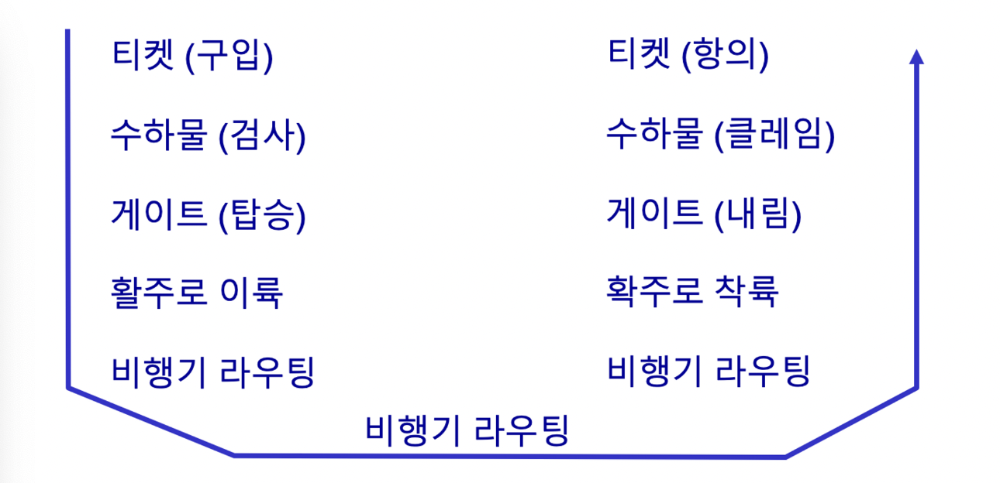
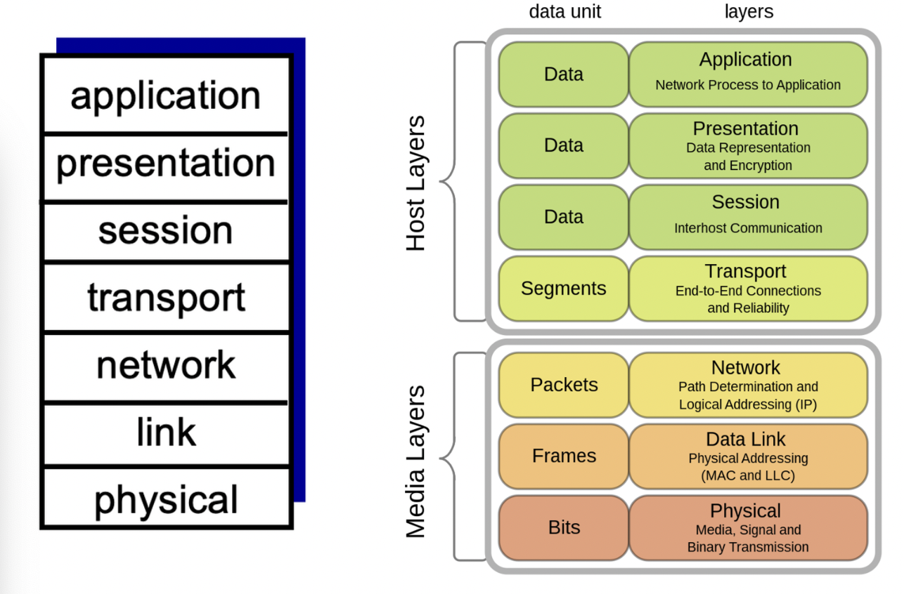

# 프로토콜 “계층”

네트워크는 많은 “요소”들로 구성되어 복잡함 :

- 호스트
- 라우터
- 다양한 매체의 링크
- 응용
- 프로토콜
- 하드웨어, 소프트웨어

> 💡 네트워크 구조를 조직화 하기 위해서는?


## 예 : 항공 여행의 조직화


분업, 조직화가 중요하다

## 계층화의 이유

복잡한 시스템을 다룰 때 :

- 명시적인 구조가 복잡한 시스템의 요소들의 식별과 관계를 분명하게 해 줌.
  - 논의를 위한 계층화된 참조모델
- 모듈화로 시스템의 관리와 갱신이 용이해짐.
  - 한 계층의 구현을 변경해도 시스템의 다른 부분에 영향을 주지 않음.

## ISO/OSI 참조 모델(Open Systems Interconnection Reference Model)


- 응용(Application) 계층: 사용자와 네트워크 간의 상호작용을 담당하며, 응용 프로토콜을 통해 다양한 네트워크 애플리케이션을 지원합니다.
- 표현(Presentation) 계층: 데이터의 형식을 변환하고 암호화, 압축, 인코딩 등의 기능을 제공하여 응용 계층이 전송할 데이터를 처리합니다.
- 세션(Session) 계층: 통신을 관리하고 연결을 설정, 유지, 해제하는 등의 기능을 담당하여 응용 프로세스 간의 세션(연결)을 관리합니다.
- 전송(Transport) 계층: 데이터의 신뢰성과 흐름 제어를 담당하며, 데이터의 분할, 전송 및 재조립을 수행하여 응용 프로세스 간의 신뢰성 있는 통신을 보장합니다.
- 네트워크(Network) 계층: 데이터의 경로 설정과 라우팅을 담당하여 다양한 네트워크 간의 통신을 제공합니다.
- 데이터 링크(Data Link) 계층: 물리 계층과 네트워크 계층 사이에서 데이터를 블록(프레임) 단위로 전송하고, 오류 검출과 수정, 흐름 제어 등의 기능을 수행합니다.
- 물리(Physical) 계층: 네트워크의 물리적인 연결과 전기적인 신호를 다루는 계층으로, 비트(Bit) 단위로 데이터를 전송합니다.
```toc
```
