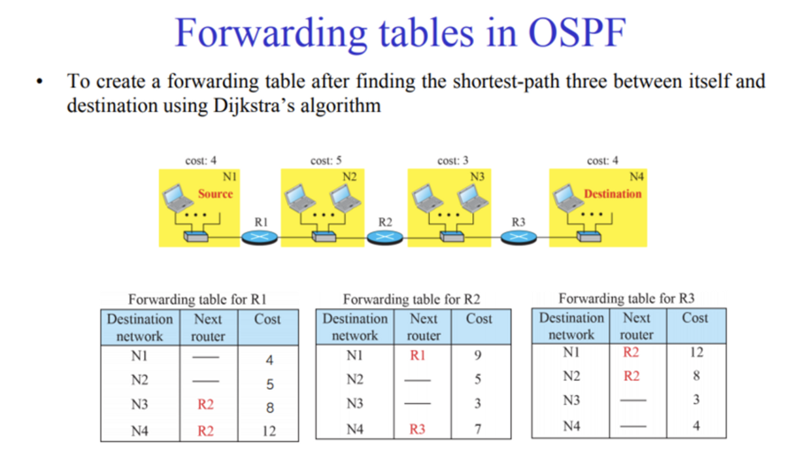
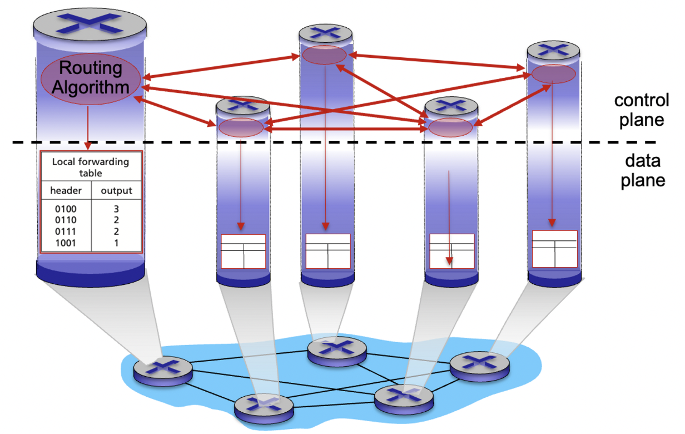
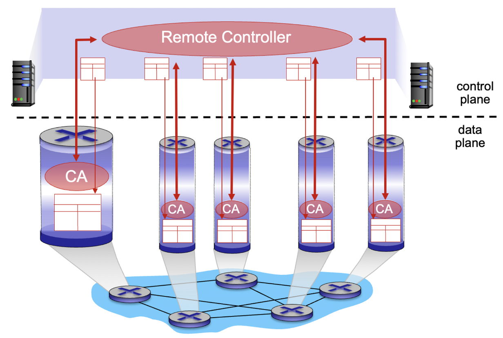
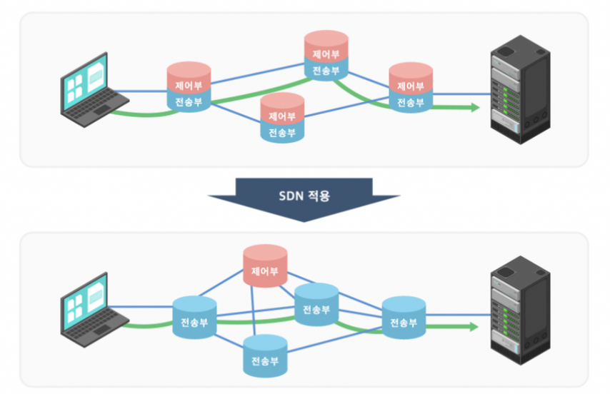
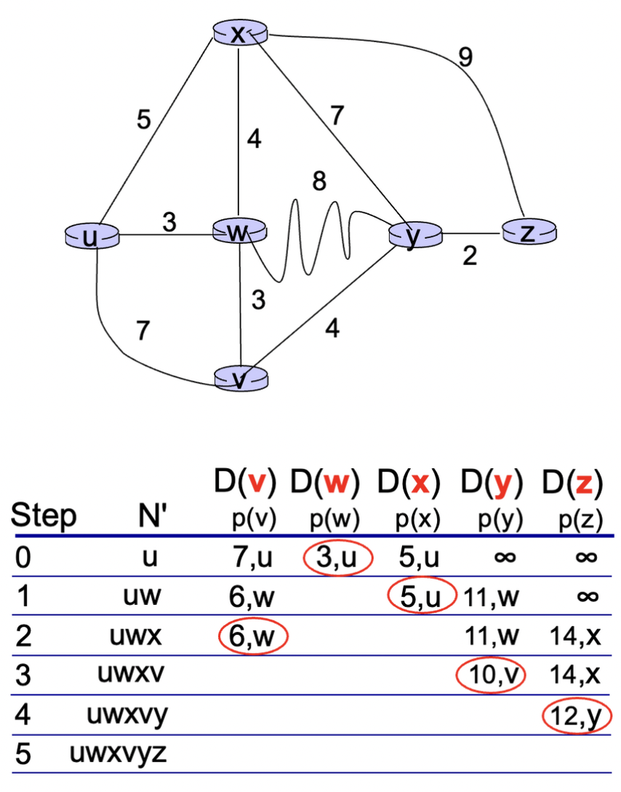
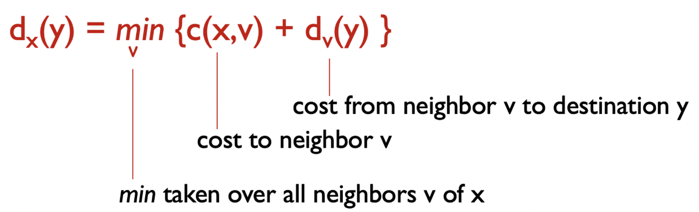
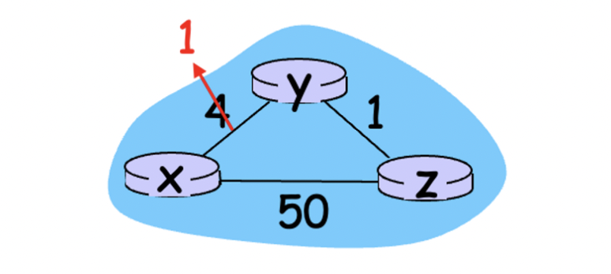
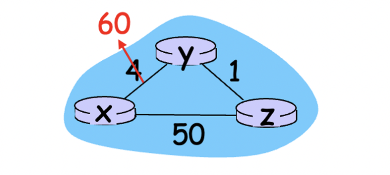

## Network Layer Functions

- **Forwarding : Data Plane**
- **Routing : Control Plane**
   - 전통적 방식
   - SDN Controller : 별도의 서버가 전체 네트워크를 관리

## 라우팅이란?

- 라우터에 저장될 라우팅 테이블을 만드는 과정
- 포워드 테이블의 구조 :

  


### 기존 방식(전통적 방식)



각각의 라우터가 제어평면(Control Plane)에서 각각의 포워딩 테이블을 작성

### Logically Centralized Control Plane(최근)





별도의(일반적으로 원격) 컨트롤러가 라우터의 로컬 제어 에이전트(CAs)와 상호 작용하여 포워딩 테이블을 작성

### 동적 라우팅의 종류

>💡 정적 라우팅은 사람이 직접하는 것이므로 따로 다루지 않는다.


- Global
   - 전체 네트워크의 구조와 연결비용을 알고 있음
   - Link state 알고리즘
      - 각 라우터는 전체 네트워크의 구성(topology)과 링크 상태 정보를 유지
      - 모든 목적지 네트워크까지의 최적 경로 계산
      - 최적 경로를 기반으로 포워딩 테이블 구성
      - Link State Advertisement(LSA) message
- Decentralized
   - 자신과 직접 연결된 라우터의 정보와 최종 목적지를 가기 위한 비용과 다음 라우터의 정보만 알고 있음
   - distance vector 알고리즘

### 다익스트라 알고리즘(Link state)



**초기화:
◦ N’ = {u} (시작 노드 u를 포함하는 집합 N’을 초기화)
◦ 모든 노드 v에 대해:
▪ 만약 v가 u와 인접한 노드라면, D(v) = c(u, v) (시작 노드로부터 v까지의 비용을 초기화)
▪ 그렇지 않으면 D(v) = ∞ (직접 이웃이 아닌 노드의 비용을 무한대로 초기화)반복:
◦ N’에 속하지 않은 최소 비용 경로를 가진 노드 w를 선택
◦ w를 N’에 추가
◦ w에 인접하면서 N’에 속하지 않은 모든 노드 v에 대해 다음을 수행:
▪ D(v) = min(D(v), D(w) + c(w, v))
▪ 새로운 경로의 비용이 기존 비용보다 작다면, 비용을 업데이트모든 노드가 N’에 속할 때까지 반복**

- 한 정점에서 다른 모든 정점으로 가는 최단거리를 구함

### 다익스트라 알고리즘 : 논의


>❓ 트래픽을 링크 비용으로 삼는것은 적절한가? 부적절함.  
>→ 트래픽 정보를 매번 계속 갱신해야하고, 갱신된 트래픽에 의해 데이터가 순환할 수 있음


### 벨만-포드 알고리즘(Distance vector)



x → y로의 최단거리를 알고 싶을 때, 이웃들(v)이 준 정보 dv(y)와 자신으로부터 이웃까지의 거리를 합해 가장 작은 값 선택

- 이웃의 정보에 의존함.
- 30초마다 갱신

### 벨만-포드 알고리즘 : 논의



비용이 변했을 경우?

링크 비용이 줄어들었을 경우는 별 문제가 되지 않음, 그러나



링크 비용이 늘어났을 경우(예 : (y,x) = 60)

y는 기존의 y → x 경로가 4에서 60으로 증가했으므로 더 적은 비용 찾으려 함.

z는 y ↔ x 경로가 60이 되었다는 것을 모르고 있으므로, z를 거치면 x에 5로 도달할 수 있다고 판단

y는 z에게 패킷을 넘겨주어 최단경로를 완수한다고 생각(60 > 5), y의 x로의 최단거리는 4가 아닌 5로 갱신.

그러나 z는 받은 패킷을 자신의 최단경로인 y로 다시 보냄. 이때 y의 x로의 최단거리가 5로 갱신되었으므로 z는 1+5 = 6으로 x에 도달할 수 있다고 생각하여 x로의 최단거리를 6으로 갱신.

위 과정이 반복되어 패킷은 쓸모없는 순환을 반복함

### 연결 상태 라우팅 vs. 거리 벡터 라우팅

| 연결 상태 라우팅 프로토콜 | 거리 벡터 라우팅 프로토콜 |
| --- | --- |
| 모든 라우터로부터 망 정보를 수집 | 인접한 이웃으로부터 망 정보를 수집 |
| 최단거리 알고리즘으로 모든 라우터에 대한 비용을 직접 계산 | 비용은 이웃 라우터와의 거리 비용을 더해서 구함 |
| 링크 상태 변화 시만 라우팅 정보 교환 | 주기적인 라우팅 정보 교환 |
| 빠른 수렴시간 | 느린 수렴시간 |
| 자신에게 직접 연결된 망 정보만 전달 | 모든 라우팅 테이블 값을 이웃에게 전달 |
| 멀티 캐스트 방식으로 라우팅 광고 | 브로드캐스트 방식으로 이웃에게 라우팅 광고 |

## 라우팅 프로토콜 정리

- 자율 시스템(AS : Autonomous System = Domain)
   - 한 기관의 내부 네트워크(동일한 통제 안에 있음)
   - AS 내부 vs. AS 외부로 나누어짐
- AS 내부 라우팅 프로토콜(Intra-domain)
   - OSPF (Link-state)
   - IGRP, EIGRP, RIP (Distance vector)
   - 표준이 없음, 각 AS마다 다른 프로토콜 사용 가능
- AS 외부 라우팅 프로토콜(Inter-domain)
   - BGP(국제 표준)

```toc
```
