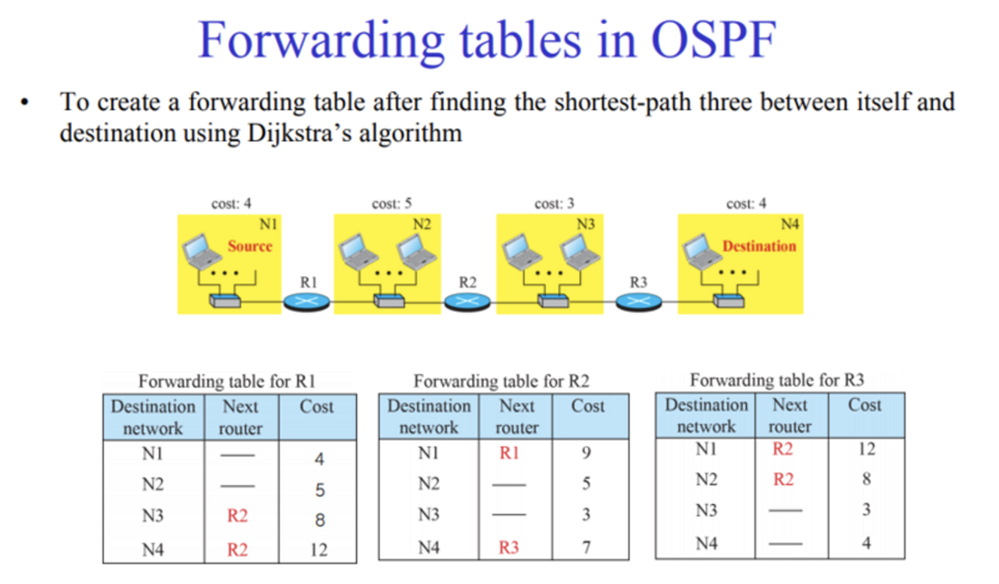
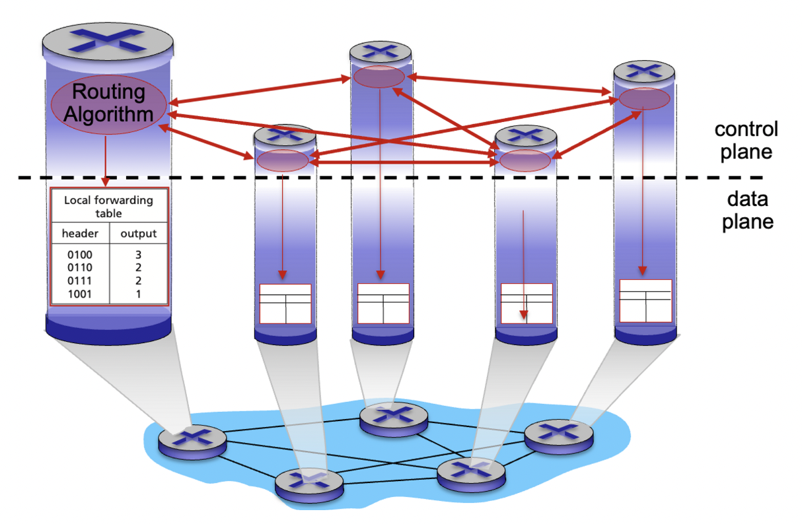
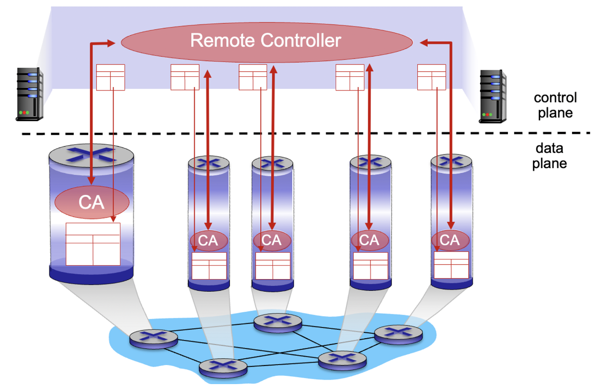
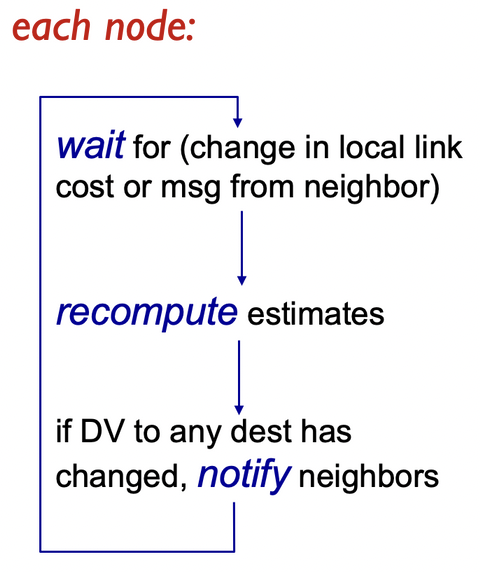
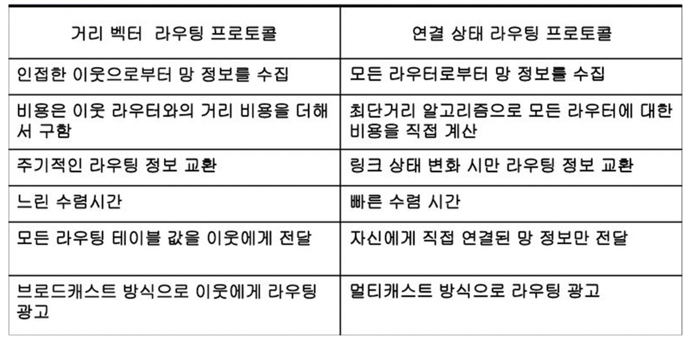

## 라우팅



라우팅의 주요 목적은 패킷을 가장 효율적이고 신속하게 목적지까지 전달하는 것입니다. 이를 위해 라우팅은 다음과 같은 기능과 프로세스를 수행합니다:

1. 경로 선택: 라우터는 수신한 패킷의 목적지 주소를 확인하고, 경로 테이블에 따라 패킷을 전달할 적절한 경로를 선택합니다. 경로 선택은 다양한 요소를 고려하여 이루어지며, 최적 경로 선택을 위해 여러 가중치와 메트릭스가 사용될 수 있습니다.
2. 경로 학습: 라우터는 주변 네트워크와의 연결성을 학습하고, 네트워크 토폴로지 정보를 수집합니다. 이를 통해 라우터는 다른 네트워크로의 경로를 파악하고 관리할 수 있습니다. 라우터는 이웃 라우터와 라우팅 프로토콜을 사용하여 네트워크 정보를 교환하고 업데이트합니다.
3. 패킷 전송: 경로 선택 후, 라우터는 수신한 패킷을 선택한 경로를 따라 전달합니다. 이때 패킷은 각 라우터를 거쳐 목적지에 도달합니다. 라우터는 패킷을 수신한 인터페이스로 받아들이고, 다음 라우터로 패킷을 전송하는 등의 동작을 수행합니다.

**Per-router control plane (기존 방식)**



기존 방식에서는 각 라우터 내의 개별 라우팅 알고리즘 구성 요소들이 서로 상호작용하여 제어 평면(control plane)에서 전달 테이블(forwarding table)을 계산합니다.

**Logically centralized control plane (최근)**



최근에는 논리적으로 중앙 집중화된 제어 평면 방식이 등장했습니다. 이 방식에서는 독립적인 (일반적으로 원격에 위치한) 컨트롤러가 라우터 내의 지역적인 제어 에이전트(Control Agent, CA)와 상호작용하여 전달 테이블을 계산합니다.

## Static routing / Dynamic routing

### **Static (수동) 라우팅**

- 경로는 관리자에 의해 변경됩니다. 따라서 변경이 느립니다.
- 복잡한 소프트웨어 구현이 필요하지 않습니다.
- 소규모이거나 거의 변경이 없는 네트워크 환경에서 사용됩니다.
- 라우팅 트래픽에 의한 대역폭 소모가 없습니다.
- 인터넷에서는 불가능합니다. 왜냐하면 인터넷은 규모가 크고 동적인 환경이기 때문입니다.

### **Dynamic (동적, 자동) 라우팅**

- 경로가 더 빠르게 변경됩니다.
- 링크 비용 변경에 대한 자동 주기적 업데이트가 있습니다.
- 초기에는 관리자가 라우터 테이블을 초기화하지만, 이후에는 자동적으로 업데이트됩니다.
- 대부분의 프로토콜은 동적 라우팅을 지원합니다.

**동적 라우팅의 두 종류**

**Global (전역) 라우팅**

- 모든 라우터는 전체 네트워크의 구조와 링크 비용 정보를 가지고 있습니다.
- "링크 상태" 알고리즘을 사용합니다.
- 각 라우터는 속한 네트워크에 대한 전체 라우터 정보를 공유합니다.
- 중앙 집중식 방식으로 작동합니다.

**Decentralized (분산) 라우팅**

- 라우터는 자신에게 물리적으로 연결된 이웃과 이웃에 대한 링크 비용 정보를 알고 있습니다.
- 라우터는 다음 라우터로 가기 위한 경로 비용과 목적지 정보만을 가지고 있습니다.
- 계산 및 이웃과의 정보 교환은 반복적인 과정으로 진행됩니다.
- "거리 벡터" 알고리즘을 사용합니다.


## 링크 상태 라우팅

1. 링크 상태 정보 수집: 각 라우터는 자신과 직접 연결된 인터페이스의 상태를 모니터링하고, 이웃 라우터와의 연결 상태 및 링크 비용 정보를 수집합니다.
2. 링크 상태 데이터 교환: 라우터는 수집한 링크 상태 정보를 주변 이웃 라우터에게 전달합니다. 이웃 라우터들은 자신의 링크 상태 정보를 포함한 데이터를 전송하고, 이를 이웃 라우터들끼리 교환하면서 전체 네트워크의 링크 상태 정보를 공유합니다.
3. 링크 상태 데이터 분석: 각 라우터는 수신한 링크 상태 정보를 기반으로 네트워크의 전체 구조를 분석하고, 링크의 상대적인 가중치나 비용을 계산합니다. 이를 통해 최적의 경로를 결정할 수 있습니다.
4. 최적 경로 계산: 링크 상태 정보와 비용을 기반으로 각 라우터는 다익스트라(Dijkstra) 알고리즘 등의 경로 선택 알고리즘을 사용하여 자신으로부터 목적지까지의 최적 경로를 계산합니다.
5. Forwarding 테이블 생성: 각 라우터는 계산된 최적 경로를 기반으로 자신의 포워딩 테이블을 업데이트합니다. 이 테이블은 패킷이 도착한 인터페이스로 패킷을 전달할지 결정하는 데 사용됩니다.

## 다익스트라 알고리즘

다익스트라 알고리즘은 하나의 노드(소스)에서 모든 다른 노드까지의 최소 비용 경로를 계산하며 해당 노드를 위한 포워딩 테이블을 제공합니다. 다익스트라 알고리즘은 다음과 같은 절차로 동작합니다:

- 초기화: 모든 노드에 대해 최소 비용 경로 값을 무한대로 초기화하고, 소스 노드의 최소 비용 경로 값을 0으로 설정합니다. 또한 모든 노드를 아직 최소 비용 경로가 결정되지 않은 노드로 표시하는 집합 N'을 초기화합니다.
- 반복: 아직 최소 비용 경로가 결정되지 않은 노드들 중에서 최소 비용 경로를 가진 노드 u를 선택합니다. u의 이웃 노드들에 대해 새로운 경로를 통해 도달할 때의 비용을 계산하고, 이 값이 현재 기록된 비용보다 작으면 경로를 업데이트합니다. 이 과정을 모든 이웃 노드에 대해 반복합니다.
- 최소 비용 경로 결정: 반복 과정이 완료되면 모든 노드에 대해 최소 비용 경로와 이전 노드를 확인할 수 있습니다. 이를 통해 각 노드의 포워딩 테이블을 생성할 수 있습니다.

다익스트라 알고리즘은 각 노드마다 반복이 필요하므로 노드 수만큼의 반복이 필요합니다. 또한 c(x, y)는 노드 x에서 y로의 링크 비용을 나타내며, 만약 직접 이웃이 아니라면 ∞로 표기됩니다. D(v)는 소스에서 목적지 v까지의 현재 비용 값을 나타내며, p(v)는 소스에서 v까지의 경로에서 이전 노드를 나타냅니다. N'은 최소 비용 경로가 결정된 노드들의 집합입니다.

1. 초기화:
    - N' = {u} (시작 노드 u를 포함하는 집합 N'을 초기화)
    - 모든 노드 v에 대해:
        - 만약 v가 u와 인접한 노드라면, D(v) = c(u, v) (시작 노드로부터 v까지의 비용을 초기화)
        - 그렇지 않으면 D(v) = ∞ (직접 이웃이 아닌 노드의 비용을 무한대로 초기화)
2. 반복:
    - N'에 속하지 않은 최소 비용 경로를 가진 노드 w를 선택
    - w를 N'에 추가
    - w에 인접하면서 N'에 속하지 않은 모든 노드 v에 대해 다음을 수행:
        - D(v) = min(D(v), D(w) + c(w, v))
        - 새로운 경로의 비용이 기존 비용보다 작다면, 비용을 업데이트
3. 모든 노드가 N'에 속할 때까지 반복

## 거리-벡터 라우팅

1. 초기화:
    - 각 라우터는 자신과 직접 연결된 이웃 라우터들에 대한 거리를 알고 있습니다.
    - 다른 모든 라우터에 대한 거리는 무한대로 초기화됩니다.
2. 주기적인 업데이트:
    - 주기적으로, 각 라우터는 이웃 라우터들에게 자신의 거리 벡터를 전송합니다.
    - 이웃 라우터는 받은 거리 벡터를 기반으로 자신의 라우팅 테이블을 업데이트합니다.
3. 경로 선택:
    - 각 라우터는 수신한 거리 벡터와 자신의 라우팅 테이블을 비교하여 최소 비용 경로를 선택합니다.
    - 최소 비용 경로로의 다음 홉(다음 라우터)을 라우팅 테이블에 업데이트합니다.
4. 이웃 간 정보 교환:
    - 이웃 라우터들은 주기적인 업데이트를 통해 자신의 거리 벡터를 서로 교환합니다.
    - 이 정보 교환을 통해 라우터들은 네트워크 전체의 경로 정보를 학습하고 업데이트합니다.

## 거리-벡터 라우팅 알고리즘



거리 벡터 라우팅 알고리즘은 반복적이고 비동기적인 방식으로 동작합니다. 각 라우터는 다음과 같은 상황에서 지역적인 반복(iteration)을 수행합니다:

- 지역적인 링크 비용 변경: 라우터의 연결된 링크 비용이 변경되면 해당 라우터는 지역적인 반복을 수행합니다.
- 이웃으로부터의 거리 벡터 업데이트 메시지: 이웃 라우터로부터 거리 벡터 업데이트 메시지를 수신한 경우 해당 라우터는 지역적인 반복을 수행합니다.

거리 벡터 알고리즘은 분산형으로 동작합니다. 각 노드는 자신의 거리 벡터가 변경될 때에만 이웃들에게 알립니다. 그리고 이웃들은 필요한 경우 자신의 이웃에게 알리게 됩니다.

이 방식을 통해 거리 벡터 알고리즘은 변화가 있는 노드들에 한정하여 업데이트를 수행하므로 효율적인 분산처리를 실현할 수 있습니다. 이웃들 간의 정보 교환과 업데이트가 필요한 경우에만 이루어지기 때문에 오버헤드를 최소화할 수 있습니다.

## vs. link-state routing



```toc
```
