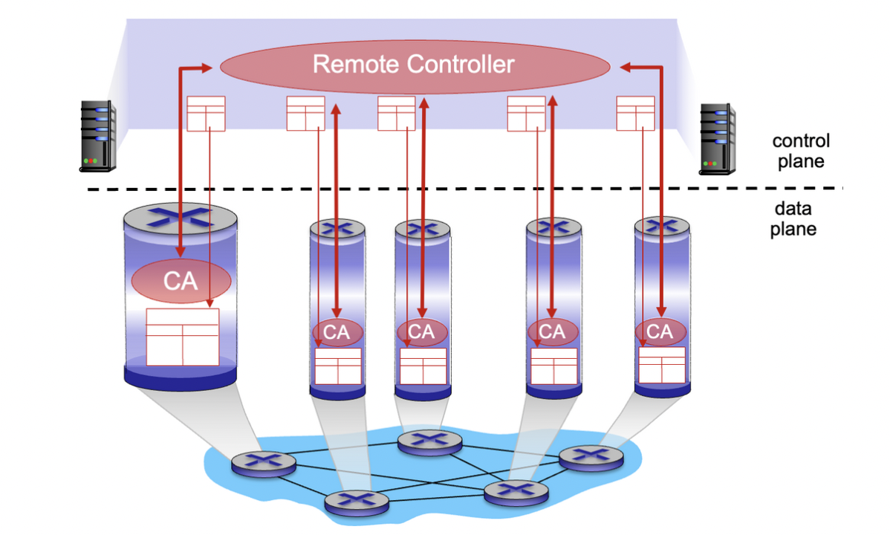
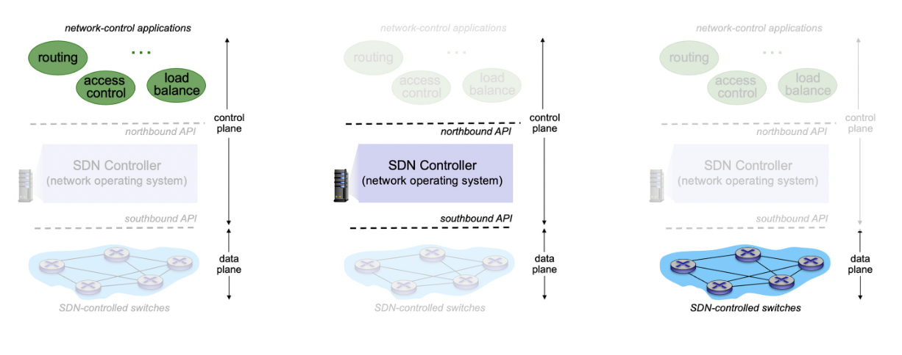
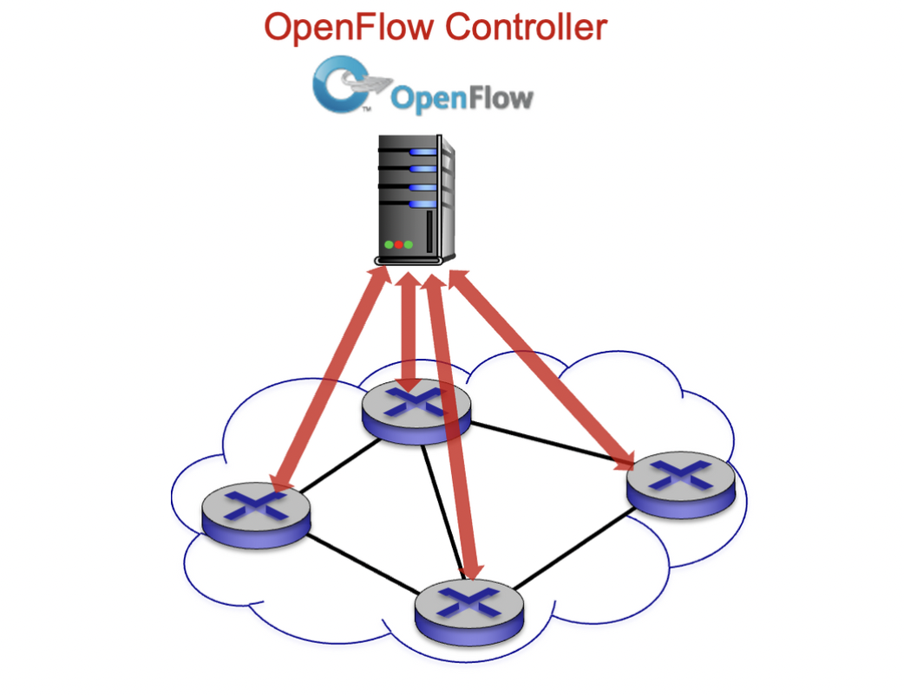

## 최근 라우팅 방식 : SDN



SDN (Software-Defined Networking)은 네트워크 관리와 제어를 분리하여 네트워크의 유연성, 자동화, 중앙 집중화를 향상시키는 네트워크 아키텍처입니다.

기존의 전통적인 네트워크에서는 네트워크 장비들이 패킷 전달과 네트워크 제어 기능을 동시에 수행합니다. 이로 인해 네트워크 관리와 구성이 복잡해지고 유지보수가 어렵게 되는 문제가 있습니다. 또한, 네트워크 확장이나 정책 변경과 같은 작업이 시간과 비용이 많이 소요되는 경우가 많았습니다.

SDN은 이러한 문제를 해결하기 위해 네트워크 제어를 중앙화하고 네트워크 데이터 평면과 제어 평면을 분리하는 방식을 채택합니다. SDN에서는 네트워크 데이터 평면은 전통적인 스위치와 라우터에서 패킷 전달을 처리하는 역할을 담당하고, 네트워크 제어 평면은 중앙 집중화된 컨트롤러에서 네트워크의 전체 동작을 관리합니다.

이를 위해 SDN에서는 네트워크 장비에게 네트워크 흐름에 대한 정보를 전달하고 명령을 내리는 OpenFlow와 같은 프로토콜을 사용합니다. OpenFlow는 네트워크 제어 평면과 데이터 평면 간의 통신을 지원하며, 컨트롤러는 네트워크의 상태를 모니터링하고 정책을 정의하여 네트워크 동작을 제어합니다.

SDN의 장점으로는 다음과 같은 것들이 있습니다:

1. 중앙 집중화된 제어로 네트워크 관리 및 구성이 용이해집니다.
2. 자동화와 프로그래밍 가능성을 통해 네트워크 구성과 정책 변경이 용이해집니다.
3. 유연성과 확장성이 향상되어 네트워크를 더욱 쉽게 조정하고 확장할 수 있습니다.
4. 가상화와 클라우드 컴퓨팅과의 통합이 용이해집니다.

## Generalized Forwarding

### **기존 방식**

- 목적지 기반 포워딩: IP 주소만을 고려하여 포워딩 결정

### **Generalized Forwarding(최근)**

- 헤더의 여러 정보를 검토하여 포워딩 결정
- 추가 정보로는 소스 IP 주소, 목적지 IP 주소, 포트 번호, 프로토콜 등이 있을 수 있음

각 라우터는 SDN (Software-Defined Networking)에 의해 계산된 **flow table**을 가지고 있습니다.

- Forwarding table (포워딩 테이블): 기존 방식에서 사용되던 라우터의 포워딩 정보를 담은 테이블입니다. 주로 목적지 IP 주소에 대한 다음 홉 정보가 포함됩니다.
- Flow table (플로우 테이블): 일반화된 포워딩을 위해 SDN에 의해 계산된 테이블로, 포워딩에 필요한 여러 정보를 검토하여 포워딩 결정을 합니다. 주로 소스 IP 주소, 목적지 IP 주소, 포트 번호, 프로토콜 등의 정보가 포함됩니다.



## **네트워크 제어 애플리케이션**

- 제어의 "두뇌": SDN 컨트롤러에서 제공하는 하위 서비스와 API를 사용하여 제어 기능을 구현합니다.
- 별도로 제공될 수 있으며, 라우팅 업체나 SDN 컨트롤러와 별개의 제3의 파티에 의해 제공될 수 있습니다.
- 네트워크 운영자가 직접 개발할 수도 있고 상용 소프트웨어를 사용할 수도 있습니다.
- 보안, 부하 분산, 경로 설정 등 다양한 기능을 소프트웨어로 제어할 수 있습니다.
- 정책은 가장 중요한 요소입니다.

SDN 관점에서 제어 애플리케이션은 네트워크 제어의 핵심 부분으로, 낮은 수준의 서비스와 SDN 컨트롤러의 API를 활용하여 제어 기능을 구현합니다. 이러한 애플리케이션은 라우팅 업체나 SDN 컨트롤러와는 별도로 제공될 수 있으며, 네트워크 운영자가 직접 개발하거나 제3의 파티로부터 상용 소프트웨어를 사용할 수도 있습니다. 이를 통해 보안, 부하 분산, 경로 설정 등 다양한 기능을 소프트웨어로 제어할 수 있습니다. 그 중에서도 정책은 네트워크 제어에서 가장 중요한 요소로 작용합니다.

## **SDN 컨트롤러 (네트워크 운영체제)**

SDN 컨트롤러는 네트워크 상태 정보를 유지하며, 상위의 네트워크 제어 애플리케이션과 Northbound API를 통해 상호 작용합니다. 또한 하위의 네트워크 스위치와 Southbound API를 통해 상호 작용합니다. 성능, 확장성, 장애 허용성, 견고성을 위해 분산 시스템으로 구현되어 있지만 논리적으로는 중앙 집중화된 역할을 수행합니다.

SDN 컨트롤러는 네트워크의 상태 정보를 유지하고 네트워크 제어 애플리케이션과 상호 작용하기 위해 Northbound API를 사용합니다. 동시에 네트워크 스위치와 Southbound API를 통해 통신합니다. 이를 위해 컨트롤러는 분산 시스템으로 구현되어 있어서 성능, 확장성, 장애 허용성, 견고성을 보장합니다. 그러나 논리적으로는 중앙 집중화된 역할을 수행하여 네트워크 상태의 통합적인 관리를 제공합니다.

## **데이터 평면 스위치**

빠르고 간단한 일반화된 데이터 평면 포워딩을 하드웨어로 구현한 상용 스위치입니다. 컨트롤러에 의해 계산되고 설치된 스위치 플로우 테이블을 사용합니다. 테이블 기반 스위치 제어를 위한 API(예: OpenFlow)가 제공됩니다. 이 API는 어떤 부분이 제어 가능하고 어떤 부분이 그렇지 않은지를 정의합니다. 컨트롤러와 통신하기 위한 프로토콜(예: OpenFlow)이 있습니다.

## OpenFlow



OpenFlow는 소프트웨어 정의 네트워킹 (SDN)에서 사용되는 표준화된 통신 프로토콜입니다. 이 프로토콜은 컨트롤러와 데이터 평면 스위치 간의 통신을 위해 설계되었습니다.

OpenFlow는 컨트롤러가 스위치의 동작을 직접 제어할 수 있도록 합니다. 스위치는 데이터 평면에서 패킷을 전달하고, 컨트롤러는 네트워크 정책을 설정하고 스위치의 동작을 프로그래밍하여 패킷의 경로와 처리 방식을 제어합니다.

OpenFlow는 컨트롤러와 스위치 간의 명령과 상태 정보를 교환하기 위한 표준화된 메시지 형식을 제공합니다. 이를 통해 컨트롤러는 스위치의 플로우 테이블을 구성하고, 플로우를 추가, 수정, 삭제하며, 트래픽을 제어할 수 있습니다.

OpenFlow는 네트워크의 유연성과 관리 용이성을 향상시키는데 기여합니다. 컨트롤러는 중앙 집중식으로 네트워크를 관리하고 정책을 적용할 수 있으며, 스위치는 단순한 데이터 전달 장치로서 동작할 수 있습니다. 이는 네트워크의 운영 및 관리를 효율적으로 수행할 수 있도록 합니다.

```toc
```
