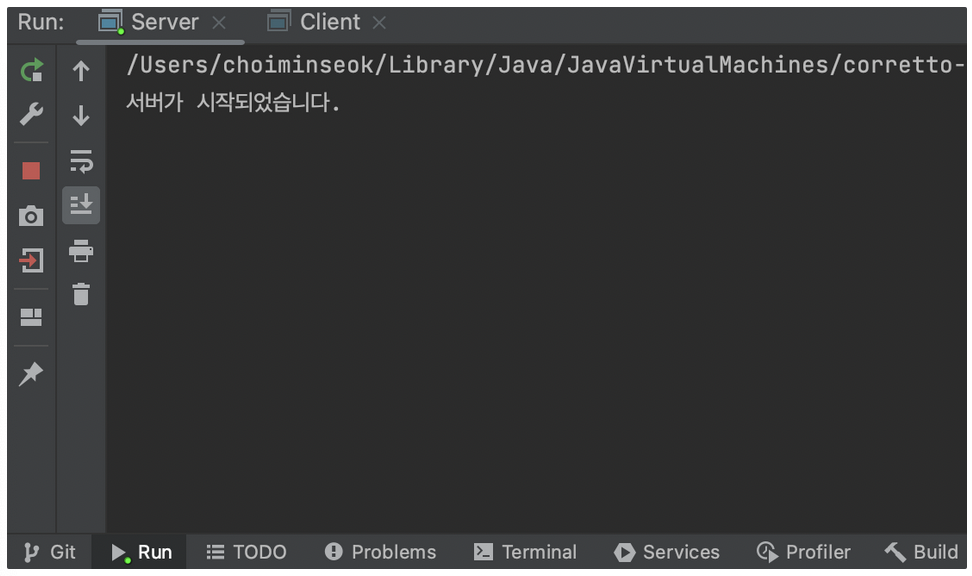
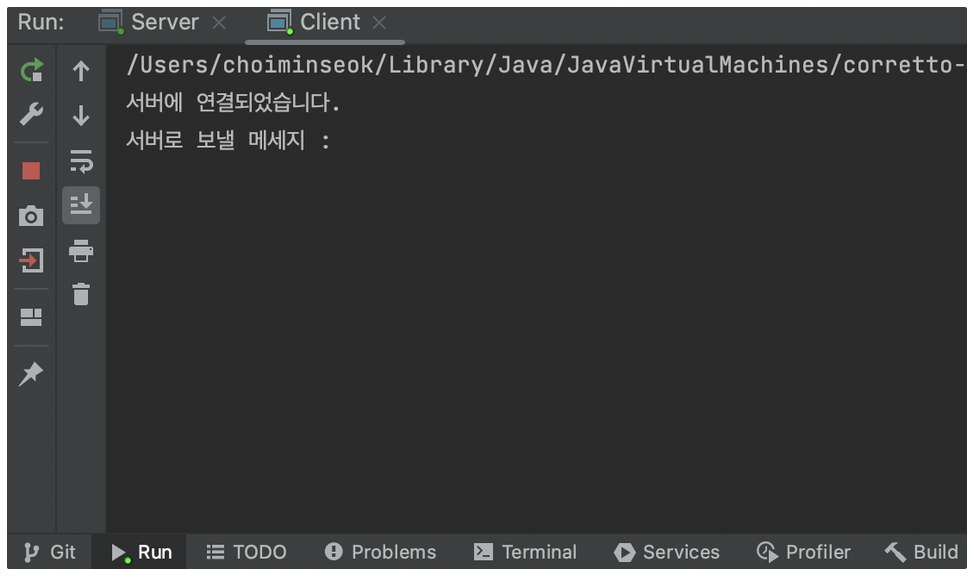
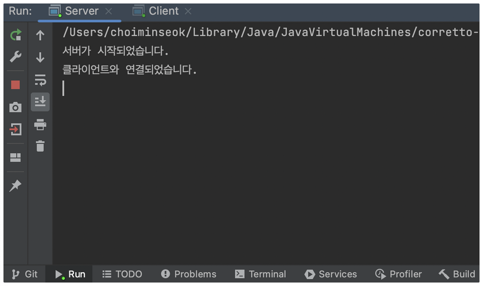
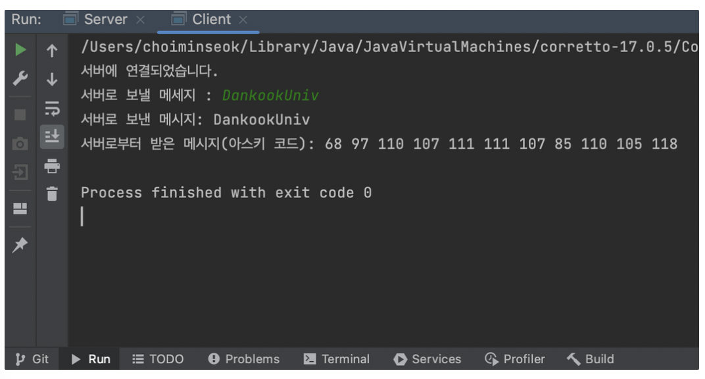
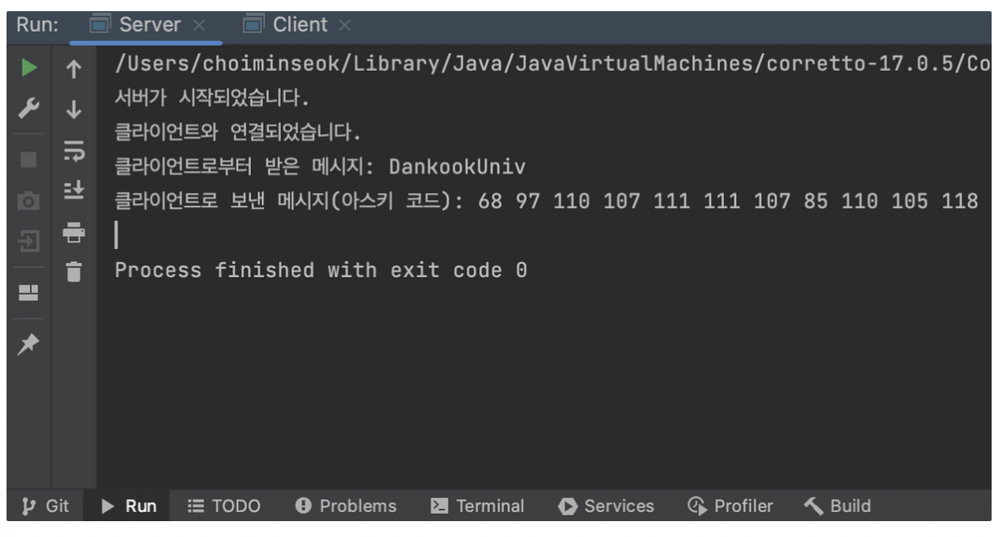
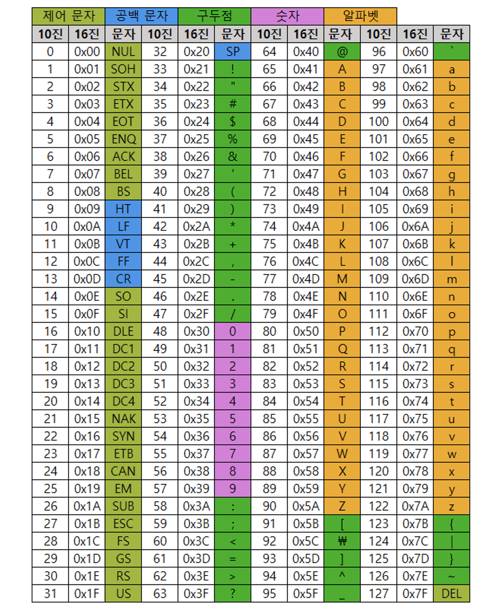
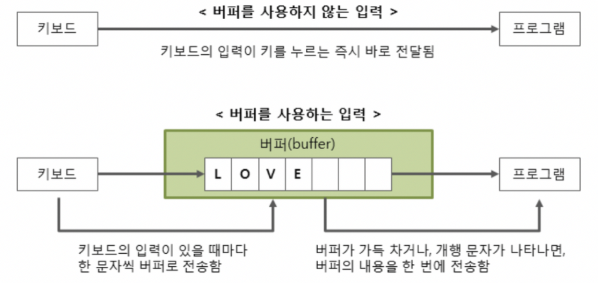
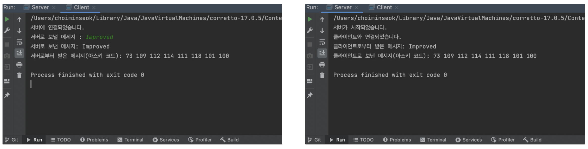

# 소켓 프로그래밍 과제#2-1 : ASCII 변환

## 요구사항

클라이언트에서 서버로 **문자열**을 보내면, 서버에서 해당 문자열을 아스키 코드로 변환 후 클라이언트에게 전송.

## 코드

### 코드(클라이언트)

```java
import java.io.*;
import java.net.*;
import java.util.Scanner;

public class Client {
    public static void main(String[] args) throws IOException {
        int portNumber = 2023;
        String serverIP="127.0.0.1"; // localhost
        try{
            Socket socket = new Socket(serverIP, portNumber);
            System.out.println("서버에 연결되었습니다.");

            // 문자열로 받기 위해 Scanner
            Scanner in = new Scanner(new InputStreamReader(socket.getInputStream()));
            // 문자열 보내기 위해 PrintWriter
            PrintWriter out = new PrintWriter(socket.getOutputStream(), true);
            Scanner input = new Scanner(System.in);
            System.out.print("서버로 보낼 메세지 : ");
            String message = input.next();
						// 서버로 메세지 보냄
            out.println(message);
            System.out.println("서버로 보낸 메시지: " + message);

            String response = in.nextLine();
            System.out.println("서버로부터 받은 메시지(아스키 코드): " + response);

            socket.close();
        }catch (IOException e) { // 예외처리
            System.out.println("연결 실패");
            e.printStackTrace();
        }
    }
}
```

### 코드(서버)

```java
import java.io.*;
import java.net.*;
import java.util.Scanner;

public class Server {
    public static void main(String[] args) throws IOException {
        ServerSocket serverSocket = new ServerSocket(2023);
        System.out.println("서버가 시작되었습니다.");

        Socket clientSocket = serverSocket.accept();
        System.out.println("클라이언트와 연결되었습니다.");
				// 문자열로 받기 위해 Scanner
        Scanner in = new Scanner(new InputStreamReader((clientSocket.getInputStream())));
        // 문자열 보내기 위해 PrintWriter
				PrintWriter out = new PrintWriter(clientSocket.getOutputStream(), true);
				// 클라이언트로부터 메세지 받기
        String message = in.nextLine();
        System.out.println("클라이언트로부터 받은 메시지: " + message);
				
				// 받은 메세지를 아스키코드화해서 StringBuilder asciiString에 넣기
        StringBuilder asciiString = new StringBuilder();
        for (int i = 0; i < message.length(); i++) {
            int ascii = (int) message.charAt(i);
            asciiString.append(ascii);
            asciiString.append(" "); //코드 간 구분 가시화를 위한 공백
        }
        out.println(asciiString.toString());
        System.out.println("클라이언트로 보낸 메시지(아스키 코드): " + asciiString.toString());

        clientSocket.close();
        serverSocket.close();
    }
}
```

### 실행 결과
> <span style="color:indianred">서버측은 붉은색</span>, <span style="color:slateblue">클라이언트 측은 푸른색</span>으로 표시하였습니다.

1. <span style="color:indianred">**서버 오픈**</span>

   

2. <span style="color:slateblue">**클라이언트 오픈**</span>

   

3. <span style="color:indianred">**클라이언트 오픈 후 서버 상태**</span>

   

4. <span style="color:slateblue">**클라이언트에서 서버로 문자열 전송 & 완료**</span>

   

5. <span style="color:indianred">**완료 후 서버 상태**</span>

   


### 아스키 코드표



코드표를 확인해 보면,

D : 68  
a : 97  
n : 110  
k : 107  
o : 111  
o : 111  
k : 107  
U : 85  
n : 110  
i : 105  
v : 118  

로 올바르게 전송된 것을 확인할 수 있다.

## 코드 개선

Scanner 대신 BufferedReader를 쓰는 것이 속도가 더 빠르다.



- Scanner는 버퍼 크기가 1KB이고, BufferedReader는 버퍼 크기가 8KB이다.
  - 예제같은 경우처럼 문자열 크기가 작을 경우는 큰 이득은 없음.
- Scanner는 입력을 읽는 과정에서 내부에서 정규 표현식 적용, 입력값 분할, 파싱 과정 등을 거치기 때문에 속도가 느림.

아래는 Scanner대신 BufferedReader를 쓴 개선 버전.

### 개선코드(클라이언트)

```java
import java.io.*;
import java.net.*;
import java.util.Scanner;

public class Client {
    public static void main(String[] args) throws IOException {
        int portNumber = 2023;
        String serverIP="127.0.0.1"; //localhost
        try{
            Socket socket = new Socket(serverIP, portNumber);
            System.out.println("서버에 연결되었습니다.");

            //문자열로 받기 위해 BufferedReader
            BufferedReader in = new BufferedReader(new InputStreamReader(socket.getInputStream()));
            //문자열 보내기 위해 PrintWriter
            PrintWriter out = new PrintWriter(socket.getOutputStream(), true);
            Scanner input = new Scanner(System.in);
            System.out.print("서버로 보낼 메세지 : ");
            String message = input.next();
            out.println(message);
            System.out.println("서버로 보낸 메시지: " + message);

            String response = in.readLine();
            System.out.println("서버로부터 받은 메시지(아스키 코드): " + response);

            socket.close();
        }catch (IOException e) {
            // TODO Auto-generated catch block
            System.out.println("연결 실패");
            e.printStackTrace();
        }
    }
}
```

- in.nextLine() → in.readLine()으로 바꾸고 Scanner대신 BufferedReader를 사용했다.

### 개선코드(서버)

```java
import java.io.*;
import java.net.*;

public class Server {
    public static void main(String[] args) throws IOException {
        ServerSocket serverSocket = new ServerSocket(2023);
        System.out.println("서버가 시작되었습니다.");

        Socket clientSocket = serverSocket.accept();
        System.out.println("클라이언트와 연결되었습니다.");
        //문자열로 받기 위해 BufferedReader
        BufferedReader in = new BufferedReader(new InputStreamReader(clientSocket.getInputStream()));
        //문자열 보내기 위해 PrintWriter
        PrintWriter out = new PrintWriter(clientSocket.getOutputStream(), true);

        String message = in.readLine();
        System.out.println("클라이언트로부터 받은 메시지: " + message);

        StringBuilder asciiString = new StringBuilder();
        for (int i = 0; i < message.length(); i++) {
            int ascii = (int) message.charAt(i);
            asciiString.append(ascii);
            asciiString.append(" ");
        }
        out.println(asciiString);
        System.out.println("클라이언트로 보낸 메시지(아스키 코드): " + asciiString);

        clientSocket.close();
        serverSocket.close();
    }
}
```

- asciiString.toString() → asciiString
- 형변환을 해주지 않아도 잘 돌아가서 빼줬다. 다만, ascii변수의 경우는 형변환 되었다는 것을 명시하기 위해 (int)를 붙였다.

### 개선버전 실행결과

좌측이 클라이언트, 우측이 서버



의도대로 동작함을 확인할 수 있다.
```toc
```
