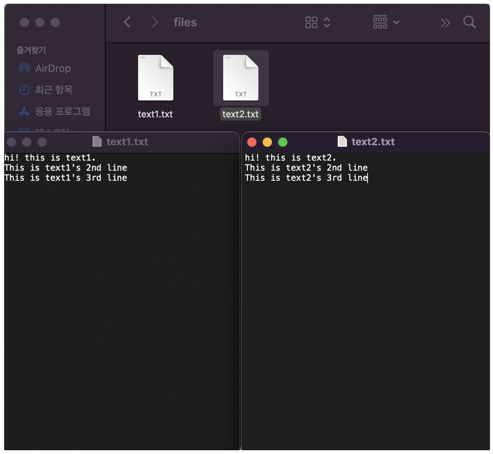
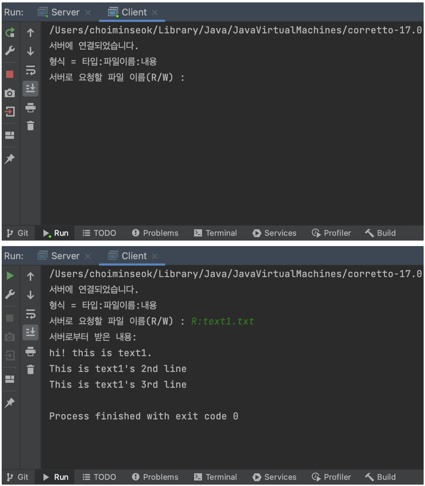
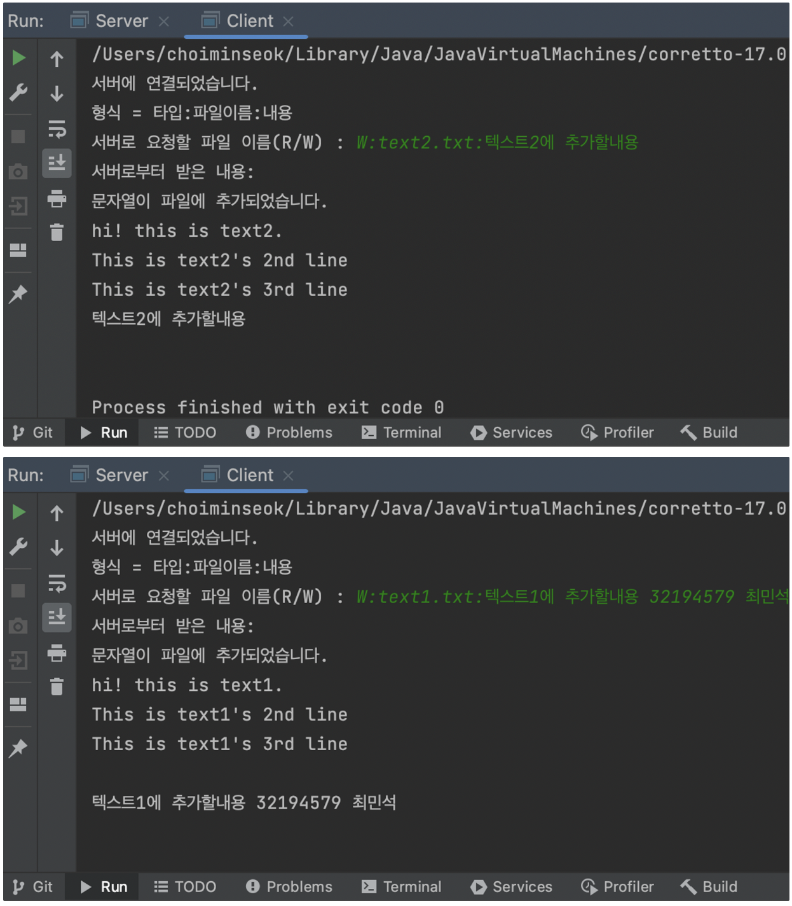
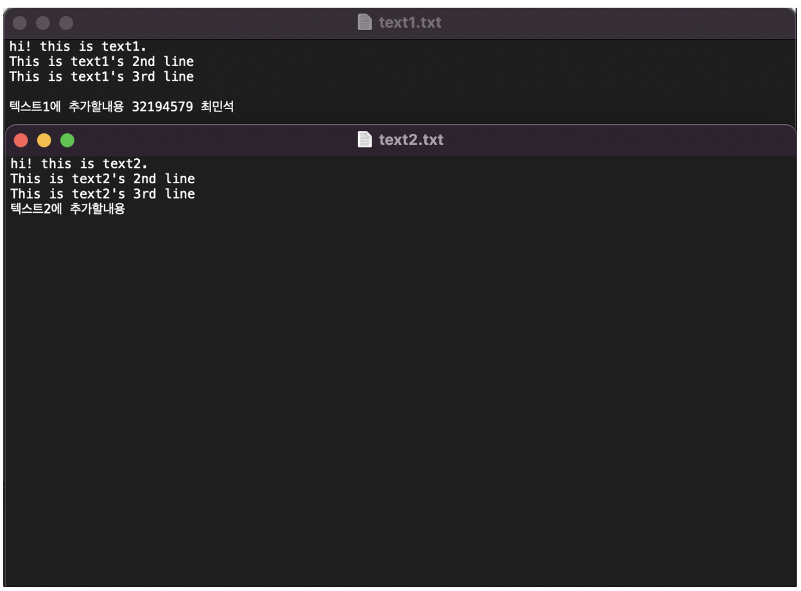
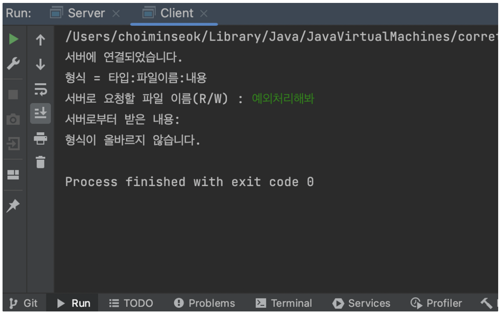
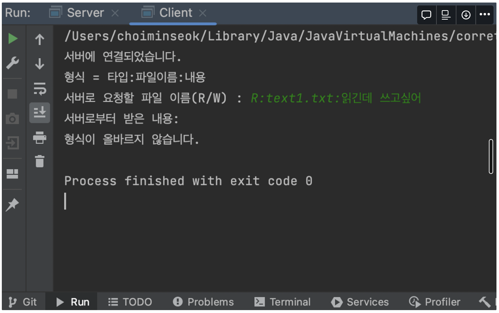
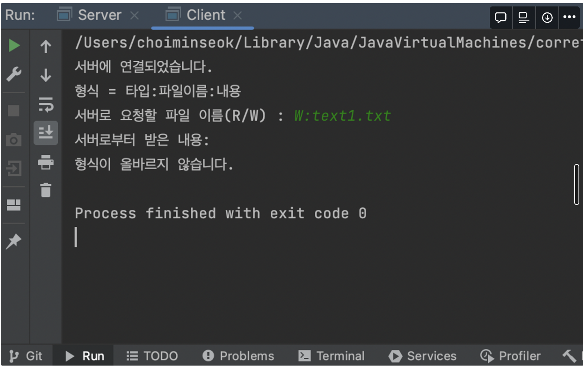

# 소켓 프로그래밍 과제#2-2 : 파일 읽기/쓰기

## 요구사항

클라이언트에서 서버에게 파일 이름을 보내면, 해당 파일을 읽고/쓰는 기본적인 기능 구현

## 코드

### 코드(클라이언트)

```java
import java.io.*;
import java.net.*;
import java.util.Scanner;

public class Client {
    public static void main(String[] args) throws IOException {
        int portNumber = 2023;
        String serverIP="127.0.0.1"; //localhost
        try{
            Socket socket = new Socket(serverIP, portNumber);
            System.out.println("서버에 연결되었습니다.");

            // 문자열로 받기 위해 BufferedReader
            BufferedReader in = new BufferedReader(new InputStreamReader(socket.getInputStream()));
            // 문자열 보내기 위해 PrintWriter
            PrintWriter out = new PrintWriter(socket.getOutputStream(), true);
            Scanner input = new Scanner(System.in);
            System.out.println("형식 = 타입:파일이름:내용");
            System.out.print("서버로 요청할 파일 이름(R/W) : ");
            String fileName = input.nextLine();
            out.println(fileName);

            String fileContent = null;
            System.out.println("서버로부터 받은 내용: ");
						// 받는 내용이 null일때까지 계속 받음
            while((fileContent = in.readLine()) != null){
                System.out.println(fileContent);
            }

            socket.close();
        }catch (IOException e) {
            System.out.println("연결 실패");
            e.printStackTrace();
        }
    }
}
```

- 클라이언트에서 지원하는 형식은 두가지이다.
   - R:파일이름
   - W:파일이름:추가할내용

### 코드(서버)

```java
import java.io.*;
import java.net.*;

public class Server {
    public static void main(String[] args) throws IOException {
        ServerSocket serverSocket = new ServerSocket(2023);
        System.out.println("서버가 시작되었습니다.");

        Socket clientSocket = serverSocket.accept();
        System.out.println("클라이언트와 연결되었습니다.");
        // 문자열로 받기 위해 BufferedReader
        BufferedReader in = new BufferedReader(new InputStreamReader(clientSocket.getInputStream()));
        // 문자열 보내기 위해 PrintWriter
        PrintWriter out = new PrintWriter(clientSocket.getOutputStream(), true);

        String input = in.readLine();
				// ":" 기준으로 파싱
        String[] elements = input.split(":");
        String type = elements[0];

        System.out.println("클라이언트로부터 받은 내용: " + input);

        // ----------READ일때----------
        if(type.equals("R") && elements.length == 2){
            String fileName = elements[1];
            try {
                File file = new File("./files/" + fileName);
                BufferedReader br = new BufferedReader(new FileReader(file));

                StringBuilder fileContent = new StringBuilder();

                String line;
								// 모든 line 보내기
                while ((line = br.readLine()) != null) {
                    fileContent.append(line);
                    if(br.ready()) {
                        fileContent.append(System.lineSeparator());
                    }
                }

                out.println(fileContent);
                System.out.println("클라이언트로 보낸 파일 내용: " + fileContent);
            } catch (FileNotFoundException e) {
                System.err.println("파일을 찾을 수 없습니다.");
                out.println("해당 파일을 찾을 수 없습니다.");
            } catch (IOException e) {
                System.err.println("파일을 읽을 수 없습니다.");
                out.println("해당 파일을 읽을 수 없습니다.");
            }
        }
        // ----------WRITE일때----------

        else if(type.equals("W") && elements.length == 3){
            String fileName = elements[1];
            String append = elements[2];
            try {
                File file = new File("./files/" + fileName);
                BufferedWriter writer = new BufferedWriter(new FileWriter(file,true));
								// 줄바꿈 추가한 뒤 추가
                writer.append("\n");
                writer.append(append);

                writer.close(); // 파일 쓰기 종료

                out.println("문자열이 파일에 추가되었습니다.");

                BufferedReader br = new BufferedReader(new FileReader(file));
                StringBuilder fileContent = new StringBuilder();
                String line;
                while ((line = br.readLine()) != null) {
                    fileContent.append(line);
                    fileContent.append(System.lineSeparator()); // 각 줄 끝에 줄바꿈 문자 추가
                }

                out.println(fileContent); // StringBuilder 객체를 문자열로 변환하여 출력
                System.out.println("클라이언트로 보낸 파일 내용: " + fileContent);

            } catch (FileNotFoundException e) {
                System.err.println("파일을 찾을 수 없습니다.");
                out.println("해당 파일을 찾을 수 없습니다.");
            } catch (IOException e) {
                System.err.println("파일을 읽을 수 없습니다.");
                out.println("해당 파일을 읽을 수 없습니다.");
            }
        }
        // ----------W,R 모두 아닐 때----------
        else{
            out.println("형식이 올바르지 않습니다.");
        }
        clientSocket.close();
        serverSocket.close();
    }
}
```

- 클라이언트로부터 받은 문자열을 “:”기준으로 파싱하여 읽기타입인지, 쓰기타입인지를 첫번째 인자로부터 알아내고, 파일 이름을 두번째 인자로부터 알아내며, (만약 쓰기라면) 세번째 인자를 통해 쓸 내용을 알아낸다.

### 텍스트 파일



## 실행 결과

- **클라이언트 읽기(R)**

  

- **클라이언트 쓰기(W)**

  

- **파일 내용**

  

- **예외처리**

  

  

  
```toc
```
