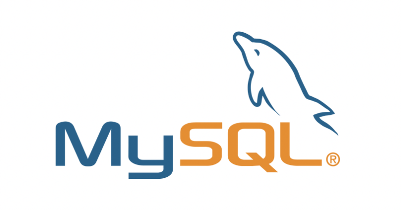
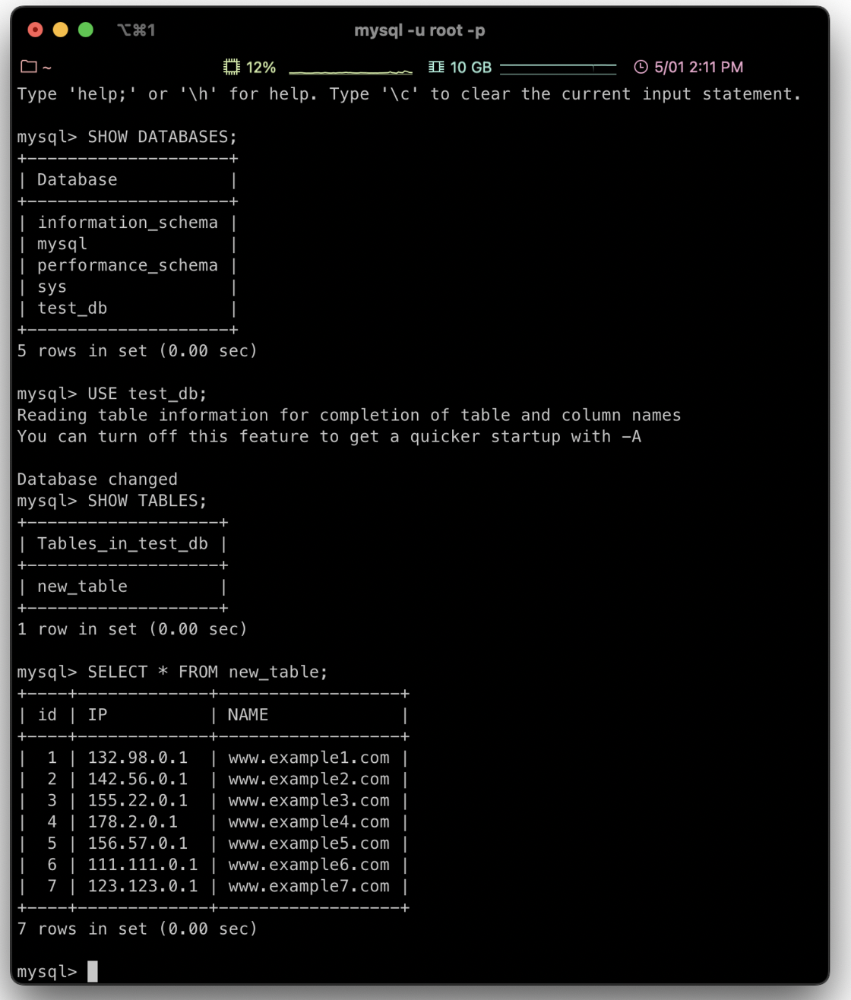
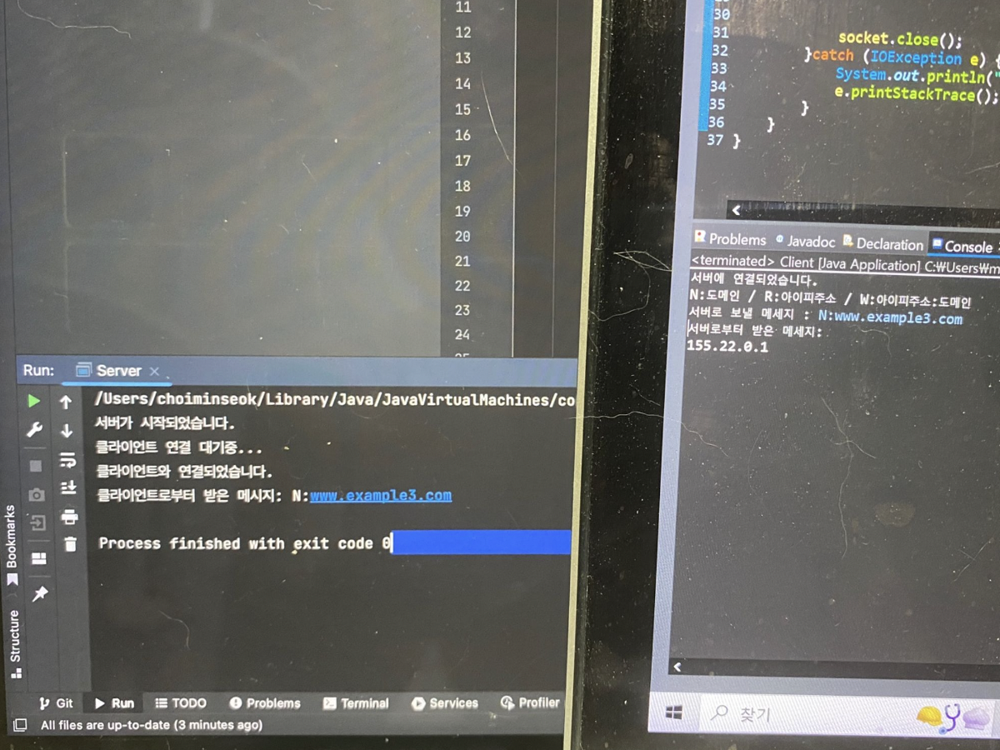
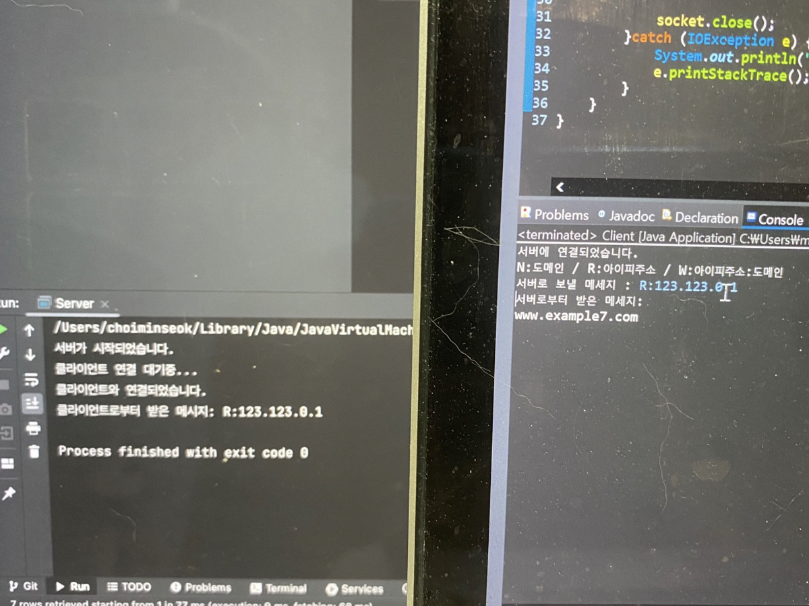
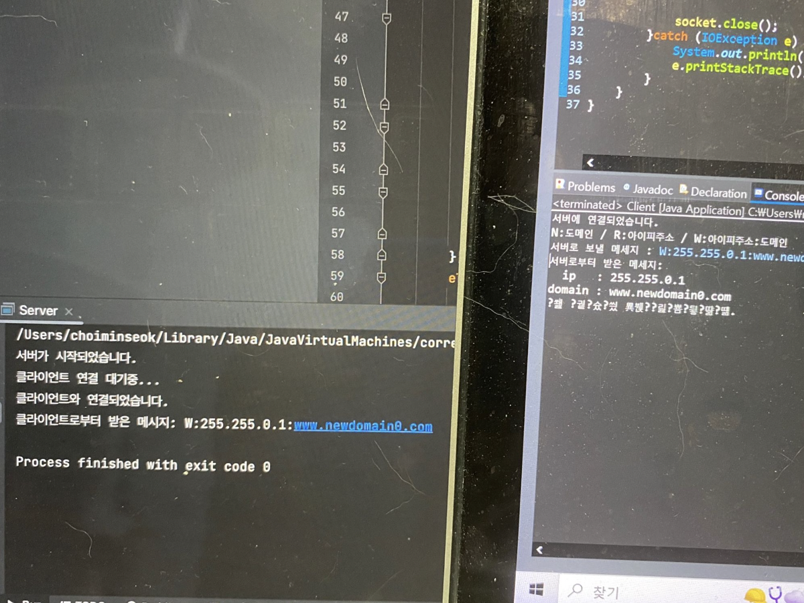
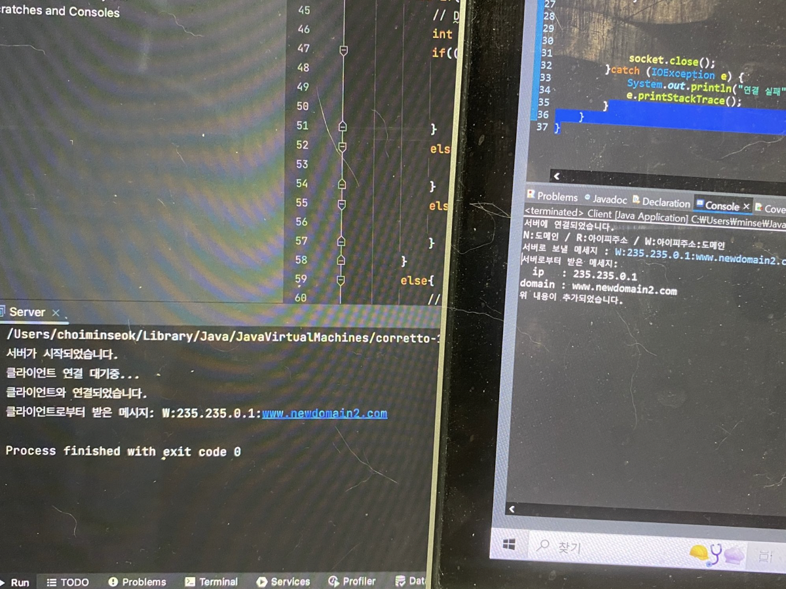
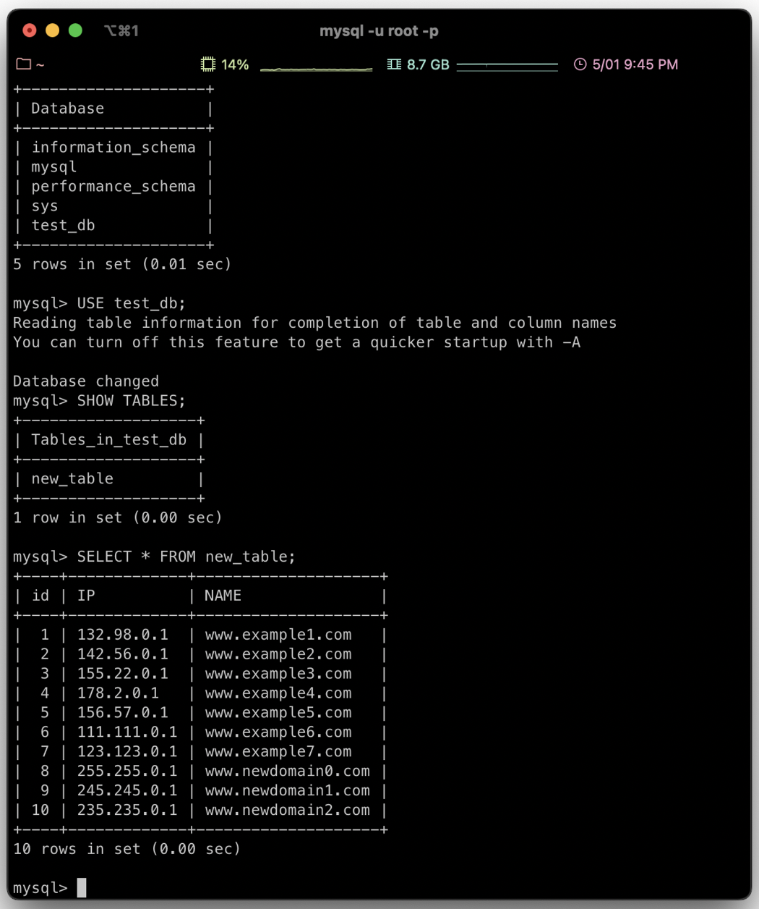

# 소켓 프로그래밍 과제#2-3 : DBMS활용 DNS구현

## 요구사항

클라이언트에서 서버에게 IP or Domain Name을 보내면 서버는 Domain Name or IP를 클라이언트에게 반환, 구분 코드는 N,R,W이고, W는 INSERT쿼리 실행하여 새로운 Domain Name, IP할당

## DBMS



- MySQL사용
- JAVA에서 구현할 것이기 때문에 JDBC드라이버 필요.

## 코드

### 코드(클라이언트)

```java
import java.io.*;
import java.net.*;
import java.util.Scanner;

public class Client {
    public static void main(String[] args) {
        int portNumber = 2023;
        String serverIP="127.0.0.1"; //localhost
        try{
            Socket socket = new Socket(serverIP, portNumber);
            System.out.println("서버에 연결되었습니다.");

            //문자열로 받기 위해 BufferedReader
            BufferedReader in = new BufferedReader(new InputStreamReader(socket.getInputStream()));
            //문자열 보내기 위해 PrintWriter
            PrintWriter out = new PrintWriter(socket.getOutputStream(), true);
            Scanner input = new Scanner(System.in);
            System.out.println("N:도메인 / R:아이피주소 / W:아이피주소:도메인");
            System.out.print("서버로 보낼 메세지 : ");
            String message = input.next();
            out.println(message);
            System.out.println("서버로부터 받은 메세지: ");
            while((message = in.readLine()) != null){
                String response = message;
                System.out.println(response);
            }

            socket.close();
        }catch (IOException e) {
            System.out.println("연결 실패");
            e.printStackTrace();
        }
    }
}
```

### 코드(서버)

```java
import java.io.*;
import java.net.*;
import java.sql.*;

public class Server {
    public static void main(String[] args) throws IOException, SQLException {
        // 서버 소켓 생성 및 포트 번호 지정
        ServerSocket serverSocket = new ServerSocket();
        serverSocket.setReuseAddress(true);
        serverSocket.bind(new InetSocketAddress("localhost", 2023));
        System.out.println("서버가 시작되었습니다.");

        // 클라이언트 연결 대기
        serverSocket.setSoTimeout(10000);
        System.out.println("클라이언트 연결 대기중...");
        Socket clientSocket = serverSocket.accept();
        System.out.println("클라이언트와 연결되었습니다.");

        // 문자열로 받기 위해 BufferedReader
        BufferedReader in = new BufferedReader(new InputStreamReader(clientSocket.getInputStream()));
        // 문자열 보내기 위해 PrintWriter
        PrintWriter out = new PrintWriter(clientSocket.getOutputStream(), true);

        // 클라이언트로부터 메시지 받기
        String message = in.readLine();
        System.out.println("클라이언트로부터 받은 메시지: " + message);

        //메세지 파싱
        String[] token = message.split(":");
        if(token.length == 2){
            if(token[0].equals("N")){
                // 도메인을 ip주소로
                out.println(domain2Ip(token[1]));
            }
            else if(token[0].equals("R")){
                // ip주소를 도메인으로
                out.println(ip2Domain(token[1]));
            }
            else{
                // 입력 오류
                out.println("형식 오류");
            }
        }
        else if(token.length == 3 && token[0].equals("W")){
            // DB미보유시 추가
            int result = 0;
            if((result = ipDomainAdd(token[1], token[2]))==0){
                out.println("  ip   : " + token[1]);
                out.println("domain : " + token[2]);
                out.println("위 내용이 추가되었습니다.");
            }
            else if(result == 1){
                out.println("해당 ip가 이미 DB에 존재합니다.");
            }
            else if(result == 2){
                out.println("해당 domain이 이미 DB에 존재합니다.");
            }
        }
        else{
            // 입력 오류
            out.println("형식 오류");
        }

        // 소켓 및 서버 소켓 닫기
        clientSocket.close();
        serverSocket.close();
    }
    public static String domain2Ip(String domain) throws SQLException {
        String url = "jdbc:mysql://localhost:3306/test_db";
        String userName = "test_user";
        String password = "password";
        String result = null;

        Connection connection = DriverManager.getConnection(url, userName, password);
        Statement statement = connection.createStatement();
        ResultSet resultSet = statement.executeQuery("select NAME, IP from new_table");

        while(resultSet.next() == true){
            if(resultSet.getString("NAME").equals(domain)){
                result = resultSet.getString("IP");
                break;
            }
        }

        resultSet.close();
        statement.close();
        connection.close();

        return result;
    }

    public static String ip2Domain(String ip) throws SQLException {
        String url = "jdbc:mysql://localhost:3306/test_db";
        String userName = "test_user";
        String password = "password";
        String result = null;

        Connection connection = DriverManager.getConnection(url, userName, password);
        Statement statement = connection.createStatement();
        ResultSet resultSet = statement.executeQuery("select NAME, IP from new_table");

        while(resultSet.next() == true){
            if(resultSet.getString("IP").equals(ip)){
                result = resultSet.getString("NAME");
                break;
            }
        }

        resultSet.close();
        statement.close();
        connection.close();

        return result;
    }

    public static int ipDomainAdd(String ip, String domain) throws  SQLException {
        String url = "jdbc:mysql://localhost:3306/test_db";
        String userName = "test_user";
        String password = "password";
        int code = 0; // no error

        Connection connection = DriverManager.getConnection(url, userName, password);
        Statement statement = connection.createStatement();
        ResultSet resultSet = statement.executeQuery("select NAME, IP from new_table");

        //중복 db 검사
        while(resultSet.next() == true){
            if(resultSet.getString("IP").equals(ip)){
                code = 1; // ip error
                break;
            }
            else if (resultSet.getString("NAME").equals(domain)) {
                code = 2; // domain error
                break;
            }
        }
        // DB없으면 추가
        if (code == 0) {
            statement.executeUpdate("INSERT INTO new_table (IP, NAME) VALUES ('" + ip + "', '" + domain + "')");
        }

        resultSet.close();
        statement.close();
        connection.close();
        return code;
    }

}
```

- IP주소는 개인 테스트를 위해 localhost(127.0.0.1)로 하였음
- 클라이언트로부터 받은 메세지를 파싱( : 를 기준으로)하여 N,R,W중 어떤 명령을 실행할지 판단

### DB



기본키는 id

IP, NAME은 유니크 키로 설정하였음

## 실제 다른 두 컴퓨터로 연결해보기


> 💡 서버 컴퓨터는 공유기 와이파이에 연결하였고, 클라이언트 컴퓨터는 핸드폰 핫스팟으로 연결하였습니다.


- Domain Name → IP 전환 기능

  

- IP → Domain Name 전환 기능

  

- 새로운 IP&Domain Name 추가 기능(인코딩이 깨져 여러번 했습니다.)

  

  

- W(DB추가) 후 DB결과

  

파일 : <a href="https://github.com/minseoky/2023_socket_programming" target="_blank"><span style="color:slateblue">깃허브 링크</span></a>

```toc
```
