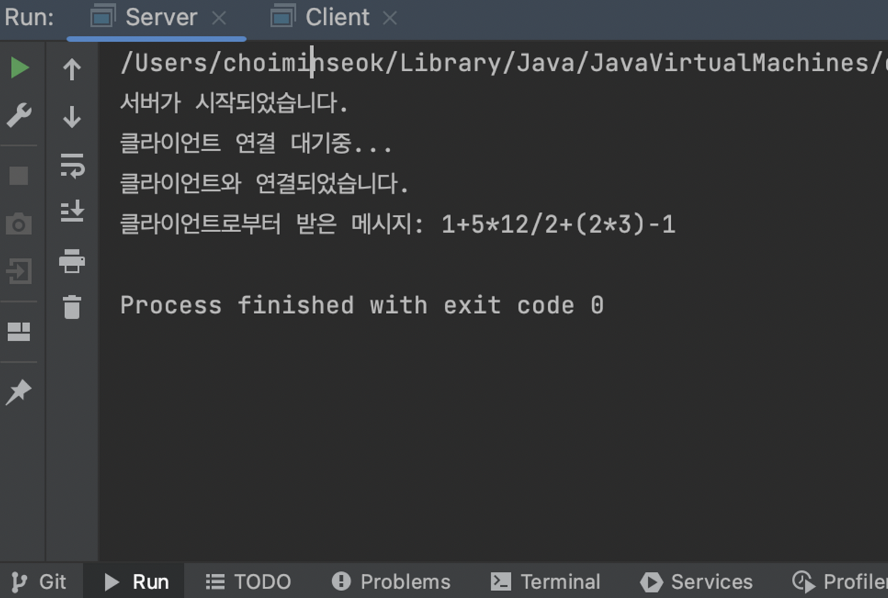
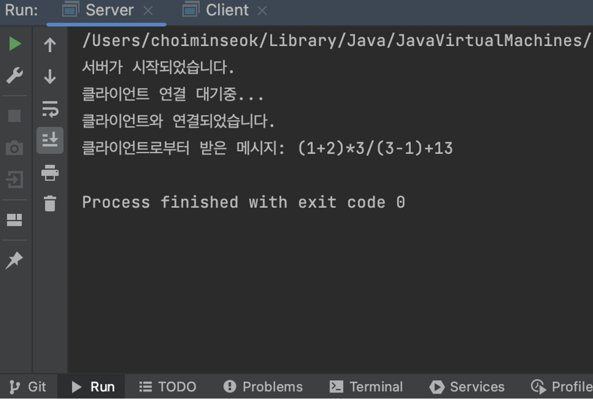
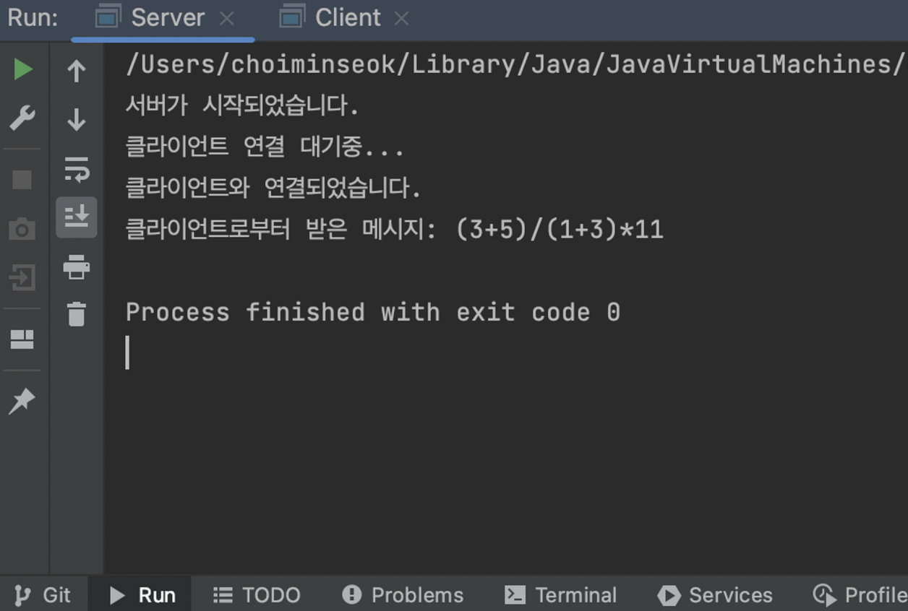
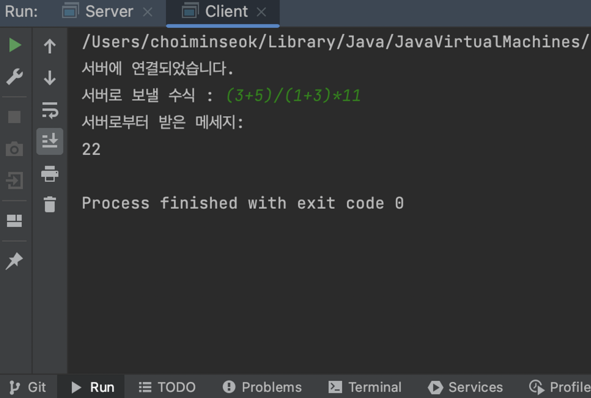

# 소켓 프로그래밍 과제#2-4 : 계산기 구현

## 요구사항

클라이언트에서 서버에게 수식을 보내면 서버는 해당 수식의 해를 클라이언트에게 전송

## 코드

### 코드(클라이언트)

```java
import java.io.*;
import java.net.*;
import java.util.Scanner;

public class Client {
    public static void main(String[] args) {
        int portNumber = 2023;
        String serverIP="127.0.0.1"; //localhost
        try{
            Socket socket = new Socket(serverIP, portNumber);
            System.out.println("서버에 연결되었습니다.");

            //문자열로 받기 위해 BufferedReader
            BufferedReader in = new BufferedReader(new InputStreamReader(socket.getInputStream()));
            //문자열 보내기 위해 PrintWriter
            PrintWriter out = new PrintWriter(socket.getOutputStream(), true);
            Scanner input = new Scanner(System.in);
            System.out.print("서버로 보낼 수식 : ");
            String message = input.next();
            out.println(message);
            System.out.println("서버로부터 받은 메세지: ");
            while((message = in.readLine()) != null){
                String response = message;
                System.out.println(response);
            }

            socket.close();
        }catch (IOException e) {
            System.out.println("연결 실패");
            e.printStackTrace();
        }
    }
}
```

### 코드(서버)

```java
import java.io.*;
import java.net.*;
import java.util.Stack;

public class Server {
    public static void main(String[] args) throws IOException {
        // 서버 소켓 생성 및 포트 번호 지정
        ServerSocket serverSocket = new ServerSocket();
        serverSocket.setReuseAddress(true);
        serverSocket.bind(new InetSocketAddress("localhost", 2023));
        System.out.println("서버가 시작되었습니다.");

        // 클라이언트 연결 대기
        serverSocket.setSoTimeout(10000);
        System.out.println("클라이언트 연결 대기중...");
        Socket clientSocket = serverSocket.accept();
        System.out.println("클라이언트와 연결되었습니다.");

        // 문자열로 받기 위해 BufferedReader
        BufferedReader in = new BufferedReader(new InputStreamReader(clientSocket.getInputStream()));
        // 문자열 보내기 위해 PrintWriter
        PrintWriter out = new PrintWriter(clientSocket.getOutputStream(), true);

        // 클라이언트로부터 메시지 받기
        String message = in.readLine();
        System.out.println("클라이언트로부터 받은 메시지: " + message);

        // 수식 계산
        String answer = calculate(message);
        out.println(answer);

        // 소켓 및 서버 소켓 닫기
        clientSocket.close();
        serverSocket.close();
    }
    public static String calculate(String equation) {
        Stack<Integer> numbers = new Stack<Integer>();
        Stack<Character> operators = new Stack<Character>();

        for (int i = 0; i < equation.length(); i++) {
            char ch = equation.charAt(i);
						// 십의 자리 이상의 피연산자가 오면 모든 자리를 포함하여 push(ex 12+13)이면 1따로 2따로가 아닌 12로 push
            if (Character.isDigit(ch)) {
                int num = 0;

                while (i < equation.length() && Character.isDigit(equation.charAt(i))) {
                    num = num * 10 + (equation.charAt(i) - '0');
                    i++;
                }

                i--;

                numbers.push(num);
						// 괄호 처리
            } else if (ch == '(') {
                operators.push(ch);
            } else if (ch == ')') {
                while (operators.peek() != '(') {
                    numbers.push(applyOp(operators.pop(), numbers.pop(), numbers.pop()));
                }

                operators.pop();
            } else if (ch == '+' || ch == '-' || ch == '*' || ch == '/') {
                while (!operators.empty() && hasPrecedence(ch, operators.peek())) {
                    numbers.push(applyOp(operators.pop(), numbers.pop(), numbers.pop()));
                }

                operators.push(ch);
            }
        }

        while (!operators.empty()) {
            numbers.push(applyOp(operators.pop(), numbers.pop(), numbers.pop()));
        }

        return numbers.pop().toString();
    }
		// 우선순위 판단
    public static boolean hasPrecedence(char op1, char op2) {
        if (op2 == '(' || op2 == ')') {
            return false;
        }

        if ((op1 == '*' || op1 == '/') && (op2 == '+' || op2 == '-')) {
            return false;
        }

        return true;
    }

    public static int applyOp(char op, int b, int a) {
        switch (op) {
            case '+':
                return a + b;
            case '-':
                return a - b;
            case '*':
                return a * b;
            case '/':
                if (b == 0) {
                    throw new UnsupportedOperationException("Cannot divide by zero");
                }

                return a / b;
        }

        return 0;
    }

}
```

- 계산 과정은 후위표기법으로 구현하였음.
- 각 연산자의 우선순위를 고려하여 연산자스택, 피연산자스택에서 push or pop

## 실행 결과

1. 1+5*12/2+(2*3)-1
- 서버



- 클라이언트


1. (1+2)*3/(3-1)+13
- 서버



- 클라이언트


1. (3+5)/(1+3)*11
- 서버



- 클라이언트



파일 : <a href="https://github.com/minseoky/2023_socket_programming" target="_blank"><span style="color:slateblue">깃허브 링크</span></a>

```toc
```
