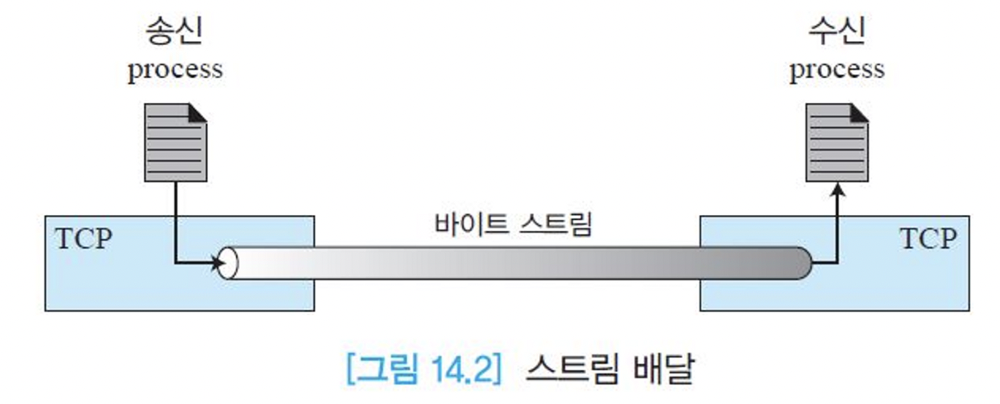

## TCP 서비스


- 연결형(Connection-Oriented): TCP는 IP 계층 위에 가상의 회선을 설정하여 실제 연결을 수립하는 방식으로 동작합니다.
- 신뢰성(Reliability): TCP는 확인 메커니즘을 통해 데이터의 신뢰성 있는 전송을 제공합니다. 데이터의 손실이나 손상을 감지하고, 재전송을 통해 신뢰성 있는 통신을 보장합니다.
- 흐름제어(Flow Control): TCP는 상대방이 처리할 수 있는 범위 내에서 데이터를 전송하도록 흐름을 제어합니다. 수신측의 버퍼 상태를 고려하여 데이터의 전송 속도를 조절합니다.
- 혼잡제어(Congestion Control): TCP는 네트워크의 혼잡 현상을 방지하거나 제어하는 기능을 갖추고 있습니다. 네트워크 상황을 모니터링하고 데이터의 전송 속도를 조절하여 네트워크 혼잡을 예방합니다.
- 스트림 통신: TCP는 데이터를 바이트 단위로 나누어 전송합니다. 이는 데이터를 연속된 스트림으로 처리하며, 수신측에서는 이를 다시 조립하여 원본 데이터로 복원합니다.

## 스트림 딜리버리 서비스

데이터를 바이트 스트림 형태로 송수신합니다.

두 개의 프로세스는 가상의 채널을 통해 연결됩니다. 송신 프로세스는 데이터를 바이트 스트림으로 생성하여 쓰고, 수신 프로세스는 바이트 스트림을 읽어 데이터를 소비합니다.

이를 통해 TCP는 연속된 스트림으로 데이터를 전달하며, 송신 프로세스와 수신 프로세스 간에 신뢰성 있는 데이터 송수신을 제공합니다.




- 전이중 통신: TCP는 양방향으로 동시에 데이터를 전송하고, 수신한 데이터에 대한 확인응답을 함께 보내는 피기배킹(piggybacking) 기법을 사용합니다.
- 다중화와 역다중화: TCP에서는 송신측에서 다중화 작업을 수행하여 여러 개의 데이터를 하나의 TCP 세그먼트로 묶어 전송하고, 수신측에서는 역다중화 작업을 수행하여 세그먼트를 추출하여 각각의 데이터로 분리합니다.
- 연결형 서비스: TCP는 연결형 프로토콜로 동작합니다. 실제로 물리적인 연결을 설정하는 것이 아니라 가상의 연결을 수립하여 데이터를 교환하며, 연결 설정, 데이터 교환, 연결 해제의 단계를 순서대로 진행합니다.
- 신뢰성 서비스: TCP는 확인응답 메커니즘을 사용하여 데이터의 신뢰성을 제공합니다. 수신측은 데이터를 받았을 때 확인응답을 보내고, 송신측은 확인응답을 받지 못한 경우 데이터를 재전송함으로써 신뢰성 있는 통신을 보장합니다.

## **Go-Back-N (GBN)**

Go-Back-N (GBN)은 데이터 전송에서 사용되는 오류 복구 기법 중 하나입니다. GBN은 송신자와 수신자 간에 연결이 설정된 상태에서 사용됩니다.

### **동작 원리**

1. 송신자는 일련의 프레임을 일정한 윈도우 크기로 분할하여 전송합니다.
2. 수신자는 프레임을 순차적으로 수신하고 확인응답(ACK)을 보냅니다.
3. 송신자는 일정 시간 동안 ACK를 기다립니다. ACK를 수신하지 못하면 윈도우 내 모든 프레임을 재전송합니다.
4. 수신자는 순차적으로 프레임을 처리하지만, 중복된 프레임이 도착하면 이전에 받은 프레임을 버리고 새로 도착한 프레임을 처리합니다.

### **특징**

- 송신자가 일련의 프레임을 전송하고, 수신자는 순차적으로 처리합니다.
- 수신자는 ACK를 사용하여 송신자에게 프레임의 정상 수신을 확인합니다.
- 송신자는 ACK를 기다리는 동안 윈도우 내의 모든 프레임을 재전송합니다.
- 수신자는 중복된 프레임을 제거하고 순차적으로 처리합니다.

## **Selective Repeat**

Selective Repeat는 데이터 전송에서 사용되는 오류 복구 기법 중 하나로, 송신자와 수신자 간에 연결이 설정된 상태에서 사용됩니다.

### **동작 원리**

1. 송신자는 일련의 프레임을 일정한 윈도우 크기로 분할하여 전송합니다.
2. 수신자는 프레임을 순차적으로 수신하고, 각 프레임에 대한 확인응답(ACK)을 개별적으로 보냅니다.
3. 송신자는 ACK를 기다리는 동안 다음 프레임을 전송할 수 있습니다.
4. 수신자는 손상된 프레임을 재전송 요청(NAK)을 통해 알려줄 수 있습니다.
5. 송신자는 NAK를 수신하면 해당 프레임만 재전송하고, 나머지 프레임은 전송하지 않습니다.

### **특징**

- 송신자가 일련의 프레임을 전송하고, 수신자는 개별적으로 확인응답(ACK)을 보냅니다.
- 송신자는 ACK를 기다리는 동안 다음 프레임을 전송할 수 있습니다.
- 수신자는 손상된 프레임을 NAK를 통해 알려줄 수 있습니다. 송신자는 NAK를 수신하면 해당 프레임만 재전송하고, 나머지 프레임은 전송하지 않습니다. 이는 선택적으로 프레임을 재전송하는 것을 의미합니다.

Selective Repeat의 특징은 Go-Back-N과 달리 송신자가 ACK를 기다리는 동안 다음 프레임을 전송할 수 있다는 점입니다. 따라서 송신자와 수신자 간의 효율적인 데이터 전송을 가능하게 합니다. 또한, 수신자는 손상된 프레임을 NAK를 통해 개별적으로 알려줄 수 있어, 손상된 프레임만 재전송하여 불필요한 재전송을 최소화할 수 있습니다.

이러한 특징을 통해 Selective Repeat는 손상이나 손실이 발생한 프레임을 효율적으로 복구하면서도 전체적인 데이터 전송의 성능을 향상시킬 수 있는 방식입니다.

```toc
```
