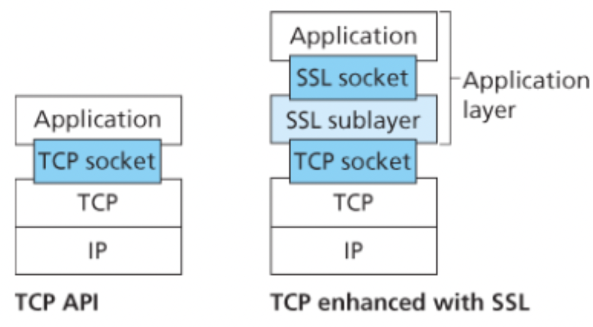
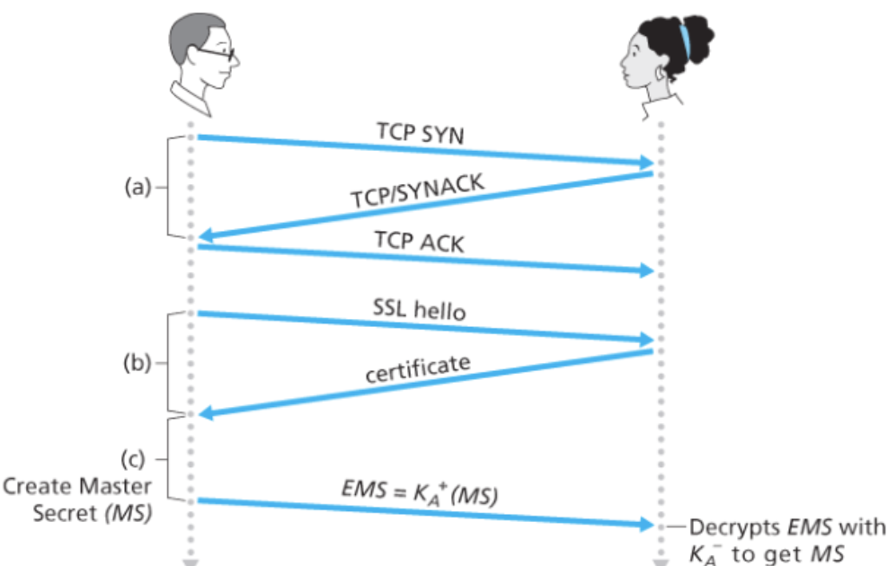
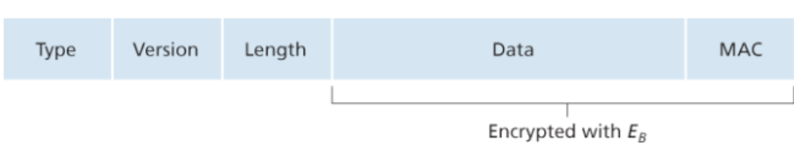

# TCP 연결의 보안: TLS

보안 서비스가 추가되어 향상된 TCP 버전을 흔히 `TLS(Transport Layer Security)` 라고 부른다.

TLS는 기밀성, 데이터 무결성, 서버인증과 클라이언트 인증을 통해 TCP를 향상하여 보안 서비스를 제공한다.

TLS는 TCP를 보호하기 때문에 TCP 상에서 일어나는 어떠한 애플리케이션에든 사용될 수 있다.

<br/>



TLS는 소켓을 사용하는 간단한 API를 제공하는데, TCP의 API와 유사하다.

TLS는 애플리케이션 계층에 존재하나 개발자의 관점에서는 보안 서비스로 강화된 TCP 서비스를 제공하는 트랜스포트 프로토콜이다.

<br/>

## TLS 개요: almost TLS

TLS를 이해하기 위해 TLS의 단순화된 버전인 `almost-TLS`를 먼저 설명한다.

`almost-TLS` 는 핸드셰이크, 키 유도, 데이터 전송이라는 세 단계로 되어 있다.

<br/>

### 핸드셰이크




1. 클라이언트는 서버와 TCP 연결을 설립한다.
2. 서버가 진짜 서버인지 확인한다.
   - 클라이언트는 hello 메시지를 보내고, 서버는 CA로부터 인증된 인증서를 보내어 클라이언트는 인증서 내의 공개키가 서버의 것이라는 것을 믿을 수 있다.
3. TLS 세션에 필요한 모든 대칭키를 생성하기 위해 서버와 클라이언트가 사용할 주 비밀키(Master Secret, MS)를 생성하여 전송한다.
   - MS를 보낼 때, 서버의 공개키로 암호화하여 EMS(Encrypted Master Secret)를 만든다.
   - 서버는 자신의 개인키로 EMS를 복호화 하여 MS를 얻는다.
   - 즉, 둘은 둘만 아는 MS를 알게 된다.

<br/>

### 키 유도

공유한 MS는 모든 암호화와 데이터 무결성 검사를 위한 대칭 세션키로 사용될 수 있으나 일반적으로 각각 다른 암호화 키를 사용하는 것이 좀 더 안전하다.

따라서 MS를 이용하여 4개의 키를 만든다.

- E(b) = 클라이언트가 서버에 보내는 데이터에 대한 세션 암호화 키
- M(b) = 클라이언트가 서버에 보내는 데이터에 대한 세션 HMAC(메시지 인증 코드) 키
- E(a) = 서버가 클라이언트에 보내는 데이터에 대한 세션 암호화 키
- M(a) = 서버가 클라이언트에 보내는 데이터에 대한 세션 HMAC(메시지 인증 코드) 키

이는 단순히 MS를 4개의 키를 쪼개어 이루어진다.

2개의 암호화 키는 데이터를 암호화하고, 2개의 HMAC 키는 데이터 무결성을 확인하는 데 사용된다.

<br/>

### 데이터 전송

TCP는 바이트 스트림 프로토콜이므로, TLS가 애플리케이션 데이터를 끊임없이 암호화하고 암호화된 데이터를 TCP에 쉴 새 없이 전달하는 것이 자연스럽다.

그렇다면 HMAC은 언제 해야할까?

분명한건 전체 세션 시간 동안 전송된 모든 데이터의 무결성을 확인하는 일이 TCP 세션이 종료될 때까지 미뤄둘 수 없다는 것이다.

TLS는 데이터 스트림을 레코드로 쪼개고 각 레코드에 무결성 검사를 위한 HMAC을 덧붙인 후 이 `레코드+HMAC`을 암호화한다.

HMAC을 생성하기 위해 클라이언트는 레코드 데이터와 키 M(b)를 해시 함수에 넣는다.

`레코드+HMAC` 꾸러미를 암호화 하기위해 E(b) 를 사용하여 TCP로 전송한다.

<br/>

그러나 만약 침입자가 TCP 세그먼트 스트림에서 스트림을 삽입, 삭제, 교환할 수 있다면 위 방법은 안전하지 않다.

예를들어, 침입자가 2개의 세그먼트 순서를 바꾼 후 TCP 세그먼트 번호까지 그에 맞게 변경하여 서버에 보낸다면 서버의 TLS는 문제 없이 이를 애플리케이션 계층에 넘겨준다.

<br/>

TLS는 순서번호를 이용해서 이 문제를 해결한다.

클라이언트는 순서 번호 카운터를 유지하며 TLS 레코드를 보낼 때마다 하나씩 증가시킨다.

HMAC을 계산할 때 `HMAC 키 M(b)`와 `레코드 데이터`와 `순서 번호`를 합친 결과의 해시로 사용한다.

서버는 클라이언트의 순서번호를 추적해서 자신의 HMAC 계산을 할 때 적절한 순서 번호를 포함시켜 레코드의 데이터 무결성을 확인한다.

<br/>

### TLS 레코드




첫 세 필드는 암호화되지 않는다.

타입 필드는 핸드셰이크 메시지인지 데이터를 담은 메시지인지 나타낸다.

<br/>

## TLS의 완전한 개념 : TLS

이제 완전한 버전의 TLS를 살펴보자.

### TLS 핸드셰이크

TLS는 서버와 클라이언트에게 특정 대칭키 알고리즘이나 공개키 알고리즘을 사용하도록 강제하지 않는다.

대신 핸드셰이크 과정에서 암호화 알고리즘을 합의하고, 서로에게 넌스를 보내 세션키를 생성한다.

**시나리오**

1. 클라이언트는 넌스와 함께 자신이 지원하는 암호화 알고리즘의 목록을 보낸다.
   - 넌스를 사용하는 이유는 만약 침입자가 모든 메시지를 엿들은 후 그대로 서버에게 보내게 된다면, 순서번호를 둔다고 하더라도 그것 또한 그대로 일치하므로 서버에서는 똑같은 메시지를 한번 더 들은 것으로 인지하기 때문이다.
   - 넌스를 포함하면 모든 메시지는 유일성을 가지게 되므로 보안에 안전해진다.
2. 목록으로부터 서버는 대칭키 알고리즘, 공개키 알고리즘, HMAC 키와 함께 HMAC 알고리즘을 선택한다.
3. 선택 결과와 인증서, 서버 넌스를 클라이언트에게 보낸다.
4. 클라이언트는 인증서를 확인하고 서버의 공개키를 알아낸 후 `PMS(Pre-Master-Secret)`을 생성한다. 이 PMS를 서버의 공개키로 암호화한 후 서버에게 보낸다.
5. 클라이언트와 서버는 같은 키 유도 함수를 사용하여 PMS와 넌스로부터 MS를 계산한다.
6. 이 MS는 2개의 암호화 키와 2개의 HMAC 키를 생성하기 위해 분할된다.
7. 이후 모든 메시지는 암호화되고 인증된다.
8. 클라이언트는 모든 핸드셰이크 메시지의 HMAC을 전송한다.
9. 서버는 모든 핸드셰이크 메시지의 HMAC을 전송한다.
   - 8, 9번 과정은 처음 암호화되지 않은 메시지에 대한 침입자의 수정을 대비해서 지금까지 주고 받은 메시지의 일치 불일치를 확인하는 것이다.

<br/>

### 연결 종료

단순히 바로 TCP FIN 세그먼트를 보내 종료시키면 문제를 발생시킬 수도 있다.

침입자가 임의로 TCP FIN 세그먼트를 보내 종료시키는 절단 공격 문제가 발생한다.

이를 해결하기 위해 레코드의 타입 필드에 그 레코드가 TLS 세션 종료를 수행할 것인지를 표시한다.


```toc
```
