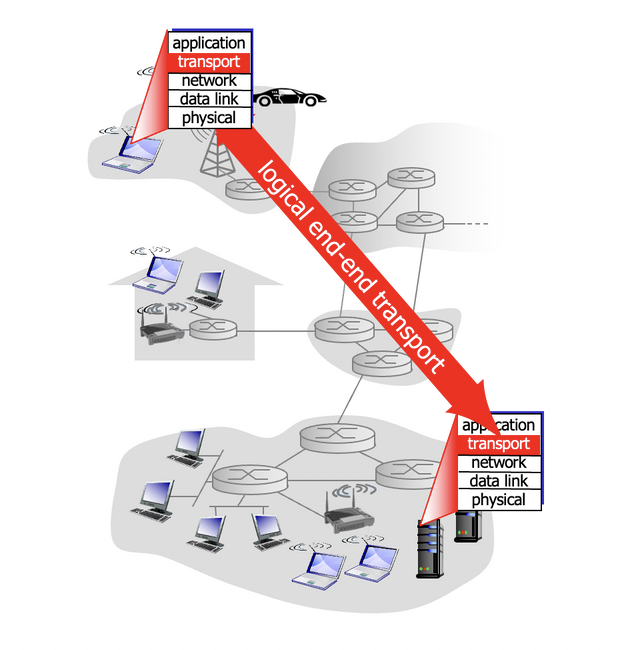
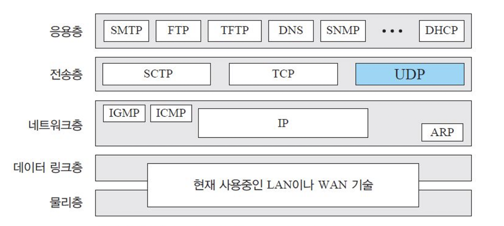
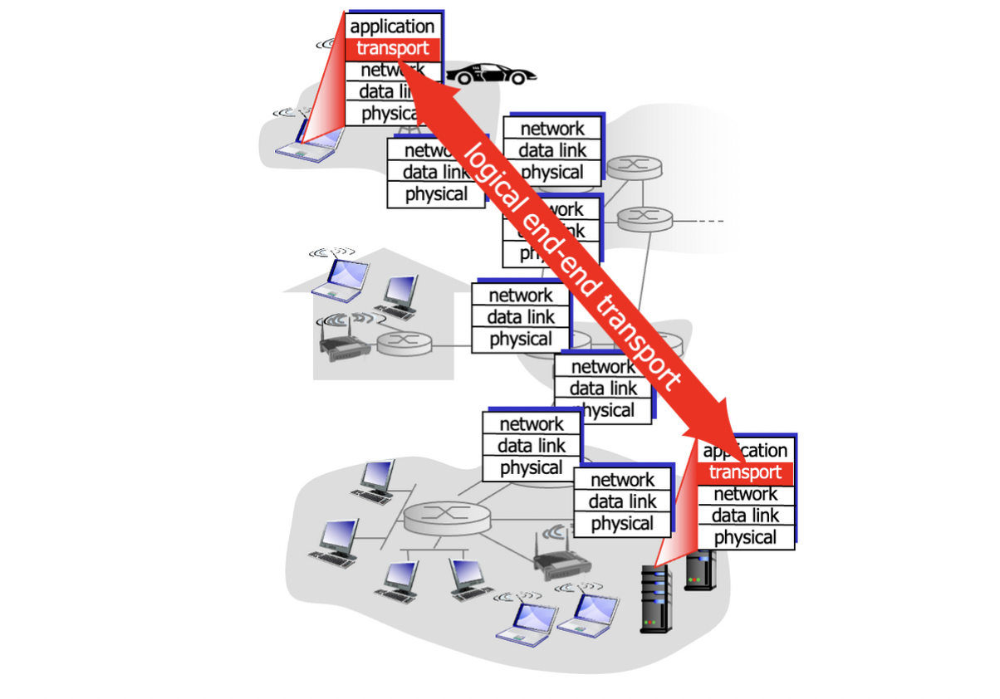

## **전송 서비스와 프로토콜**



- 전송 프로토콜은 서로 다른 호스트에서 실행되는 애플리케이션 프로세스 간의 논리적 통신을 제공합니다.
- 전송 프로토콜은 종단 시스템(end systems)에서만 실행됩니다.
- 송신 측에서는 전송 프로토콜이 애플리케이션 메시지를 세그먼트로 분할하고 네트워크 계층으로 전달합니다.
- 수신 측에서는 전송 프로토콜이 세그먼트를 메시지로 재조립하고 애플리케이션 계층으로 전달합니다.



- 인터넷에서는 TCP(Transmission Control Protocol)와 UDP(User Datagram Protocol)라는 두 가지 전송 프로토콜이 일반적으로 사용됩니다.

## **전송 계층 vs. 네트워크 계층 비유**

- 네트워크 계층은 호스트 간의 논리적 통신을 제공합니다.
- 전송 계층은 프로세스 간의 논리적 통신을 제공합니다.
- 전송 계층은 네트워크 계층을 의존하며 강화합니다.
- 프로그램, 프로세스, 스레드:
    - 가정의 비유: Ann의 집에 있는 12명의 아이들이 Bill의 집에 있는 12명의 아이들에게 편지를 보냅니다.
    - 호스트는 집과 같습니다.
    - 프로세스는 아이들과 같습니다.
    - 애플리케이션 메시지는 봉투 안의 편지와 같습니다.
    - 전송 프로토콜은 메시지를 집 안의 형제들에게 분배하는 Ann과 Bill과 같습니다.
    - 네트워크 계층 프로토콜은 우체부와 같습니다.
- 링크와 물리 계층(버스, 기차, 비행기 등의 운반 수단)은 데이터 전송의 하위 수준 작업을 담당합니다.



## 인터넷 전송계층 프로토콜
| 프로토콜 | 특징 | 기능 |
| --- | --- | --- |
| TCP | - 신뢰성 있는, 순서대로 전달 | - 혼잡 제어, 흐름제어, 연결 설정 |
| UDP | - 신뢰성 없는, 순서에 상관없이 전달 | - IP 기반의 최소한의 기능 제공 |

```toc
```
