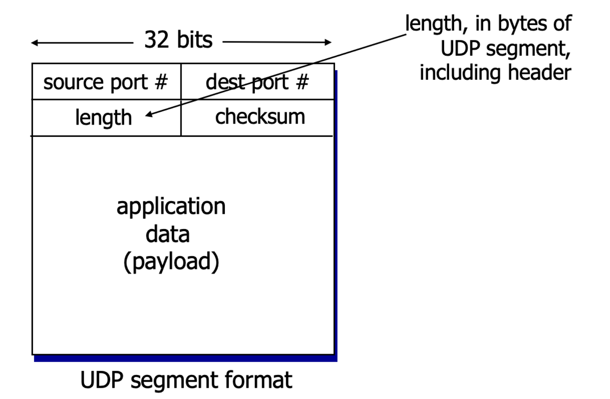
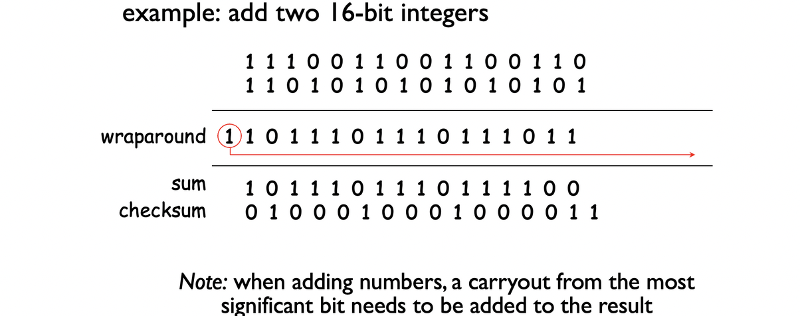

## UDP 목적

- 프로세스-대-프로세스 통신 생성 : 포트번호 이용
- 최소한의 오류 제어 메커니즘 수행
- 프로세스로부터 데이터 단위를 받아 신뢰성 없는 전달 제공
- 비 연결형, 신뢰성이 없는 전송 프로토콜
- 최소한의 오버헤드만 사용하는 간단한 프로토콜

## **UDP (User Datagram Protocol)**

- UDP는 "no frills" 또는 "bare bones" 인터넷 전송 프로토콜입니다.
- UDP는 "best effort" 서비스를 제공하며, UDP 세그먼트는 다음과 같은 특징을 가질 수 있습니다:
  - 손실될 수 있음
  - 순서가 바뀌어 애플리케이션으로 전달될 수 있음
- 연결이 없는 프로토콜로, UDP 송신자와 수신자 간에는 핸드셰이킹이 없습니다.
- 각 UDP 세그먼트는 다른 세그먼트와 독립적으로 처리됩니다.
- UDP는 다음과 같은 용도로 사용됩니다:
  - 스트리밍 멀티미디어 애플리케이션 (손실에 대해 관대하고 전송률에 민감)
  - DNS (Domain Name System)
  - SNMP (Simple Network Management Protocol)
- UDP를 통한 신뢰성 있는 전송:
  - 응용 프로그램 계층에서 신뢰성을 추가할 수 있습니다.
  - 응용 프로그램별로 오류 복구를 수행합니다.
  - 필요한 경우 응용 프로그램에서 직접 처리합니다.

## **UDP (User Datagram Protocol) 특징**

- **비연결형(Connectionless):** UDP는 데이터를 전송하기 전에 연결을 설정하지 않습니다. TCP와 달리 연결 설정 과정이 없이 데이터를 주고받습니다.
- **비상태정보(Non-state):** UDP는 상태 정보를 유지하지 않습니다. TCP에서는 각 연결에 대한 상태 정보를 유지하지만, UDP에서는 이러한 상태 정보를 가지지 않습니다.
- **비정규적인 송신률(Unregulated Send Rate):** UDP는 송신률에 대해 규제가 없습니다. 일부 패킷 손실이 발생하더라도 지속적인 최소 전송률을 요구하는 실시간 영상 서비스 등에 적합합니다.
- **최선형 서비스(Best Effort service):** UDP는 최선형 서비스를 제공합니다. 수신 확인 및 재전송 기능이 없으며, 데이터 손실이 발생할 수 있습니다.

## UDP : 세그먼트 헤더



**UDP 사용 이유**

1. **연결 설정이 없음:** TCP와 달리 연결 설정 과정이 없으므로, UDP는 지연을 추가하지 않고 데이터를 즉시 전송할 수 있습니다.
2. **간단함:** UDP는 간결하게 설계되었습니다. 송신자와 수신자 간에 연결 상태를 유지할 필요가 없습니다. 이러한 간결성은 UDP를 가볍고 효율적인 프로토콜로 만듭니다.
3. **작은 헤더 크기:** UDP는 8바이트의 작은 헤더 크기를 가지고 있습니다. 이 작은 오버헤드는 각 세그먼트에 추가적인 데이터를 거의 더하지 않아도 되는 장점이 있습니다.
4. **혼잡 제어가 없음:** 혼잡 제어 기능이 내장되어 있지 않은 TCP와 달리, UDP는 혼잡 제어 기능이 없습니다. 따라서 UDP는 원하는 속도로 데이터를 빠르게 전송할 수 있습니다. UDP는 응용 프로그램이 원하는 속도로 데이터를 전송할 수 있어 특정 용도에 유용합니다.

## **UDP Checksum**

**목표:** 전송된 세그먼트에서 "에러" (예: 비트 전환) 감지하기

**송신자:**

- 세그먼트 내용을 16비트 정수의 연속으로 취급하여 처리한다. 이는 헤더 필드를 포함한다.
- 체크섬: 세그먼트 내용의 합산 (원의 보수 합)
- 송신자는 체크섬 값을 UDP 체크섬 필드에 넣는다.

**수신자:**

- 수신된 세그먼트의 체크섬을 계산한다.
- 계산된 체크섬이 체크섬 필드의 값과 일치하는지 확인:
  - 일치하지 않으면 에러가 감지된다.
  - 일치하면 에러가 감지되지 않았다. 하지만 여전히 에러가 있을 수 있는가?



UDP 체크섬은 전송 중 발생하는 오류를 감지하기 위해 사용됩니다. 송신자는 세그먼트의 내용을 합산하여 체크섬을 계산하고, 이 값을 체크섬 필드에 저장합니다. 수신자는 수신된 세그먼트의 체크섬을 다시 계산하여 저장된 체크섬 값과 비교합니다. 일치하지 않으면 오류가 감지되고, 일치하면 오류가 감지되지 않았다고 판단합니다. 그러나 체크섬만으로 모든 종류의 오류를 완벽하게 감지할 수는 없으므로, 추가적인 오류 처리 방법이 필요할 수 있습니다.

```toc
```
