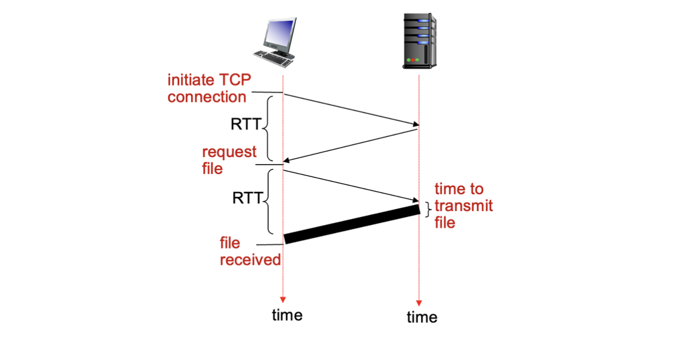
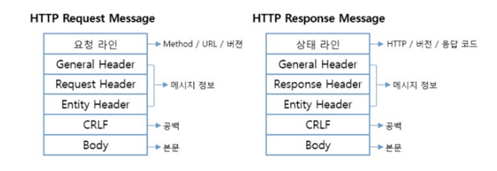
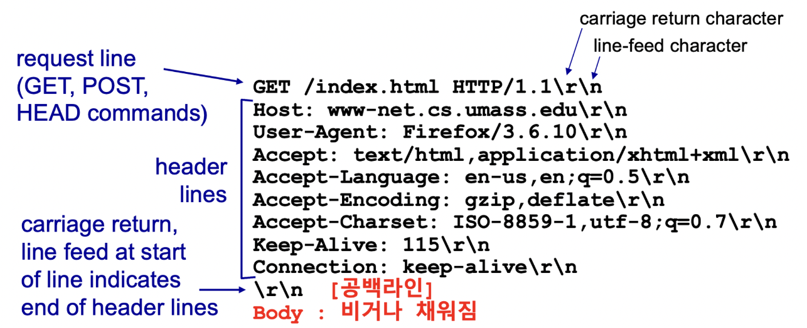
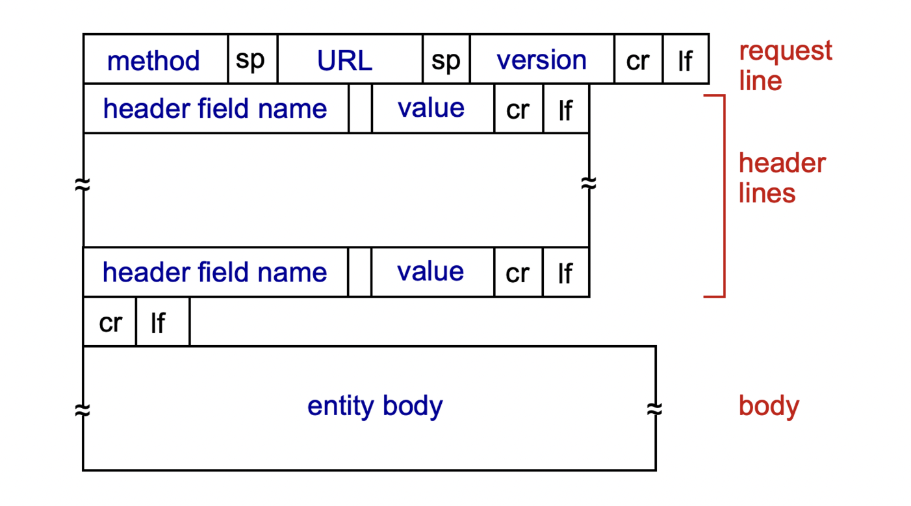
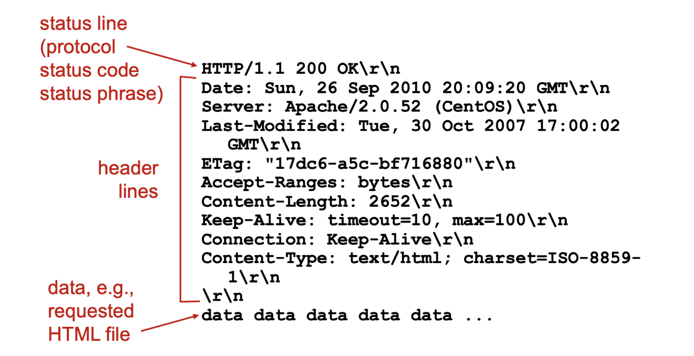
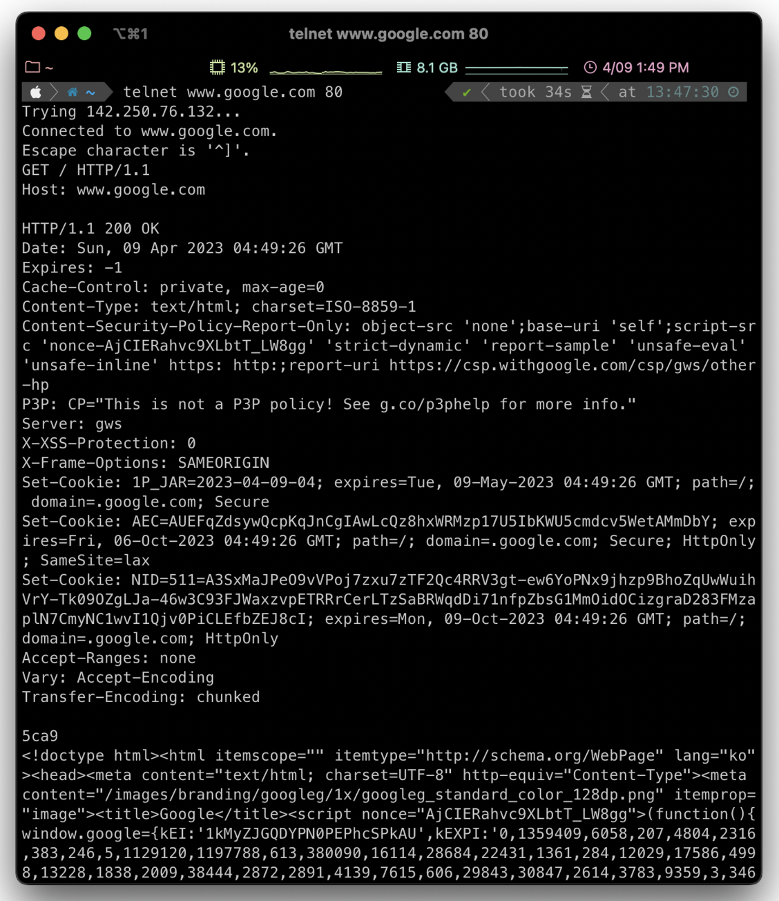
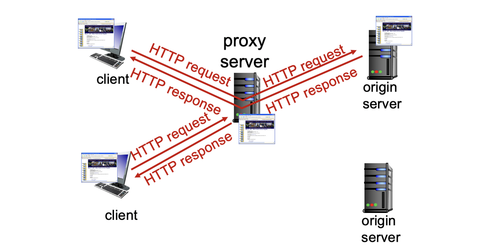

# 웹 & HTTP

웹 페이지는 객체(object)들로 이루어져 있다.
객체는 HTML 파일, JPEG 이미지, Java applet, 오디오 파일 등이 될 수 있다.
웹 페이지는 여러 개의 참조된 객체들을 포함하는 기본 HTML 파일로 구성된다.
각 객체는 URL(예: Uniform Resource Locator)을 통해 주소 지정이 가능하다.
도메인 이름(Domain Name)과 URL의 차이점이 있다.


## 웹 문서

- HTML
- CSS
- HTML5 = HTML + CSS + Javascript
- SGML, XML

### HTML vs. XML

1. 목적 및 사용범위: HTML은 웹 페이지의 구조와 내용을 표현하는 언어로 주로 웹 브라우저에서 사용된다. 반면에 XML은 데이터를 표현하고 전송하는 일반적인 마크업 언어로, 다양한 분야에서 사용될 수 있다.
2. 태그와 문법: HTML은 미리 정의된 태그들로 이루어진 마크업 언어로, 태그에는 미리 정의된 의미와 스타일이 부여되어 있다. XML은 사용자가 직접 태그를 정의하여 데이터를 마크업하는 언어로, 문법이 더 자유롭다.
3. 데이터의 구조와 유효성 검사: HTML은 웹 페이지의 구조와 내용을 표현하기 위한 목적으로 설계되었기 때문에, 데이터의 구조와 유효성을 강제하는 기능이 제한적이다. 반면에 XML은 데이터의 구조와 유효성을 자세히 정의할 수 있어 데이터의 일관성과 유효성을 보장할 수 있다.
4. 응용 분야: HTML은 웹 페이지의 표현을 위한 언어로, 웹 브라우저에서 웹 페이지를 표시하는 데 주로 사용된다. XML은 다양한 분야에서 데이터를 표현하고 전송하기 위해 사용될 수 있으며, 데이터 교환, 문서 표현, 설정 파일 등의 다양한 응용 분야에서 사용된다.
5. 스타일과 레이아웃: HTML은 스타일과 레이아웃을 태그 내에 포함하며, 스타일과 레이아웃을 상세하게 제어할 수 있는 기능이 제한적이다. XML은 스타일과 레이아웃을 별도의 스타일 시트를 통해 제어할 수 있어 더 유연한 스타일링이 가능하다.

## APM(Apache, php, MySQL)

- **Apache**
  리눅스OS에서 작동되는 웹 서버 프로그램  
  MS의 IIS (Internet Information Services)  
- **PHP**
  유닉스/리눅스에서 지원되는 스크립트 언어  
  HTML문서 내장된  
  MS의 ASP, JSP  
- **MySQL**
  데이터베이스 관리 시스템  
  Oracle, SQL server, etc  

## Java Applet vs. JavaScript

Java Applet:

- Java로 작성된 웹 페이지 내에서 동작하는 작은 프로그램 또는 애플리케이션
- 웹 페이지에 임베디드(embedded)되어 웹 브라우저에서 실행
- 별도의 Java Virtual Machine(JVM)을 필요로 함
- 다양한 기능을 제공하며, 사용자와 상호작용이 가능
- 보안상의 이슈가 있어 웹 브라우저에서의 사용이 제한되고 있음

Java Script:

- 웹 페이지 내에서 사용되는 스크립트 언어
- 웹 브라우저에서 실행되는 클라이언트 사이드 스크립트
- 별도의 JVM이 필요하지 않고, 웹 브라우저에 내장된 JavaScript 엔진을 사용
- 웹 페이지의 동적인 기능을 구현하기 위해 사용됨
- 사용자와 상호작용이 가능하며, 웹 페이지의 동적인 변경, 이벤트 처리, 데이터 유효성 검사 등을 수행할 수 있음
- 상대적으로 보안이 강화되어 있음


>💡 자바 애플릿은 호환성이 떨어지고 보안성도 좋지 않아 현재 사용되지 않음


## URI : URL vs. URN

**URL**:
예시: https://www.example.com/images/pic.jpg

- 프로토콜(Protocol): https
- 호스트(Host): www.example.com
- 경로(Path): /images/pic.jpg

URL은 리소스의 위치를 나타내는 주소로, 프로토콜, 호스트, 경로 등으로 구성된다. 위의 예시에서는 이미지 파일인 "pic.jpg"가 "https" 프로토콜을 사용하는 "www.example.com" 호스트의 "/images" 경로에 위치해 있다는 정보가 포함되어 있다. URL은 리소스의 위치를 통해 접근하고 찾아갈 수 있다.

**URN**:
예시: urn:example:image:pic.jpg

- 네임스페이스(Namespace): urn:example
- 식별자(Identifier): image:pic.jpg

URN은 리소스의 이름을 나타내는 식별자로, 네임스페이스와 식별자로 구성된다. 위의 예시에서는 "example"이라는 네임스페이스와 "image:pic.jpg"라는 식별자로 구성되어 있다. URN은 리소스의 이름을 통해 유일하게 식별될 수 있다.

**차이점**:

- URL은 리소스의 위치를 나타내고, URN은 리소스의 이름을 나타냄.
- URL은 리소스의 위치를 통해 접근하고 찾아가야 하지만, URN은 리소스의 이름만으로 유일하게 식별 가능.
- URL은 프로토콜, 호스트, 경로 등의 구성 요소를 포함하지만, URN은 네임스페이스와 식별자로만 구성됨.

## HTTP

HTTP(Hypertext Transfer Protocol)는 웹의 응용 계층 프로토콜로, 클라이언트/서버 모델을 따름


- 클라이언트: 웹 브라우저가 HTTP 프로토콜을 사용하여 웹 객체를 요청하고 받아온 후 웹 객체를 "표시"
- 서버: 웹 서버가 HTTP 프로토콜을 사용하여 요청에 대한 응답으로 웹 객체를 전송

**HTTP는 TCP를 사용**:

- 클라이언트가 서버에게 요청을 보내기 위해 TCP 연결을 초기화하고, 포트 80을 사용하여 서버에 접속한다.
- 서버는 클라이언트로부터의 TCP 연결을 수락한다.
- HTTP 메시지(응용 계층 프로토콜 메시지)가 브라우저(HTTP 클라이언트)와 웹 서버(HTTP 서버) 간에 교환된다.
- TCP 연결이 종료되면 클라이언트와 서버 사이의 연결이 닫힌다.

**HTTP는 "비상태(stateless)" 프로토콜이다**:

- 서버는 이전 클라이언트 요청에 대한 정보를 유지하지 않는다.
- 각 클라이언트 요청은 독립적이며, 서버는 이전 요청에 대한 정보를 가지고 있지 않다.
- 클라이언트의 상태 정보를 서버에 유지하지 않으므로, 서버의 부담이 줄어든다.
- 클라이언트가 요청을 보낼 때마다 모든 필요한 정보를 함께 보내야 한다는 단점이 있다.

**"상태(state)"를 유지하는 프로토콜은 복잡하다**:

- 과거의 이력(상태)을 유지해야 한다.
- 서버 또는 클라이언트가 충돌하면, 상태 정보가 일치하지 않을 수 있으며 조정이 필요하다.
- 서버와 클라이언트가 동일한 상태 정보를 가지도록 조정해야 한다.
- 이러한 복잡성은 비상태 프로토콜인 HTTP와는 다르다.
  - HTTP는 상태 정보를 서버에 유지하지 않으므로 복잡한 상태 관리가 필요하지 않다.
  - 서버나 클라이언트가 충돌하더라도 상태 정보를 일치시키는 문제가 없다. 각 클라이언트 요청이 독립적으로 처리되기 때문이다.

## 웹서버의 포터 번호

- 기본 포터 번호 : 80
- 보안을 위해 8000, 8080도 사용
- https (http over TSL/SSL)의 경우 443 사용

## HTTP연결

**비지속 HTTP(HTTP 1.0)**

- TCP 연결을 통해 최대 한 개의 객체만 전송하고 연결을 즉시 닫는 방식으로 동작.
- 다수의 객체를 다운로드하려면 여러번의 연결이 필요함.
- TCP 변수와 시간에 대한 단점 존재.

**지속 HTTP(HTTP 1.1)**

- 단일 TCP 연결을 통해 여러 개의 객체를 전송할 수 있는 방식으로 동작.
- 클라이언트와 서버 간에 지속적인 연결이 가능함.
- 여러 개의 객체를 하나의 연결로 다운로드 가능.

### 비지속 HTTP


- RTT (왕복 시간): 작은 패킷이 클라이언트에서 서버로 전송되고 다시 클라이언트로 돌아오는 데 걸리는 시간
- HTTP 응답 시간:
  - TCP 연결을 초기화하기 위한 RTT 1회
  - HTTP 요청 및 첫 몇 바이트의 HTTP 응답을 받기 위한 RTT 1회
  - 파일 전송 시간
- 비지속 HTTP 응답 시간:
  - 2RTT + 파일 전송 시간
  - 오브젝트가 10개면 20RTT + 10 파일 전송 시간

### 지속 HTTP

비지속 HTTP의 문제점:

- 객체당 2개의 RTT가 필요하다.
- 각 TCP 연결마다 운영체제 오버헤드가 발생한다.
- 브라우저는 종종 참조된 객체를 가져오기 위해 병렬 TCP 연결을 여는데, 이는 여러 개의 연결을 유지하는 오버헤드를 가진다.

지속 HTTP:

- 서버는 응답을 보낸 후에도 연결을 열어둔다.
- 이후 동일한 클라이언트/서버 간에 전송되는 HTTP 메시지는 열린 연결을 통해 전송된다.
- 클라이언트는 참조된 객체를 만나면 즉시 요청을 보낸다.
- 모든 참조된 객체에 대해 최소 1개의 RTT로 처리된다.

## HTTP 프로토콜 구조


## HTTP Request Message (요청 메세지)



- **각 라인별 의미**
1. GET /index.html HTTP/1.1: HTTP 요청 메서드인 GET을 사용하여 /index.html 리소스를 요청한다. HTTP 버전은 1.1이다.
2. Host: www-net.cs.umass.edu: 요청을 보내는 대상 호스트의 도메인 이름이다. www-net.cs.umass.edu를 요청한다.
3. User-Agent: Firefox/3.6.10: 요청을 보내는 클라이언트의 User-Agent 정보로, Firefox 브라우저의 버전이 3.6.10임을 나타낸다.
4. Accept: text/html,application/xhtml+xml: 클라이언트가 받아들일 수 있는 응답의 MIME 타입을 지정한다. text/html과 application/xhtml+xml 형식을 허용한다.
5. Accept-Language: en-us,en;q=0.5: 클라이언트가 선호하는 언어를 지정한다. en-us를 가장 선호하고, en은 우선순위가 낮아서 q=0.5의 가중치를 가진다.
6. Accept-Encoding: gzip,deflate: 클라이언트가 서버에서 받아들일 수 있는 응답의 압축 방식을 지정한다. gzip과 deflate를 허용한다.
7. Accept-Charset: ISO-8859-1,utf-8;q=0.7: 클라이언트가 서버에서 받아들일 수 있는 문자 집합을 지정한다. ISO-8859-1을 가장 선호하고, utf-8은 우선순위가 낮아서 q=0.7의 가중치를 가진다.
8. Keep-Alive: 115: 클라이언트가 서버와의 연결을 유지할 시간을 지정한다. 115초 동안 연결을 유지한다.
9. Connection: keep-alive: 클라이언트가 서버와의 연결을 유지할 것을 지정한다. keep-alive로 지정되어 있어 연결을 계속 유지한다.

### HTTP 요청 메세지 포맷


### Method Types (요청 메세지)

| Request Method | Explanation |
| --- | --- |
| GET | 서버로부터 리소스를 요청하여 응답으로 해당 리소스를 받아옵니다. |
| POST | 서버에 데이터를 제출하여 리소스를 생성하거나 업데이트합니다. |
| HEAD | GET 메서드와 유사하지만, 응답으로 리소스의 바디(body)를 받아오지 않고 헤더 정보만을 받아옵니다. |
| PUT | 서버에 데이터를 제출하여 리소스를 생성하거나 업데이트합니다. |
| DELETE | 서버의 리소스를 삭제합니다. |
| CONNECT | 서버와의 네트워크 연결을 요청합니다. 주로 프록시 서버와의 터널링에 사용됩니다. |
| OPTIONS | 서버가 지원하는 HTTP 옵션들을 요청합니다. |
| TRACE | 클라이언트와 서버 간의 디버깅을 위해 요청과 응답을 추적합니다. |
| PATCH | 서버의 리소스를 부분적으로 수정합니다. |
- **HTTP 1.0 메서드:**
  1. GET: 서버로부터 리소스를 요청하여 응답으로 해당 리소스를 받아옵니다.
  2. POST: 서버에 데이터를 제출하여 리소스를 생성하거나 업데이트합니다.
  3. HEAD: GET 메서드와 유사하지만, 응답으로 리소스의 바디(body)를 받아오지 않고 헤더 정보만을 받아옵니다.
  4. PUT: 서버에 데이터를 제출하여 리소스를 생성하거나 업데이트합니다.
  5. DELETE: 서버의 리소스를 삭제합니다.
- **HTTP 1.1 메서드:**
  1. GET
  2. POST
  3. HEAD
  4. PUT
  5. DELETE
  6. CONNECT: 서버와의 네트워크 연결을 요청합니다. 주로 프록시 서버와의 터널링에 사용됩니다.
  7. OPTIONS: 서버가 지원하는 HTTP 옵션들을 요청합니다.
  8. TRACE: 클라이언트와 서버 간의 디버깅을 위해 요청과 응답을 추적합니다.
  9. PATCH: 서버의 리소스를 부분적으로 수정합니다.

### Uploading form input

클라이언트에서 서버에 정보를 보낼때 두가지 방식이 있음.

1. POST 메서드 사용 :
   POST 메서드는 웹 페이지에서 폼(form) 입력을 포함하는 경우에 사용됨.
   사용자가 입력한 데이터가 요청 메시지의 본문(entity body)에 업로드되어 서버로 전송(*포맷참조*)
   이는 데이터를 서버로 보내기 위해 사용되는 메서드임
2. URL 메서드 사용 :
   URL 메서드는 GET 메서드를 사용하여 데이터를 요청하는 방법.
   사용자가 입력한 데이터가 요청 라인의 URL 필드에 업로드되어 요청 메시지에 포함
   이는 데이터를 URL의 쿼리 파라미터로 전송하여 서버로 보내는 방법
   URL 메서드는 GET 메서드와 함께 사용되어 데이터를 요청하면서 정보를 함께 전송할 수 있음

## HTTP Response Message (응답 메세지)


1. HTTP/1.1 200 OK: HTTP 프로토콜 버전과 상태 코드인 200 OK가 포함된 상태 라인입니다. "200 OK"는 서버가 요청을 성공적으로 처리했음을 나타내는 HTTP 상태 코드입니다.
2. Date: 응답이 생성된 날짜와 시간이 포함된 헤더입니다. 이 경우에는 "Sun, 26 Sep 2010 20:09:20 GMT"로 설정되어 있습니다.
3. Server: 서버의 소프트웨어와 버전 정보가 포함된 헤더입니다. 이 경우에는 "Apache/2.0.52 (CentOS)"로 설정되어 있습니다.
4. Last-Modified: 서버에서 마지막으로 리소스가 수정된 날짜와 시간이 포함된 헤더입니다. 이 경우에는 "Tue, 30 Oct 2007 17:00:02 GMT"로 설정되어 있습니다.
5. ETag: 서버에서 리소스의 고유한 태그가 포함된 헤더입니다. 이를 통해 클라이언트가 리소스를 캐시하고 필요한 경우에만 다시 요청할 수 있습니다. 이 경우에는 ""17dc6-a5c-bf716880""로 설정되어 있습니다.
6. Accept-Ranges: 서버가 지원하는 바이트 단위의 범위 요청을 허용하는지를 나타내는 헤더입니다. 이 경우에는 "bytes"로 설정되어 있습니다.
7. Content-Length: 응답 바디의 길이가 포함된 헤더입니다. 이 경우에는 "2652"로 설정되어 있습니다.
8. Keep-Alive: 클라이언트와 서버 간의 연결을 유지하는데 사용되는 헤더입니다. "timeout=10"은 연결을 유지하는 시간이 10초로 설정되어 있고, "max=100"은 최대로 유지될 수 있는 연결의 개수가 100개로 설정되어 있습니다.
9. Connection: 클라이언트와 서버 간의 연결 상태를 나타내는 헤더입니다. "Keep-Alive"는 연결이 유지되고 있다는 것을 나타냅니다.
10. Content-Type: 응답 바디의 미디어 타입과 문자 인코딩이 포함된 헤더입니다. 이 경우에는 "text/html; charset=ISO-8859-1"로 설정되어 있으며, 응답 바디가 텍스트 형식의 HTML이고, 문자 인코딩이 ISO-8859-1로 되어 있다는 것을 나타냅니다.

### HTTP 응답 상태 코드

상태라인에 나타남.

코드 예시 :

- 200 (OK) : 요청이 성공적으로 처리되었음을 나타냄.
- 301 (Moved Permanently) : 요청한 객체가 다른 위치로 영구적으로 이동되었음을 나타냄. 새로운 위치는 이후에 나옴 (Location:).
- 400 (Bad Request) : 서버가 요청 메시지를 이해하지 못함을 나타냄.
- 404 (Not Found) : 요청한 문서를 서버에서 찾을 수 없음을 나타냄.
- 505 (HTTP Version Not Supported) : 지원되지 않는 HTTP 프로토콜 버전을 사용하고 있음을 나타냄.

### telnet 실습


## 쿠키

쿠키(Cookie)는 웹 브라우저와 웹 서버 간에 정보를 교환하기 위해 사용되는 작은 텍스트 파일이다. 웹 서버가 클라이언트(웹 브라우저)에게 쿠키를 전송하면, 해당 쿠키는 클라이언트의 웹 브라우저에 저장되고, 이후에 같은 웹 서버에 대한 요청이 있을 때마다 클라이언트가 쿠키를 함께 전송한다. 이를 통해 웹 서버는 클라이언트를 식별하고 상태를 유지할 수 있다.

쿠키는 HTTP 헤더(Header)에 포함되어 웹 서버와 클라이언트 간에 함께 전송된다. 보다 구체적으로 말하면, 서버가 클라이언트에게 HTTP 응답(Response)를 보낼 때, 응답 헤더에 Set-Cookie 헤더를 포함하여 쿠키를 전송한다. 클라이언트(웹 브라우저)는 이 쿠키를 자동으로 저장하고, 이후에 같은 웹 서버에 대한 요청(Request)을 보낼 때, 요청 헤더에 Cookie 헤더를 포함하여 저장된 쿠키를 함께 전송한다.

```php
HTTP/1.1 200 OK
Set-Cookie: user_id=12345; expires=Sat, 09-Apr-2023 12:00:00 GMT; path=/
```

이는 "user_id"라는 이름의 쿠키를 생성하고, 값으로 "12345"를 설정한 뒤, 쿠키의 만료 날짜를 2023년 4월 9일로 지정하고, 경로를 "/"로 설정한 것이다. 이후에 클라이언트가 같은 서버에 요청을 보낼 때, "user_id"라는 이름의 쿠키와 해당 값을 함께 전송하여 서버가 사용자를 식별하고, 저장된 정보를 활용할 수 있게 된다.

## 프록시 서버(Proxy Server)


**목적: 오리진 서버에 개입하지 않고 클라이언트 요청을 충족시키기**

- 사용자가 웹 브라우저를 캐시를 통해 웹에 접근하도록 설정함
- 브라우저는 모든 HTTP 요청을 캐시로 전송함
- 캐시에 해당하는 객체가 있으면, 캐시는 해당 객체를 반환함
- 그렇지 않으면, 캐시는 오리진 서버에서 객체를 요청하고, 그 객체를 클라이언트에게 반환함

### Conditional GET

프록시 서버의 조건부 GET(Conditional GET)은 클라이언트가 요청한 리소스가 변경되었는지를 확인하여 변경되지 않았을 경우에는 서버로부터 리소스를 다시 가져오지 않고, 이전에 받아온 리소스를 클라이언트에게 제공하는 메커니즘이다.

조건부 GET은 클라이언트가 요청한 리소스에 대한 메타데이터를 검사하여 변경 여부를 확인한다. 이를 위해 HTTP 헤더를 사용하며, 주요한 헤더는 다음과 같다.

1. If-Modified-Since (IMS): 클라이언트가 이전에 받아온 리소스의 수정 날짜를 헤더에 포함하여 서버에 전송한다. 서버는 이 날짜와 요청한 리소스의 현재 수정 날짜를 비교하여 변경 여부를 확인한다. 변경되지 않았다면 304 Not Modified 상태 코드를 응답하여 실제 리소스를 다시 보내지 않고 클라이언트에게 이전에 받아온 리소스를 사용하도록 안내한다.
2. If-None-Match (INM): 서버가 리소스에 대해 생성한 엔티티 태그를 클라이언트가 헤더에 포함하여 전송한다. 서버는 이 태그와 현재 리소스의 엔티티 태그를 비교하여 변경 여부를 확인한다. 변경되지 않았다면 304 Not Modified 상태 코드를 응답하여 실제 리소스를 다시 보내지 않고 클라이언트에게 이전에 받아온 리소스를 사용하도록 안내한다.

조건부 GET을 사용함으로써 프록시 서버는 변경되지 않은 리소스에 대해서는 서버와의 통신을 최소화하여 대역폭을 절약하고 응답 속도를 향상시킬 수 있다.
```toc
```
