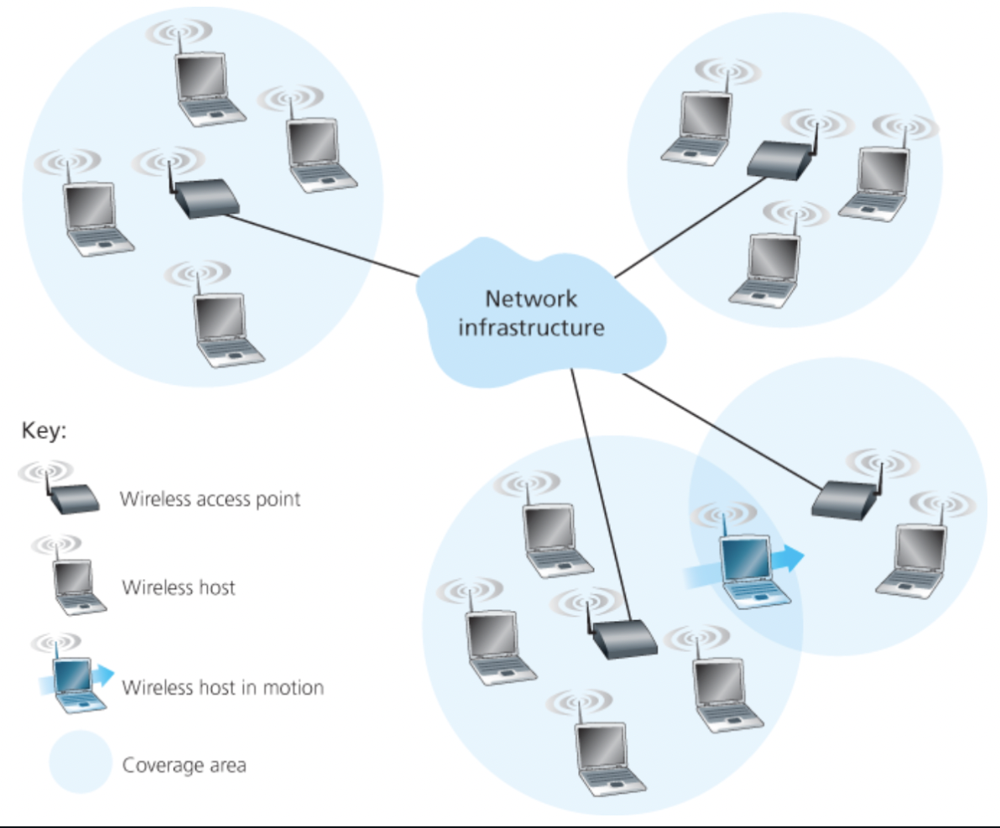

# 개요

<br/>

# 무선 네트워크의 요소

무선 네트워크는 다음과 같은 구성 요소로 이루어진다.

<br/>



<br/>
<br/>
<br/>

## 무선 호스트

`무선 호스트(wireless host)`는 유선 네트워크의 경우처럼 **애플리케이션을 실행하는 종단 시스템 장치**다.

e.g., 스마트폰, 태블릿, 랩톱, 센서 등의 IoT(Internet of Things) 장치, 가전제품, 자동차, 그 외 인터넷에 연결된 무수히 많은 장치

<br/>
<br/>

## 무선 링크

호스트는 `무선 통신 링크(wireless communication link)`를 통해 기지국(base station)이나 다른 무선 호스트에 연결된다.

<br/>

위 그림에서 무선 링크는 네트워크 가장자리에 있는 호스트를 코어에 있는 네트워크 인프라스트럭처로 연결해준다.

무선 링크는 때로는 네트워크 코어에서도 라우터, 스위치 등 네트워크 장치들 사이를 연결해주는 데 사용될 수 있다.

<br/>
<br/>

## 기지국

`기지국(base station)`은 기지국에 결합된 무선 호스트와의 **데이터(e.g., 패킷) 송수신에 대한 책임**을 진다.

즉, 자신과 결합되어 있는 다수의 무선 호스트들 사이의 전송을 중재하고 조정한다.

<br/>

`무선 호스트가 어떤 기지국에 ‘결합(association)되어 있다’`는 것은 아래 두 가지를 의미한다.

1. 호스트가 해당 기지국의 무선 통신 영역 안에 있다.
2. 호스트가 자신과 네트워크 간의 데이터 중계(relay)를 위해 해당 기지국을 사용한다.

<br/>

기지국의 예

- 셀룰러 네트워크에서의 `셀 타워(cell tower)`
- 무선 네트워크에서의 `AP(access point)`

<br/>

### 인프라스트럭처 방식

기지국에 접속된 호스트는 `인프라스트럭처 방식(infrastructure mode)으로 동작한다`고 한다.

이는 주소 할당이나 라우팅 등 기존의 **모든 네트워크 서비스가 기지국을 통해** 네트워크에 연결된 호스트에게 제공되기 때문이다.

<br/>

이에 반해 `애드혹 네트워크(ad hoc network)`의 경우 무선 호스트는 연결할 수 있는 이런 인프라스트럭처가 없다.

이때 호스트는 스스로 라우팅, 주소 할당, DNS 방식의 이름-주소 변환 등의 서비스를 수행해야 한다.

<br/>

### 핸드오프 (핸드오버)

이동 호스트가 한 기지국 영역을 벗어나 **다른 기지국 영역으로 이동하는 경우**, 중심부에 있는 큰 네트워크로의 접속점을 변경(결합된 기지국을 변경)해야 한다.

이 과정을 `핸드오프(handoff)` 또는 `핸드오버(handover)`라고 한다.

<br/>
<br/>

## 네트워크 인프라스트럭처

무선 호스트가 통신하고자 하는 큰 네트워크다.

<br/>
<br/>
<br/>

# 무선 네트워크의 종류

무선 네트워크를 이루는 요소들은 다양한 방식으로 결합되어 여러 가지 형태의 무선 네트워크를 형성할 수 있다.

<br/>

우리는 다음의 두 가지 기준에 따라 무선 네트워크를 크게 몇 종류로 분류할 수 있다.

1. 무선 네트워크 내의 패킷이 `하나의 홉`만을 거치는가 `여러 홉`을 거치는가?
2. 기지국과 같은 네트워크 `인프라스트럭처`가 있는가, 없는가?

<br/>

### 단일 홉, 인프라스트럭처 존재

- 좀 더 큰 **유선 네트워크와 연결된 기지국**을 갖고 있다.
- 모든 통신은 이 기지국과 무선 호스트 사이에 **단일 무선 홉**으로 이루어진다.
- e.g.,
    - `802.11 네트워크` : 교실, 음식점, 도서관 등에서 사용
    - `4G LTE 네트워크`

<br/>

### 단일 홉, 인프라스트럭처 없음

- 유선 네트워크가 연결된 기지국이 없다.
- **단일 홉 네트워크 안의 하나의 노드가 다른 노드들의 전송을 중재, 조정할 수 있다.**
- e.g., `블루투스 네트워크` : 키보드, 스피커, 헤드셋 등 작은 무선 장비들을 연결

<br/>

### 다중 홉, 인프라스트럭처 존재

- **좀 더 큰 네트워크와 연결된 기지국**이 존재해야 한다.
- 일부 노드들은 기지국와 통신하기 위해 다른 무선 노드들의 중계를 거쳐야 한다.
- e.g.,
    - `일부 무선 센터 네트워크(wireless sensor network)`
    - `무선 메시 네트워크(wireless mesh network)`

<br/>

### 다중 홉, 인프라스트럭처 없음

- **기지국이 없다.**
- 노드들은 메시지를 목적지에 보내기 위해 여러 노드들의 중계를 거칠 수 있다.
- 노드들은 **이동성**이 있어 노드들 간의 연결성이 변화할 수 있다.
- 이러한 형태의 네트워크는 `이동 애드혹 네트워크(mobile ad hoc network, MANET)`라고 한다.

<br/>
<br/>

*책에서는 주로 단일 홉 네트워크와 인프라스트럭처가 있는 네트워크에 논의를 한정한다.*

```toc
```
