> ❗️**날짜별로 정리하여 복습하기를 원하기 때문에 내용이 길고 다소 정리되지 않았습니다.**
# Introduction

## Structure

> 💡 OS : User단과 HW단 사이에서 동작하는 프로그램


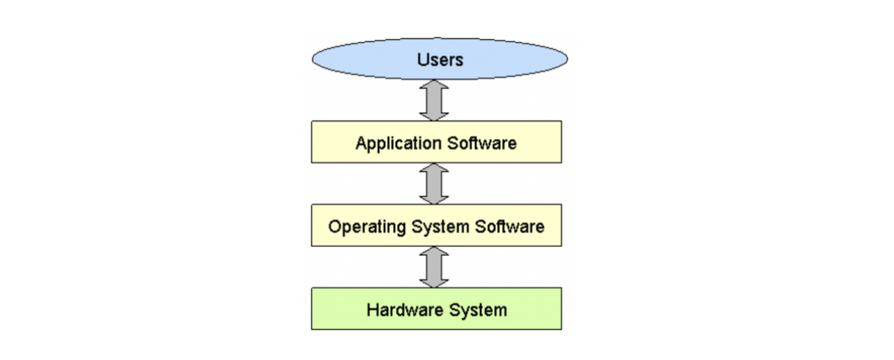

**Performance metrics(OS 평가 기준)**

- Throughput : jobs / sec. - system oriented
- Utilization : % of time busy - system oriented
- Response time : sec / job - user oriented

**4 Components**

- Hardware
- Operating system
- Application programs
- Users

**OS’s role**

1. Resource allocator
   1. CPU, 메모리 저장공간, 파일 저장 공간, 입출력장치 등의 자원을 관리
   2. 자원 요구에 대한 충돌적 요구를 효과적/공정하게 분배
2. Control program
   1. 에러 예방 등


>💡 커널 : OS에서 항상 실행되는 부분


## System program vs. Application Program

**System program**

- OS
- Loader
- Linker
- etc…

**Application program**

- …

## Computer System Organization

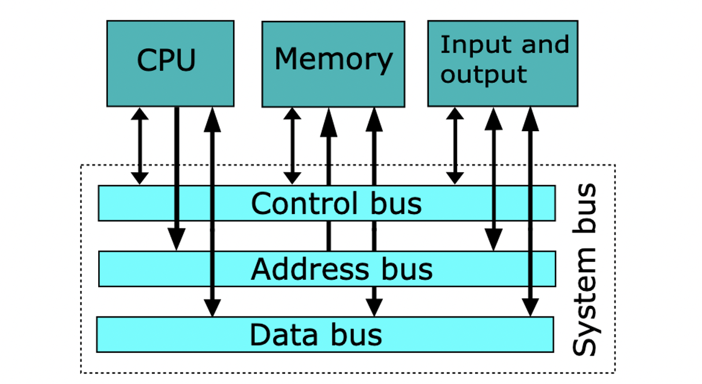

>💡 {HDD, SSD} ∈ I/O Device


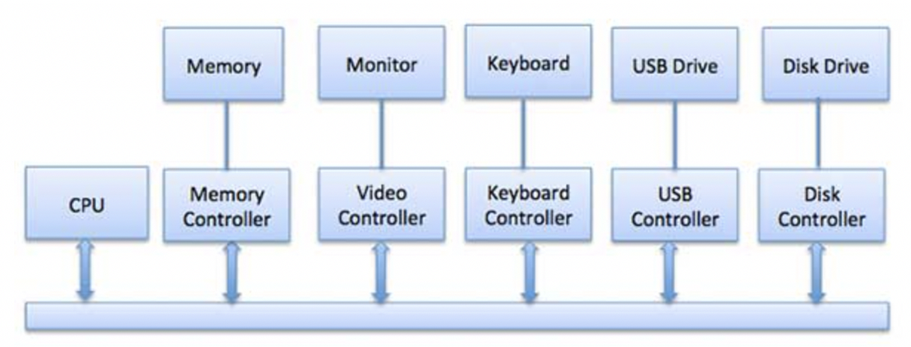


**Bus와 I/O Device 사이에 I/O Device Controller(HW)가 있음. (Device Driver-SW)**

## I/O Device driver architecture

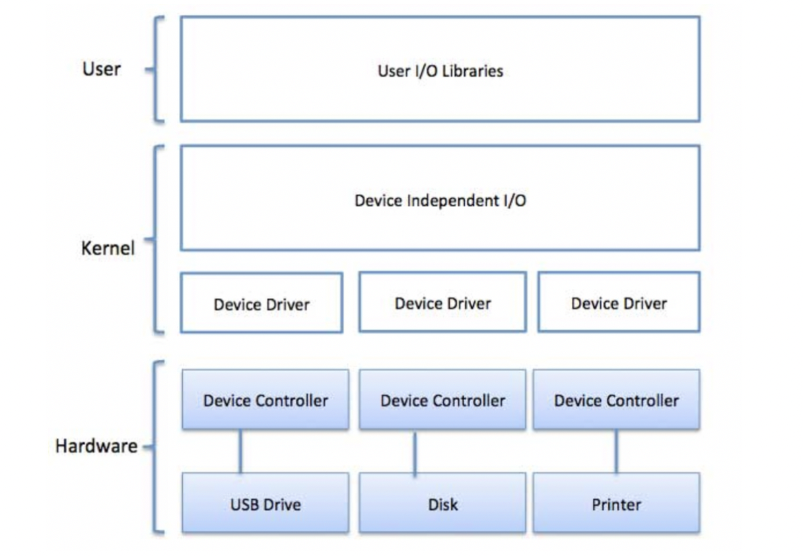


>💡 Device Driver와 Device Controller의 차이에 유의  
>Driver는 설치하면 OS에 종속됨. Controller는 IO장치에 있음


## Polling(Busy Waiting) vs. Interrupt

- **Polling**
   - I/O Device의 status register에 상태비트가 존재, CPU는 계속해서 I/O장치의 상태를 확인함
- **Interrupt**
   - I/O Device가 작업을 완료하면 다음 Command를 할당받기 위해 CPU에 Interrput 신호 송신, Interrupt Request Line(Control bus) 추가로 필요
   - **Interrupt Service Routine** : CPU는 Interrupt 신호를 받을 뿐, 어떤 디바이스가 요청했는지 모름.
      - **2nd Polling(앞 Polling과 다름) :** 어떤 디바이스가 요청했는지 일일히 확인
      - Vectored Interrupt : 벡터 테이블을 통해 어떤 디바이스가 요청했는지 바로 확인
   - **Interrupt Handler** : 디바이스 색출 후 작업(디바이스마다 상이함)

## Direct Memory Access(DMA)

- 기존 방식(Programmed I/O)
   1. CPU는 입출력 작업을 수행하기 위해 입출력 장치의 상태를 확인합니다. 입출력 장치가 준비 상태에 있는지, 데이터를 읽거나 쓸 수 있는 상태인지 등을 체크합니다.
   2. 입출력 장치가 준비되었다면, CPU는 입출력 데이터를 임시적으로 가지고 있는 레지스터나 버퍼로 데이터를 복사합니다.
   3. CPU는 복사한 데이터를 주기억장치로 전송합니다. 이때, 입출력 데이터는 CPU와 주기억장치 사이에서 복사되어야 합니다. CPU는 입출력 데이터를 버스를 통해 주기억장치로 전송하며, 이 과정에서 데이터의 복사가 이루어집니다.
   4. 입출력 데이터가 주기억장치로 복사되면, 입출력 장치로부터 다음 데이터를 읽거나 CPU가 전송한 데이터를 입출력 장치에 쓸 수 있습니다.
- DMS 방식
   - CPU가 할 일을 DMA에게 토스
   1. CPU는 DMA 컨트롤러에게 데이터 전송을 시작할 주소, 전송할 데이터의 크기 등을 설정합니다.
   2. DMA 컨트롤러는 CPU의 명령에 따라 입출력 장치와 주기억장치 간의 데이터 전송을 시작합니다.
   3. DMA 컨트롤러는 입출력 장치와 주기억장치 사이에서 데이터를 직접 전송합니다.
   4. 전송이 완료되면 DMA 컨트롤러는 인터럽트 신호 등을 통해 CPU에 전송 완료를 알립니다.


>💡 DMS Device Controller에게 CPU의 I/O Device관련 작업을 이양함.


## Blocking I/O vs Non-blocking I/O

- Blocking I/O

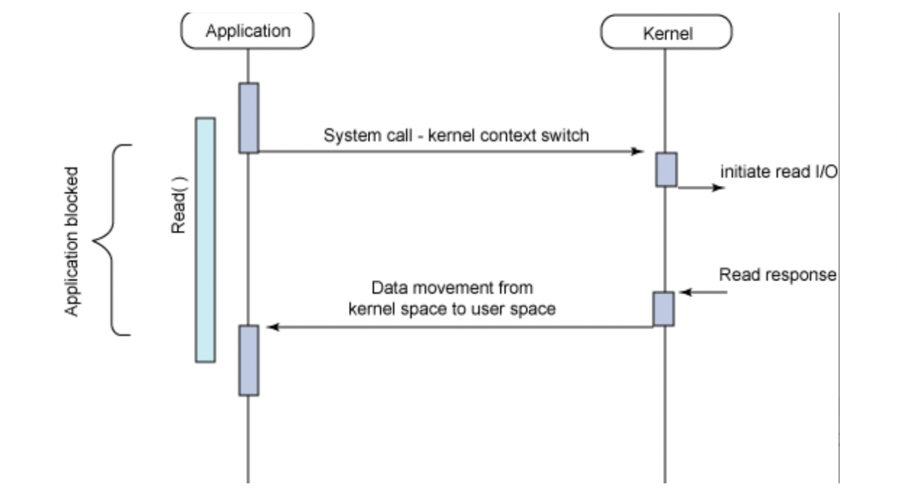

I/O 작업 수행 시 CPU가 블로킹되어 다른 쓰레드 및 프로세스 작업을 수행하지 못함.

- Non-blocking I/O

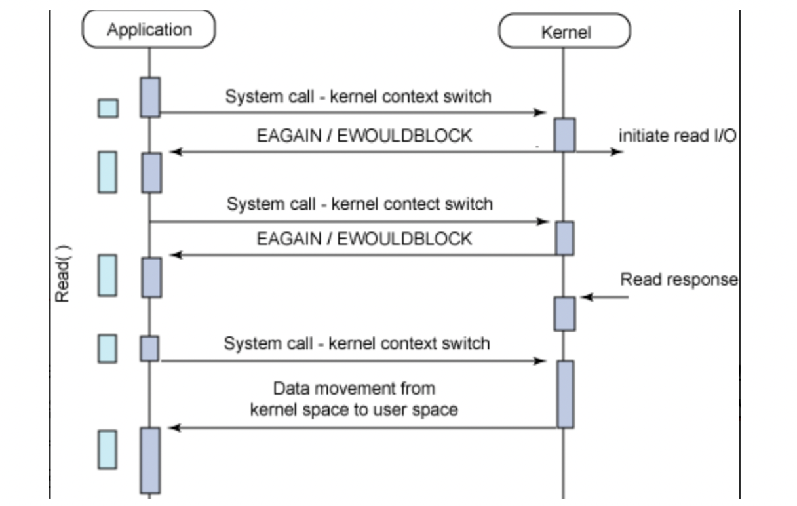

I/O 작업 완료 여부와 상관없이 즉시 응답한다. 이후 애플리케이션이 중간중간 시스템 콜을 보내 작업 완료 여부를 확인하는 방식


## Synchronous I/O vs Asynchronous I/O

**Synchronous Blocking I/O**


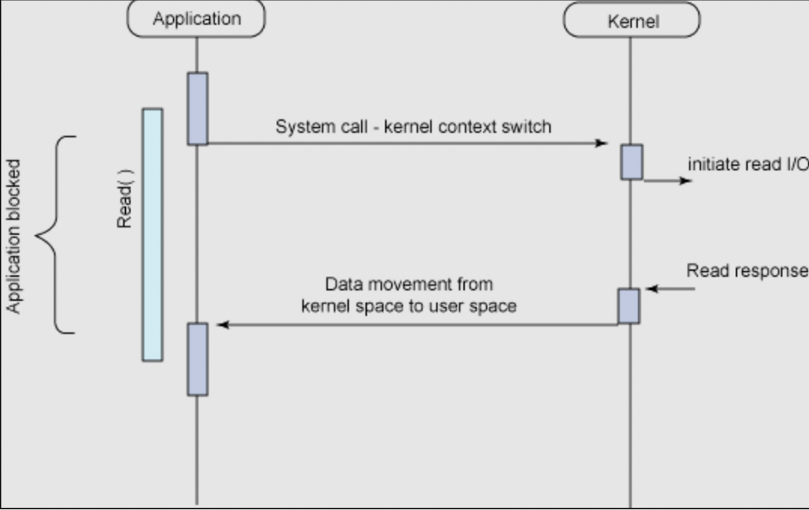


> SynchoronousApplication의 Read() 메소드가 리턴하는 시간과 Kernel에서 read I/O작업 결과가 반환되는 시간이 일치한다.BlockingApplication은 Kernel에게 read I/O 작업 요청을 하면서 동시에 제어권을 넘긴다.Application은 Kernel의 I/O 작업이 완료될 때까지 다음 작업을 수행하지 못하고 대기한다.
>


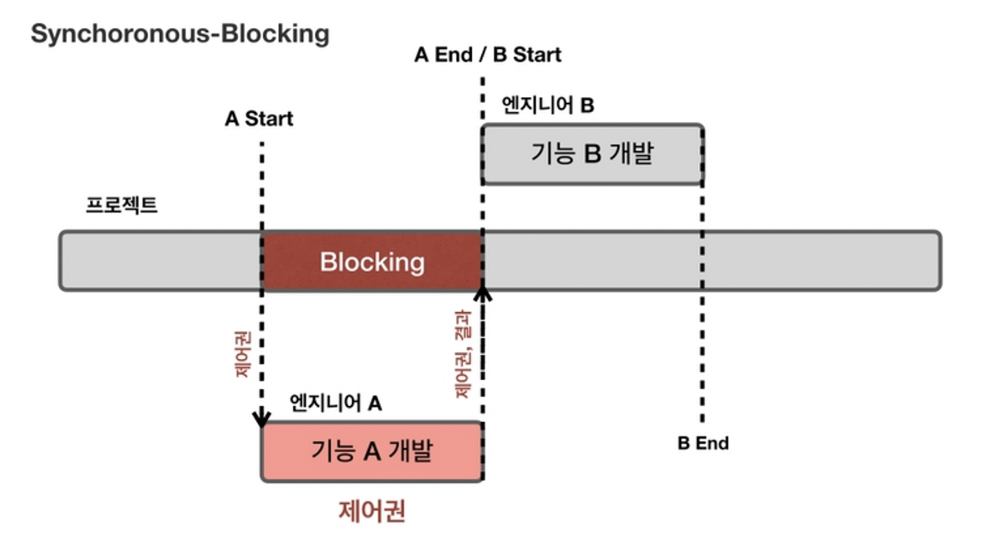


> Synchoronous프로젝트 팀장은 기능 A가 완성되야 기능 B를 만들 수 있도록 하였다. 그래서 엔지니서 A가 업무를 끝내는 시간이 엔지니어 B가 업무를 시작하는 시간과 일치해야한다.Blocking엔지니어 A는 제어권을 가지게 되어 프로젝트 팀장은 다른 일을 못하고 기다리게 된다.
>

**Synchronous Non-Blocking I/O**


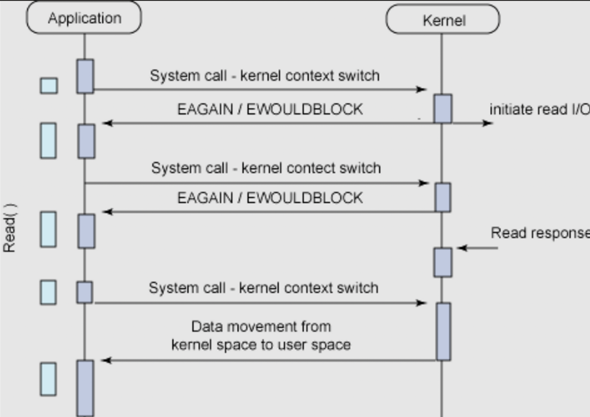


> SynchoronousApplication의 Read() 메소드가 리턴하는 시간과 Kernel에서 read I/O작업 결과가 반환되는 시간이 일치한다.Non-BlockingApplication은 Kernel에게 read I/O 작업 요청과 동시에 제어권을 넘기지만, Kernel의 작업 완료 여부와 관계없이 Application에게 제어권이 다시 반환된다.Kernel의 I/O 작업이 완료되면 그 결과를 Application에게 반환한다.
>


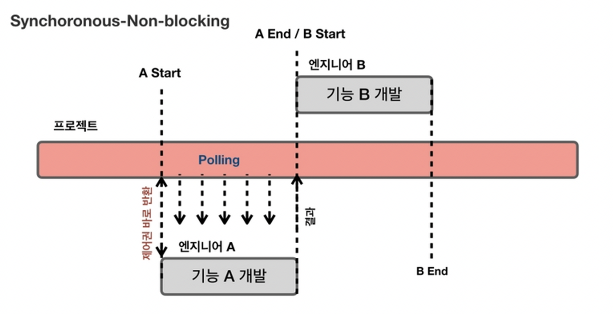


> Synchoronous기능 A가 기능 B보다 우선 개발되어야 하기 때문에 엔지니어 A의 작업 종료 시간에 맞춰 엔지니어 B의 작업이 시작된다.Non-Blocking엔지니어 A는 제어권을 받자마자 프로젝트 팀장에게 넘긴다. 프로젝트 팀장은 엔지니어 A의 작업이 종료될 때까지 기다리지 않고 주기적으로 결과를 확인하는 작업 (Polling)을 한다.
>

**Asynchronous Non-Blocking I/O (AIO)**

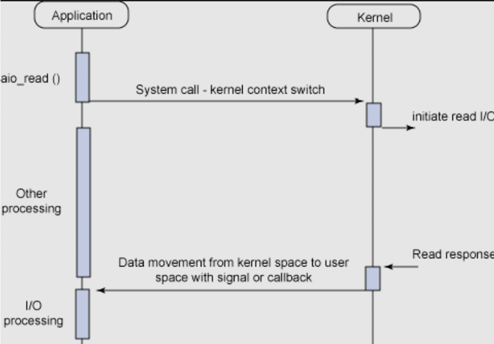

> AsynchronousApplication의 Read() 메소드가 리턴하는 시간과 Kernel에서 read I/O작업 결과가 반환되는 시간이 일치하지 않는다.Non-BlockingApplication은 Kernel에게 read I/O 작업 요청과 동시에 제어권을 넘기지만, Kernel의 작업 완료 여부와 관계없이 Application에게 제어권이 다시 반환된다.Kernel의 I/O 작업이 완료되면 그 결과를 Application에게 반환한다. Application은 콜백함수를 통해 그 결과를 처리한다.
>

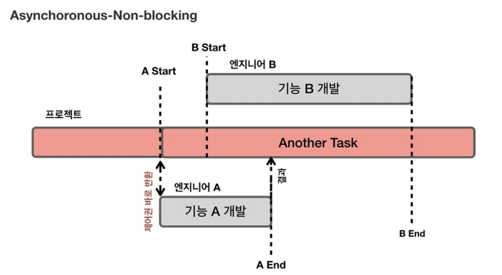

> Asynchronous엔지니어 A와 B의 시간을 맞추지 않는다. 즉, 기능 A가 기능 B보다 우선 개발될 필요가 없다.Non-Blocking기능 A을 개발하는 엔지니어 A는 프로젝트 제어권을 가지지 않는다. 엔지니어 B 또한 마찬가지이다.프로젝트 팀장은 엔지니어 A와 B에게 각각 기능 A, B를 맡기고 다른 작업을 수행한다.
>

**Asynchronous Blocking**

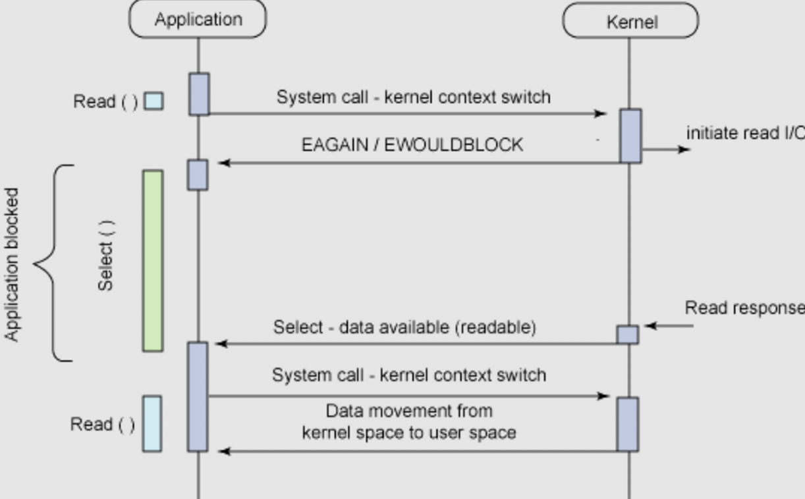

> 가장 비효율적인 모델이다.
>
>
> 하지만 Asynchronous Non-Blocking 모델 중에서 의도치 않게 Asynchronous Blocking으로 동작하는 경우가 있다고 한다.
>

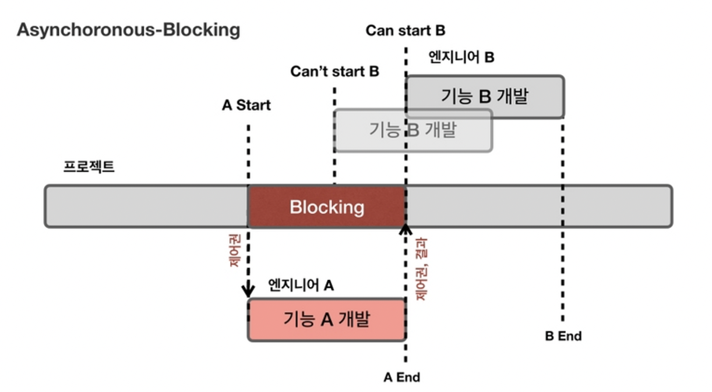

> `Asynchronous`  
>기능 A가 기능 B보다 먼저 개발될 필요가 없다. 즉, 작업의 우선순위가 없다.  
>`Blocking`  
>하지만 프로젝트 제어권을 엔지니어 A가 가지고 있기 때문에 작업 우선순위가 없음에도 불구하고 기능 A 개발이 종료될 때까지 기능 B를 개발할 수 없게 된다.


**이하 예시**

**Blocking & Synchronous**

> 나 : 대표님, 개발자 좀 더 뽑아주세요..
>
>
> 대표님 : 오케이, 잠깐만 거기 계세요!
>
> 나 : …?!!
>
> 대표님 : (채용 공고 등록.. 지원자 연락.. 면접 진행.. 연봉 협상..)
>
> 나 : (과정 지켜봄.. 궁금함.. 어차피 내 일 하러는 못 가고 계속 서 있음)
>

**Blocking & Asynchronous**

> 나 : 대표님, 개발자 좀 더 뽑아주세요..
>
>
> 대표님 : 오케이, 잠깐만 거기 계세요!
>
> 나 : …?!!
>
> 대표님 : (채용 공고 등록.. 지원자 연락.. 면접 진행.. 연봉 협상..)
>
> 나 : (안 궁금함.. 지나가는 말로 여쭈었는데 붙잡혀버림.. 딴 생각.. 못 가고 계속 서 있음)
>

**Non-blocking & Synchronous**

> 나 : 대표님, 개발자 좀 더 뽑아주세요..
>
>
> 대표님 : 알겠습니다. 가서 볼 일 보세요.
>
> 나 : 넵!
>
> 대표님 : (채용 공고 등록.. 지원자 연락.. 면접 진행.. 연봉 협상..)
>
> 나 : 채용하셨나요?
>
> 대표님 : 아직요.
>
> 나 : 채용하셨나요?
>
> 대표님 : 아직요.
>
> 나 : 채용하셨나요?
>
> 대표님 : 아직요~!!!!!!
>

**Non-blocking & Asynchronous**

> 나 : 대표님, 개발자 좀 더 뽑아주세요..
>
>
> 대표님 : 알겠습니다. 가서 볼 일 보세요.
>
> 나 : 넵!
>
> 대표님 : (채용 공고 등록.. 지원자 연락.. 면접 진행.. 연봉 협상..)
>
> 나 : (열일중..)
>
> 대표님 : 한 분 모시기로 했습니다~!
>
> 나 : 😍


```toc
```
