> ❗️**날짜별로 정리하여 복습하기를 원하기 때문에 내용이 길고 다소 정리되지 않았습니다.**

## 컴퓨터 아키텍처

**폰 노이만 구조**

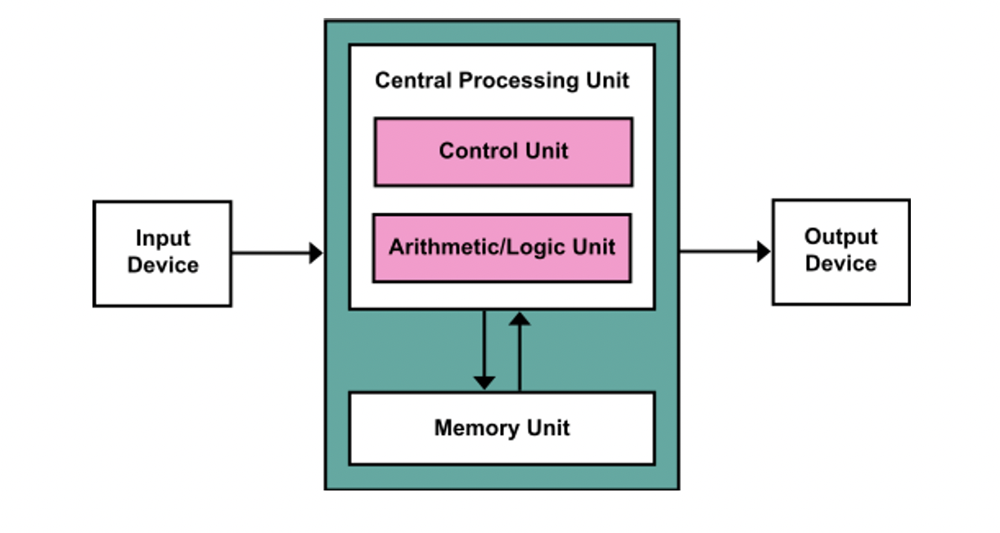

## 프로세스 구조

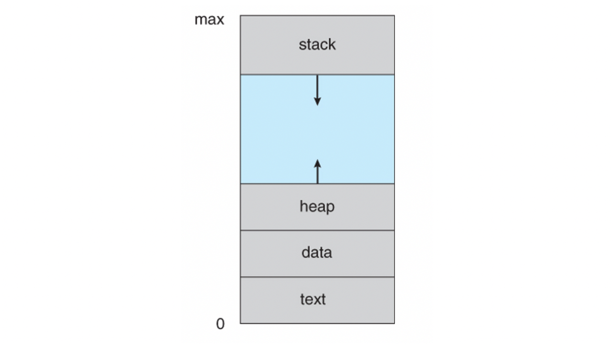

**Code 영역**

`실행할 프로그램의 코드`가 저장됩니다. CPU는 이 영역에서 명령어를 하나씩 가져와 처리하게 됩니다.

**Data 영역**

`전역변수와 정적변수`가 저장됩니다. 이 변수들은 프로그램이 시작될 때 할당되어 프로그램 종료 시 소멸됩니다.

+) 더 자세히 들어가면 BSS(Block Stated Symbol) 영역이 있는데요, 이 영역에는 초기화 되지 않은 전역변수가 저장됩니다. 초기화 된 전역변수는 Data 영역에 저장되어 비휘발성 메모리인 ROM에 저장되는데 이 부분은 비용이 많이 들어 RAM에 저장될 것과 ROM에 저장될 것을 구분하기 위해 영역을 구분해 사용합니다.

**Stack 영역**

지연변수, 매개변수, 리턴값 등 `잠시 사용되었다가 사라지는 데이터`를 저장하는 영역입니다. 함수 호출 시 할당되고 함수 반환 시 소멸됩니다. 로드 시(컴파일 타임) 크기가 결정됩니다.

위 세 영역은 컴파일 할 때 data, stack 영역의 크기를 계산해 메모리 영역을 결정합니다!

**Heap 영역**

`동적 데이터 영역`입니다. 메모리 주소 값에 의해서만 참조되고 사용되는 영역입니다. 따라서, *프로그램 동작 시(런타임)에 크기가 결정*됩니다.

예를 들어, stack에서 pointer 변수를 할당하면 pointer가 가리키는 heap 영역의 임의의 공간부터 원하는 크기만큼 할당해 사용하게 됩니다.

ref:[https://velog.io/@cchloe2311/운영체제-프로세스-메모리-구조](https://velog.io/@cchloe2311/%EC%9A%B4%EC%98%81%EC%B2%B4%EC%A0%9C-%ED%94%84%EB%A1%9C%EC%84%B8%EC%8A%A4-%EB%A9%94%EB%AA%A8%EB%A6%AC-%EA%B5%AC%EC%A1%B0)

## Multiprogramming and Multitasking

- Multiprogramming

  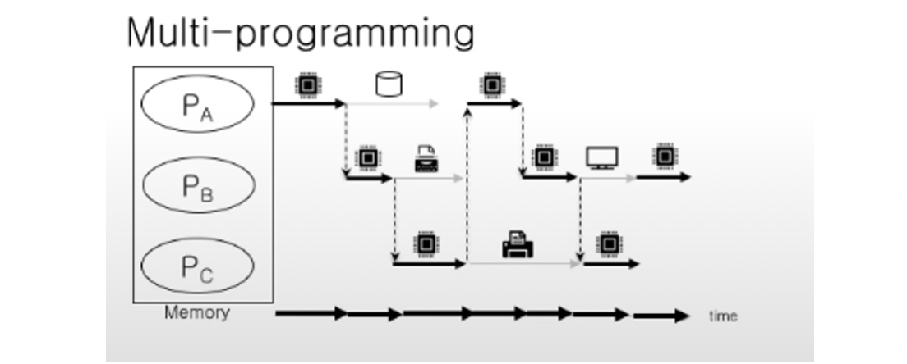

   - 하나의 프로세서가 여러개의 프로세스 실행
   - 여러개의 Task가 메모리에 올려짐
- Timesharing(Multitasking) - Round-Robin

  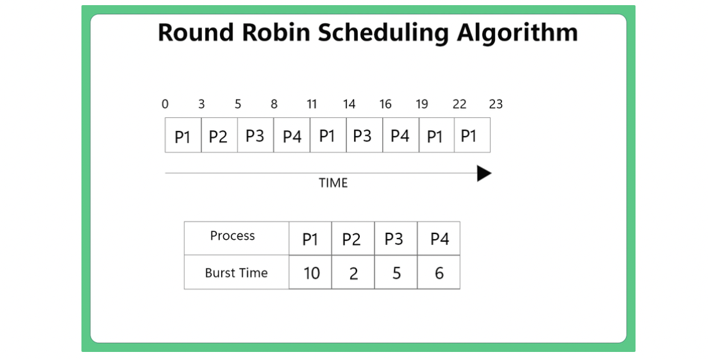

   - Multiprogramming과 비슷하나 task단위
   - =시분할시스템

## Multiprocessing

### Non-Uniform Memory Access System

- Context Switching이 자주 발생하기 때문에 오버헤드가 크지만, 기아상태를 어느정도 방지하여 프로세스간 공정성 높임

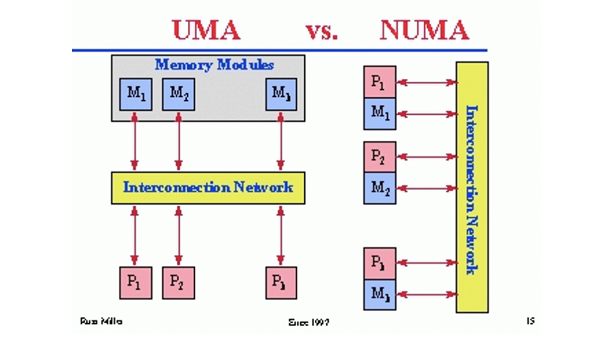

- **UMA : Uniform Memory Access**
   - 균일 기억 장치 접근
   - 모든 프로세서들이 상호간에 연결되어 하나의 메모리를 공유하는 기술
   - 프로세서들은 메모리의 어느 영역 이던지 접근이 가능하며, 모든 프로세서가 걸리는 시간이 동일하다
   - 구조가 간단하고, 프로그래밍 하기는 쉬우나, 메모리에 한번에 하나씩의 연결만 가능하여, 커지면 커질수록 효율성이 떨어진다.
   - 메모리 접근 시간이 비슷함
- **NUMA : Non-Uniform Memory Access**
   - 불균일 기억 장치 접근
   - UMA 모델의 한계를 극복하고, 더 큰 시스템을 만들기 위해 구성
   - 메모리 접근하는 시간이 프로세서와 메모리의 상대적인 위치에 따라 달라진다.
   - 빈번하게 쓰는 메모리에 대한 접근이 더 빠름

## Computer System Environments

### Client-Server

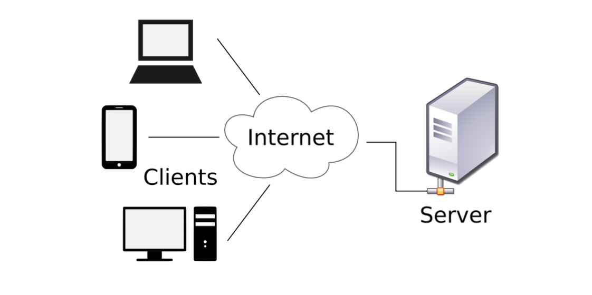

### Peer-to-Peer(P2P)

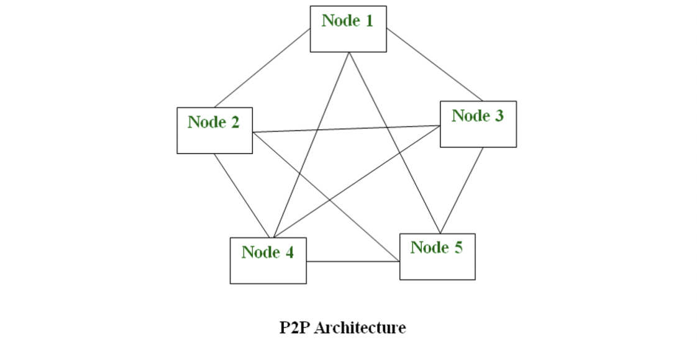


### Cloud Computing

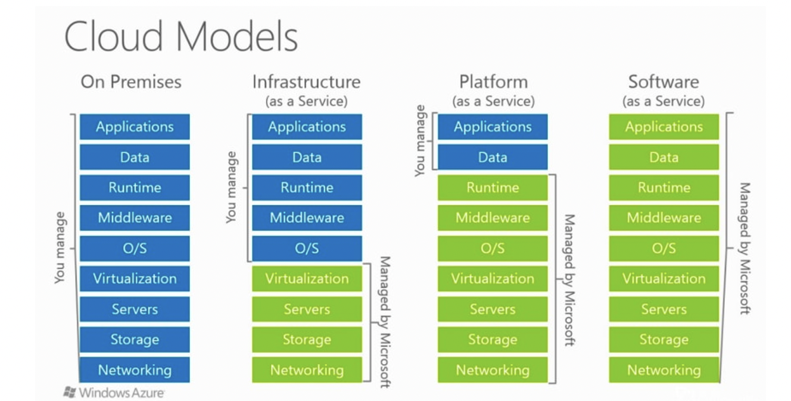

- SaaS(Software as a Service)
- PaaS(Platform as a Service)
- IaaS(Infrastructure as a Service)

## Emulation vs. Virtualization

**Emulation**

- 일반적으로 느림
- Interpretation(코드를 재해석)
- 하드웨어 역할을 소프트웨어가 대신 수행
- 호스트와 게스트 사이에 호환성 필요 없음

**Virtualization**

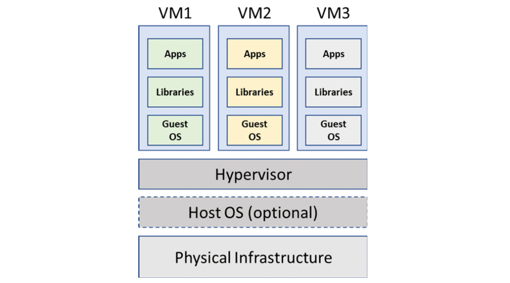

- Hypervisor
- 하드웨어와 연계된 가상화 기술
- 호스트와 게스트 사이에 호환성 요구

**Real-time OS(RTOS)**


>💡 정해진 시간 내에 무조선 Task를 끝내야 하는 경우


## User Operating System Interface - CLI(Command Line Interface)

**Shell**

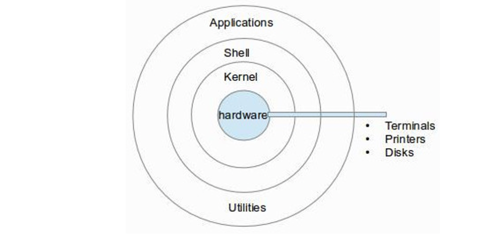

- OS서비스에 접근하기 위한 UI(User Interface)
- Command interpretation
- Several shells are availavle for Linux
   - BASH
   - CSH
   - KSH
- Shell Script
   - 쉘에 의해 동작하도록 설계된 프로그램

## User Operating System Interface - GUI(Graphic User Interface)

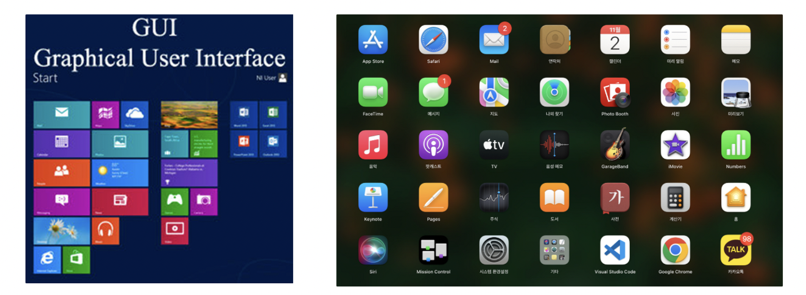

- GUI는 시각적인 구성 요소를 사용하여 애플리케이션과 사용자 사이의 상호작용을 가능하게 함.
- 마우스, 키보드, 터치 스크린 등의 입력 장치를 통해 애플리케이션을 조작하고 시각적인 요소로 정보를 표시

### **GUI vs. CLI**

- CLI(명령 줄 인터페이스)는 텍스트 명령어를 사용하여 컴퓨터와 상호작용하는 방식입니다.
- GUI는 그래픽적인 아이콘, 버튼, 창, 대화 상자 등을 사용하여 사용자가 쉽게 애플리케이션을 조작할 수 있도록 합니다.

## System calls vs. API

**System calls**

- OS에서 제공하는 기능을 사용하기 위한 프로그래밍 인터페이스
- 일반적으로 고수준 언어로 쓰임(C, C++)
- System call ∈ API
- 각 운영체제마다 System call은 다름(ex : Windows는 CreateProcess(), Unix는 fork())

**API**

- 최초의 API는 운영체제가 어플리케이션을 위해 제공하는 기능
- 확대된 의미
   - 하부 시스템(운영체제, 가상 머신 등)에서 상위에 존재하는 어플리케이션이나 앱에 제공하는 각종 기능(함수)들의 집합
   - 특정 플랫폼에서 하위 기능을 제어하거나, 제공하는 기능을 호출할 수 있는 함수들의 집합
   - 최근 온라인 서비스 등에서 클라이언트에 제공하는 기능들도 API라고 함
- API는 제품(OS 같은 경우)을 구매하거나, 사용(Google같은 경우)해야 사용할 ㅅ 있으며, 개발자가 제작하는 어플리케이션에 포함되지 않음, 즉 어플리케이션 외부의 기능을 호출

## Linux System Structure

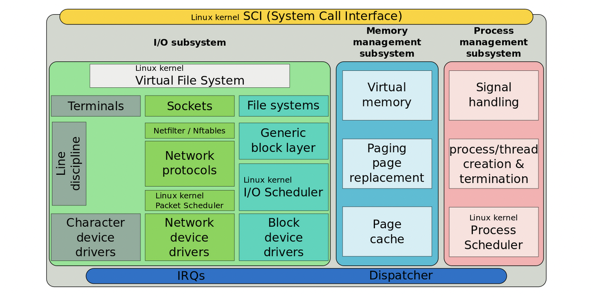

- 모놀리식(≠마이크로서비스)
- 모듈러 디자인

```toc
```
