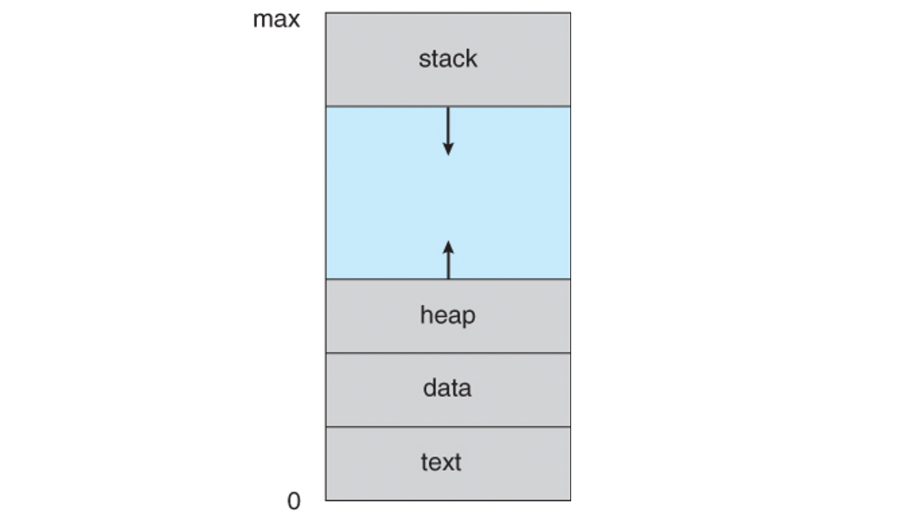
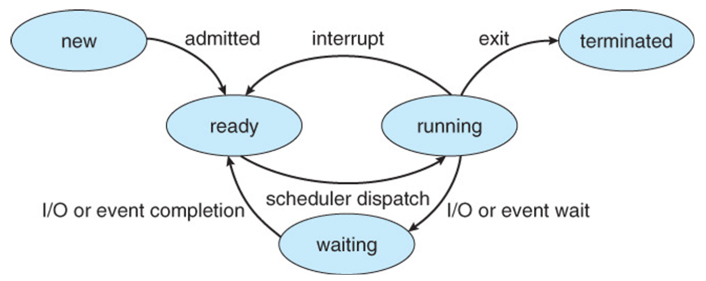
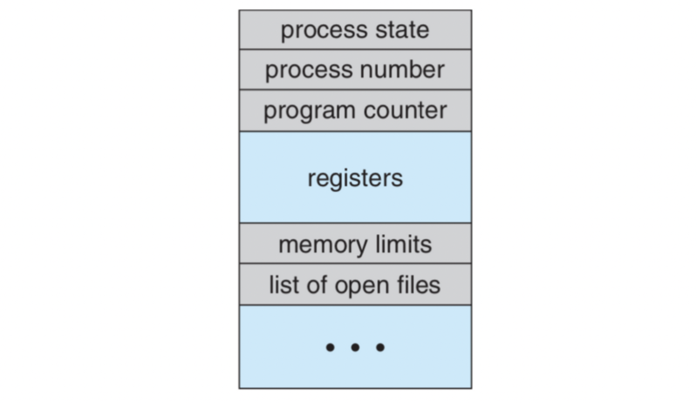
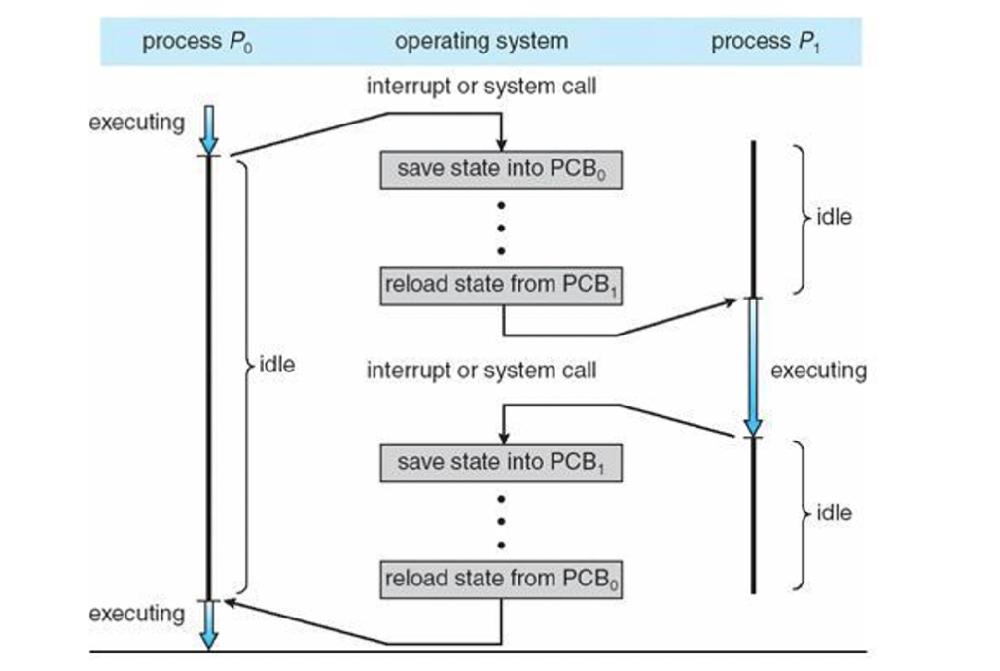
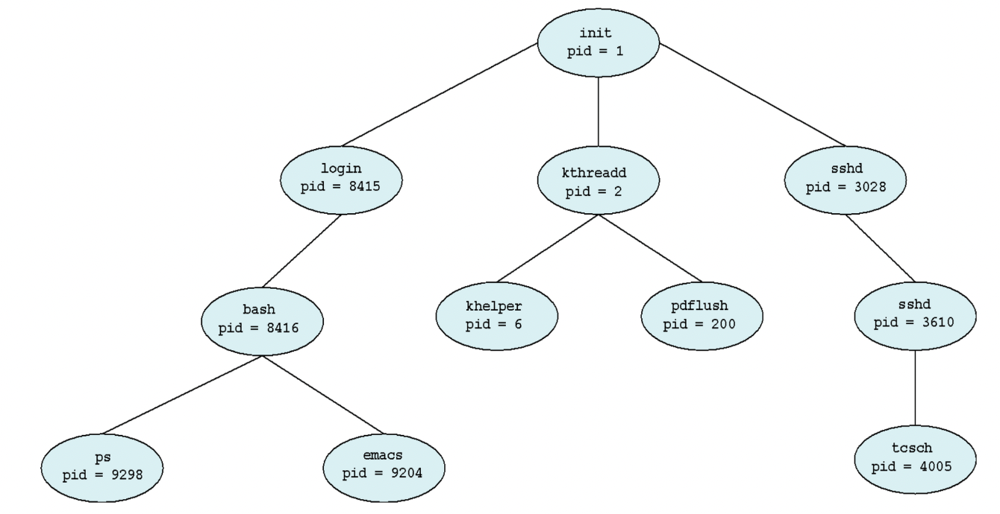
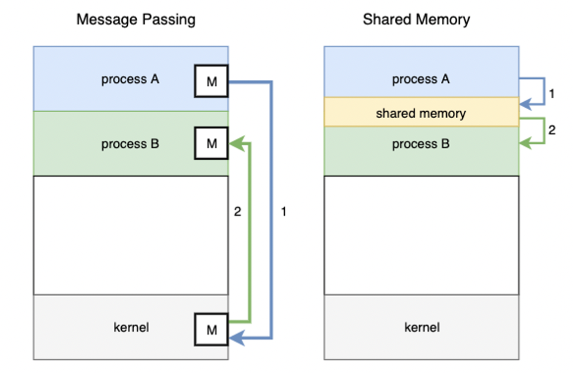

> ❗️**날짜별로 정리하여 복습하기를 원하기 때문에 내용이 길고 다소 정리되지 않았습니다.**
# Process Concept

## Process



### Code 영역

**실행할 프로그램의 코드**가 저장됩니다. CPU는 이 영역에서 명령어를 하나씩 가져와 처리하게 됩니다.

### Data 영역

**전역변수와 정적변수**가 저장됩니다. 이 변수들은 프로그램이 시작될 때 할당되어 프로그램 종료 시 소멸됩니다.

+) 더 자세히 들어가면 BSS(Block Stated Symbol) 영역이 있는데요, 이 영역에는 초기화 되지 않은 전역변수가 저장됩니다. 초기화 된 전역변수는 Data 영역에 저장되어 비휘발성 메모리인 ROM에 저장되는데 이 부분은 비용이 많이 들어 RAM에 저장될 것과 ROM에 저장될 것을 구분하기 위해 영역을 구분해 사용합니다.

### Stack 영역

지연변수, 매개변수, 리턴값 등 **잠시 사용되었다가 사라지는 데이터**를 저장하는 영역입니다. 함수 호출 시 할당되고 함수 반환 시 소멸됩니다. 로드 시(컴파일 타임) 크기가 결정됩니다.

위 세 영역은 컴파일 할 때 data, stack 영역의 크기를 계산해 메모리 영역을 결정합니다!

### Heap 영역

**동적 데이터 영역**입니다. 메모리 주소 값에 의해서만 참조되고 사용되는 영역입니다. 따라서, *프로그램 동작 시(런타임)에 크기가 결정*됩니다.

예를 들어, stack에서 pointer 변수를 할당하면 pointer가 가리키는 heap 영역의 임의의 공간부터 원하는 크기만큼 할당해 사용하게 됩니다.

ref:[https://velog.io/@cchloe2311/운영체제-프로세스-메모리-구조](https://velog.io/@cchloe2311/%EC%9A%B4%EC%98%81%EC%B2%B4%EC%A0%9C-%ED%94%84%EB%A1%9C%EC%84%B8%EC%8A%A4-%EB%A9%94%EB%AA%A8%EB%A6%AC-%EA%B5%AC%EC%A1%B0)

### 프로세스 상태 전이



- new : 프로세스 생성
- ready : 준비 큐에 프로세스 등록, 스케줄링 알고리즘에 따라 dispatch
- running : 프로세스 실행, 인터럽트 발생시 준비 큐로 이동, 입출력 이벤트 발생시 프로세스 대기
- waiting : 입출력 이벤트 처리, 완료 시 준비 큐로 이동
    - waiting에도 대기 큐가 있음, Device에 따라 다른 큐
- terminated : 프로세스 종료

### 프로세스 제어 블록(PCB)



| 이름                  | 내용                               |
|---------------------|----------------------------------|
| Process State       | 생성, 준비, 실행, 대기, 완료               |
| Process number(=id) | 프로세스 식별자                         |
| Program Counter     | 해당 프로세스가 다음에 실행할 Instruction의 주소 |
| registers           | 사용 중인 레지스터 정보                    |
| Memory limits       | 사용 가능한 메모리 공간 정보                 |

### Context Switching



(그림에서) `프로세스 P0`가 interrupt 혹은 system call에 의해 중단되면 `PCB0`의 상태를 저장하고, `PCB1` 의 상태를 로드해 준비 큐에서 `프로세스 P1`을 dispatch, 실행상태로 변경한다.

`프로세스 P1`가 interrupt 혹은 system call에 의해 중단되면 `PCB1`의 상태를 저장하고, `PCB0` 의 상태를 로드해 준비 큐에서 `프로세스 P0`을 dispatch, 실행상태로 변경한다.

>💡 idle = 프로세스가 실행하고 있지 않은 상태  
>idle이 겹치는 시간 = 오버헤드


## Operations on Processes

### Four steps of process creation

1. OS 커널에 PCB생성
2. 메모리 공간 할당
3. 바이너리 프로그램 로드
4. 프로그램 초기화

### Process Creation



- 부모 프로세스가 자식 프로세스 생성, 트리 형태로 구성됨
- 일반적으로 프로세스는 process identifier(pid)를 통해 인식되고 관리됨
- 위 그림은 Linux에서의 프로세스 트리 구조

---

- 자원(CPU time, memory, files, I/O Devices) 공유 옵션 :
    - 부모-자식이 모든 자원을 공유
    - 자식이 부모 자원의 일부만 공유
    - 서로 자원을 공유하지 않음
- 실행 옵션 :
    - 부모-자식이 동시에 실행
    - 부모가 자식프로세스의 종료를 기다림
- Address-space possilibities for the new process :
    - 자식 프로세스가 부모 프로세스를 복제함(부모와 같은 데이터를 가짐 - 예 : 리눅스)
    - 자식 프로세스가 새로운 프로그램을 로드(예 : 윈도우)

### fork(), exec()

fork()함수로 부모 프로세스가 자식프로세스를 생성(Linux : Duplicate), fork()의 반환값은 부모 프로세스는 양수, 자식 프로세스는 0을 반환함.

부모 프로세스는 wait() 함수를 통해 자식 프로세스가 exit()함수를 호출할때까지 기다림. 부모가 받는 fork()의 반환값은 이후 생성될 자식프로세스의 pid를 의미함.

fork()이후에 자식프로세스는 자신 고유의 pid를 가짐. pid를 할당하는 알고리즘 및 Policy는 OS에 따라 다름

## Interprocess Communication

시스템의 프로세스들은 `독립적`이거나 `협력적`임

`독립적인 프로세스`는 다른 프로세스의 실행에 영향을 주거나 영향을 받을 수 없음.

`협력적인 프로세스`는 다른 프로세스의 실행에 영향을 주거나 영향을 받을 수 있음.

**협력적인 프로세스를 사용하는 이유**

- 정보 공유
- 연산속도 향상
- 모듈성
- 편리성

>💡 협력적인 프로세스는 정보 공유를 위해 Interprocess communication(IPC)를 필요로 한다.


### Interprocess Communication(IPC)

**Communications Models**



- Two models of IPC
    - Message Passing(1 : send, 2 : receive)
    - Shared Memory(1 : write, 2 : read)

---

1. **Message Passing**
2. **Shared Memory(효율적)**
    - 프로세스간 소통을 위해 메모리 공간을 공유하는 것
    - OS영역이 아닌 User control area에 의해 통제됨
    - Major issue - 어떻게 공유된 공간에 대한 두 프로세스의 행동을 동기화(Synchronization)할 것인가?

### Producer-Consumer Problem

- Paradigm : `producer process` 는 `consumer process`가 소비할 정보를 생산함
- Two variations:
    - Unbound-buffer : 무한한 버퍼 사이즈
        - 공급자가 절대 기다리지 않음
        - 소비자는 소비할 버퍼가 없다면 기다림
    - Bounded-buffer : 유한한 버퍼 사이즈
        - 공급자는 버퍼가 가득 차면 기다려야 함
        - 소비자는 소비할 버퍼가 없다면 기다림


```toc
```
