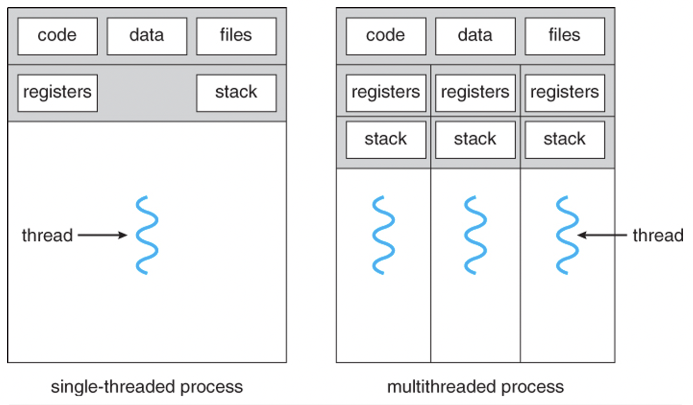
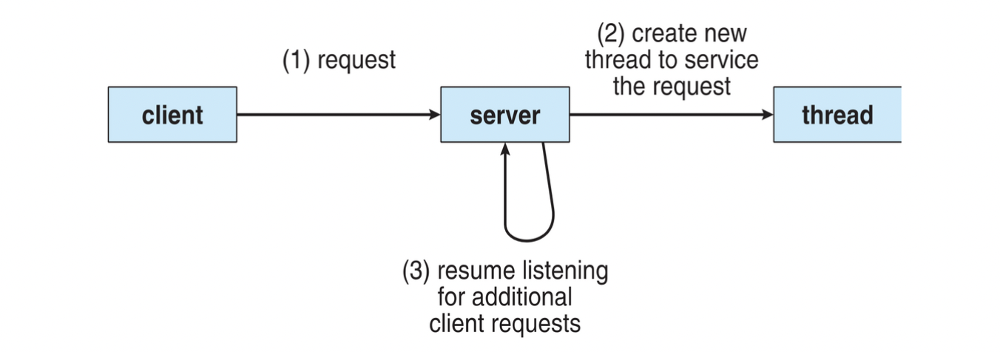
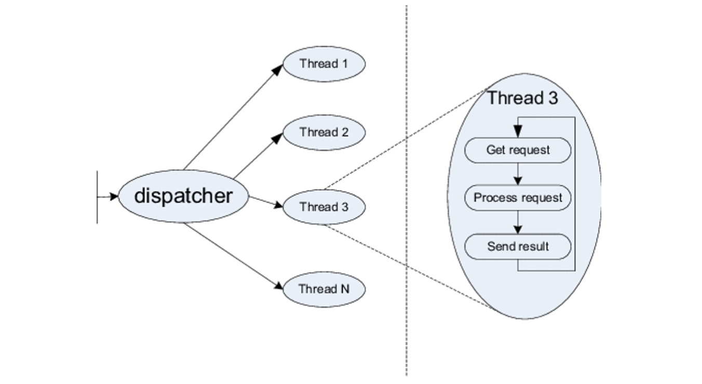
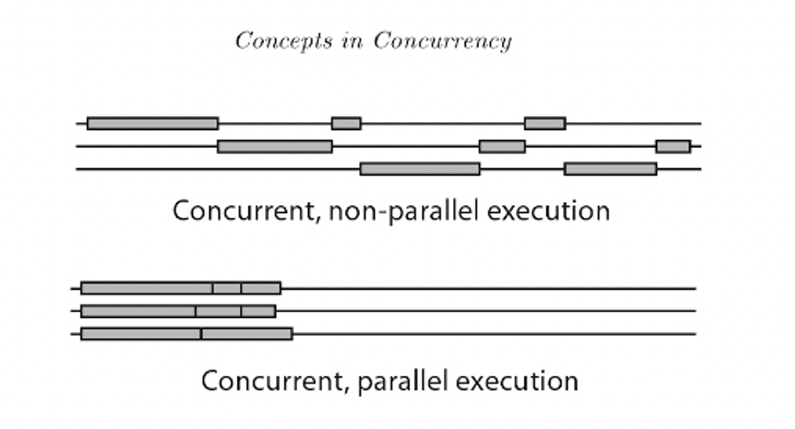
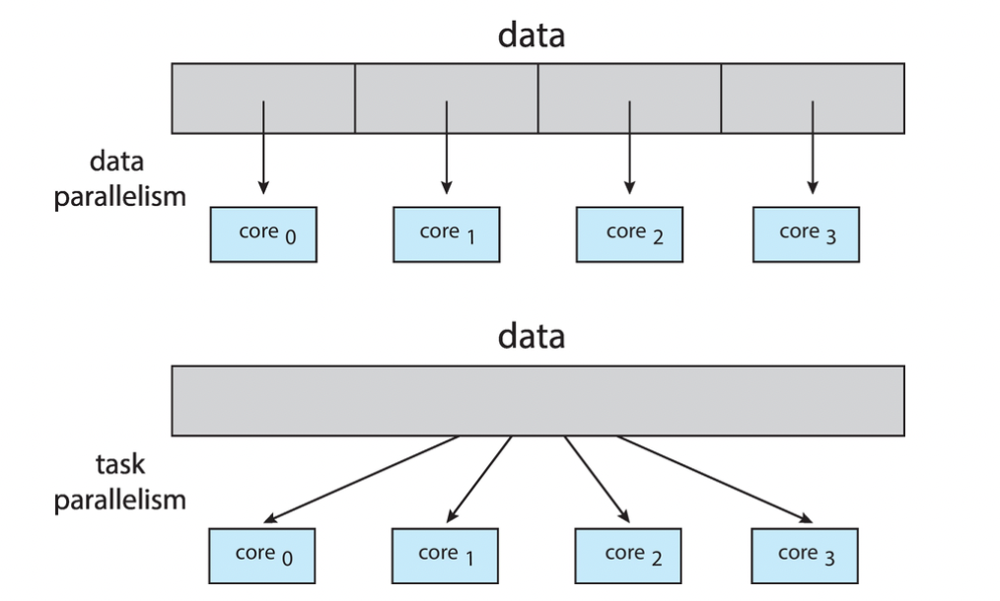
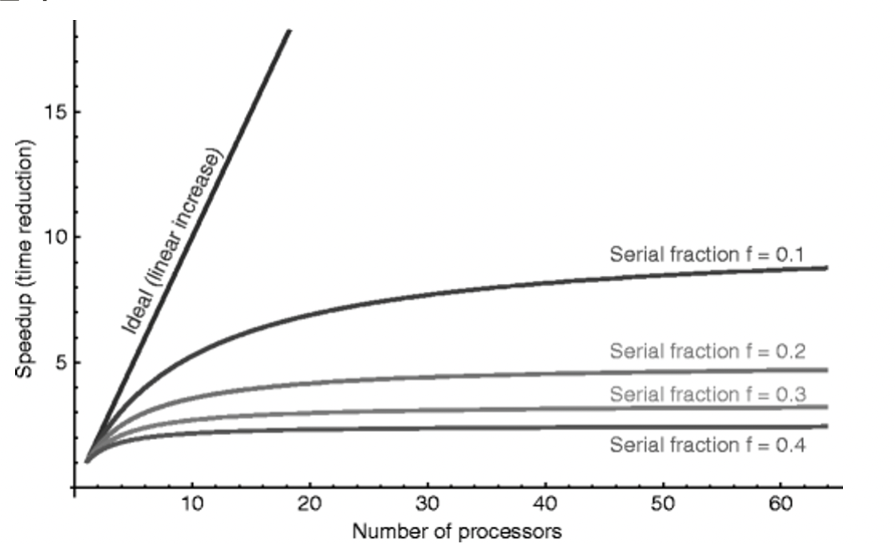
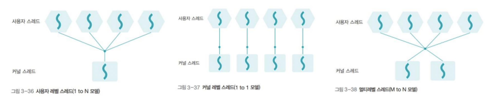

> ❗️**날짜별로 정리하여 복습하기를 원하기 때문에 내용이 길고 다소 정리되지 않았습니다.**
# Thread & Concurrency

## Thread Overview




>❗ 쓰레드는 코드, 데이터, 힙 영역을 공유하고 스택영역만을 따로 할당한다.


**스택을 독립적으로 할당하는 이유**

> 스택은 함수 호출 시 전달되는 인자, 되돌아갈 주소값 및 함수 내에서 선언하는 변수 등을 저장하기 위해 사용되는 메모리 공간이다. 따라서 스택 메모리 공간이 독립적이라는 것은 독립적인 함수 호출이 가능하다는 것이고, 이는 독립적인 실행 흐름이 추가되는 것이다. 결과적으로 실행 흐름의 추가를 위한 최소 조건이 독립된 스택을 제공하는 것이다.
>

**코드 영역을 공유**

> 프로세스는 독립적인 구조이기 때문에 다른 프로세스의 Code영역에 있는 함수를 호출할 수 없다.쓰레드는 Code영역을 공유하기 때문에 두 개 이상의 쓰레드가 자신이 포함된 프로세스의 Code영역에 있는 함수를 호출할 수 있다.
>

**데이터 영역과 힙 영역을 공유**

> 전역 변수와 동적 할당된 메모리 공간을 공유할 수 있고, 이를 통해 쓰레드 간 통신을 할 수 있지만 동시에 메모리에 접근하기 때문에 주의해야 한다.
>

### Multithreaded Server Architecture





Server의 main thread가 client를 받아 요청에 따라 work thread 생성 후 client마다 분배

단점 : 스레드 생성에 많은 시간 소요, 스레드가 하나의 일을 끝내면 삭제됨, 스레드의 바운드(최대 개수)를 정해줘야 함

### 개선 : Thread Pools

- Thread를 미리 Pool에 만들어둠
- 서버로 Request가 들어오면 Pool에서 Thread 하나를 깨움
- Request가 끝나면 다시 Pool에서 재움

pool에 스레드를 몇개 생성할 것인가? → 경험에 의해 결정(해봐야 암)

## Multicore Programming



- Concurrency(병행성) : 하나 이상의 progress를 실행
    - 동시에 실행되는 것처럼 보이는 것
- Parallelism(병렬성) : 하나 이상의 task를 **동시에** 실행
    - Multicore에서만 가능

---



- Types of parallelism
    - Data parallelism - 같은 알고리즘(같은 코드)로 다른 데이터를 다룸
    - Task parallelism - 같은 데이터로 여러개의 Task 처리, 쓰레드마다 다른 일을 함

### 암달의 법칙




>❗ 코어 수가 증가한다고 해서 속도 향상 그래프가 선형적이지 않음


S(그래프에선 f) : Serial portion - 동시 실행이 불가능한 부분 비율

(1-S) : parallel portion - 동시 실행이 가능한 부분 비율

N : processors


>💡 Serial portion 비율이 높아질수록 Processor 수에 비례한 속도 향상의 효율성이 낮음  
>→ 병렬처리가 가능한 부분을 늘려야 효율성이 높다.


## User Threads & Kernel Threads



**커널 레벨 스레드**

- 커널 스레드는 **가장 가벼운 커널 스케쥴링 단위**다.
- 하나의 프로세스는 적어도 하나의 커널 스레드를 가지게 된다.
- 커널 영역에서 스레드 연산을 수행하게 된다.
- 커널이 스레드를 관리하기 때문에 **커널에 종속적**이다.
- 프로그래머 요청에 따라 스레드를 생성하고 **스케줄링하는 주체가 커널**이면 커널 레벨(Kernel Level) 스레드라고 한다.

**커널 레벨 스레드 장점**

- 프로세스의 스레드들을 몇몇 프로세서에 **한꺼번에 디스패치** 할 수 있기 때문에 멀티프로세서 환경에서 매우 빠르게 동작한다.
- 다른 스레드가 입출력 작업이 다 끝날 때까지 다른 스레드를 사용해 다른 작업을 진행할 수 있다.
- 커널이 **각 스레드를 개별적으로 관리**할 수 있다.
- 커널이 직접 스레드를 제공해 주기 때문에 안정성과 다양한 기능이 제공된다.

**커널 레벨 스레드 단점**

- 스케줄링과 동기화를 위해 **커널을 호출하는데 무겁고 오래걸린다**.(저장한 내용을 다시 불러오는 과정이 필요)
- 즉, 사용자 모드에서 커널 모드로의 전환이 빈번하게 이뤄져 **성능 저하**가 발생한다.
- 사용자가 프로그래밍할 때 구현하기 어렵고 **자원을 더 많이 소비**하는 경향이 있다.

**사용자 레벨 스레드**

- 사용자 영역에서 스레드 연산을 수행한다.
- 사용자 영역에서 스레드 연산을 수행하기 때문에 운영체제에 투명하다.
- 커널에 의존적이지 않은 형태로 스레드의 기능을 제공하는 **라이브러리를 활용**하는 방식이 사용자 레벨(User Level) 스레드다.

**사용자 레벨 스레드 장점**

- 운영체제에서 스레드를 지원할 필요가 없다.
- 스케줄링 결정이나 동기화를 위해 커널을 호출하지 않기 때문에 **인터럽트가 발생할 때 커널 레벨 스레드보다 오버헤드가 적다**.
- 즉, 위의 말은 사용자 영역 스레드에서 행동을 하기에 **OS Scheduler의 context switch가 없다(유저레벨 스레드 스케줄러를 이용)**.
- **커널은 사용자 레벨 스레드의 존재조차 모르기** 때문에 모드 간의 전환이 없고 성능 이득이 발생한다

**사용자 레벨 스레드 단점**

- 시스템 전반에 걸친 **스케줄링 우선순위를 지원하지 않는다**. (무슨 스레드가 먼저 동작할 지 모른다.)
- 프로세스에 속한 스레드 중 **I/O 작업등에 의해 하나라도 블록이 걸린다면 전체 스레드가 블록**된다.


```toc
```
