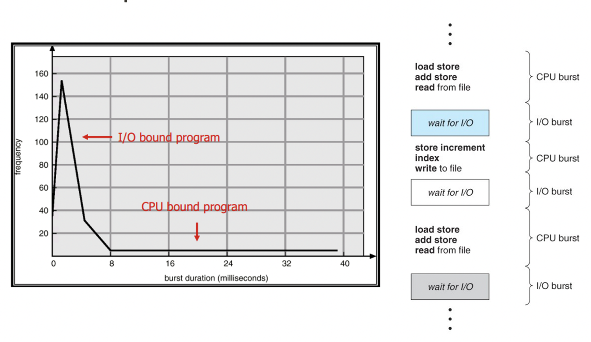
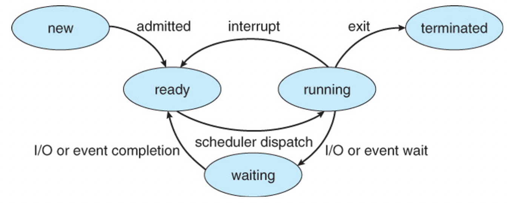
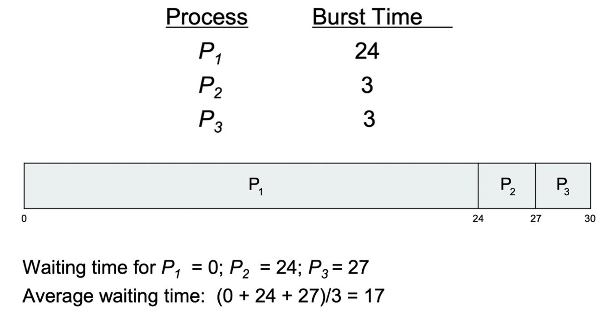
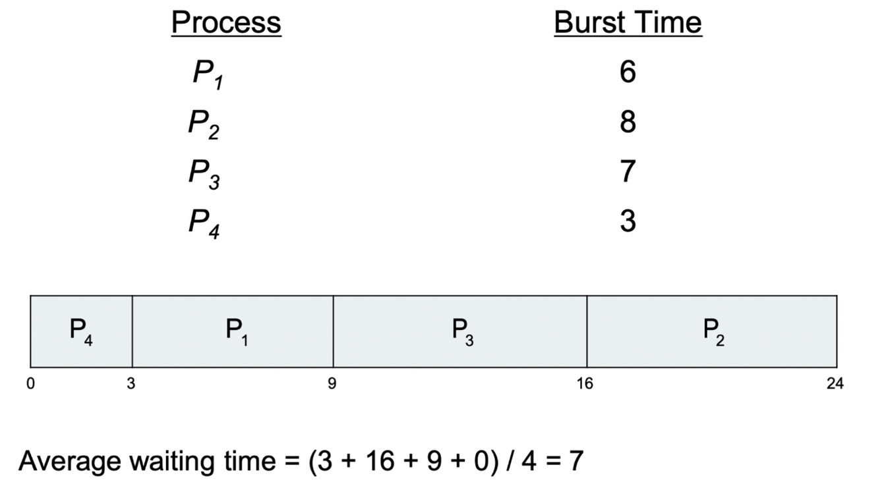
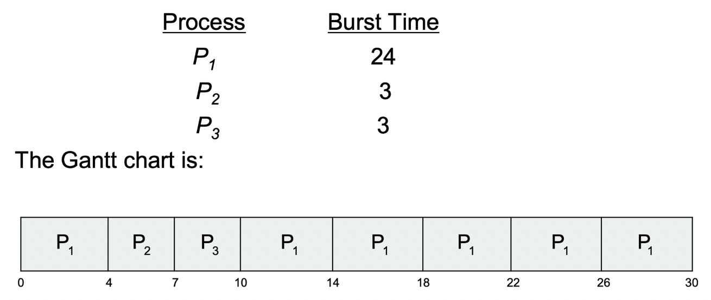
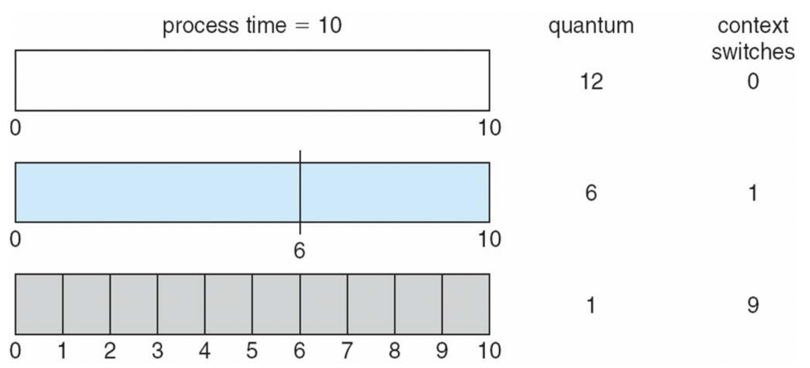
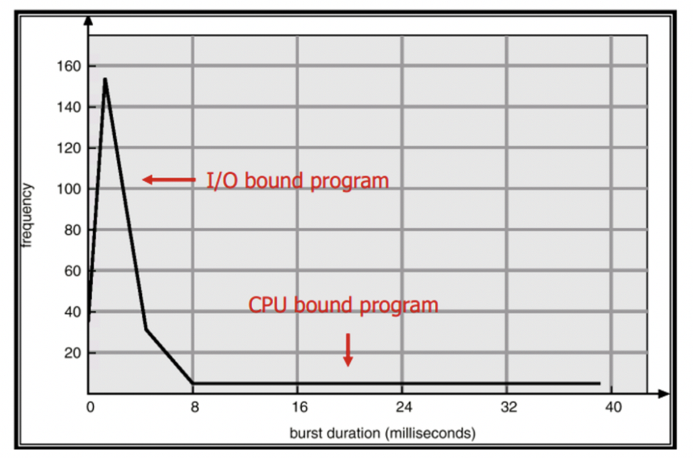
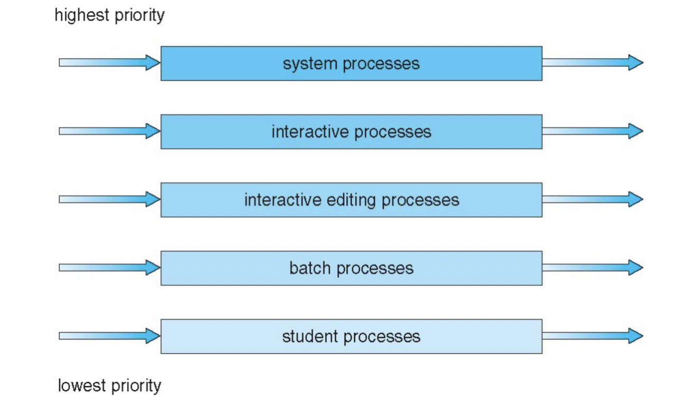
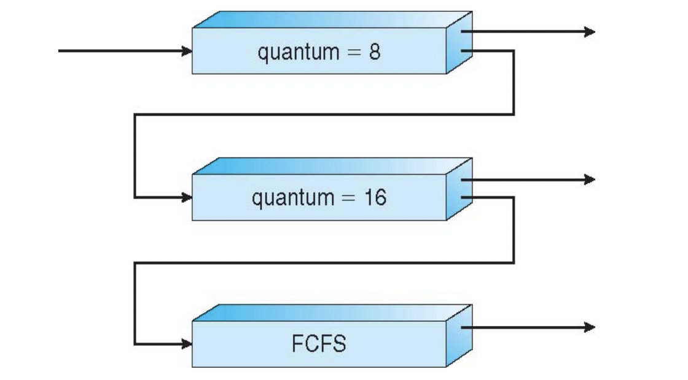

> ❗️**날짜별로 정리하여 복습하기를 원하기 때문에 내용이 길고 다소 정리되지 않았습니다.**
# CPU Scheduling

## Basic Concept



- 멀티프로그래밍을 통해 최대 CPU 활용률을 얻기 위함
- CPU – I/O 버스트 주기 – 프로세스 실행은 CPU 실행 주기와 I/O 대기 주기로 구성됨
- `CPU 버스트` → `I/O 버스트` → `CPU 버스트` 분포가 기본

## CPU Scheduler



- CPU Scheduler는 준비 큐에서 어떤 프로세스를 선택해서 Processor에 할당할지 결정한다.
    - 준비 큐는 다양한 방법으로 순서를 정할 수 있다.
- CPU Scheduling은 process를 어떤 상태로 만들지 결정한다.
    1. Switches from running to waiting state(e.g., I/O request)
    2. Switches from running to ready state(e.g., timer out)
    3. Switches from waiting to ready state(e.g, I/O finished interrupt)
    4. Terminate

## 선점 스케줄링 및 비선점 스케줄링

비선점 스케줄링 : CPU를 사용하고 있는 프로세스의 권한을 다른 프로세스가 뺏을 수 없음.

- 엄격한 비선점 스케줄링 : 어떤 경우에도 다른 프로세스가 CPU를 점유하고 있는 프로세스의 권한 탈취 불가능(Interrupt 등에도)

선점 스케줄링 : CPU를 사용하고 있는 프로세스의 권한을 다른 프로세스가 뺏기 가능.

## 스케줄링 평가 기준

시스템

- CPU Utilization - CPU가 가능한 한 바쁜 정도
- Throughput - 프로세스가 유닛당 실행을 완료하는 시간

유저

- Turnaround Time - 특정 프로세스가 도착 후 반환되는데까지 걸리는 시간(완료 시간 - 도착 시간 = 반환 시간)
- Waiting Time - 프로세스가 준비 큐에서 기다린 시간(대기 시간)
- Response Time - 프로세스가 도착 후 최초로 CPU를 점유하는데 걸리는 시간(시작 시간 - 도착 시간 = 응답 시간)

## 스케줄링 알고리즘

### First-Come, First-Served (FCFS)



- P1, P2, P3이 0초에 순서대로 도착했다고 가정하면 위와 같은 결과가 나온다.
- Convoy Effect

### Shortest-Job-First (SJF)



- P1, P2, P3, P4가 0초에 동시에 도착한다고 가정(순서대로가 아니라 동시라고 가정)하면 제일 Burst Time이 적은 것부터 우선 실행
- 위 내용은 비선점 SJF의 내용임
- 선점 SJF의 경우 Time Quantum를 사용하는 것이 일반적(스케줄링 동안 다른 프로세스의 도착하지 않도록 보장하기 어렵기 때문)
- 이상적이고 최적이지만 실제로 수행하기에는 어려움
    - 미래 예측, 프로세스의 Burst Time을 예측하기 어려움
    - **Exponential Averaging(지수 가중 평균)을 이용**
        - 데이터의 이동 평균을 구할 때, 오래된 데이터가 미치는 영향을 지수적으로 감쇠(exponential decay) 하도록 만들어 주는 방법.

### Round-Robin (RR)



> 선점 스케줄링 방식인 Round Robin 방식은 Time Quantum이 필요  
> 위 간트 차트는 **Time Quantum = 4**일 때

- 모든 프로세스는 (n-1)q 시간 이상 기다리지 않음



- Time Quantum의 변화에 따른 간트차트 및 context switch



> 위 그래프를 보면 알 수 있듯, 대부분의 프로세스는 I/O 중심 프로세스이다. I/O 중심 프로세스는 burst time이 상대적으로 적은 경향이 있으므로, 대부분의 I/O 중심 프로세스의 burst time보다는 크게 time quantum을 정하는 것이 효율적이다.


### Priority Scheduling

- 각 프로세스에 Priority Number를 부여
- CPU는 Priority Number에 따른 우선순위에 의해 CPU 할당
    - 선점
    - 비선점
- 예시 : SJF 스케줄링은 Priority Number대신 작업의 짧은 정도를 통해 우선순위 배정
- 문제
    - 기아상태 발생 → 낮은 우선순위의 프로세스는 오랫동안 실행되지 않을 수 있음
    - 해결책 : Aging 기법 → 시간이 지날수록 프로세스의 우선순위를 높이는 방법

### Multilevel Queue Scheduling



- 프로세스 타입에 따라서 우선순위가 있는 여러개의 큐 사용
    - 상위 큐가 비어야 하위 큐에서 꺼냄
    - 각각의 큐마다 다른 스케줄링 사용 가능
    - **큐간 이동이 불가능**

### Multilevel Feedback Queue Scheduling



- 그림의 경우 3개의 큐
    - Q0 - `Time Quantum=8`의 `Round-Robin` 방식
    - Q1 - `Time Quantum=16`의 `Round-Robin` 방식
    - Q2 - `FCFS`방식
    - 큐간 우선순위는 정하기 나름, 위 그림에서는 에이징(Aging) 기법을 사용하지 않았음.

```toc
```
