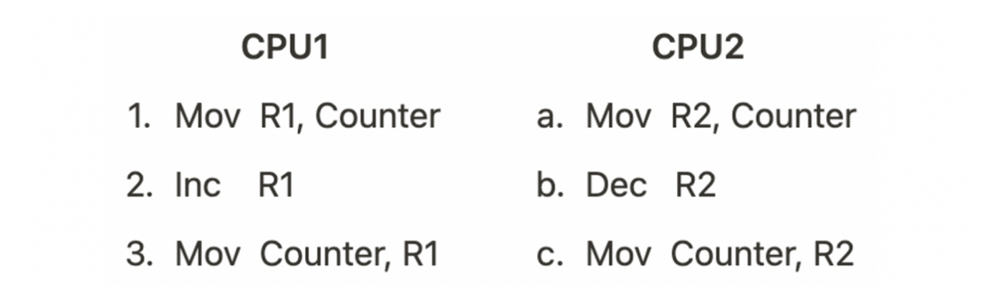
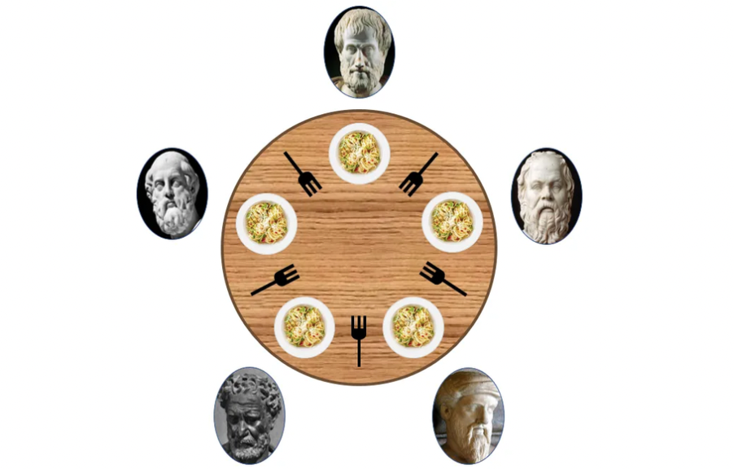
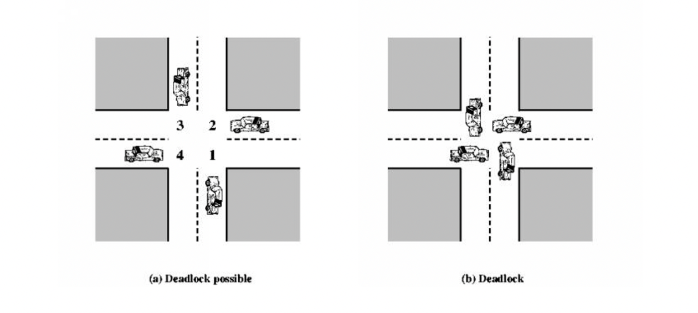
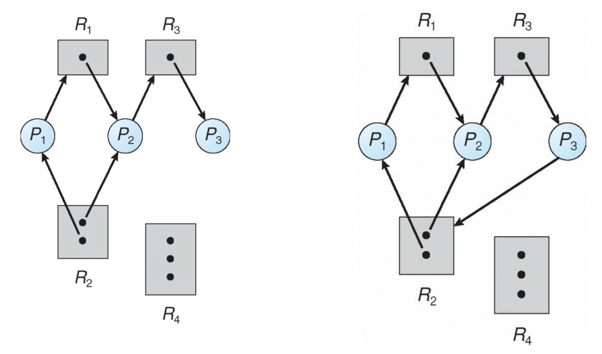
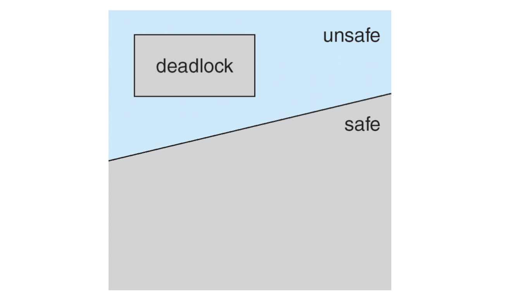

> ❗️**날짜별로 정리하여 복습하기를 원하기 때문에 내용이 길고 다소 정리되지 않았습니다.**
# Synchronization Tools

### Background

- 협력적인 프로세스는 다른 프로세스에 영향을 주거나 받을 수 있다.
- 프로세스간 공유 데이터 영역은 데이터 불일치의 가능성이 있다.
- 협력적인 프로세스에서는 데이터의 일치성을 유지시키는 것이 필요.

### Race Condition

> 여러개의 프로세스가 동시에 `공유 데이터`에 접근하는 것
>
- 공유된 데이터의 최종값은 마지막으로 완료된 프로세스에 의존
- Race Condition을 예방하기 위해 동시적인 프로세스는 동기성을 유지해야 함.

### Example of a Race Condition

>💡 Counter++ is not **atomic**


**if**…



> a→b→c→1→2→3 : 5  
> a→1→b→2→c→3 : 4  
> a→1→b→2→3→c : 6  

- 결과에 일관성이 없음
- 암달의 법칙의 한가지 원인

### 임계 영역(Critical Section)

여러 프로세스 또는 스레드가 공유 자원에 접근하는 코드 영역

### 상호 배제(Mutual Exclusion)

한 프로세스 또는 스레드가 임계 영역에 진입했을 때 다른 프로세스 또는 스레드들이 동시에 접근하지 못하도록 하는 메커니즘

### Mutex Locks

```c
while (true){
	aquire lock

	critical section

	release lock

	remainder section
}
```

**Lock 구현 방법 1 : Semaphores**

```c
wait(S){
	while(S <= 0)
		;//busy wait
	S--;
}
signal(S){
	S++;
}
```

## Classical Problems of Synchronization

- Bounded-Buffer Problem(Producer-consumer Problem)
    - 제한된 버퍼에 데이터를 채우고/가져가는 문제
- Readers and Writers Problem
    - 데이터의 공유문제
- Dining-Philosophers Problem
    - 한 자원을 가지고 다른 자원을 요청하는 문제


### Bounded-Buffer Problem(Producer-consumer Problem)

- 버퍼에 넣는 행위와 꺼내는 행위는 동시에 양립해선 안 됨
- if semaphore full = 0, empty = n, mutex = 1; (각 찬 버퍼의 수, 빈 버퍼의 수, 뮤텍스)

```c
//PRODUCER
while(1){
	produce an item
	...
	wait(empty);
	wait(mutex);
	...
	add item to buffer
	...
	signal(mutex);
	signal(full);
}
```

```c
//CONSUMER
while(1){
	wait(full);
	wait(mutex);
	...
	remove an item from buffer
	...
	signal(mutex);
	signal(empty);
	...
	consume the item
	...
}
```

### Readers-Writers Problem

- 하나가 Read하면 다른 이들도 모두 Read할 수 있음
- 하나가 Write하면 다른 누구도 Write 혹은 Read할 수 없음
- if semaphore mutex = 1, rw_mutex = 1;

```c
//Writer
wait(rw_mutex);
...
writing is performed
...
signal(rw_mutex);
```

```c
//Reader
wait(mutex);
read_count++;
if(read_count==1) wait(rw_mutex); //첫번째 Reader만 wait호출
signal(mutex);
...
reading is performed
...
wait(mutex);
read_count--;
if(read_count==0) signal(rw_mutex); //빠져나온 Reader가 마지막이면 signal호출
signal(mutex);
```

- **위 솔루션은 Reader가 끊임없이 들어올 때, Writer가 기아상태에 빠질 수 있음.**
- 다양한 Variation

### Dining-Philosophers Problem



- semaphore fork[5]; // Initially all values are 1-식탁에 놓여 있음

```c
while(true){
	wait(fork[i]);
	wait(fork[(i+1)%5]);
	//eat for awhile...
	signal(fork[i]);
	signal(fork[(i+1)%5]);
	//think for awhile...
}
```

- **위 솔루션은 교착상태(Deadlock)에 빠질 수 있음**

## Deadlock



- Deadlock : 프로세스들이 얽혀서 결코 일어나지 않을 상황을 끝없이 기다리는 것
- Livelock : 락의 해제와 획득을 반복적으로 하며 실질적인 작업을 하지 못하는 것
- Starvation : 우선순위에 밀려 일어날 가능성이 낮은 일을 기다리는 것

### Deadlock 조건

- 상호 배제 : 하나의 프로세스만 자원에 접근 가능
- Hold and wait : 프로세스가 하나 이상의 자원을 가지고 다른 자원을 기다려야함
- 비선점 : 다른 프로세스의 자원을 뺏을 수 없음
- 원형 대기 : 프로세스들이 원형으로 다음 프로세스의 자원 해제를 대기함

### 방법 1. Deadlock Prevention

위 조건 중 하나라도 만족하지 않으면 효율성은 떨어지나 데드락이 발생하지 않음.

- 원형 대기를 제외하는 것이 가장 나음. 뮤텍스에 우선순위 부여하여 순서대로 await하면 해결
- 그러나 효율이 낮기 때문에 Deadlock Avoidence 선택

### 방법 2. Deadlock Avoidence

**Resource Allocation Graph**



좌측 → 우측으로 변하면 Cycle이 생겨서 데드락 발생 가능성이 생김.



위 Cycle이 생긴다고 데드락이 무조건 발생하지는 않음.

Cycle을 만들지 않도록 하는 방법이 Avoidence

### **은행원 알고리즘(Banker’s Algorithm)**

다익스트라가 제안한 기법으로, 어떤 자원의 할당을 허용하는지에 관한 여부를 결정하기 전에, **미리 결정된 모든 자원들의 최대 가능한 할당량을 가지고 시뮬레이션 해서 Safe state에 들 수 있는지 여부**를 검사
즉 대기중이 다른 프로세스들의 활동에 대한 교착 상태 가능성을 미리 조사하는 것

**처음에 시스템이 총 12개의 자원을 가지고 있다고 가정**

| (t=t0) | Max | Allocation | Need | Available |
| --- | --- | --- | --- | --- |
| P0 | 10 | 5 | 5 |  |
| P1 | 4 | 2 | 2 |  |
| P2 | 9 | 2 | 7 |  |

P0~P2는 프로세스이고, `Max`는 각 프로세스마다 최대 자원 요청량, `Allocation`은 현재 프로세스에 할당 중인 자원의 양, `Need`는 남은 필요한 자원의 양(Max-Allocation) 입니다.

현재 t0일 때 **프로세스에 할당된 자원의 합은 5+2+2=9개** 입니다. 따라서 현재 **Available 자원**은 12 - 9 = **3개** 입니다.

여기서 Safe sequence를 찾아보려고 합니다. 순서가 `<P1, P0, P2>` 일 때 안전 순서를 만족합니다.

- `P1`은 2개가 이미 할당되어 있고, 2개를 추가적으로 할당받기를(`Need`) 기다리고 있습니다. 현재 **Available 자원은 3개**이므로, 이 중에 2개를 P1에게 할당해 줍니다. => **현재 Available은 3 - 2 = 1개**
- 실행이 끝난 `P1`은 자신에게 할당되어 있던 자원 4개를 모두 반납합니다. => **현재 Available은 1 + 4 = 5개**
- 현재 Available 자원이 5개이고, 이를 **P0에게 모두 할당해 주면** P0도 실행 가능해집니다. => **현재 Available은 5 - 5 = 0개** 가 됩니다.
- 실행이 끝난 `P0`은 자신에게 할당되어 있던 자원 10개를 모두 반납합니다. => **현재 Available은 0 + 10 = 10개**
- 마지막으로 `P2`에게 자원 7개를 할당해 줍니다. => **현재 Available은 10 - 7 = 3개**
- 실행이 끝난 `P2`는 자신에게 할당되어 있던 자원 9개를 모두 반납합니다. => **현재 Available은 3 + 9 = 12개**

이렇게 자원의 부족함 없이 올바르게 할당하여 모든 프로세스가 실행을 할 수 있었습니다.

만약 여기에서 P2 프로세스가 처음에 자원을 하나 더 할당받고 있었다면(즉, 2개가 아니라 3개) 운영체제가 가지고 있는 Available 자원은 12 - (5+2+3) = **2개** 였을 것입니다.

이 상황에서는 처음에 P1에게 2개를 모두 주고, P1이 실행이 끝나고 자원을 모두 반납해도 **Available 자원은 2 + 2 = 4개 뿐**이므로, 이 자원으로는 나머지 P0이나 P2 프로세스를 해결해 줄 수 없습니다. (모두 4개보다 많은 양의 자원을 필요로 하고 있으므로)

따라서 P0, P2는 자원을 할당받기를 계속 기다려야 할 것입니다.

운영체제가 사전에 P2 프로세스가 자원을 하나 더 요청했을 때 할당해 주지 않고, P1이 먼저 끝나게 한다면 데드락이 발생하지 않았을 것입니다. 그러므로 은행원 알고리즘을 사용해서 **자원 할당량을 사전에 파악하고 데드락을 회피**할 수 있도록 하면 될 것입니다.

- **최대 자원 요구량 및 할당할 수 있는 자원 수가 일정해야 하는 제약조건**
- 자원 이용도가 낮음
- 예시에서는 자원이 1개이지만 여러개의 자원에 대해서도 적용 가능하다. ([링크](https://www.youtube.com/watch?v=pyOJDBphHkI&t=748s))

### 방법 3. Deadlock Detection & Recovery

### 방법 4. Ignore the Deadlock Problem

- UNIX, Windows 등의 운영체제가 이 방법 채택, 개발자에게 떠넘김


```toc
```
