> ❗️**날짜별로 정리하여 복습하기를 원하기 때문에 내용이 길고 다소 정리되지 않았습니다.**
# Main Memory

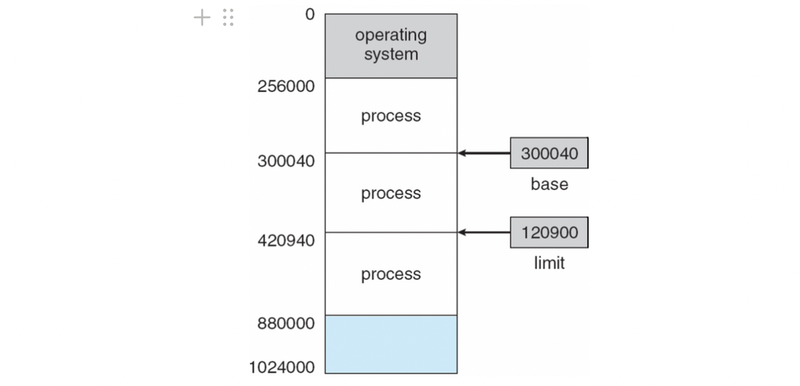

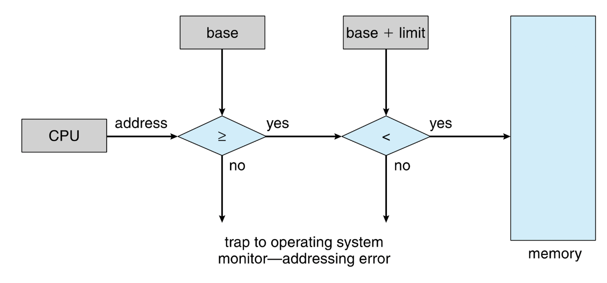

### Address Binding

- 절대주소는 프로그램의 실행에 필요한 데이터와 명령어가 메인 메모리에서 실제로 위치하는 고정된 주소→absolute program(프로그램을 작성할때 주소를 결정)
- 상대주소는 프로그램 내에서 상대적인 위치를 나타내며, 실행 시에 절대 주소로 변환(런타임에 결정)
- 상대주소를 절대주소로 변환하는 과정을 Address Binding 이라고 한다.
- 개발시에 주소를 결정하는 방법, 컴파일시에 결정하는 방법 등이 있지만 런타임에 결정하는 방법이 대표적이다.

### Address 변환 3단계

1. Symbolic address : 프로그래머들이 특정 이름을 통해 변수를 지정하고 값을 저장, 변수의 이름 자체를 Symbolic address라고 함.
2. Relocatable address(=Logical address) : 주소를 프로그램이 실행될 때마다 재배치할 수 있는 상대적인 주소로, 주소 바인딩을 통해 절대 주소로 변환될 수 있음. → load module의 주소
3. Absolute address : 메모리의 실제 물리 주소

### Memory Management Unit(MMU)

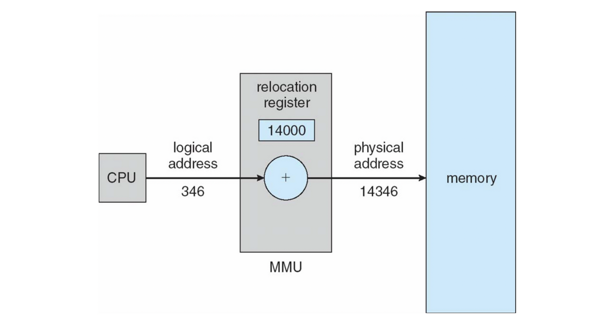

논리 주소를 물리 주소로 바꾸는 역할을 함.

### Dynamic loading

- static loading
  - 모든 프로그램과 데이터를 메모리에 다 올리는 방법
  - 물리 메모리의 크기에 따라 제한
- dynamic loading
  - 런타임에 필요에 따라 메모리에 부분적으로 올리는 방법
  - OS의 특별한 지원이 필요치 않음.

## Allocations

## Contiguous Allocation

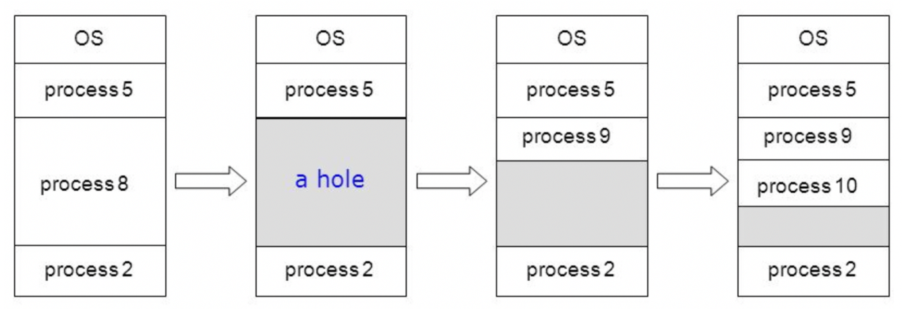

- 메모리의 빈공간에 연속적으로 할당하는 방법
- 빈공간에 할당하는 정책이 필요함

### Contiguous Allocation Policy

- First-fit : 넣을 수 있는 첫번째 Hole에 프로세스 할당
- Best-fit : 넣을 수 있는 가장 작은 Hole에 프로세스 할당
- Worst-fit : 넣을 수 있는 가장 큰 Hole에 프로세스 할당

### Fragmentation

- 내부 단편화(Internal Fragmentation) : 프로세스가 필요로 하는 메모리보다 많은 메모리를 주어 빈 메모리가 남는 현상
- 외부 단편화(External Fragmentation) : 남은 메모리보다 넣을 프로세스가 필요로 하는 메모리가 더 커서 프로세스가 들어갈 수 없는 현상

### Memory Compaction

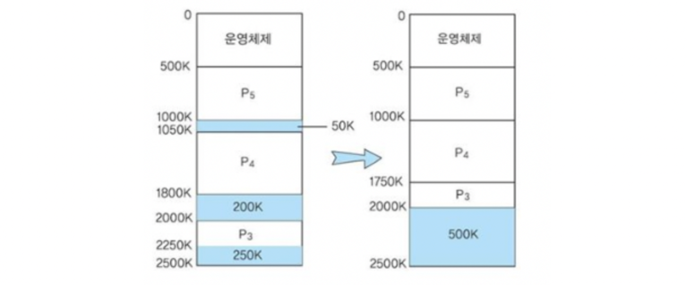

- 단편화 해결의 한 기법으로 메모리의 빈 공간을 한부분으로 모으는 방법

### Memory Coalescing

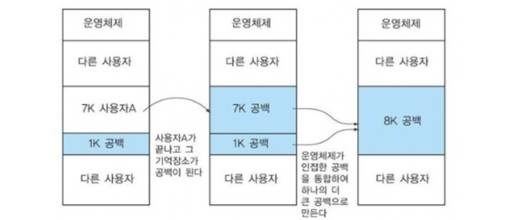

- 단편화 해결의 한 기법으로 메모리의 인접한 두 빈공간을 하나로 합침

## Segmentation

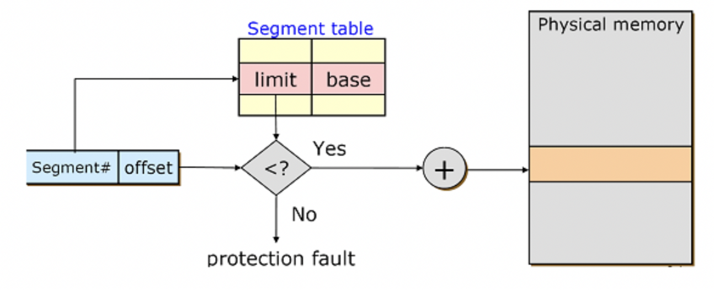

- Segmentation은 물리적인 주소의 단위가 아닌 논리적인 주소의 단위로 자르기 때문에 일반적으로 크기가 다르다.
- CPU가 제공한 논리 주소(Segment + offset)를 segment table을 통해 물리 주소로 변환
- Segment table에는 각 프로세스의 limit, base주소가 들어가 있다.
- Segment table은 main memory에 위치한다.
- 논리적 단위로 프로세스를 나누어 같은 테이블을 사용하기 때문에 같은 물리주소를 참조하는 **여러 프로세스간 공유가 쉽다**
- 내부 단편화는 해결되나 외부단편화 문제가 여전히 존재함.

## Paging

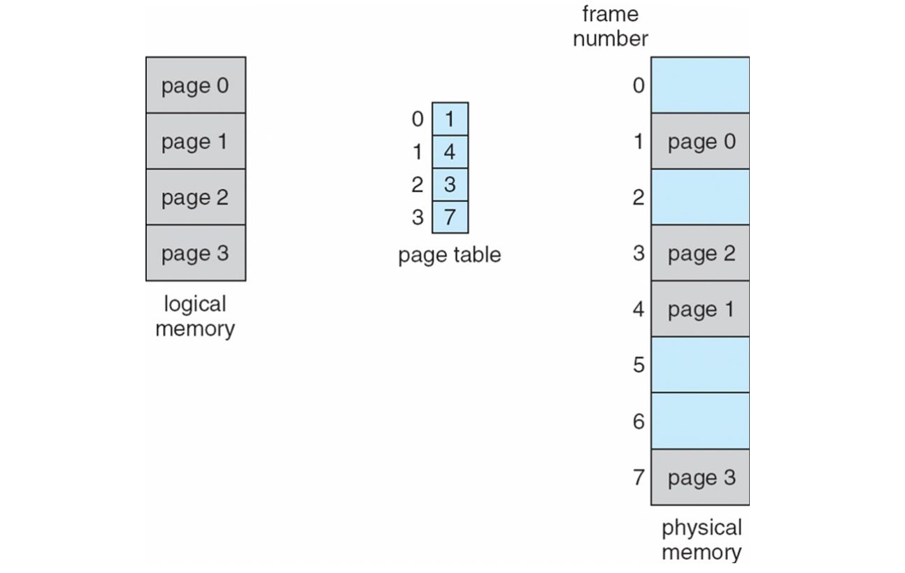

- 논리적 단위는 무시하고, 같은 크기로 나눠 물리적 메모리의 아무 위치에나 위치시키는 것
- logical memory에서는 page라 부르고, physical memory에서는 frame이라 부른다.
- 내부 단편화는 발생하지만 외부 단편화가 발생하지 않음.
- 프로세스마다 각각의 페이지 테이블이 존재함.
- table에 limit필요 없이 base만 등록(frame number), 페이지 크기가 같기 때문. 2의 배수로 해야함.

### TLB(**Translation Look-aside Buffer)**

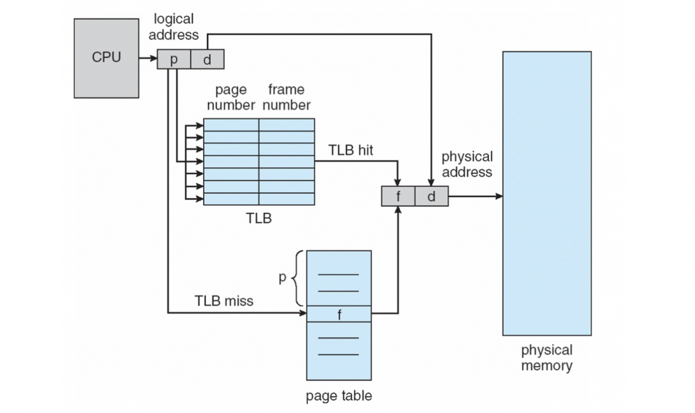

1. page table에 한번 접근
2. page table을 기반으로 실제 메모리로 접근

**EAT(Effective Memory-Access Time)**

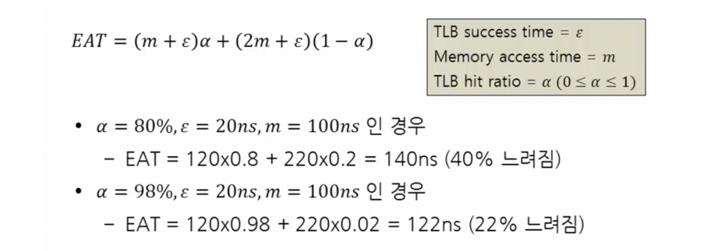

- 평균 메모리 접근 시간을 의미
- TLB 적중률(α)에 의존

### Demand Paging(Valid-Invalid bit)

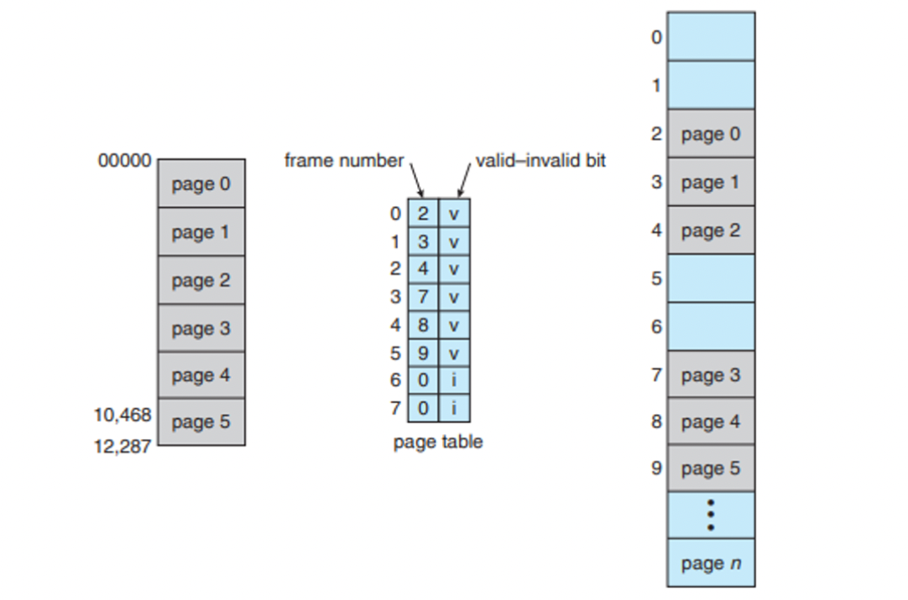

page table frame 뒤에 valid bit를 붙여 해당 frame(물리주소)에 유효한 데이터가 있는지를 검증

페이지가 필요할때 해당 frame이 invalid면 디스크에서 page를 로드(이후 virtual memory 참조)

```toc
```
