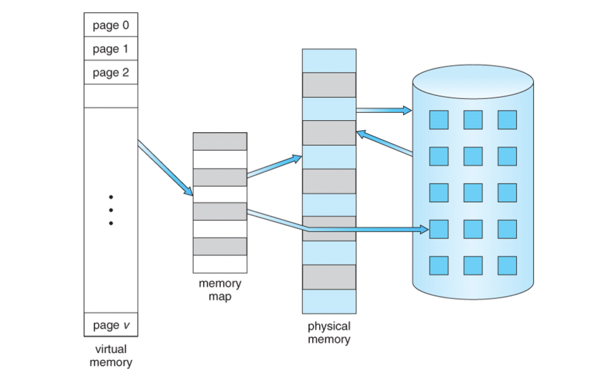
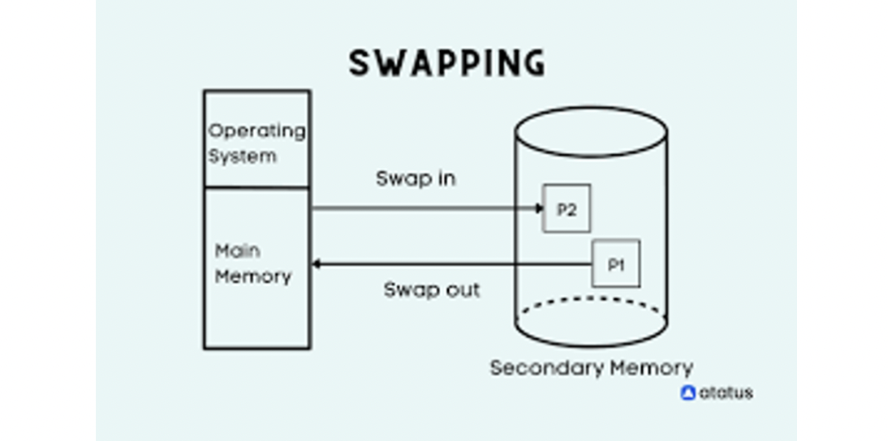
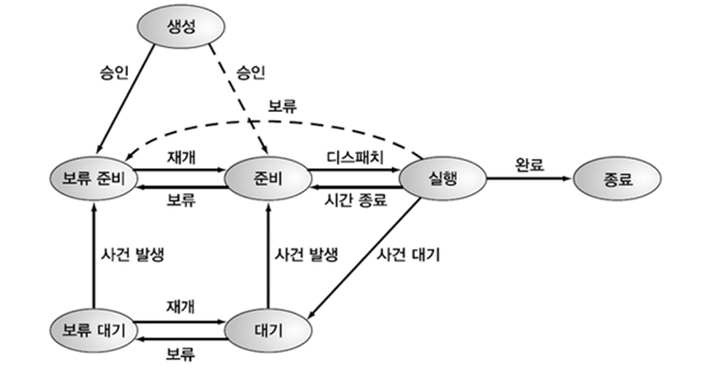
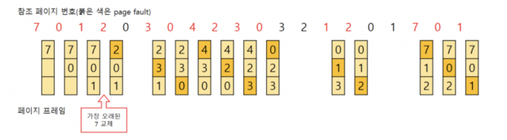
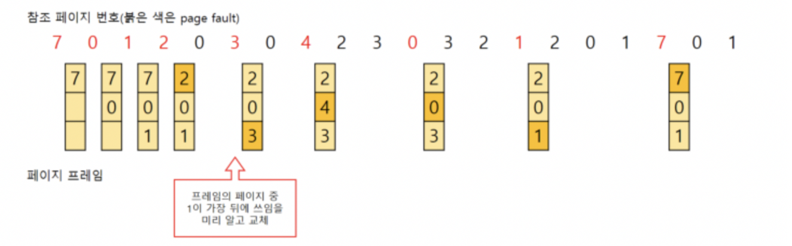
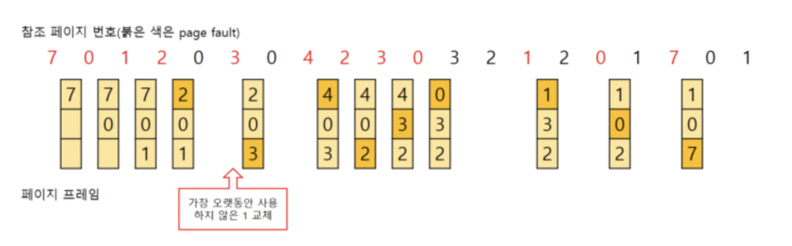
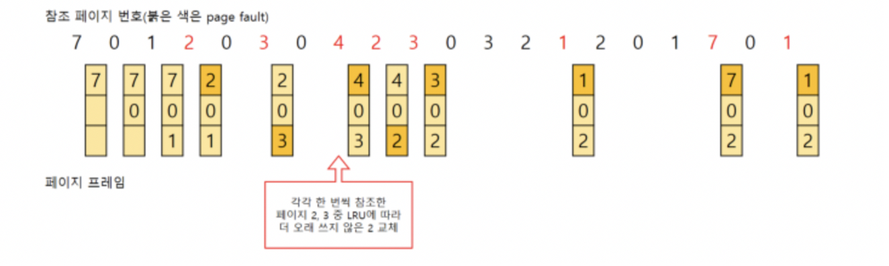
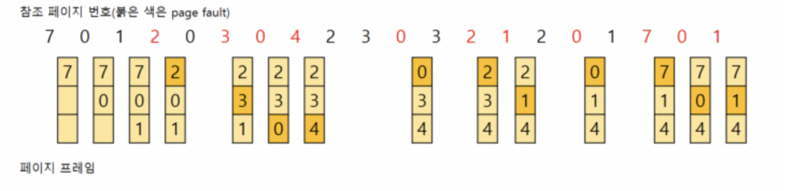
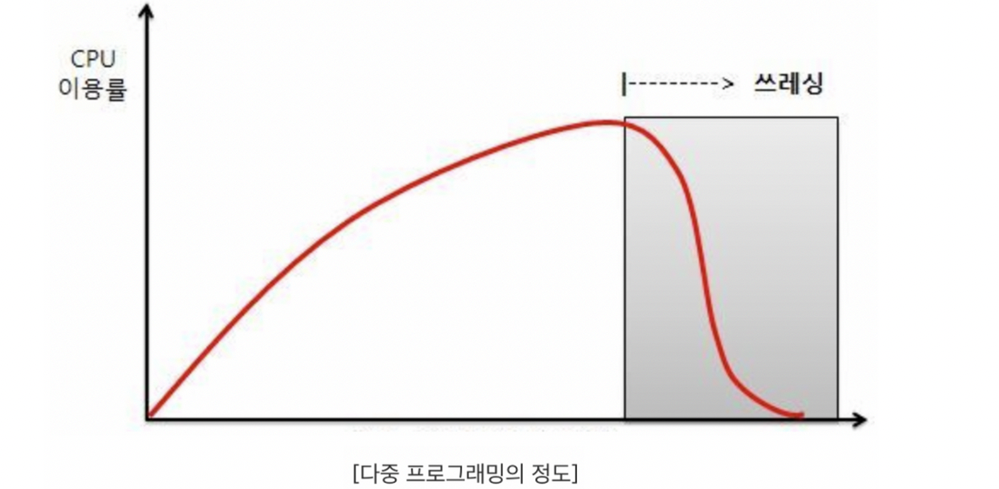

> ❗️**날짜별로 정리하여 복습하기를 원하기 때문에 내용이 길고 다소 정리되지 않았습니다.**
# Virtual Memory



> 드라이브의 일부를 물리 메모리의 일부처럼 활용하는 기법


## Swapping



- 실제 물리 메모리가 가득 찼을때 프로세스를 swap-in & swap-out 을 통해 드라이브의 일부를 가상 메모리로 활용

### 프로세스 상태 전이도(expand)



- 대기 → 보류대기 : swap out
- 보류 대기 → 보류 준비 : wake
- 보류 준비 → 준비 : swap in

## 페이지 교체 알고리즘

### First-In-First-Out (FIFO)



- 가장 오래된 페이지를 swap out 하고 새로운 페이지를 swap in 하는 알고리즘

### Optimal Algorithm



- 앞으로 가장 오래 쓰이지 않을 페이지를 교체하는 알고리즘
- 미래 예측이기 때문에 현실적으로 제약사항이 많음
- 그래서 이후 알고리즘이 등장함

### Least Recently Used (LRU)



- 가장 오랫동안 사용하지 않은 페이지를 swap out 하고 새로운 페이지를 swap in 하는 알고리즘

### Least Frequently Used (LFU)



- 참조한 빈도가 가장 낮은 페이지를 swap out 하고 새로운 페이지를 swap in 하는 알고리즘
- 교체 대상이 여러개면 LRU방식으로 swap out

### Most Frequently Used (MFU)



- 참조 빈도가 가장 높은 페이지를 swap out 하고 새로운 페이지를 swap in 하는 알고리즘
- 많이 썼으면 앞으로 안쓸거라는 예측에 의존

## Thrashing



- 프로세스가 실행되는 시간보다 swapping하는 시간이 더 길어지면서 CPU이용률이 저하되는 상태
- **주기억장치의 모든 페이지가 활발히 사용되고 있어서 어떤 페이지가 교체된 후 곧바로 반복적인 페이지 부재가 발생**
- 프로세스의 실행보다 페이징을 위해 더 많은 시간이 소요
- CPU는 이용률을 높이기 위해 다중프로그래밍 정도 향상→ 악화

```toc
```
