> ❗️**날짜별로 정리하여 복습하기를 원하기 때문에 내용이 길고 다소 정리되지 않았습니다.**
## MySQL

### 시작하기

- MySQL 8.0 버전은 서버 설치과정에서 임시 번호 생성

```sql
grep 'temporary password' /var/log/mysqld.log
```

- MySQL 접속

```sql
mysql -u root -p
```

- 비밀번호 변경

```sql
ALTER USER 'root'@'localhost' IDENTIFIED BY 'yourpassword';
```

- 데이터 조회, 선택 및 테이블 조회

```sql
// 데이터베이스 조회
SHOW DATABASES;
// 데이터베이스 선택
USE 'DATABASE';
// 데이터베이스 내 테이블 조회
SHOW TABLES;
```

- 테이블 생성

```sql
CREATE TABLE s_region 
(
id INT PRIMARY KEY,
name VARCHAR(50) NOT NULL UNIQUE
);
```

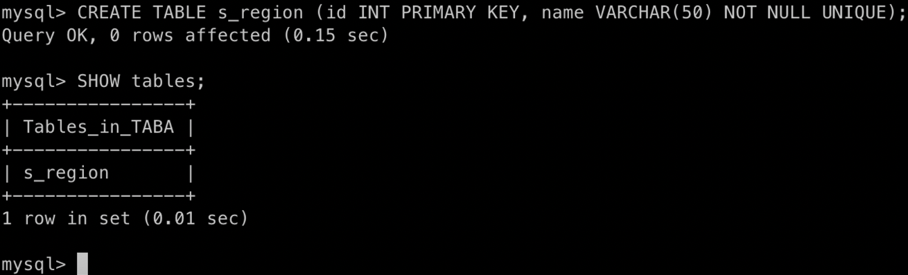

```sql
CREATE TABLE s_dept
(
deptno INT PRIMARY KEY,
dname VARCHAR(14),
loc VARCHAR(13)
);
```

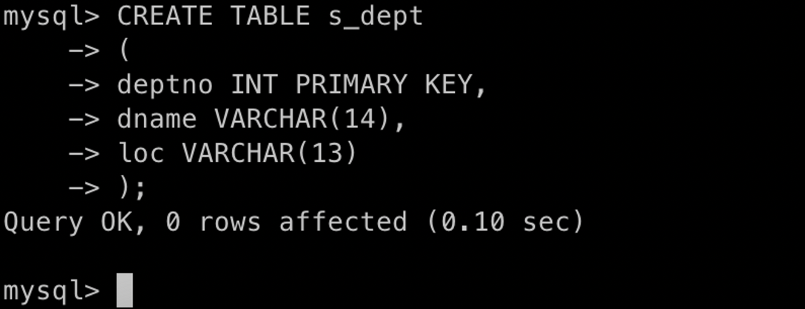

```sql
create table s_emp
(
empno INT  PRIMARY KEY,
ename VARCHAR (10)  NOT NULL,
job VARCHAR (9),
mgr INT ,
hiredate DATE,
sal INT ,
comm INT ,
deptno INT,
FOREIGN KEY (mgr) REFERENCES s_emp(empno) on update cascade,
FOREIGN KEY (deptno) REFERENCES s_dept(deptno)
);
```

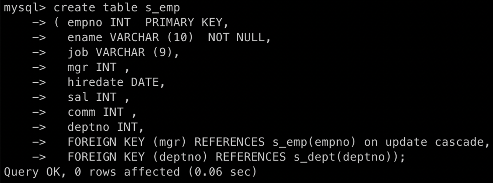

- 데이터 저장

```sql
INSERT INTO s_dept VALUES (10, 'ACCOUNTING', 'NEW YORK');
INSERT INTO s_dept VALUES (20, 'RESEARCH',   'DALLAS');
INSERT INTO s_dept VALUES (30, 'SALES',      'CHICAGO');
INSERT INTO s_dept VALUES (40, 'OPERATIONS', 'BOSTON');
```

```sql
INSERT INTO s_emp VALUES (7839,'KING','PRESIDENT',NULL,'81-11-17',5000,NULL,10);
INSERT INTO s_emp VALUES (7698,'BLAKE','MANAGER',7839,'81-05-01',2850,NULL,30);
INSERT INTO s_emp VALUES (7782,'CLARK','MANAGER',7839,'81-05-09',2450,NULL,10);
INSERT INTO s_emp VALUES (7566,'JONES','MANAGER',7839,'81-04-01',2975,NULL,20);
INSERT INTO s_emp VALUES (7654,'MARTIN','SALESMAN',7698,'81-09-10',1250,1400,30);
INSERT INTO s_emp VALUES (7499,'ALLEN','SALESMAN',7698,'81-02-11',1600,300,30);
INSERT INTO s_emp VALUES (7844,'TURNER','SALESMAN',7698,'81-08-21',1500,0,30);
INSERT INTO s_emp VALUES (7900,'JAMES','CLERK',7698,'81-12-11',950,NULL,30);
INSERT INTO s_emp VALUES (7521,'WARD','SALESMAN',7698,'81-02-23',1250,500,30);
INSERT INTO s_emp VALUES (7902,'FORD','ANALYST',7566,'81-12-11',3000,NULL,20);
INSERT INTO s_emp VALUES (7369,'SMITH','CLERK',7902,'80-12-09',800,NULL,20);
INSERT INTO s_emp VALUES (7788,'SCOTT','ANALYST',7566,'82-12-22',3000,NULL,20);
INSERT INTO s_emp VALUES (7876,'ADAMS','CLERK',7788,'83-01-15',1100,NULL,20);
INSERT INTO s_emp VALUES (7934,'MILLER','CLERK',7782,'82-01-11',1300,NULL,10);
```

- 테이블 구조 확인

```sql
DESCRIBE s_emp;
```

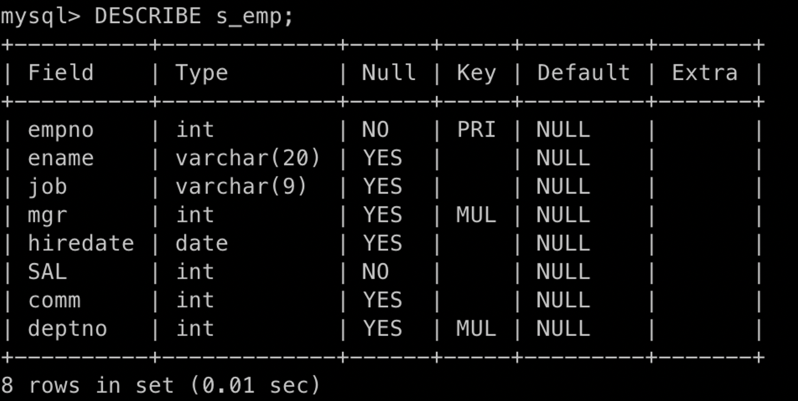

- 테이블에 칼럼 추가

```sql
ALTER TABLE s_region ADD COLUMN (comments VARCHAR (255));
```

- 칼럼 속성 변경(데이터 타입, 기본값, 제약조건)

```sql
ALTER TABLE s_emp MODIFY ename VARCHAR (20);
ALTER TABLE s_emp MODIFY SAL INT NOT NULL;
```

- 테이블 제약조건 조회

```sql
select * from information_schema.table_constraints where table_name='s_emp';
```

- 제약조건 추가 및 삭제

```sql
// 외래키 제약조건 삭제
ALTER TABLE s_emp DROP FOREIGN KEY s_emp_ibfk_1;
// 외래키 제약조건 추가
ALTER TABLE s_emp ADD CONSTRAINT s_emp_fk_id FOREIGN KEY (mgr)
```

### 뷰

- 뷰 생성

```sql
CREATE VIEW empvu10
AS SELECT empno, ename, job
FROM s_emp
WHERE deptno = 10;
```

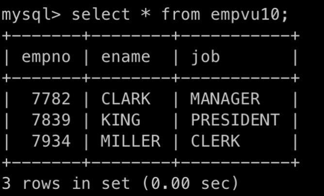

```sql
CREATE VIEW empvu20 (id, employee, title) //Alias 지정
AS SELECT empno, ename, job
FROM s_emp
WHERE deptno = 20;
```

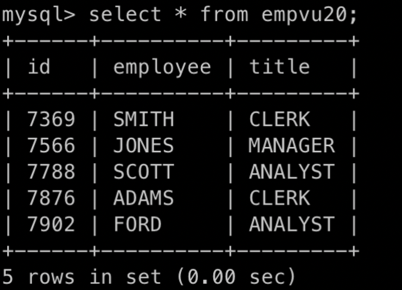

```sql
CREATE VIEW salvu1500
AS SELECT empno ID, ename NAME, sal MONTHLY_SALARY // Alias 지정
FROM s_emp
WHERE sal >= 1500;
```

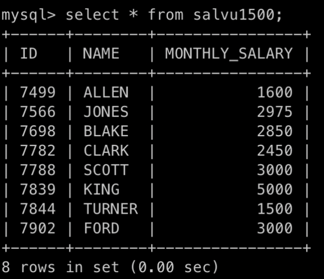

```sql
CREATE VIEW empvu30
AS SELECT *
FROM s_emp
WHERE deptno = 30
WITH CHECK OPTION;
```

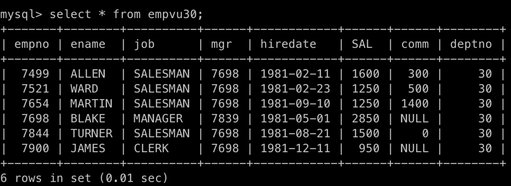

- 현재 사용자에 속한 뷰의 정보 조회하기

```sql
SHOW FULL TABLES IN TABA WHERE TABLE_TYPE LIKE 'VIEW';
```

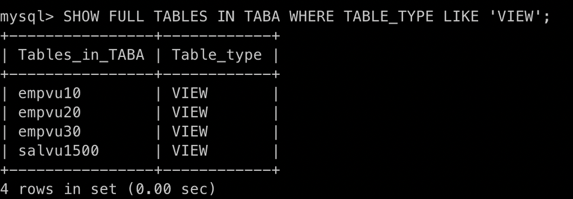

- 뷰 삭제하기

```sql
DROP VIEW empvu10;
```

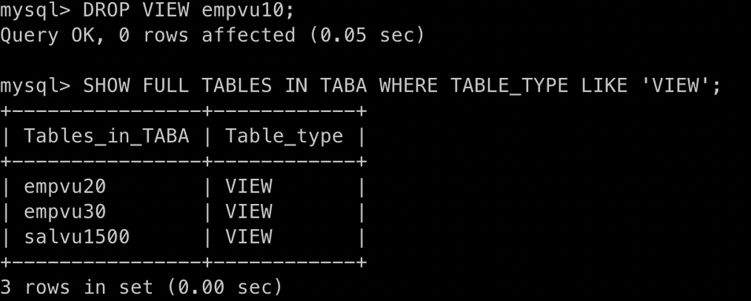

### 데이터 조작

- 테이블 구조 확인

```sql
DESC empvu30;
//or
DESCRIBE empvu30;
```

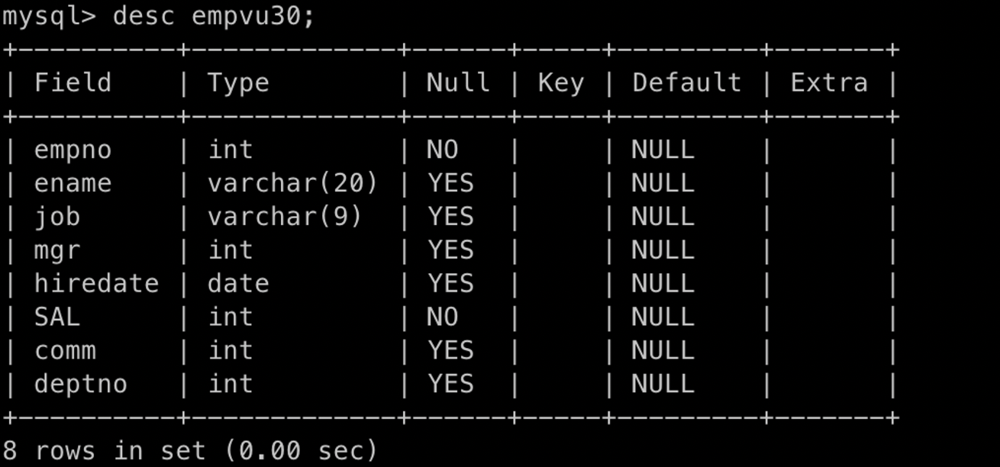

- 테이블 모든 칼럼 출력

```sql
SELECT * FROM s_dept;
```

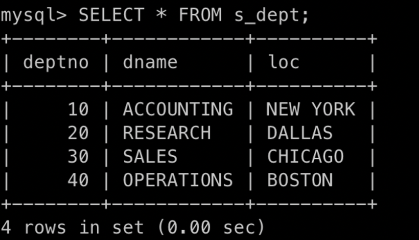

- 특정 칼럼만 출력

```sql
SELECT dname FROM s_dept;
```

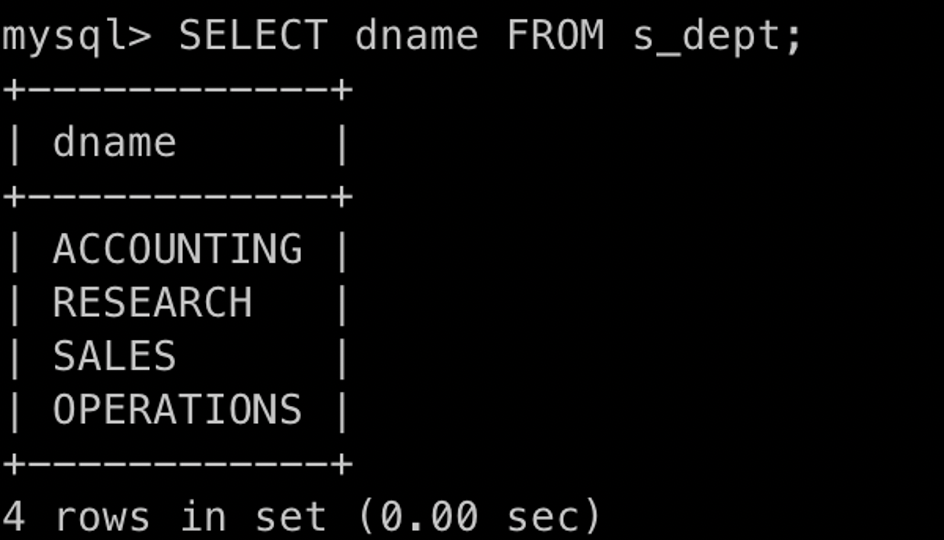

```sql
SELECT ename, sal FROM s_emp;
```

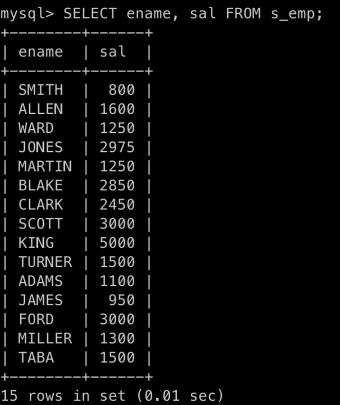

- 중복 제거하여 출력

```sql
SELECT job FROM s_emp; // 중복 허용
```

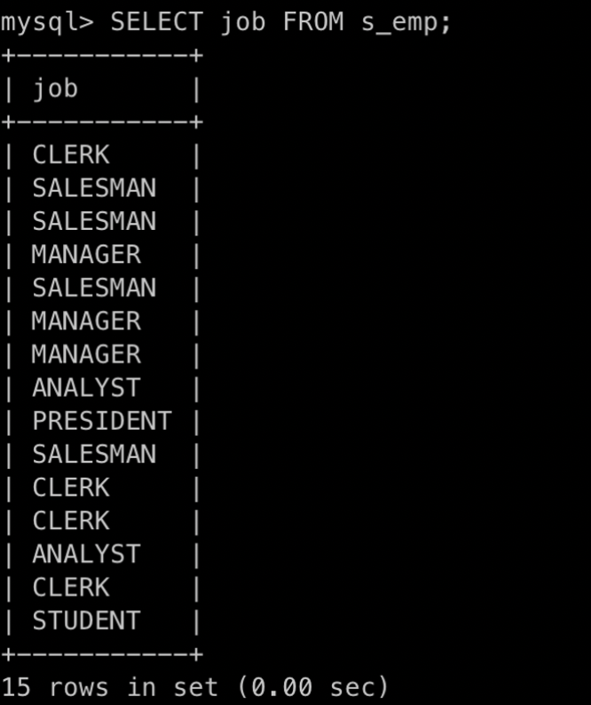

```sql
SELECT DISTINCT job FROM s_emp; // 중복 제거(DISTINCT)
```

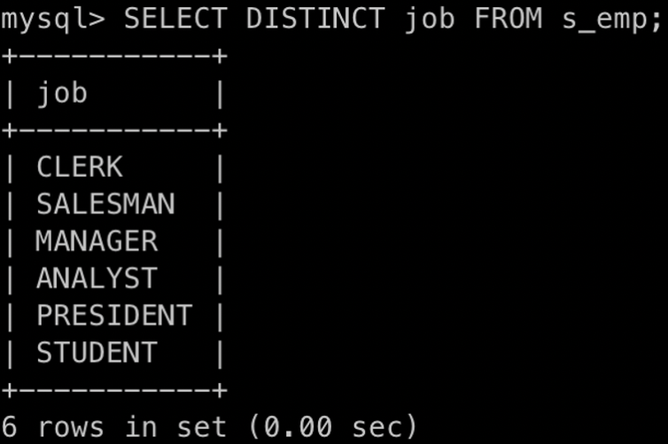

- 별칭 지정하여 출력(Alias)

```sql
SELECT DISTINCT job "Title" FROM s_emp; // 별칭 : Title
```

>💡 공백, 특수문자 필요한 경우에 큰따옴표(”)붙임


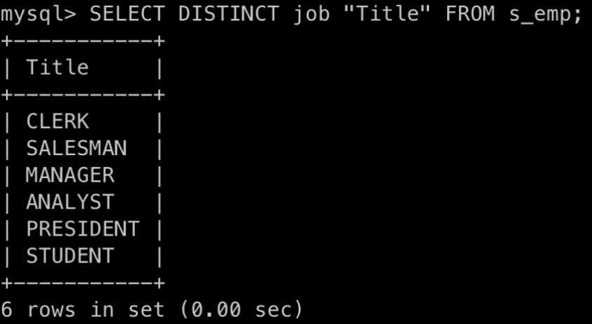

- 조건 지정하여 조회

```sql
SELECT ename FROM s_emp WHERE sal > 2000; // sal이 2000보다 큰 행의 ename 조회
```

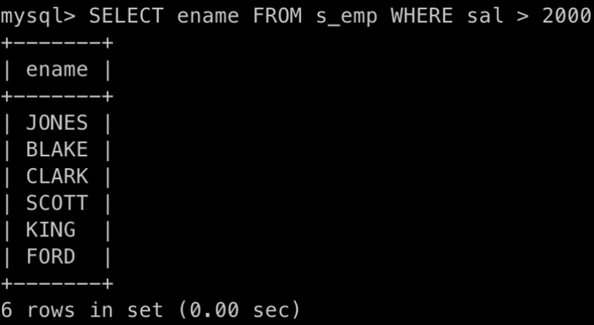

```sql
// deptno가 20인 행의 deptno, ename, job 조회
SELECT deptno, ename, job FROM s_emp WHERE deptno = 20;
```

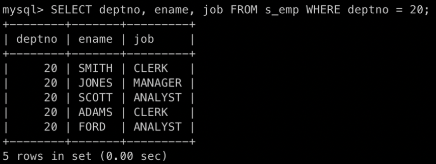

```sql
// ename이 'BLAKE'인 행의 empno, ename, job, sal 조회
SELECT empno, ename, job, sal FROM s_emp WHERE ename = 'BLAKE';
```

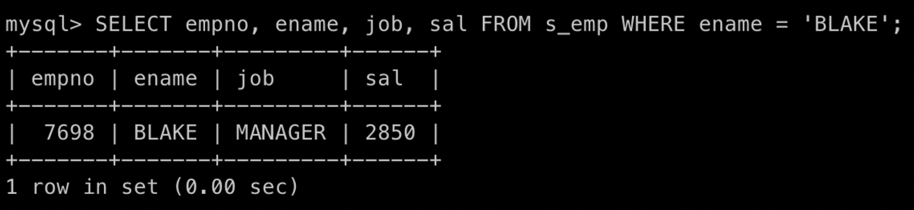

```sql
// sal >= 1000 이상인 행 중에 deptno가 10 또는 20인 ename, sal, deptno 조회
SELECT ename, sal, deptno 
FROM s_emp 
WHERE sal >= 1000 AND (deptno = 10 OR deptno = 20);
```

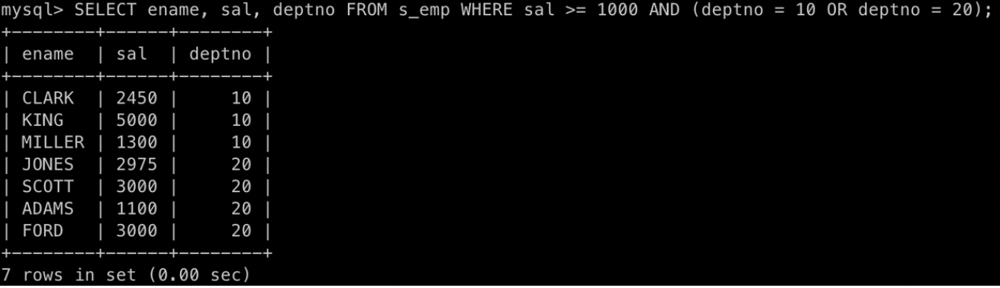

```sql
// sal 기준 오름차순 정렬하여 조회
SELECT ename, sal FROM s_emp WHERE deptno = 30 ORDER BY sal;
```

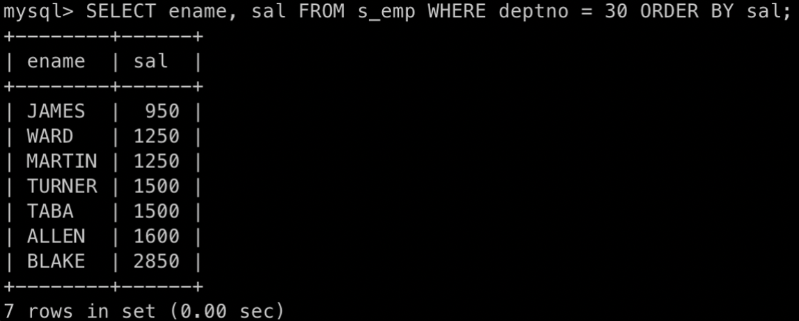

```sql
// sal 기준 내림차순 정렬하여 조회
SELECT ename, sal FROM s_emp WHERE deptno = 30 ORDER BY sal DESC;
```

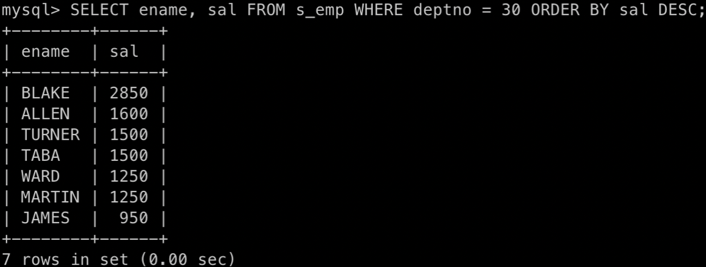

### 권한 제어

- 유저 생성

```sql
CREATE USER "USER_NAME" IDENTIFIED BY "USER_PASSWORD";
```

- 유저 제거

```sql
DROP "USER_NAME";
```

- 권한 부여

```sql
GRANT "권한내용" TO "USER_NAME" [WITH ADMIN OPTION];
```

**대표적인 시스템 권한**

> **create Session : 데이터 베이스를 연결할 수 있는 권한  
> create table  : 테이블을 생성할 수 있는 권한  
> create sequence : 시퀀스를 생성할 수 있는 권한  
> create view :  뷰를 생성할 수 있는 권한  
> create procedure : 프로시저를 생성할 수 있는 권한  
> create role : 오라클 데이터베이스 역할을 생성할 수 있는 권한  
> alter user:  생성한 사용자의 정의를 변경할 수 있는 권한  
> drop user:  생성한 사용자를 삭제시키는 권한  
> WITH ADMIN OPTION : 권한 받은 내용을 다른 사용자에게 부여할 수 있는 권한 부여**

- ROLE 생성

```sql
CREATE ROLE "ROLE_NAME";
```

- ROLE에 권한 부여

```sql
GRANT "권한내용" TO "ROLE_NAME";
```

- 사용자에게 ROLE 부여

### 조건 연산자

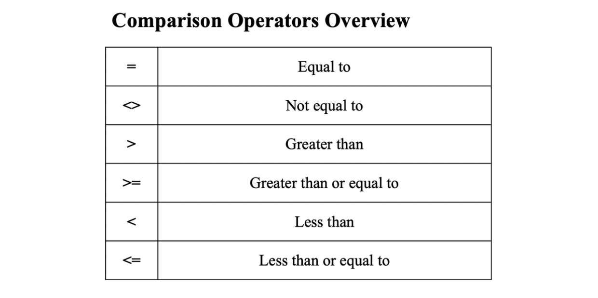

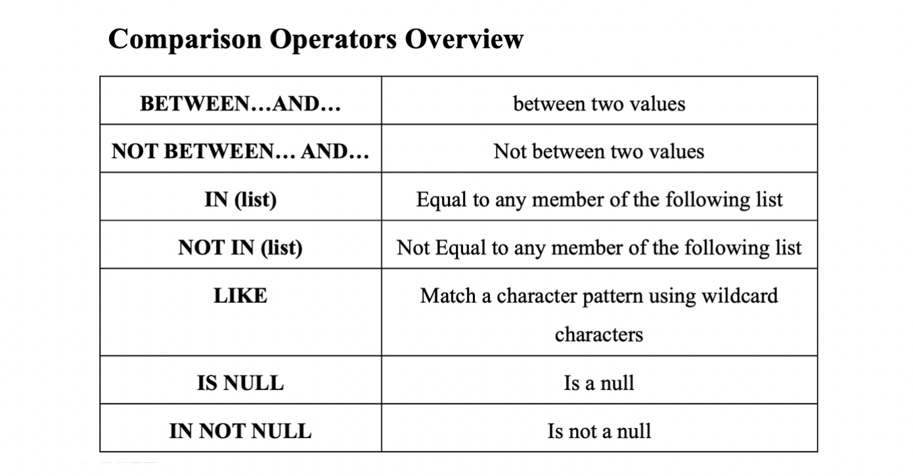

```toc
```
