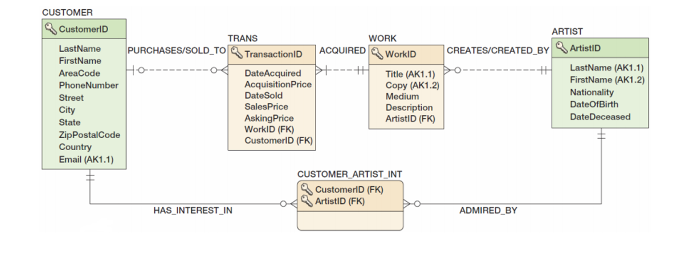

> ❗️**날짜별로 정리하여 복습하기를 원하기 때문에 내용이 길고 다소 정리되지 않았습니다.**
# DB구조를 위한 SQL

## Example : View Ridge Gallary



### CREATE TABLE(SQL Server)

```sql
CREATE TABLE ARTIST(
  // SQL Server에선 IENTITY(a,b) 구문이 a번부터 b만큼 증가하며 자동부여
	ArtistID        Int        NOT NULL IDENTITY(1,1),
	LastName        Char(25)   NOT NULL,
	FirstName       Char(25)   NOT NULL,
	...
  CONSTRAINT ArtistPK        PRIMARY KEY(ArtistID),
  // 제약조건(CONSTRAINT) 복합키이자 대체키
	CONSTRAINT ArtistAK1       UNIQUE(LastName, FirstName) 
);
```

- Cloumn name(이름) : ArtistID, …
- Data type(데이터 형식) : Int, …
- Optional constraints(제약조건) : NOT NULL, …

### Creating Relationships

```sql
CREATE TABLE ARTIST(
	ArtistID        Int           NOT NULL IDENTITY(1,1),
	LastName        Char(25)      NOT NULL,
	FirstName       Char(25)      NOT NULL,
	...
  CONSTRAINT ArtistPK           PRIMARY KEY(ArtistID),
	CONSTRAINT ArtistAK1          UNIQUE(LastName, FirstName) 
);

CREATE TABLE WORK(
	WorkID          Int           NOT NULL IDENTITY(500,1),
	Title           Char(35)      NOT NULL,
	Copy            Char(12)      NOT NULL,
	Medium          Char(35)      NULL,
	[Description]   VarChar(1000) NULL DEFAULT 'Unknown provenance',
	ArtistID        Int           NOT NULL,
	CONSTRAINT      WorkPK        PRIMARY KEY (WorkID),
	CONSTRAINT      WorkAK1       UNIQUE (Title, Copy),
	CONSTRAINT      ArtistFK      FOREIGN KEY (ArtistID)
								    REFERENCES ARTIST(ArtistID)
								    	ON UPDATE NO ACTION
								    	ON UPDATE NO ACTION
);
```

### SQL for Constraints

```sql
CREATE TABLE ARTIST(
	ArtistID        Int          NOT NULL IDENTITY(1,1),
	LastName        Char(25)     NOT NULL,
	FirstName       Char(25)     NOT NULL,
  Nationality     Char(30)     NULL,
	...
  CONSTRAINT ArtistPK          PRIMARY KEY (ArtistID),
	CONSTRAINT ArtistAK1         UNIQUE (LastName, FirstName) 
  CONSTRAINT NationalityValues CHECK
                       (Nationality IN ('Canadian', 'English',
                       'French', 'German')),
  ...
);

CREATE TABLE WORK(
	WorkID          Int.          NOT NULL IDENTITY(500,1),
	Title           Char(35)      NOT NULL,
	Copy            Char(12)      NOT NULL,
	Medium          Char(35)      NULL,
	[Description]   VarChar(1000) NULL DEFAULT 'Unknown provenance',
	ArtistID        Int           NOT NULL,
	CONSTRAINT      WorkPK        PRIMARY KEY (WorkID),
	CONSTRAINT      WorkAK1       UNIQUE (Title, Copy),
	CONSTRAINT      ArtistFK      FOREIGN KEY (ArtistID)
								    REFERENCES ARTIST (ArtistID)
								    	ON UPDATE NO ACTION
								    	ON UPDATE NO ACTION
);
```

### ALTER Statement example

```sql
ALTER TABLE ASSIGNMENT
	ADD CONSTRAINT EmployeeFK
    FOREIGN KEY (EmployeeNumber)
    REFERENCES EMPLOYEE (EmployeeNumber)
        ON UPDATE CASCADE
        ON DELETE NO ACTION;
```

### Adding and Dropping Columns

```sql
ALTER TABLE CUSTOMER ADD MyColumn Char(5) NULL;
```

```sql
ALTER TABLE CUSTOMER DROP COLUMN MyColumn;
```

### Adding and Dropping Donstraints

```sql
ALTER TABLE CUSTOMER
  ADD CONSTRAINT MyConstraint CHECK
    ([Name] NOT IN ('Robert No Pay'));
```

```sql
ALTER TABLE CUSTOMER
  DROP CAONSTRAINT MyConstraint;
```

### Removing Tables

```sql
DROP TABLE TRANS;
```

```sql
// if there are constraints
ALTER TABLE CUSTOMER_ARTIST_INT
  DROP CONSTRAINT
  Customer_Artist_Int_CustomerFK;
ALTER TABLE [TRANSACTION]
  DROP CONSTRAINT TransactionCustomerFK;
DROP TABLE CUSTOMER;
```

### SQL DML - INSERT

```sql
INSERT INTO ARTIST ([NAME], Nationality, DateOfBirth, DateDeceased)
VALUES ('Tamayo', 'Mexican', 1927, 1998);
```

```sql
//Bulk INSERT
INSERT INTO ARTIST ([NAME], Nationality, DateOfBirth)
SELECT [Name], Nationality, BirthDate
FROM IMPORTED_ARTIST;
```

### SQL DML - UPDATE

```sql
UPDATE CUSTOMER
SET City = 'New York City'
WHERE CustomerID = 1000;
```

```sql
//Bulk UPDATE
UPDATE CUSTOMER
SET AreaCode = '333'
WHERE City = 'Denver';
```

### SQL DML - DELETE

```sql
DELETE FROM CUSTOMER
WHERE CustomerID = 1000;
```

### JOIN ON Syntax *

```sql
SELECT CUSTOMER.Name, ARTIST.Name
FROM CUSTOMER JOIN CUSTOMER_ARTIST_INT
ON CUSTOMER.CustomerID = CUSTOMER_ARTIST_INT.CustomerID
  JOIN ARTIST
  ON CUSTOMER_ARTIST_INT.ArtistID = ARTIST.ArtistID;
```

### Outer Join

```sql
SELECT C.LastName, C.FirstName,
       A.LastName AS ArtistName
FROM CUSTOMER C LEFT JOIN CUSTOMER_ARTIST_INT CI
ON C.CustomerID = CI.CustomerID LEFT JOIN ARTIST A
ON CI.ArtistID = A.ArtistID;
```

### CREATE VIEW Command

```sql
CREATE VIEW CustomerNameView AS
  SELECT LastName AS CustomerLastName,
         FirstName AS CustomerFirstName,
  FROM CUSTOMER;
```

```sql
//뷰 보기
SELECT * FROM CustomerNameView
ORDER BY CustomerLastName, CustomerFirstName;
```

### Types of view

- Horizontal subset view
- Vertical subset view
- Join view
- Statistical summary view

### SQL의 종류

- Interactive SQL(대화식 SQL)
    - Oracle : SQLplus
- Procedural SQL(절차적 SQL)
    - 표준안 : SQL/PSM
    - Oracle: PL/SQL (Procedural SQL)
    - SQL Server: T-SQL (Transact SQL)
- Embedded SQL
    - ESQL/C → Oracle :Pro*C

### Triggers

- 특정 이벤트가 발생했을때 DBMS에 의해 실행되는 저장된 프로그램
- 타입:
    - BEFORE
    - INSTEAD OF
    - AFTER
        - 각 타입은 INSERT, UPDATE, DELETE에 선언 가능
        - 총 9가지 트리거 타입
- Oracle은 9가지 트리거 타입을 지원
- SQL Server는 6개 타입 지원

### Stored Procedure

- DB에 저장돼서 컴파일 될 때 사용되는 프로그램
- Input parameter, Output parameter를 지정할 수 있음 ↔ Trigger와 다름
- 자동으로 실행되지 않고 많은 언어에서 원할때 실행 가능 ↔ Trigger와 다름

```toc
```
