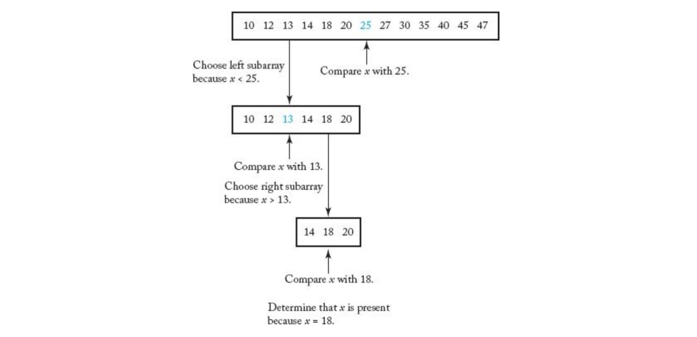
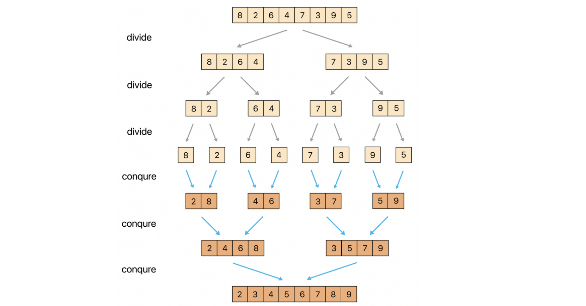

## 분할-정복

### 이진탐색



- 반드시 이미 정렬된 배열에 대해 사용
- 배열에서 임의의 값을 선택, 찾으려는 값보다 임의의 값이 크면 임의의 값 왼쪽에서 재탐색(재귀).
- 찾으려는 값보다 임의의 값이 작으면, 임의의 값 오른쪽에서 재탐색(재귀)

    ```java
    public class BS_recur {
    	public static int binarySearch(int[] arr, int start, int end, int value) {
    		// 정렬되어 있는 배열 arr의 start부터 end까지에서 value의 idx를 찾는 함수
    		
    		if (start > end) //start가 end보다 큰 경우 탐색 실패, 찾으려는 값이 없음
    			return -1;
    		else if (start == end) { // start가 end와 같은 경우
    			if (arr[start] == value) //찾으려는 값이 start인덱스에 있는 경우
    				return start; //(찾음!)
    			else //찾으려는 값이 없음
    				return -1;
    		} else { 
    
    			int mid = (start + end) / 2; //중간값
    			if (arr[mid] == value) //중간 값이 찾으려는 값인 경우 
    				return mid; //(찾음!)
    			else if (arr[mid] > value) //찾으려는 값보다 중간값이 큰 경우
    				return binarySearch(arr, start, mid - 1, value); //왼쪽에서 재탐색(재귀)
    			else //찾으려는 값보다 중간값이 작은 경우
    				return binarySearch(arr, mid + 1, end, value); //오른쪽에서 재탐색(재귀)
    		}
    	}
    }
    ```

- 시간복잡도 분석
  - 처음에 입력된 개수 n이라 하면 첫 시행 후 n/2, 재시행 후 n/2 x 1/2 …
  - k번의 시행 후에 (1/2)^k x n 이고, 최악의 경우, 마지막에 1개가 남을때이므로 (1/2)^k x n ~= 1
  - 양변에 2^k를 곱해주면, n ~= 2^k이다. 여기서, 양변에 2를 밑으로 하는 로그를 취하면
  - k = log_2(n), 시간복잡도는 O(logn)으로 나타낼 수 있다. (상수 무시)

### 합병 정렬(Merge sort)




```java
public class MergeSort {
    public static void merge_sort(int array[],int start, int end){
        if(end-start >= 1){
            int mid = (start+end)/2;
            merge_sort(array, start, mid);
            merge_sort(array, mid+1, end);
            int l = start;
            int r = mid+1;
            int newArray[] = new int[end-start+1];
            int idx = 0;
            while(l <= mid && r <= end){
                if(array[l] < array[r]){
                    newArray[idx++] = array[l++];
                }
                else{
                    newArray[idx++] = array[r++];
                }
            }
            while(l <= mid){
                newArray[idx++] = array[l++];
            }
            while(r <= end){
                newArray[idx++] = array[r++];
            }
            idx = 0;
            for(int i = start ; i <= end ; i++){
                array[i] = newArray[idx++];
            }
        }
    }
}
```

- 시간복잡도
  - 배열의 길이 n이라 할때, 단계의 높이는 logn을 따르고, 병합시 비교는 배열의 길이만큼의 횟수가 필요하기 때문에 n이다. 따라서 시간복잡도 O(nlogn)이다.
  - [최악의 경우 및 점화식 분석](https://nolzaheo.tistory.com/6)
```toc
```
